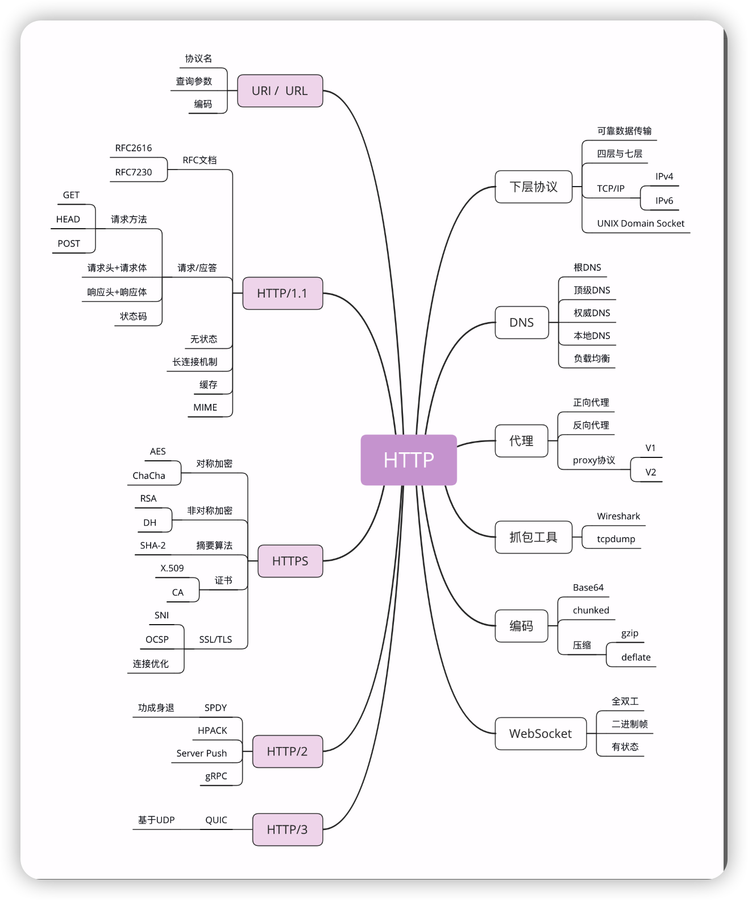

# 透视 HTTP

## HTTP 是什么？HTTP 又不是什么？

### HTTP 是什么

先看一下 HTTP 的名字：`超文本传输协议`，它可以拆成三个部分，分别是：`超文本` `传输` 和 `协议`。我们从后往前来逐个解析，理解了这三个词，我们也就明白了什么是 HTTP。


1. 超文本

   文本对于我们来说很好理解，那什么超文本呢？

   所谓 `文本`（Text），就表示 HTTP 传输的不是 TCP/UDP 这些底层协议里被切分的杂乱无章的二进制包（datagram），而是完整的、有意义的数据，可以被浏览器、服务器这样的上层应用程序处理。

   在 http 中你可以将 `文字` `图片`、`音频`、`视频`、`甚至是压缩包` 都可以算作是文本。

   所谓 `超文本`，就是“超越了普通文本的文本”，它是文字、图片、音频和视频等的混合体，最关键的是含有 `超链接`，能够从一个“超文本跳跃到另一个超文本，形成复杂的非线性、网状的结构关系。

   对于“超文本”，我们最熟悉的就应该是 HTML 了，它本身只是纯文字文件，但内部用很多标签定义了对图片、音频、视频等的链接，再经过浏览器的解释，呈现在我们面前的就是一个含有多种视听信息的页面

2) 传输

   计算机和网络世界里有数不清的各种角色：CPU、内存、总线、磁盘、操作系统、浏览器、网关、服务器……这些角色之间相互通信也必然会有各式各样、五花八门的协议，用处也各不相同，例如广播协议、寻址协议、路由协议、隧道协议、选举协议等等。

   HTTP 是一个 `传输协议`，所谓的“传输”（Transfer）其实很好理解，就是把一堆东西从 A 点搬到 B 点，或者从 B 点搬到 A 点，即 `A<===>B`。

   但是，即使是从 `A<===>B` 这个动作，我们也可以做很多事情，

   - HTTP 协议是一个 **双向协议**

     也就是说，有两个最基本的参与者 A 和 B，从 A 开始到 B 结束，数据在 A 和 B 之间双向而不是单向流动。通常我们把先发起传输动作的 A 叫做 `请求方`，把后接到传输的 B 叫做应答方或者 `响应方`。拿我们最常见的上网冲浪来举例子，浏览器就是请求方 A，网易、新浪这些网站就是应答方 B。双方约定用 HTTP 协议来通信，于是浏览器把一些数据发送给网站，网站再把一些数据发回给浏览器，最后展现在屏幕上，你就可以看到各种有意思的新闻、视频了。

   - 传输之间可以允许 **中转** 或者 **接力**

     数据虽然是在 A 和 B 之间传输，但并没有限制只有 A 和 B 这两个角色，允许中间有“中转”或者“接力”。这样，传输方式就从“A<===>B”，变成了“A<=>X<=>Y<=>Z<=>B”，A 到 B 的传输过程中可以存在任意多个“中间人”，而这些中间人也都遵从 HTTP 协议，只要不打扰基本的数据传输，就可以添加任意的额外功能，例如安全认证、数据压缩、编码转换等等，优化整个传输过程。

3) 协议

   HTTP 是一个用在计算机世界里的协议。它使用计算机能够理解的语言确立了一种计算机之间交流通信的规范，以及相关的各种控制和错误处理方式。

### HTTP 不是什么

1. HTTP 不是编程语言

2. HTTP 不是 HTML

3. HTTP 不是一个孤立的协议

   在互联网世界里，HTTP 通常跑在 `TCP/IP` 协议栈之上，依靠 `IP` 协议实现寻址和路由、`TCP`协议实现可靠数据传输、`DNS` 协议实现域名查找、`SSL/TLS` 协议实现安全通信。此外，还有一些协议依赖于 HTTP，例如 WebSocket、HTTPDNS 等。这些协议相互交织，构成了一个协议网，而 HTTP 则处于中心地位。

## 与 HTTP 相关的各种概念与协议


### 概念

1. 网络世界

   互联网的正式名称是 Internet，里面存储着无穷无尽的信息资源，我们通常所说的“上网”实际上访问的只是互联网的一个子集 `万维网`（World Wide Web），它基于 HTTP 协议，传输 HTML 等超文本资源，能力也就被限制在 HTTP 协议之内。

2. 浏览器

   浏览器的正式名字叫 `Web Browser`，顾名思义，就是检索、查看互联网上网页资源的应用程序，

   名字里的 Web，实际上指的就是 `World Wide Web`，也就是万维网。

   浏览器本质上是一个 HTTP 协议中的请求方，使用 HTTP 协议获取网络上的各种资源。当然，为了让我们更好地检索查看网页，它还集成了很多额外的功能。

   例如，HTML 排版引擎用来展示页面，JavaScript 引擎用来实现动态化效果，甚至还有开发者工具用来调试网页，以及五花八门的各种插件和扩展。

   在 HTTP 协议里，浏览器的角色被称为 `User Agent` 即“用户代理”，意思是作为访问者的“代理”来发起 HTTP 请求。不过在不引起混淆的情况下，我们通常都简单地称之为“客户端”。

3. web 服务器

   浏览器是 HTTP 里的请求方，那么在协议另一端的应答方（响应方）又是什么呢？

   答案就是 **服务器，Web Server**

   当我们谈到“Web 服务器”时有两个层面的含义：**硬件和软件**。

   硬件含义就是物理形式或“云”形式的机器，在大多数情况下它可能不是一台服务器，而是利用反向代理、负载均衡等技术组成的庞大集群。但从外界看来，它仍然表现为一台机器，但这个形象是“虚拟的”。

   软件含义的 Web 服务器可能我们更为关心，它就是提供 Web 服务的应用程序，通常会运行在硬件含义的服务器上。它利用强大的硬件能力响应海量的客户端 HTTP 请求，处理磁盘上的网页、图片等静态文件，或者把请求转发给后面的 Tomcat、Node.js 等业务应用，返回动态的信息。

4. cdn

   浏览器和服务器是 HTTP 协议的两个端点，那么，在这两者之间还有别的什么东西吗？

   当然有了。浏览器通常不会直接连到服务器，中间会经过“重重关卡”，其中的一个重要角色就叫做 CDN。CDN，全称是 `Content Delivery Network`，翻译过来就是 `内容分发网络`。

   它应用了 HTTP 协议里的缓存和代理技术，代替源站响应客户端的请求。

   CDN 有什么好处呢？简单来说，它可以缓存源站的数据，让浏览器的请求不用“千里迢迢”地到达源站服务器，直接在“半路”就可以获取响应。如果 CDN 的调度算法很优秀，更可以找到离用户最近的节点，大幅度缩短响应时间。

   CDN 也是现在互联网中的一项重要基础设施，除了基本的网络加速外，还提供负载均衡、安全防护、边缘计算、跨运营商网络等功能，能够成倍地“放大”源站服务器的服务能力。

5. 爬虫

   前面说到过浏览器，它是一种用户代理，代替我们访问互联网。

   但 HTTP 协议并没有规定用户代理后面必须是“真正的人类”，它也完全可以是“机器人”，这些“机器人”的正式名称就叫做 `爬虫`（Crawler），**实际上是一种可以自动访问 Web 资源的应用程序**。

   `爬虫` 这个名字非常形象，它们就像是一只只不知疲倦的、辛勤的蚂蚁，在无边无际的网络上爬来爬去，不停地在网站间奔走，搜集抓取各种信息。据估计，互联网上至少有 50% 的流量都是由爬虫产生的，某些特定领域的比例还会更高，也就是说，如果你的网站今天的访问量是十万，那么里面至少有五六万是爬虫机器人，而不是真实的用户。

   爬虫是怎么来的呢？

   绝大多数是由各大搜索引擎“放”出来的，抓取网页存入庞大的数据库，再建立关键字索引，这样我们才能够在搜索引擎中快速地搜索到互联网角落里的页面。爬虫也有不好的一面，它会过度消耗网络资源，占用服务器和带宽，影响网站对真实数据的分析，甚至导致敏感信息泄漏。所以，又出现了“反爬虫”技术，通过各种手段来限制爬虫。其中一项就是 `君子协定` robots.txt，约定哪些该爬，哪些不该爬。**无论是“爬虫”还是“反爬虫”，用到的基本技术都是两个，一个是 HTTP，另一个就是 HTML**。

### 协议



1. TCP/IP

   `TCP/IP` 协议实际上是一系列网络通信协议的统称，其中最核心的两个协议是 TCP 和 IP，其他的还有 UDP、ICMP、ARP 等等，**共同构成了一个复杂但有层次的协议栈**。

   `TCP` 协议是“Transmission Control Protocol”的缩写，意思是 `传输控制协议`，**它位于 IP 协议之上，基于 IP 协议提供可靠的、字节流形式的通信，是 HTTP 协议得以实现的基础**。

   `可靠` 是指保证数据不丢失，`字节流` 是指保证数据完整，所以在 TCP 协议的两端可以如同操作文件一样访问传输的数据，就像是读写在一个密闭的管道里“流动”的字节。

   HTTP 是一个"传输协议"，但它不关心寻址、路由、数据完整性等传输细节，而要求这些工作都由下层来处理。因为互联网上最流行的是 TCP/IP 协议，而它刚好满足 HTTP 的要求，所以互联网上的 HTTP 协议就运行在了 TCP/IP 上，HTTP 也就可以更准确地称为“HTTP over TCP/IP”。

   `IP` 协议是“Internet Protocol”的缩写，主要目的是解决寻址和路由问题，以及如何在两点间传送数据包。

   `IP` 协议使用 `IP地址` 的概念来定位互联网上的每一台计算机。可以对比一下现实中的电话系统，你拿着的手机相当于互联网上的计算机，而要打电话就必须接入电话网，由通信公司给你分配一个号码，这个号码就相当于 IP 地址。

   现在我们使用的 IP 协议大多数是 v4 版，地址是四个用 `.` 分隔的数字，例如“192.168.0.1”，总共有 2^32，大约 42 亿个可以分配的地址。看上去好像很多，但互联网的快速发展让地址的分配管理很快就“捉襟见肘”。所以，就又出现了 v6 版，使用 8 组 `:` 分隔的数字作为地址，容量扩大了很多，有 2^128 个，在未来的几十年里应该是足够用了。

2. DNS

   在 TCP/IP 协议中使用 IP 地址来标识计算机，数字形式的地址对于计算机来说是方便了，但对于人类来说却既难以记忆又难以输入。

   于是 `域名系统`（Domain Name System）出现了，用有意义的名字来作为 IP 地址的等价替代。

   设想一下，你是愿意记“95.211.80.227”这样枯燥的数字，还是“nginx.org”这样的词组呢？

   在 DNS 中，“域名”（Domain Name）又称为“主机名”（Host），为了更好地标记不同国家或组织的主机，让名字更好记，所以被设计成了一个有层次的结构。域名用 `.` 分隔成多个单词，**级别从左到右逐级升高，最右边的被称为“顶级域名”**。

   但想要使用 TCP/IP 协议来通信仍然要使用 IP 地址，所以需要把域名做一个转换，“映射”到它的真实 IP，这就是所谓的 `域名解析`。

3. URI/URL

   有了 TCP/IP 和 DNS，是不是我们就可以任意访问网络上的资源了呢？还不行，DNS 和 IP 地址只是标记了互联网上的主机，但主机上有那么多文本、图片、页面，到底要找哪一个呢？

   所以就出现了 `URI`（Uniform Resource Identifier），中文名称是 **统一资源标识符**，使用它就能够唯一地标记互联网上资源。URI 另一个更常用的表现形式是 `URL`（Uniform Resource Locator）， **统一资源定位符**，也就是我们俗称的 `网址`，它实际上是 URI 的一个子集，不过因为这两者几乎是相同的，差异不大，所以通常不会做严格的区分。

   ```javascript
   http://nginx.org/en/download.html
   ```

   你可以看到，URI 主要有三个基本的部分构成：

   - 协议名：即访问该资源应当使用的协议，在这里是“http”；

   - 主机名：即互联网上主机的标记，可以是域名或 IP 地址，在这里是“nginx.org”；

   - 路径：即资源在主机上的位置，使用“/”分隔多级目录，在这里是“/en/download.html”。

4. HTTPS

   它的全称是 `HTTP over SSL/TLS`，也就是运行在 SSL/TLS 协议上的 HTTP。

   注意它的名字，这里是 `SSL/TLS`，而不是 TCP/IP，**它是一个负责加密通信的安全协议，建立在 TCP/IP 之上，**所以也是个可靠的传输协议，可以被用作 HTTP 的下层。

   HTTPS 相当于 `HTTP+SSL/TLS+TCP/IP`。

   `SSL` 的全称是“Secure Socket Layer”，由网景公司发明，当发展到 3.0 时被标准化，改名为 TLS，即“Transport Layer Security”，但由于历史的原因还是有很多人称之为 SSL/TLS，或者直接简称为 SSL。

5. 代理

   `代理`（Proxy）是 HTTP 协议中请求方和应答方中间的一个环节，作为“中转站”，既可以转发客户端的请求，也可以转发服务器的应答。

   代理有很多的种类，常见的有：

   - 匿名代理：完全“隐匿”了被代理的机器，外界看到的只是代理服务器；

   - 透明代理：顾名思义，它在传输过程中是“透明开放”的，外界既知道代理，也知道客户端；

   - 正向代理：靠近客户端，代表客户端向服务器发送请求；

   - 反向代理：靠近服务器端，代表服务器响应客户端的请求；上一讲提到的 CDN，实际上就是一种代理，它代替源站服务器响应客户端的请求，通常扮演着透明代理和反向代理的角色。

   由于代理在传输过程中插入了一个“中间层”，所以可以在这个环节做很多有意思的事情，比如：

   - 负载均衡：把访问请求均匀分散到多台机器，实现访问集群化；

   - 内容缓存：暂存上下行的数据，减轻后端的压力；

   - 安全防护：隐匿 IP, 使用 WAF 等工具抵御网络攻击，保护被代理的机器；

   - 数据处理：提供压缩、加密等额外的功能。

## 域名里有哪些门道

IP 协议的职责是“网际互连”，它在 MAC 层之上，使用 IP 地址把 MAC 编号转换成了四位数字，这就对物理网卡的 MAC 地址做了一层抽象，发展出了许多的“新玩法”。

例如，分为 A、B、C、D、E 五种类型，公有地址和私有地址，掩码分割子网等。只要每个小网络在 IP 地址这个概念上达成一致，不管它在 MAC 层有多大的差异，都可以接入 TCP/IP 协议栈，最终汇合进整个互联网。

但接入互联网的计算机越来越多，IP 地址的缺点也就暴露出来了，最主要的是它“对人不友好”，虽然比 MAC 的 16 进制数要好一点，但还是难于记忆和输入。

怎么解决这个问题呢？

那就“以其人之道还治其人之身”，在 IP 地址之上再来一次抽象，把数字形式的 IP 地址转换成更有意义更好记的名字，在字符串的层面上再增加“新玩法”。于是，DNS 域名系统就这么出现了。

### 域名的形式

域名是一个有层次的结构，是一串用“.”分隔的多个单词，最右边的被称为“顶级域名”，然后是“二级域名”，层级关系向左依次降低。最左边的是主机名，通常用来表明主机的用途，比如“www”表示提供万维网服务、“mail”表示提供邮件服务，不过这也不是绝对的，名字的关键是要让我们容易记忆。

看一下极客时间的域名“time.geekbang.org”，这里的“org”就是顶级域名，“geekbang”是二级域名，“time”则是主机名。使用这个域名，DNS 就会把它转换成相应的 IP 地址，你就可以访问极客时间的网站了。

在 Apache、Nginx 这样的 Web 服务器里，**域名可以用来标识虚拟主机，决定由哪个虚拟主机来对外提供服务，**比如在 Nginx 里就会使用“server_name”指令：

~~~javascript
server {
    listen 80;                       #监听80端口
    server_name  time.geekbang.org;  #主机名是time.geekbang.org
    ...
}
~~~

**域名本质上还是个名字空间系统，**使用多级域名就可以划分出不同的国家、地区、组织、公司、部门，每个域名都是独一无二的，可以作为一种身份的标识。

举个例子吧，假设 A 公司里有个小明，B 公司里有个小强，于是他们就可以分别说是“小明.A 公司”，“小强.B 公司”，即使 B 公司里也有个小明也不怕，可以标记为“小明.B 公司”，很好地解决了重名问题。

因为这个特性，域名也被扩展到了其他应用领域，比如 Java 的包机制就采用域名作为命名空间，只是它使用了反序。如果极客时间要开发 Java 应用，那么它的包名可能就是“org.geekbang.time”。而 XML 里使用 URI 作为名字空间，也是间接使用了域名。

### 域名的解析

就像 IP 地址必须转换成 MAC 地址才能访问主机一样，域名也必须要转换成 IP 地址，这个过程就是 `域名解析`。

目前全世界有几亿个站点，有几十亿网民，而每天网络上发生的 HTTP 流量更是天文数字。这些请求绝大多数都是基于域名来访问网站的，所以 DNS 就成了互联网的重要基础设施，必须要保证域名解析稳定可靠、快速高效。

**DNS 的核心系统是一个三层的树状、分布式服务，基本对应域名的结构：**

1. 根域名服务器（Root DNS Server）：管理顶级域名服务器，返回“com”“net”“cn”等顶级域名服务器的 IP 地址；

2. 顶级域名服务器（Top-level DNS Server）：管理各自域名下的权威域名服务器，比如 com 顶级域名服务器可以返回 apple.com 域名服务器的 IP 地址；

3. 权威域名服务器（Authoritative DNS Server）：管理自己域名下主机的 IP 地址，比如 apple.com 权威域名服务器可以返回 www.apple.com 的 IP 地址。


在这里根域名服务器是关键，它必须是众所周知的，否则下面的各级服务器就无从谈起了。目前全世界共有 13 组根域名服务器，又有数百台的镜像，保证一定能够被访问到。

有了这个系统以后，任何一个域名都可以在这个树形结构里从顶至下进行查询，就好像是把域名从右到左顺序走了一遍，最终就获得了域名对应的 IP 地址。

例如，你要访问“www.apple.com”，就要进行下面的三次查询：

1. 访问根域名服务器，它会告诉你“com”顶级域名服务器的地址；

2. 访问“com”顶级域名服务器，它再告诉你“apple.com”域名服务器的地址；

3. 最后访问“apple.com”域名服务器，就得到了“www.apple.com”的地址。

虽然核心的 DNS 系统遍布全球，服务能力很强也很稳定，但如果全世界的网民都往这个系统里挤，即使不挤瘫痪了，访问速度也会很慢。

**所以在核心 DNS 系统之外，还有两种手段用来减轻域名解析的压力，并且能够更快地获取结果，基本思路就是“缓存”。**

首先，许多大公司、网络运行商都会建立自己的 DNS 服务器，作为用户 DNS 查询的代理，代替用户访问核心 DNS 系统。这些“野生”服务器被称为 `非权威域名服务器`，可以缓存之前的查询结果，如果已经有了记录，就无需再向根服务器发起查询，直接返回对应的 IP 地址。

这些 DNS 服务器的数量要比核心系统的服务器多很多，而且大多部署在离用户很近的地方。比较知名的 DNS 有 Google 的 `8.8.8.8`，Microsoft 的 `4.2.2.1`，还有 CloudFlare 的 `1.1.1.1` 等等。

其次，操作系统里也会对 DNS 解析结果做缓存，如果你之前访问过“www.apple.com”，那么下一次在浏览器里再输入这个网址的时候就不会再跑到 DNS 那里去问了，直接在操作系统里就可以拿到 IP 地址。

另外，操作系统里还有一个特殊的“主机映射”文件，通常是一个可编辑的文本，在 Linux 里是 `/etc/hosts`，在 Windows 里是 `C:\WINDOWS\system32\drivers\etc\hosts`，如果操作系统在缓存里找不到 DNS 记录，就会找这个文件。

有了上面的“野生”DNS 服务器、操作系统缓存和 hosts 文件后，很多域名解析的工作就都不用“跋山涉水”了，直接在本地或本机就能解决，不仅方便了用户，也减轻了各级 DNS 服务器的压力，效率就大大提升了。

下面的这张图比较完整地表示了现在的 DNS 架构。


在 Nginx 里有这么一条配置指令“resolver”，它就是用来配置 DNS 服务器的，如果没有它，那么 Nginx 就无法查询域名对应的 IP，也就无法反向代理到外部的网站。

~~~javascript
resolver 8.8.8.8 valid=30s;  #指定Google的DNS，缓存30秒
~~~

### DNS的解析过程

在浏览器地址栏里随便输入一个不存在的域名，比如就叫“www. 不存在.com”，试着解释一下它的 DNS 解析过程？

比如你有一个网站要上线，你在域名注册商那里申请了abc.com，那么你的域名A记录就保存在这个域名注册商的DNS服务器上，该DNS服务器称为权威域名服务器。当客户端访问abc.com时，先查找浏览器DNS缓存，没有则查找操作系统DNS缓存，在这一阶段是操作系统 `dnscache clinet` 服务进行DNS缓存的（你在任务管理器里面可以看到一个dns客户端进程，就是这玩意实现缓存的），如果还是没有则查找hosts文件中的域名记录。然后依然没有的话则访问电脑上设置的DNS服务器IP，比如三大营运商的dns服务器或者谷歌的8.8.8.8，此时这一层的DNS服务器称为“野生DNS缓存服务器”，也就是非权威域名服务器。如果还是没有则非权威域名服务器会去查找 根域名服务器 - > 顶级域名服务器 - > 二级域名服务器 - > 权威域名服务器 ，这样客户端就在权威域名服务器上找到了abc.com对应的IP了，这个IP可以是多个，每次客户端请求的时候域名服务器会根据负载均衡算法分配一个IP给你。当DNS缓存失效了，则重新开始新一轮的域名请求。 

总结如下： 浏览器缓存 - > 操作系统dnscache - > hosts文件 - > 非权威域名服务器 - > 根域名服务器 - > 顶级域名服务器 - > 二级域名服务器 - > 权威域名服务器。 其中非权威域名服务器还包括LDNS（企业内网DNS服务器），三大营运商DNS，谷歌公开的DNS，微软公开的DNS等。