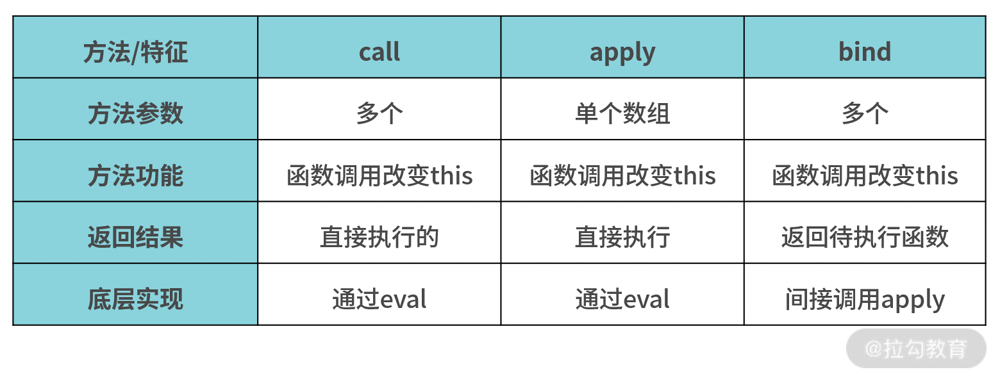

# 你不知道的 JavaScript(中)

## 类型和语法

### 七种内置类型

> ES5 6 种
> ES6 新增 1 种

1. number(数字类型)
2. string(字符串类型)
3. bool(布尔类型)
4. null(空值)
5. undefined(未定义)
6. object(对象)
7. symbol(符号)

### 数组

> 数组可以存放任意类型的值：数字，字符串，布尔，对象，甚至是另一个数组。

**稀疏数组**：数组中含有空白或者空缺单元的数组。

```js
// 稀疏数组
var arr = [];
arr[0] = 0;
arr[2] = 2;
console.log(arr[1]); // 输出 undefined
console.log(arr.length); // 输出 3
```

**类数组**：与数组的结果类似，但并不是真正的数组。

```js
// 类数组的案例
function foo() {
  // arguments就是类数组
  console.log(arguments);
}
foo("a", "b", "c");
```

#### 类数组转成真正的数组

> 1. `Array.prototype.slice()`工具函数转
> 2. `Array.from()`ES6 新方法转

```js
// 类数组转真正数组的案例
function foo() {
  var arr = Array.prototype.slice.call(arguments);
  var arr2 = Array.from(arguments);
  arr.push(3);
  arr2.push(4);
  // 输出[1, 2, 3]
  console.log(arr);
  // 输出[1, 2, 4]
  console.log(arr2);
}
foo(1, 2);
```

### 字符串和字符数组

#### 相似之处

1. 都是类数组
2. 都有`length`属性
3. 都有`indexOf`，`concat`方法

```js
// 字符串和字符的相似之处
var a = "foo";
var b = ["f", "o", "o"];
console.log(a.length); // 输出3
console.log(b.length); // 输出3

console.log(a.indexOf("o")); // 输出1
console.log(b.indexOf("o")); // 输出1

var c = a.concat("bar");
var d = b.concat(["b", "a", "r"]);
console.log(c); // 输出foobar
console.log(d); // 输出['f','o','o','b','a','r']
```

#### 为什么字符串不可变

> 字符串不可变：意思是字符串的成员函数不会改变原始的值，而是创建并返回一个新的字符串。

```js
// 字符串的不可变性
var a = "foo";
var b = a.concat("bar");
console.log(b); // 输出foobar
console.log(a); // 输出foo

var c = a.toUpperCase();
console.log(c); // 输出FOO
console.log(a); // 输出foo
```

#### 字符串借用数组的方法

```js
// 字符串借用数组的方法
var a = "foo";
var b = Array.prototype.join.call(a, "-");
console.log(b); // 输出f-o-o
var c = Array.prototype.map
  .call(a, function(v) {
    return v.toUpperCase() + ".";
  })
  .join("");
console.log(c); // 输出F.O.O.
```

#### 字符串借用数组方法反转

```js
// 最暴力的字符串反转方法
var a = "why";
var b = a
  .split("")
  .reverse()
  .join("");
console.log(b); // 输出yhw
```

### 十种原生函数

> ES5 9 种
> ES6 新增 1 种

1. String()
2. Number()
3. Boolean()
4. Array()
5. Function()
6. Object()
7. RegExp()
8. Date()
9. Error()
10. Symbol() (ES6 新增)

#### 原生函数的运用

```js
// 原生函数的运用
var strObj = new String("abc");
var str = "abc";

console.log(typeof str); // 输出string
console.log(typeof strObj); // 输出Object

console.log(str); // 输出abc
console.log(strObj); // 输出String {0:'a',1:'b',2:'c',length:3}
```

> 再次强调：利用原生函数创建的是一个封装对象，而非其基本类型的值

#### [[CLASS]]内部属性

> 1. 所有`typeof`返回`object`的对象，都有一个内部属性，这个属性无法访问，一般通过`Object.prototype.toString.call()`访问
> 2. `null`和`undefined`虽然没有其对应的原生构造函数，但其内部`[[CLASS]]`依然是`Null`和`Undefined`

```js
// 内部属性
console.log(Object.prototype.toString.call([1, 2, 3])); // 输出[object Array]
console.log(Object.prototype.toString.call("abc")); // 输出[object String]
console.log(Object.prototype.toString.call(12)); // 输出[object Number]
console.log(Object.prototype.toString.call(null)); // 输出[object Null]
console.log(Object.prototype.toString.call(undefined)); // 输出[object Undefined]
```

#### 封装对象的封装和拆封

> 1. 基本类型值会自动封装成一个封装对象
> 2. 封装对象永远返回的是一个对象，其布尔值为`true`，即使是对`false`值进行的封装的对象，其布尔值也是`true`
> 3. 获取封装对象中的基本类型值，用`valueOf()`函数

```js
// 封装对象的封装和拆封
var str = "abc";
console.log(str.length); // 输出3
console.log(str.toUpperCase()); // 输出ABC

var flag = new Boolean(false);
if (!flag) {
  console.log("执行不到这里，因为flag为封装对象，其布尔值为true");
}

var number = new Number(123);
console.log(str.valueOf()); // 输出abc
console.log(number.valueOf()); // 输出123
```

### 强制类型转换

> **显示强制类型转换**：发生在静态类型语言的编译阶段
> **隐式强制类型转换**：发生在动态语言的运行时

```js
// 两种强制类型转换
var a = 42;
var b = a + ""; // 隐式强制类型转换
var c = String(a); // 显示强制类型转换
```

#### ToString 类型转换规则

> 1. 数字按照规则转换成对应的字符串格式
> 2. `null`转换成字符串`null`
> 3. `undefined`转换成字符串`undefined`
> 4. 布尔值转换成对应的字符串格式，`true`转换成字符串`true`,`false`转换成字符串`false`
> 5. 数组，将所有单元以`,`号连接起来
> 6. 对象，如果对象没有重新定义其`toString()`方法，返回其对应的内部属性`[[CLASS]]`的值，如`[object Object]`

```js
// ToString类型转换的规则
var a = String(42);
var b = String(null);
var c = String(undefined);
var d = String(true);
var e = String([1, 2, 3]);
var f = {
  name: "www",
  age: 12,
  toString: function() {
    return this.age;
  },
};
var h = {
  name: "AAA",
  age: 11,
};

console.log(a); // 输出42
console.log(b); // 输出null
console.log(c); // 输出undefined
console.log(d); // 输出true
console.log(e); // 输出1,2,3
console.log(f.toString()); // 输出12，f对象重新定义了toString()方法
console.log(h.toString()); // 输出[object Object]，返回的是h对象的内部属性[[CLASS]]的值
```

#### JSON 字符串化

> 1. 数字字符串化为其对应的字符串格式
> 2. 字符串字符串化为其对应的字符串格式，但有两对引号，其中一对是字符串本身的
> 3. 布尔字符串为其对应的字符串格式
> 4. `null`字符串化为`"null"`
> 5. 数组字符串化为其对应的字符串化格式，例如`[1,2,3]`字符串化为`"[1,2,3]"`
> 6. `undefined`、函数`function`和`symbol`会自动忽略，变成`undefined`，如果在数组中，则返回`null`以保证数组中单元位置不变

```js
// JSON字符串化
var a = 42;
var b = "abc";
var c = true;
var d = null;
var e = [1, 2, 3];
console.log(JSON.stringify(a)); // 输出"42"
console.log(JSON.stringify(b)); // 输出""abc""
console.log(JSON.stringify(c)); // 输出"true"
console.log(JSON.stringify(d)); // 输出"null"
console.log(JSON.stringify(e)); // 输出"[1,2,3]"

var f = undefined;
var h = [1, undefined, function() {}, 4];
var i = {
  name: "why",
  age: 12,
  sayHello: function() {
    consoel.log(this.age);
  },
};

console.log(JSON.stringify(f)); // 忽略，变成undefined
console.log(JSON.stringify(h)); // 忽略数组第二项，第三项 输出"[1,null,null,4]"
console.log(JSON.stringify(i)); // 忽略对象中的方法，sayHello属性不字符串化，输出"{"name":'why',"age": 12}"
```

#### JSON 字符串化对象

> 1. 未定义其`toJSON`方法，则按正常规则进行序列化
> 2. 定义了其`toJSON`方法，则按具体定义`toJSON()`方法的返回值来进行序列化

注意

对象的字符串化方法`toJSON()`并不是直接返回字符串化的值，而是返回一个能够被 JSON 字符串化的一个 JSON 安全的值，最后通过`JSON.stringify()`来字符串化

```js
// 对象的字符串化
var obj1 = {
  name: "why",
  age: 12,
};
var obj2 = {
  name: "why",
  age: 12,
  toJSON: function() {
    // 只字符串化name属性，age属性不
    return {
      name: this.name,
    };
  },
};

console.log(JSON.stringify(obj1)); // 输出{"name":"why","age":12}
console.log(JSON.stringify(obj2)); // 输出{"name":"why"}
```

#### JSON 字符串化参数运用

- 第一个可选参数：可以是一个数组或者一个函数，用来指定对象序列化过程中，哪些属性应该被处理，哪些属性应该被排斥。当参数为数组时，只序列化数组中的属性；当参数为函数时，函数返回什么就序列化什么。
- 第二个可选参数：用来指定输出的缩进格式，不常用

```js
// JSON字符串格式化参数的运用
var obj = {
  a: 42,
  b: "42",
  c: true,
  d: [1, 2, 3],
};
var result1 = JSON.stringify(obj, ["a", "b", "d"]);
var result2 = JSON.stringify(obj, function(key, value) {
  if (key !== "c") {
    return value;
  }
});

console.log(result1); // 输出{"a":"42","b":"42","d":"[1,2,3]"}}(给什么输出什么)
console.log(result2); // 输出{"a":"42","b":"42","d":"[1,2,3]"}}(返回什么输出什么)
```

#### ToNumber 转换规则

> 1. `true`转换为 1
> 2. `false`转换为 0
> 3. 空字符串转换为 0，非空字符串转换为 1
> 4. null 转换为 0，undefined 转换为 NaN
> 5. 对象或者数组，先查找`valueOf()`再查找`toString()`，都没有则报`TypeError`错误

```js
// ToNumber转换规则
var a = true;
var b = false;
var c = null;
var d = undefined;
var e = {
  a: 42,
  valueOf: function() {
    return this.a;
  },
  toString: function() {
    return 24;
  },
};
var f = {
  a: 42,
  toString: function() {
    return this.a;
  },
};
var h = [1, 2, 3];
h.toString = function() {
  return this.join("");
};

console.log(Number(a)); // 输出1
console.log(Number(b)); // 输出0
console.log(Number(c)); // 输出0
console.log(Number(d)); // 输出NaN
console.log(Number(e)); // 输出42，先判断valueOf()
console.log(Number(f)); // 输出42,没有valueOf()时，判断toString()
console.log(Number(h)); // 输出123
```

#### ToBoolean 转换规则

**假值**：可以被强制类型转换为 false 的值
**真值**：其他

JS 规范假值表

1. `undefined`
2. `null`
3. `false`
4. `+0 -0`和 NaN
5. 空字符串

```js
// ToBoolean转换规则
var a = Boolean(42);
var b = Boolean(0);
var c = Boolean(null);
var d = Boolean(undefined);
var e = Boolean("");
var f = Boolean("0");
var g = Boolean("false");
var h = Boolean(NaN);
var i = Boolean([]);
var j = Boolean({});
var k = Boolean(function() {
  console.log("k");
});

console.log(a); // 输出true
console.log(b); // 输出false
console.log(c); // 输出false
console.log(d); // 输出false
console.log(e); // 输出false
console.log(f); // 输出true
console.log(g); // 输出true
console.log(h); // 输出fasle
console.log(i); // 输出true
console.log(j); // 输出true
console.log(k); // 输出true
```

#### 显示强制类型转换(字符串与数字之间)

> 1. 数字转字符串用`String()`方法，没有使用`new`
> 2. 字符串转数字用`Number()`方法，没有使用`new`
> 3. 其他方法

```js
// 字符串与数字之间的强制类型转换
var a = 42;
var b = String(a);

var c = "3.14";
var d = Number(c);

console.log(b); // 输出"42"
console.log(d); // 输出3.14
```

#### 字符串与数字之间转换的其他方法

```js
// 字符串与数字之间转换的其他方法
var a = 42;
var b = a.toString(); // 隐式类型转换，创建一个封装对象

var c = "3.14";
var d = +c; // 一元运算符，显示转换为数字类型

console.log(b); // 输出"42"
console.log(d); // 输出3.14
```

#### 显示转换为布尔值

> 1. 其他类型转换为布尔值时，使用`Boolean()`，没有使用`new`操作符
> 2. 其他方法

```js
// 其他类型值转换为布尔值
var a = 0;
var b = "0";
var c = null;
var d = undefined;
var e = [];
var f = {};
var h = "";
var i = "false";

console.log(Boolean(a)); //输出false
console.log(Boolean(b)); //输出true
console.log(Boolean(c)); //输出false
console.log(Boolean(d)); //输出false
console.log(Boolean(e)); //输出true
console.log(Boolean(f)); //输出true
console.log(Boolean(h)); //输出false
console.log(Boolean(i)); //输出true
```

#### 显示转换为布尔值的其他方法

```js
// 显示转换为布尔值的其他方法
var a = [];
var b = "";

var c = !a; // !一元运算符，显示强制类型转换，将其真值转换为假值，假值转换为真值
var d = !b;

var e = !!a; // !!二元运算符，在!一元运算符的基础上，把值再次取反
var f = !!b;

console.log(c); // 输出false
console.log(d); // 输出true
console.log(e); // 输出true
console.log(f); // 输出false
```

#### 隐式强制类型转换

#### 隐式强制类型转换形式一：运算符

> 1. 运算符`+`可以隐式将数字转换为字符串
> 2. 运算符`-`可以隐式的将字符串转换为数字

```js
// 隐式强制类型转换形式一：运算符
var a = 42;
var b = "0";

var c = a + b;
var d = c - 0;
console.log(c); // 输出"420"
console.log(d); // 输出420

var e = [1, 2];
var f = [3, 4];
var g = e + f;
// 输出1,23,4 数组相加时，会隐式的调用数组的valueOf()或者toString()
// e.toString() => "1,2"
// f.toString() => "3,4"
console.log(g);

// 提问一 i==j 或者j==i中 是数字转换成字符串再进行比较；还是字符串转换成数字，再进行比较
// 解答：ES5规范定义：数字==字符串 判断是，是字符串转换成数字，再和数字比较
var i = 42;
var j = "42";
console.log(i == j);
console.log(j == i);

// 提问二：数字==布尔值时，是数字转出布尔值，再进行判断；还是布尔值转成数字，再进行判断
// 解答：ES5规范：数字==布尔值时，是布尔值转换成对应的数字，再和数字比较(true:1,false:0)
var p = true;
var q = 0;
console.log(p == q);
```

#### 隐式强制类型转换形式二：隐式转换为布尔值

隐式转换为布尔值的情况

1. `if`语句的条件判断
2. `for循环的第二条条件判断语句`
3. `do..while`和`while`循环的循环判断条件
4. `?:`三元运算符
5. `||`和`&&`逻辑运算符

注意

`||`和`&&`逻辑操作符返回的不一定是布尔值，而是两个数中的其中一个数

```js
// || 和 && 逻辑运算符的返回值
var a = 42;
var b = "abc";
var c = false;

console.log(a && b); // 输出"abc"，a为真，直接返回第二个数，不管第二个数为真还是为假
console.log(b && a); // 输出42，规则同上

console.log(a || b); // 输出42，a为真，直接返回第一个数，不管第二个数为真还是为假
console.log(b || a); // 输出"abc",规则同上

console.log(c && b); // 输出false，c为假，直接返回第一个数，不管第二个数为真还是为假
console.log(c || b); // 输出"abc"，c为假，直接返回第二个数，不管是真还是假
// 三元运算符和逻辑操作符的大致关系
var a = 42;
var b = false;

// a||b 大致相当于 a?a:b
console.log(a || b); // 输出42
console.log(a ? a : b); // 输出42

// a&&b 大致相当于 a?b:a
console.log(a && b); // 输出false
console.log(a ? b : a); // 输出false
```

#### 隐式强制类型转换形式三：符号

> 1. `==`宽松相等：只判断值是否相等
> 2. `===`严格相等不仅判断值，还要判断类型

```js
// 隐式强制类型转换形式一：符号
var a = 42;
var b = "42";

console.log(a == b); // 输出true
console.log(a === b); // 输出false，a为数字类型，b为字符串类型
```

### 手动实现 JSON.stringify 方法

`JSON.stringify` 方法是将一个 JavaScript 对象或值转换为 JSON 字符串，默认该方法其实有三个参数：第一个参数是必选，后面两个是可选参数非必选。第一个参数传入的是要转换的对象；第二个是一个 replacer 函数，比如指定的 replacer 是数组，则可选择性地仅处理包含数组指定的属性；第三个参数用来控制结果字符串里面的间距，后面两个参数整体用得比较少。

该方法的语法为：`JSON.stringify(value[, replacer [, space]])`

#### 分析各种数据类型及边界情况

我们来分析一下都有哪些数据类型传入，传入了之后会有什么返回，通过分析的结果我们之后才能更好地实现编码。大致的分析汇总如下表所示（可参考 MDN 文档）


上面这个表中，基本整理出了各种数据类型通过 JSON.stringify 这个方法之后返回对应的值，但是还有一个特殊情况需要注意：对于包含循环引用的对象（深拷贝那讲中也有提到）执行此方法，会抛出错误。

#### 代码逻辑实现

我们先利用 typeof 把基础数据类型和引用数据类型分开，分开之后再根据不同情况来分别处理不同的情况，按照这个逻辑代码实现如下。

```js
function jsonStringify(data) {
  // 1. 首先获取类型
  let type = typeof data;

  // 2. 基本类型和引用类型做区分
  if (type !== "object") {
    let result = data;
    if (Number.isNaN(data) || data === Infinity) {
      result = "null";
    } else if (
      type === "function" ||
      type === "undefined" ||
      type === "symbol"
    ) {
      // 由于 function 序列化返回 undefined，因此和 undefined、symbol 一起处理
      return undefined;
    } else if (type === "string") {
      result = '"' + data + '"';
    }
    return String(result);
  } else if (type === "object") {
    if (data === null) {
      return "null";
    } else if (data.toJSON && typeof data.toJSON === "function") {
      return jsonStringify(data.toJSON(data));
    } else if (data instanceof Array) {
      let result = [];
      data.forEach((item, index) => {
        if (
          typeof item === "function" ||
          typeof item === "undefined" ||
          typeof item === "symbol"
        ) {
          result[index] = "null";
        } else {
          result[index] = jsonStringify(item);
        }
      });
      return (result = "[" + result + "]");
    } else {
      // 处理普通对象
      let result = [];
      Object.keys(data).forEach((item, index) => {
        if (typeof item !== "symbol") {
          // key 如果是 symbol 对象，忽略
          if (
            data[item] !== undefined &&
            typeof data[item] !== "function" &&
            typeof data[item] !== "symbol"
          ) {
            // 键值如果是 undefined、function、symbol 为属性值，忽略
            result.push('"' + item + '"' + ":" + jsonStringify(data[item]));
          }
        }
      });
      return "{" + result + "}";
    }
  }
}
```

1. 由于 function 返回 'null'， 并且 typeof function 能直接返回精确的判断，故在整体逻辑处理基础数据类型的时候，会随着 undefined，symbol 直接处理了；
2. 由于 01 讲说过 typeof null 的时候返回'object'，故 null 的判断逻辑整体在处理引用数据类型的逻辑里面；
3. 关于引用数据类型中的数组，由于数组的每一项的数据类型又有很多的可能性，故在处理数组过程中又将 undefined，symbol，function 作为数组其中一项的情况做了特殊处理；
4. 同样在最后处理普通对象的时候，key （键值）也存在和数组一样的问题，故又需要再针对上面这几种情况（undefined，symbol，function）做特殊处理；
5. 最后在处理普通对象过程中，对于循环引用的问题暂未做检测，如果是有循环引用的情况，需要抛出 Error；

#### 实际效果测试

```js
let nl = null;
console.log(jsonStringify(nl) === JSON.stringify(nl));
// true

let und = undefined;
console.log(jsonStringify(undefined) === JSON.stringify(undefined));
// true

let boo = false;
console.log(jsonStringify(boo) === JSON.stringify(boo));
// true

let nan = NaN;
console.log(jsonStringify(nan) === JSON.stringify(nan));
// true

let inf = Infinity;
console.log(jsonStringify(Infinity) === JSON.stringify(Infinity));
// true

let str = "jack";
console.log(jsonStringify(str) === JSON.stringify(str));
// true

let reg = new RegExp("w");
console.log(jsonStringify(reg) === JSON.stringify(reg));
// true

let date = new Date();
console.log(jsonStringify(date) === JSON.stringify(date));
// true

let sym = Symbol(1);
console.log(jsonStringify(sym) === JSON.stringify(sym));
// true

let array = [1, 2, 3];
console.log(jsonStringify(array) === JSON.stringify(array));
// true

let obj = {
  name: "jack",
  age: 18,
  attr: ["coding", 123],
  date: new Date(),
  uni: Symbol(2),
  sayHi: function() {
    console.log("hi");
  },
  info: {
    sister: "lily",
    age: 16,
    intro: {
      money: undefined,
      job: null,
    },
  },
};
console.log(jsonStringify(obj) === JSON.stringify(obj));
// true
```

### 手动实现 call apply bind 方法

```js
Function.prototype.call = function(context, ...args) {
  // context 新的this指向，args 函数形参列表
  let context = context || window;
  // 给context添加一个方法指向this
  context.fn = this;
  let result = eval("context.fn(...args)");
  delete context.fn;
  return result;
};
```

```js
Function.prototype.apply = function(context, args) {
  let context = context || window;
  context.fn = this;
  let result = eval("context.fn(...args)");
  delete context.fn;
  return result;
};
```

```js
Function.prototype.bind = function(context) {
  let self = this;
  return function() {
    return self.apply(context, ...arguments);
  };
};
```

#### 为什么要用 eval

首先，你需要先仔细学一下 eval 函数；其次，使用 eval 函数会帮我们进行了处理，隐藏执行了等效于 toString() 的操作，你要知道从上面传过来的参数是需要作为 context.fn 这个函数的参数一次性执行完成的，这里传进来如果参数是数组的话也是不能直接作为参数传递给 context.fn 的，因此通过 eval 函数把他们全部变成字符串作为要执行的函数的参数传进来进行执行的。最后要是还是不理解的话可以看下这两点：[1,2,3].toString() 在控制台输出的结果是什么？另外再理解一下 eval 这个函数的作用


