# 你不知道的JavaScript(上)

## 深入理解javascript作用域 - 内部原理

javascript拥有一套设计良好的规则来存储变量，并且之后可以方便地找到这些变量，这套规则被称为作用域。作用域貌似简单，实则复杂，由于作用域与[this机制](http://www.cnblogs.com/xiaohuochai/p/5735901.html)非常容易混淆，使得理解作用域的原理更为重要。本篇文章是深入理解javascript作用域系列的第一篇——内部原理

内部原理分成编译、执行、查询、嵌套和异常五个部分进行介绍，最后以一个实例过程对原理进行完整说明

### 编译

尽管通常将 javascript 归类为“动态”或“解释执行语言”，但事实上它是一门编译语言。

但与传统的编译语言不同，他不是提前编译的，编译结果也不能在分布式系统中进行移植。

在传统编译语言的流程中，程序中的一段源代码在执行之前会经历三个步骤，统称为 “编译”。

以var a = 2;为例，说明javascript的内部编译过程，主要包括以下三步：

+ 分词(tokenizing)

  把由字符组成的字符串分解成有意义的代码块，这些代码块被称为词法单元(token)

  var a = 2；被分解成为下面这些词法单元：var、a、=、2、;。这些词法单元组成了一个词法单元流数组

  ~~~javascript
  // 词法分析后的结果
  [
    "var" : "keyword",
    "a" : "identifier",
    "="   : "assignment",
    "2"  : "integer",
    ";"   : "eos" (end of statement)
  ]
  ~~~

  

+ 解析(parsing)

  把词法单元流数组转换成一个由元素逐级嵌套所组成的代表程序语法结构的树，这个树被称为“抽象语法树” (Abstract Syntax Tree, AST)

  var a = 2；的抽象语法树中有一个叫VariableDeclaration的顶级节点，接下来是一个叫Identifier(它的值是a)的子节点，以及一个叫AssignmentExpression的子节点，且该节点有一个叫Numericliteral(它的值是2)的子节点

  ~~~javascript
  {
    operation: "=",
    left: {
      keyword: "var",
      right: "a"
    }
    right: "2"
  }
  ~~~

  

+ 代码生成

  将AST转换为可执行代码的过程被称为代码生成，这个过程与语言，目标平台等息息相关。

  var a=2；的抽象语法树转为一组机器指令，用来创建一个叫作a的变量(包括分配内存等)，并将值2储存在a中

  实际上，javascript引擎的编译过程要复杂得多，包括大量优化操作，上面的三个步骤是编译过程的基本概述，

  简单地说，任何 javascript 代码片段在执行前都要进行编译（通常就在执行前）。因此，javascript编译器首先会对var a=2；这段程序进行编译，然后做好执行它的准备，并且通常马上就会执行它。


### 执行

+ 引擎

  从头到尾负责整个 javascript 程序的编译及执行过程

+ 编译器

  引擎的好朋友之一，负责语法分析及代码生成等脏活累活

+ 作用域

  引擎的另一位好朋友，负责收集并维护所有声明的标识符（变量）组成的一系列查询，并实施一套非常严格的规则，确定当前执行的代码对这些标识符的访问权限。


当你看见 var a = 2 这段程序时，很可能认为这是一段声明。但我们的新朋友引擎却不这么看，事实上，引擎认为这里有两个完全不同的声明，一个由编译器在编译时处理，另一个则由引擎在运行时处理。


下面我们将 var a = 2; 分解，

编译过程就是编译器把程序分解成词法单元(token)，然后把词法单元解析成语法树(AST)，**但是当编译器进行代码生成时，**他对这段程序的处理方式会和预期的有所不同。

事实上编译器会进行如下处理。

1. 遇到 var a ，编译器查找作用域是否已经有一个名称为 a 的变量存在于同一个作用域的集合中。如果是，编译器会忽略该声明，继续进行编译；否则它会要求作用域在当前作用域的集合中声明一个新的变量，并命名为 a。
2. 接下来编译器会为引擎生成运行时所需的代码，这些代码被用来处理 a = 2 这个赋值操作，引擎运行时会首先询问作用域，在当前作用域中是否存在一个叫做 a 的变量，如果是，引擎就会使用这个变量，如果否，引擎会继续查找该变量。如果引擎最终找到了变量a，就会将2赋值给它。否则引擎会抛出一个异常。

> 依据编译器的编译原理，javascript中的重复声明是合法的

~~~javascript
//test在作用域中首次出现，所以声明新变量，并将20赋值给test
var test = 20;
//test在作用域中已经存在，直接使用，将20的赋值替换成30
var test = 30;
~~~


### 查询

在引擎执行的第一步操作中，对变量a进行了查询，这种查询叫做LHS查询。实际上，引擎查询共分为两种：LHS查询和RHS查询 。

从字面意思去理解，当变量出现在赋值操作的左侧时进行LHS查询，出现在右侧时进行RHS查询

更准确地讲，RHS查询与简单地查找某个变量的值没什么区别，而LHS查询则是试图找到变量的容器本身，从而可以对其赋值。


> LHS和RHS的含义是 “赋值操作的左侧和右侧” 并不一定意味着就是 “= 赋值操作符的左侧或右侧”，赋值操作符还有其他几种形式，因此在概念上最好将其理解为，“赋值操作的目标是谁 （LHS）”以及“谁是赋值操作的源头（RHS）”
>
> RHS查询就是普通的查询变量的值，即获取变量的值。


~~~javascript
function foo(a){
    console.log(a);//2
}
foo( 2 );
~~~

这段代码中，总共包括4个查询，分别是：

1. foo(...)对foo进行了RHS引用

2. 函数传参a = 2对a进行了LHS引用

3. console.log(...)对console对象进行了RHS引用，并检查其是否有一个log的方法

4. console.log(a)对a进行了RHS引用，并把得到的值传给了console.log(...)


### 嵌套

当一个块或函数嵌套在另一个块或函数中时，就发生了作用域嵌套，在当前作用域中无法找到某个变量时，引擎就会在外层嵌套的作用域中继续查找，直到找到该变量，或抵达最外层的作用域（也就是全局作用域）为止。

~~~javascript
function foo(a){
    console.log( a + b ) ;
}
var b = 2;
foo(2);// 4
~~~

在代码片段中，作用域foo()函数嵌套在全局作用域中。引擎首先在foo()函数的作用域中查找变量b，并尝试对其进行RHS引用，没有找到；接着，引擎在全局作用域中查找b，成功找到后，对其进行RHS引用，将2赋值给b。


### 异常

为什么区分LHS和RHS是一件重要的事情？因为在变量还没有声明（在任何作用域中都无法找到变量）的情况下，这两种查询的行为不一样。


**RHS**

1. 如果RHS查询失败，引擎会抛出ReferenceError(引用错误)异常

   ~~~javascript
   //对b进行RHS查询时，无法找到该变量。也就是说，这是一个“未声明”的变量
   function foo(a){
       a = b;  
   }
   foo();//ReferenceError: b is not defined
   ~~~

2.  如果RHS查询找到了一个变量，但尝试对变量的值进行不合理操作，比如对一个非函数类型值进行函数调用，或者引用null或undefined中的属性，引擎会抛出另外一种类型异常：TypeError(类型错误)异常

   ~~~javascript
   function foo(){
       var b = 0;
       b();
   }
   foo();//TypeError: b is not a function
   ~~~

   

**LHS**

1. 当引擎执行LHS查询时，如果无法找到变量，全局作用域会创建一个具有该名称的变量，并将其返还给引擎

   ~~~javascript
   function foo(){
       a = 1;  
   }
   foo();
   console.log(a);//1
   ~~~

2. 如果在严格模式中LHS查询失败时，并不会创建并返回一个全局变量，引擎会抛出同RHS查询失败时类似的ReferenceError异常

   ~~~javascript
   function foo(){
       'use strict';
       a = 1;  
   }
   foo();
   console.log(a);//ReferenceError: a is not defined
   ~~~


+ ReferenceError 同作用域判别失败相关，而 TypeError 则代表了作用域判别成功了，但是对结果的操作是非法或不合理的。


### 原理

~~~javascript
function foo(a){
    console.log(a);
}
foo(2);
~~~

以上面这个代码片段来说明作用域的内部原理，分为以下几步：

【1】引擎需要为foo(...)函数进行RHS引用，在全局作用域中查找foo。成功找到并执行

【2】引擎需要进行foo函数的传参a=2，为a进行LHS引用，在foo函数作用域中查找a。成功找到，并把2赋值给a

【3】引擎需要执行console.log(...)，为console对象进行RHS引用，在foo函数作用域中查找console对象。由于console是个内置对象，被成功找到

【4】引擎在console对象中查找log(...)方法，成功找到

【5】引擎需要执行console.log(a)，对a进行RHS引用，在foo函数作用域中查找a，成功找到并执行

【6】于是，引擎把a的值，也就是2传到console.log(...)中

【7】最终，控制台输出2

## 深入理解javascript作用域 - 词法作用域

大多数时候，我们对作用域产生混乱的主要原因是分不清楚应该按照函数位置的嵌套顺序，还是按照函数的调用顺序进行变量查找。再加上this机制的干扰，使得变量查找极易出错。这实际上是由两种作用域工作模型导致的，作用域分为词法作用域和动态作用域，分清这两种作用域模型就能够对变量查找过程有清晰的认识。本文是深入理解javascript作用域系列第二篇——词法作用域和动态作用域。


### 词法作用域

上一篇介绍过，编译器的第一个工作阶段叫作分词，就是把由字符组成的字符串分解成词法单元。这个概念是理解词法作用域的基础。

简单地说，词法作用域就是定义在词法阶段的作用域，换句话说，词法作用域是由写代码时将变量和块作用域写在哪里来决定的，因此当词法分析器处理代码时会保持作用域不变。


**关系**

无论函数在哪里被调用，也无论它如何被调用，它的词法作用域都只由函数被声明时所处的位置决定


考虑一下代码：

~~~javascript
function foo(a) {
    var b = a * 2;
    function bar(c) {
        console.log( a, b, c );
    }
    bar(b * 3);
}
foo( 2 ); // 2 4 12
~~~

在这个例子中有三个逐级嵌套的作用域。为了帮助理解，可以将它们想象成几个逐级包含的气泡。


1. 作用域气泡由其对应的作用域块代码写在哪里决定，它们是逐级包含的

2. 气泡1包含着整个全局作用域，其中只有一个标识符：foo

3. 气泡2包含着foo所创建的作用域，其中有三个标识符：a、bar和b

4. 气泡3包含着bar所创建的作用域，其中只有一个标识符：c


**查找**

作用域气泡的结构和互相之间的位置关系给引擎提供了足够的位置信息，引擎用这些信息来查找标识符的位置

在代码片段中，引擎执行console.log(...)声明，并查找a、b和c三个变量的引用。它首先从最内部的作用域，也就是bar(...)函数的作用域开始查找。引擎无法在这里找到a，因此会去上一级到所嵌套的foo(...)的作用域中继续查找。在这里找到了a，因此引擎使用了这个引用。对b来讲也一样。而对c来说，引擎在bar(...)中找到了它

`注意` 词法作用域查找只会查找一级标识符，如果代码引用了foo.bar.baz，词法作用域查找只会试图查找foo标识符，找到这个变量后，对象属性访问规则分别接管对bar和baz属性的访问

~~~javascript
foo = {
    bar:{
        baz: 1
    }
};
console.log(foo.bar.baz);//1
~~~


**遮蔽**

作用域查找从运行时所处的最内部作用域开始，逐级向外或者说向上进行，直到遇见第一个匹配的标识符为止

在多层的嵌套作用域中可以定义同名的标识符，这叫作“遮蔽效应”，内部的标识符“遮蔽”了外部的标识符

~~~javascript
var a = 0;
function test(){
    var a = 1;
    console.log(a);//1
}
test();
~~~


全局变量会自动为全局对象的属性，因此可以不直接通过全局对象的词法名称，而是间接地通过对全局对象属性的引用来对其进行访问

~~~javascript
var a = 0;
function test(){
    var a = 1;
    console.log(window.a);//0
}
test();
~~~

通过这种技术可以访问那些被同名变量所遮蔽的全局变量。但非全局的变量如果被遮蔽了，无论如何都无法被访问到


### 动态作用域

javascript使用的是词法作用域，它最重要的特征是它的定义过程发生在代码的书写阶段

那为什么要介绍动态作用域呢？实际上动态作用域是javascript另一个重要机制this的表亲。作用域混乱多数是因为词法作用域和this机制相混淆，傻傻分不清楚

动态作用域并不关心函数和作用域是如何声明以及在任何处声明的，只关心它们从何处调用。换句话说，作用域链是基于调用栈的，而不是代码中的作用域嵌套

~~~javascript
var a = 2;
function foo() {
    console.log( a );
}
function bar() {
    var a = 3;
    foo();
}
bar();
~~~

【1】如果处于词法作用域，也就是现在的javascript环境。变量a首先在foo()函数中查找，没有找到。于是顺着作用域链到全局作用域中查找，找到并赋值为2。所以控制台输出2

【2】如果处于动态作用域，同样地，变量a首先在foo()中查找，没有找到。这里会顺着调用栈在调用foo()函数的地方，也就是bar()函数中查找，找到并赋值为3。所以控制台输出3

两种作用域的区别，简而言之，词法作用域是在定义时确定的，而动态作用域是在运行时确定的


## 深入理解javascript作用域 - 函数作用域

正如我们在前面讨论的那样，作用域包含了一系列的气泡，每一个都可以作为容器，其中包含了标识符（变量，函数）的定义。这些气泡互相嵌套并排列成蜂窝型，排列的结构是在写代码的时候定义的。

但是究竟是什么生成了一个新的气泡？只有函数会生成新的气泡吗？javascript中的其他结构能生成作用域气泡吗？


### 函数中的作用域

对于前面提出的问题，最常见的答案是 **javascript 具有基于函数的作用域**，意味着每声明一个函数都会为其自身创建一个气泡，而其他结构都不会创建作用域气泡，但事实上这并不完全正确。


考虑下面的代码：

~~~javascript
function foo (a) {
    var b = 2
    function bar () {
        // ...
    }
    var c = 3
}
~~~

在这个代码片段中，foo(..) 的作用域气泡中包含了标识符 a, b, c 和 bar。无论标识符声明出现在作用域的何处，这个标识符所代表的变量或函数都将附属于所处作用域的气泡，


bar(..) 拥有自己的作用域气泡。全局作用域也拥有自己的作用域气泡，他只包含了一个标识符：foo。

由于标识符 a, b, c 和 bar 都附属于 foo(..) 的作用域气泡，因此无法从 foo(..) 的外部对他们进行访问，也就是说，这些标识符全都无法从全局作用域中进行访问，


函数作用域的含义是指，属于这个函数的全部变量都可以在整个函数的范围内使用以及复用（事实上在嵌套作用域中也可以使用）。这种设计方案是非常有用的，能充分利用 javascript 变量可以根据需要改变值类型的 "动态" 特性。


### 隐藏内部实现

对函数的传统认知就是先声明一个函数，然后再向里面添加代码。但反过来想也可以带来一些启示：从所写的代码中挑选出一个任意的片段，然后用函数声明对他进行包装，实际上就是把这些代码隐藏起来了。

实际的结果就是在这个代码片段的周围创建了一个作用域气泡，也就是说这段代码中的任何声明（变量或函数）都将绑定在这个新创建的包装函数的作用域中，而不是先前所在的作用域中。换句话说，可以把变量和函数包裹在一个函数的作用域中，然后用这个作用域来"隐藏"他们。


为什么 "隐藏" 变量和函数是一个有用的技术？


有很多原因促成了这种作用域的隐藏方法，他们大都是从最小 `最小特权`原则中引申出来的，也叫最小授权或最小暴露原则。这个原则指在软件设计中，应该最小限度地暴露必要内容，而将其他内容都 "隐藏" 起来，比如某个模块或对象的 API 设计。

例如：

~~~javascript
function doSomething (a) {
    b = a + doSomethingElse(a * 2)
    console.log(b * 3)
}

function doSomethingElse (a) {
    return a - 1
}

var b

doSomething(2) // 15
~~~


~~~javascript
function doSomething (a) {
    function doSomethingElse (a) {
        return a - 1
    }
    var b
    b = a + doSomethingElse(a * 2)
    console.log(b * 3)
}

doSomething(2) // 15
~~~


### 规避冲突

隐藏作用域中的变量和函数所带来的另一个好处，是可以避免同名标识符之间的冲突，两个标识符可能具有相同的名字但用途不一样，无意间可能造成命名冲突。冲突会导致变量的值被意外覆盖。

例如：

~~~javascript
function foo () {
    function bar (a) {
        i = 3; // 修改 for 循环所属作用域中的 i
        console.log(a + i)
    }
    
    for (var i = 0; i < 10; i++) {
        bar (i * 2); // 无限循环了！
    }
}

foo()
~~~

bar(..) 内部的赋值表达式 i = 3 意外地覆盖了声明在 foo(..) 内部 for 循环中的 i。在这个例子中将会导致无限循环，因为 i 被固定设置为 3，永远满足小于 10 这个条件。

bar(..) 内部的赋值操作需要声明一个本地变量来使用，采用任何名字都可以， var i = 3；就可以满足这个需求（同时会为 i 声明一个前面提到过的 "遮蔽变量"）。另外一种方法是采用一个完全不同的标识符名称，比如 var j = 3;。


### 函数作用域

我们已经知道，在任意代码片段外部添加包装函数，可以将内部的变量和函数定义 “隐藏” 起来，外部作用域无法访问包装函数内部的任何内容。

例如：

~~~javascript
var a = 2
function foo () {
    var a = 3
    console.log(a) // 3
}

foo()

console.log(a) // 2
~~~


虽然这种技术可以解决一些问题，但他并不理想，因为会导致一些额外的问题。首先，必须声明一个具名函数 foo()，意味着 foo 这个名称本身 "污染" 了所在作用域（在这个例子中是全局作用域）。其次必须显示地通过函数名（foo()）调用这个函数才能运行其中的代码。


如果函数不需要函数名（或者至少函数名可以不污染所在作用域），并且能够自动运行，这将会更加理想。

~~~javascript
var a = 2

(function foo () {
    var a = 3
    console.log(a) // 3
})()

console.log(a) // 2
~~~

接下来我们分别介绍这里发生的事情。

首先，包装函数的声明以 (function...而不仅是以 function... 开始。尽管看上去这并不是一个很显眼的细节，但实际上却是非常重要的区别，函数会被当做函数表达式而不是一个标准的函数声明来处理。

+ 区分函数声明和表达式最简单的方法是看 function 关键字出现在声明中的位置（不仅仅是一行代码，而是整个声明中的位置）。如果 function 是声明中的第一个词，那么就是一个函数声明，否则就是一个函数表达式。
+ 函数声明和函数表达式之间最重要的区别就是他们的标识符将会绑定在何处。

(function foo () { .. }) 作为函数表达式意味着 foo 只能在 .. 所代表的位置中被访问，外部作用域则不行。foo 变量名被隐藏在自身中意味着不会非必要地污染外部作用域。


### 匿名和具名

对于函数表达式你最熟悉的场景可能就是回调参数了，比如：

~~~javascript
setTimeout (function () {
    console.log('I watied 1 second')
}, 1000)
~~~


这叫做**匿名函数表达式**，因为 function ()..没有标识符，函数表达式可以是匿名的，而函数声明则不可以省略函数名 — 在 javascript 的语法中这是非法的。


### 立即执行函数表达式

~~~javascript
var a = 2

(function foo () {
    var a = 3
    console.log(a) // 3
})()

console.log(a) // 2
~~~

由于函数被包含在一对（）括号内部，因此成为了一个函数表达式，通过在末尾加上另外一个（）可以立即执行这个函数，比如 (function foo(){..})()。第一个 （）将函数变成表达式，第二个执行了这个函数。


**IIFE** 代表立即执行函数表达式；


~~~javascript
var a = 2

(function IIFE () {
    var a = 3
    console.log(a) // 3
}())

console.log(a) // 2
~~~

相较于传统的 IIFE 形式，很多人更喜欢另一个改进的形式，(function foo(){..})()。仔细观察其中的区别。第一种形式中的函数表达式被包含在（）中，然后在后面用另一个（）括号来调用。第二种形式用来调用的（）括号被移进了用来包装的（）括号中。


**IIFE** 的另一个非常普遍的进阶用法是把他们当做函数调用并传递参数进去。

例如：

~~~javascript
var a = 2

(function IIFE (global) {
    var a = 3
    console.log(a) // 3
    console.log(global.a) // 2
})(window)

console.log(a) // 2
~~~

我们将 window 对象的引用传递进去，但将参数命名为 global， 因此在代码风格上对全局对象的引用变得比引用一个没有 "全局" 字样的变量更加清晰。当然可以从外部作用域传递任何你需要的东西，并将变量命名为任何你觉得合适的名字，这对于改进代码风格是非常有帮助的。


## 深入理解javascript作用域 - 块作用域

尽管函数作用域是最常见的作用域单元，也是现行大多数javascript最普遍的设计方法，但其他类型的作用域单元也是存在的，并且通过使用其他类型的作用域单元甚至可以实现维护起来更加优秀、简洁的代码，比如块作用域。随着ES6的推广，块作用域也将用得越来越广泛。


尽管你可能连一行带有块作用域风格的代码都没有写过，但对下面这种很常见的 javascript 代码一定很熟悉。

~~~javascript
for (var i = 0; i < 10; i++) {
    console.log(i)
}
~~~

我们在 for 循环的头部直接定义了变量 i ，通常是因为只想在for循环内部的上下文中使用变量i，而忽略了 i  会被绑定在外部作用域（函数或全局）中的事实。


这就是块作用域的用处，变量的声明应该距离使用的地方越近越好，并最大限度的本地化。

另外一个例子：

~~~javascript
var foo = true

if (foo) {
    var bar = foo * 2
    console.log(bar)
}
~~~

bar 变量仅在 if 声明的上下文中使用，因此如果能将它声明在 if 块内部中会是一个很有意义的事情。但是，当使用 var 声明变量时，他写在哪里都是一样的，因为他们最终都会属于外部作用域。

+ 块作用域是一个用来对之前的最小授权原则进行扩展的工具，将代码从在函数中隐藏信息扩展为在块中隐藏信息。


### try/catch

try-catch语句的一个常见用途是创建块级作用域，其中声明的变量仅仅在catch内部有效

~~~javascript
{
    let a = 2;
    console.log(a); // 2
}
console.log(a); //ReferenceError: a is not defined
~~~


在ES6之前的环境中，可以使用try-catch语句达到上面代码的类似效果

~~~javascript
try{
    throw 2;
}catch(a){
    console.log( a ); // 2
}
console.log( a ); //ReferenceError: a is not defined
~~~


~~~javascript
try{
    throw undefined;
}catch(a){
    a = 2;
    console.log( a ); // 2
}
console.log( a ); //ReferenceError: a is not defined
~~~


### let

ES6改变了现状，引入了新的let关键字，提供了除var以外的另一种变量声明方式。let关键字可以将变量绑定到所在的任意作用域中(通常是{...}内部)，实现块作用域。

换句话说，let 为其声明的变量隐式地劫持了所在的块作用域。

~~~javascript
{
  let i = 1;  
};
console.log(i);//ReferenceError: i is not defined
~~~

用 let 将变量附加在一个块作用域上的行为是隐式的。在开发和修改代码的过程中，如果没有密切关注哪些块作用域中有绑定的变量，并且习惯性地移动这些块或者将其包含在其他的块中，就会导致代码变得混乱。


如果将文章最开始那段for循环的代码中变量i用let声明，将会避免作用域污染问题

~~~javascript
for (let i= 0; i<10; i++) {
     console.log(i);
}
console.log(i);////ReferenceError: i is not defined
~~~

　for循环头部的let不仅将i绑定到了for循环的块中，事实上它将其重新绑定到了循环的每一个迭代中，确保使用上一个循环迭代结束时的值重新进行赋值

通过另一种方式来说明每次迭代时进行重新绑定的行为

~~~javascript
//与上一段代码等价
{
    let j;
    for (j=0; j<10; j++) {
        let i = j; //每个迭代重新绑定
        console.log( i );
    }
}
~~~


下面代码中，由于闭包只能取得包含函数中的任何变量的最后一个值，所以控制台输出5，而不是0

~~~javascript
var a = [];
for(var i = 0; i < 5; i++){
    a[i] = function(){
        return i;
    }
}
console.log(a[0]());//5
~~~


当然，可以通过函数传参，来保存每次循环的值

~~~javascript
var a = [];
for(var i = 0; i < 5; i++){
    a[i] = (function(j){
        return function(){
            return j;
        }
    })(i);
}
console.log(a[0]());//0
~~~


而使用let则更方便，由于let循环有一个重新赋值的过程，相当于保存了每一次循环时的值

~~~javascript
var a = [];
for(let i = 0; i < 5; i++){
    a[i] = function(){
        return i;
    }
}
console.log(a[0]());//0
~~~


### const

除了let以外，ES6还引入了const，同样可以用来创建块作用域变量，但其值是固定的（常量）。之后任何试图修改值的操作都会引起错误

~~~javascript
if (true) {
    var a = 2;
    const b = 3; 
    a = 3; 
    b = 4;// TypeError: Assignment to constant variable
}
console.log( a ); // 3
console.log( b ); // ReferenceError: b is not defined
~~~


const声明的常量，也与let一样不可重复声明

~~~javascript
const message = "Goodbye!";
const message = "Goodbye!";//SyntaxError: Identifier 'message' has already been declared
~~~


## 深入理解javascript作用域 - 提升

直觉上会认为 javascript 代码在执行时是由上到下一行一行执行的。但实际上这并不完全正确，有一种特殊的情况会导致这个假设是错误的。


### 变量声明提升

考虑一下代码：

~~~javascript
a = 2 ;
var a;
console.log( a );
~~~

直觉上，会认为是undefined，因为var a声明在a = 2;之后，可能变量被重新赋值了，因为会被赋予默认值undefined。但是，真正的输出结果是2


~~~javascript
console.log( a ) ;
var a  =  2 ;
~~~

鉴于上面的特点，可能会认为这个代码片段也会同样输出2。但，真正的输出结果是undefined


所有这些和观感相违背的原因是在于编译器的编译过程

第一篇介绍过作用域的内部原理。引擎会在解释javascript代码之前首先对其进行编译。编译阶段中的一部分工作就是找到所有的声明，并用合适的作用域将它们关联起来。第二章中展示了这个机制，也正是词法作用域的核心内容。

**因此，正确的思考思路是，包括变量和函数在内的所有声明都会在任何代码被执行前首先被处理。**


当你看到 var a = 2；时，可能会认为这是一个声明，但 javascript 实际上会将其看成两个声明； var a 和 a = 2；。第一个定义声明是在编译阶段进行的。第二个赋值声明会被留在原地等待执行阶段。

我们的第一个代码片段会以如下形式进行处理：

~~~javascript
var a;
a = 2 ;
console.log(a);
~~~

其中第一部分是编译，而第二部分是执行。


类似的，我们的第二个代码片段实际是按照以下流程处理的；

~~~javascript
var a
console.log(a);
a = 2
~~~


这个过程就好像变量和函数声明从它们在代码中出现的位置被“移动”到了最上面，这个过程就叫作**提升**(hoisting)。


+ 只有声明本身会提升，而赋值或其他运行逻辑会留在原地。如果提升改变了代码的执行顺序，会造成非常严重的破坏。


另外值得注意的是，每个作用域都会进行提升操作

~~~javascript
console.log(a);
var a = 0;
function fn(){
    console.log(b);
    var b = 1;
    function test(){
        console.log(c);
        var c = 2;
    }
    test();
}
fn();
~~~


~~~javascript
//变量声明提升后，变成下面这样
var a ;
console.log(a);
a = 0;
function fn(){
    var b;
    console.log(b);
    b = 1;
    function test(){
        var c ;
        console.log(c);
        c = 2;
    }
    test();
}
fn();
~~~


### 函数声明提升

声明包括两种：变量声明和函数声明。不仅变量声明可以提升，函数声明也有提升操作

~~~javascript
foo();
function foo(){
    console.log(1);//1
}
~~~

上面这个代码片段之所以能够在控制台输出1，就是因为foo()函数声明进行了提升，如下所示：

~~~javascript
function foo(){
    console.log(1);
}
foo();
~~~


函数声明会被提升，但是函数表达式却不会被提升。

~~~javascript
foo();
var foo = function(){
    console.log(1);//TypeError: foo is not a function
}
~~~

这段程序中的变量标识符foo被提升并分配给全局作用域，因此foo()不会导致ReferenceError。但是foo此时并没有赋值，foo()由于对undefined值进行函数调用而导致非法操作，因此会抛出TypeError异常

~~~javascript
//变量提升后，代码如下所示：
var foo;
foo();
foo = function(){
    console.log(1);
}
~~~


即使是具名的函数表达式也无法被提升

~~~javascript
foo();//TypeError: foo is not a function
var foo = function bar(){
      console.log(1);
};
~~~


~~~javascript
//声明提升后，代码变为:
var foo;
foo();//TypeError: foo is not a function
foo = function bar(){
      console.log(1);
};
~~~


函数表达式的名称只能在函数体内部使用，而不能在函数体外部使用

~~~javascript
foo() //TypeError
bar() //ReferenceError

var foo = function bar(){
    console.log(1);
};
~~~


### 函数优先

**函数声明和变量声明都会被提升。但是函数会首先被提升，然后才是变量。函数声明会覆盖变量声明。**

考虑以下代码：

~~~javascript
foo() // 1

var foo

function foo () {
	console.log(1)
}

foo = function (){
      console.log(2)
}
~~~

会输出1不是2！这个代码片段会被引擎理解为如下形式：

~~~javascript
function foo () {
	console.log(1)
}

foo() // 1

foo = function (){
      console.log(2)
}
~~~

注意，var foo 尽管出现在 function foo()... 的声明之前，但他是重复声明的（因此被忽略了），因为函数声明会被提升到普通变量之前。


但是，如果变量存在赋值操作，则最终的值为变量的值

```javascript
var a=1;
function a(){}
console.log(a);//1
```

~~~javascript
var a;
function a(){};
console.log(a);//'function a(){}'
a = 1;
console.log(a);//1
~~~


**变量的重复声明是无用的，但函数的重复声明会覆盖前面的声明(无论是变量还是函数声明)**

+ 尽管 var 声明会被忽略掉，但是后面的函数声明会覆盖前面的函数声明

~~~javascript
a();//2
function a(){
    console.log(1);
}
function a(){
    console.log(2);
}
~~~


+ 变量的重复声明无用

~~~javascript
var a = 1;
var a;
console.log(a);//1
~~~


+ 由于函数声明提升优先于变量声明提升，所以变量的声明无作用

~~~javascript
var a;
function a(){
    console.log(1);
}
a();//1
~~~


## 深入理解javascript作用域-执行环境与作用域

对于执行环境(execution context)和作用域(scope)并不容易区分，甚至很多人认为它们就是一回事，只是高程和犀牛书关于作用域的两种不同翻译而已。但实际上，它们并不相同，却相互纠缠在一起。本文先用一张图开宗明义，然后进行术语的简单解释，最后根据图示内容进行详细说明


### 图示

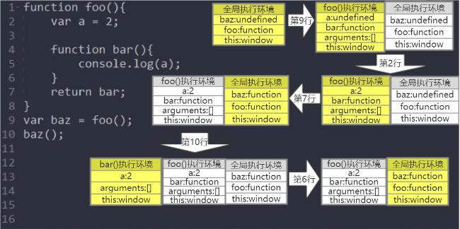


### 概念

作用域是一套规则，用于确定在何处以及如何查找标识符。关于LHS查询和RHS查询详见作用域系列第一篇[内部原理](http://www.cnblogs.com/xiaohuochai/p/5699739.html)。

作用域分为**词法作用域**和动态作用域。javascript使用词法作用域，简单地说，词法作用域就是定义在词法阶段的作用域，是由写代码时将变量和函数写在哪里来决定的。于是词法作用域也可以描述为程序源代码中定义变量和函数的区域

作用域分为全局作用域和函数作用域，函数作用域可以互相嵌套

在下面的例子中，存在着全局作用域，fn作用域和bar作用域，它们相互嵌套

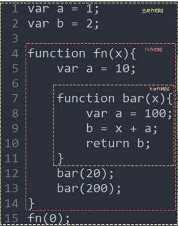


**作用域链和自由变量**

各个作用域的嵌套关系组成了一条作用域链。例子中bar函数保存的作用域链是bar -> fn -> 全局，fn函数保存的作用域链是fn -> 全局

使用作用域链主要是进行标识符的查询，标识符解析就是沿着作用域链一级一级地搜索标识符的过程，而作用域链就是要保证对变量和函数的有序访问


【1】如果自身作用域中声明了该变量，则无需使用作用域链

在下面的例子中，如果要在bar函数中查询变量a，则直接使用LHS查询，赋值为100即可

~~~javascript
var a = 1;
var b = 2;
function fn(x){
    var a = 10;
    function bar(x){
        var a = 100;
        b = x + a;
        return b;
    }
    bar(20);
    bar(200);
}
fn(0);
~~~


【2】如果自身作用域中未声明该变量，则需要使用作用域链进行查找

这时，就引出了另一个概念——自由变量。在当前作用域中存在但未在当前作用域中声明的变量叫自由变量

在下面的例子中，如果要在bar函数中查询变量b，由于b并没有在当前作用域中声明，所以b是自由变量。bar函数的作用域链是bar -> fn -> 全局。到上一级fn作用域中查找b没有找到，继续到再上一级全局作用域中查找b，找到了b

~~~javascript
var a = 1;
var b = 2;
function fn(x){
    var a = 10;
    function bar(x){
        var a = 100;
        b = x + a;
        return b;
    }
    bar(20);
    bar(200);
}
fn(0);
~~~


[注意]如果标识符没有找到，则需要分为RHS和LHS查询进行分析，若进行的是LHS查询，则在全局环境中声明该变量，若是严格模式下的LHS查询，则抛出ReferenceError(引用错误)异常；若进行的是RHS查询，则抛出ReferenceError(引用错误)异常。


### 执行环境

执行环境(execution context)，有时也称为执行上下文、执行上下文环境或环境，执行环境定义了变量或函数有权访问的其他数据，决定了他们各自的行为。每个执行环境都有一个与之关联的**变量对象**，环境中定义的所有变量和对象都保存在这个对象中。虽然我们编写的代码无法访问这个对象，但解析器在处理数据是会在后台使用他。


一定要区分执行环境和变量对象。执行环境会随着函数的调用和返回，不断的重建和销毁。但变量对象在有变量引用(如闭包)的情况下，将留在内存中不被销毁


这是例子中的代码执行到第15行时fn(0)函数的执行环境，执行环境里的变量对象保存了fn()函数作用域内所有的变量和函数的值

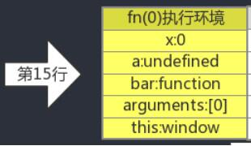


### 执行流

代码的执行顺序叫做执行流，程序源代码并不是按照代码的书写顺序一行一行往下执行，而是和函数的调用顺序有关

例子中的执行流是第1行 -> 第2行 -> 第4行 -> 第15行 -> 第5行 -> 第7行 -> 第12行 -> 第8行 -> 第9行 -> 第10行 -> 第11行 -> 第13行 -> 第8行 -> 第9行 -> 第10行 -> 第11行 -> 第14行


### 执行环境栈

执行环境栈类似于作用域链，有序地保存着当前程序中存在的执行环境。当执行流进入一个函数时，函数的环境就会被推入一个环境栈中。而在函数执行之后，栈将其环境弹出，把控制权返回给之前的执行环境。ECMAScript程序中的执行流正是由这个方便的机制控制着。

在例子中，当执行流进入bar(20)函数时，当前程序的执行环境栈如下图所示，其中黄色的bar(20)执行环境表示当前程序正处此执行环境中

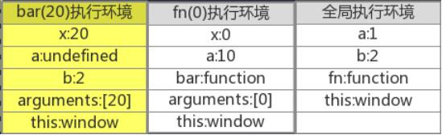

当bar(20)函数执行完成后，当前程序的执行环境栈如下图所示，bar(20)函数的执行环境被销毁，等待垃圾回收，控制权交还给黄色背景的fn(0)执行环境

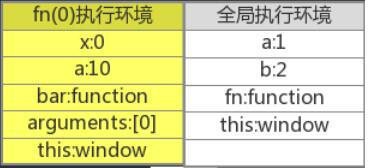


### 说明

下面按照代码执行流的顺序对该图示进行详细说明


【1】代码执行流进入全局执行环境，并对全局执行环境中的代码进入**声明提升**

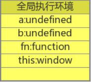

【2】执行流执行第1行代码`var a = 1`;，对a进行LHS查询，给a赋值1；执行流执行第2行代码`var b = 2`;，对b进行LHS查询，给b赋值2

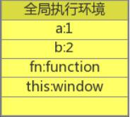

【3】执行流执行第15行代码fn(0);，调用fn(0)函数，此时执行流进入fn(0)函数执行环境中，对该执行环境中的代码进行声明提升过程，并将实参0赋值给形参x中。此时执行环境栈中存在两个执行环境，fn(0)函数为当前执行流所在执行环境

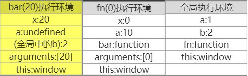

【4】执行流执行第5行代码`var a = 10`;，对a进行LHS查询，给a赋值10

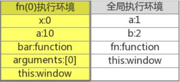

【5】执行流执行第12行代码bar(20);，调用bar(20)函数，此时执行流进入bar(20)函数执行环境中，对该执行环境中的代码进行声明提升过程，并将实参20赋值给形参x中。此时执行环境栈中存在三个执行环境，bar(20)函数为当前执行流所在执行环境

　　在声明提升的过程中，由于b是个自由变量，需要通过bar()函数的作用域链bar() -> fn() -> 全局作用域进行查找，最终在全局作用域中也就是代码第2行找到`var b = 2`;，然后在全局执行环境中找到b的值是2，所以给b赋值2


【6】执行流执行第8行代码`var a = 100`;，给a赋值100；执行流执行第9行`b = x + a`;，对x进行RHS查询，找到x的值是20，对a进行RHS查询，找到a的值是100，所以通过计算b的值是120，给b赋值120；执行第10行代码`return b`;，对b进行RHS查询，找到b的值是120，所以函数返回值为120

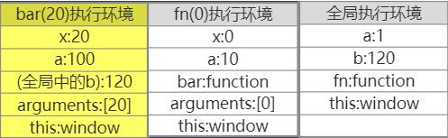

【7】执行流执行完第10行代码后，bar(20)的执行环境被弹出执行环境栈，并被销毁，等待垃圾回收，控制权交还给fn(0)函数的执行环境

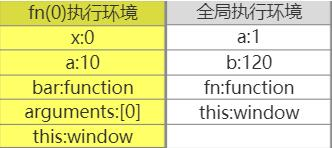

【8】执行流执行第13行代码bar(200);，调用bar(200)函数，此时执行流进入bar(200)函数执行环境中，对该执行环境中的代码进行声明提升过程，并将实参200赋值给形参x中。此时执行环境栈中存在三个执行环境，bar(200)函数为当前执行流所在执行环境

　　与第5步相同，在声明提升的过程中，由于b是个自由变量，需要通过bar()函数的作用域链bar() -> fn() -> 全局作用域进行查找，最终在全局作用域中也就是代码第2行找到更新后的`var b = 120`，然后在全局执行环境中找到b的值是120，所以给b赋值120

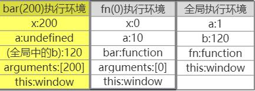

【9】与第6步相同，执行流执行第8行代码`var a = 100`;，给a赋值100；执行流执行第9行`b = x + a`;，对x进行RHS查询，找到x的值是200，对a进行RHS查询，找到a的值是100，所以通过计算b的值是300，给b赋值300；执行第10行代码`return b`;，对b进行RHS查询，找到b的值是300，所以函数返回值为300

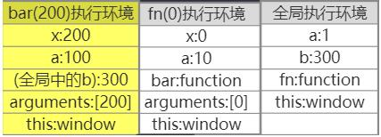

【10】执行流执行完第10行代码后，bar(200)的执行环境被弹出执行环境栈，并被销毁，等待垃圾回收，控制权交还给fn(0)函数的执行环境

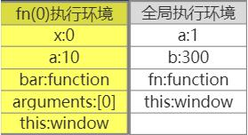

【11】执行流执行第14行代码`}`，fn(0)的执行环境被弹出执行环境栈，并被销毁，等待垃圾回收，控制权交还给全局执行环境

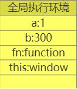

【12】当页面关闭时，全局执行环境被销毁，页面再无执行环境


### 总结

【1】javascript使用的是词法作用域。对于函数来说，词法作用域是在函数定义时就已经确定了，与函数是否被调用无关。通过作用域，可以知道作用域范围内的变量和函数有哪些，却不知道变量的值是什么。所以作用域是静态的


【2】对于函数来说，执行环境是在函数调用时确定的，执行环境包含作用域内所有变量和函数的值。在同一作用域下，不同的调用(如传递不同的参数)会产生不同的执行环境，从而产生不同的变量的值。所以执行环境是动态的


## 深入理解闭包 - 什么是闭包

闭包是基于词法作用域书写代码时所产生的自然结果，你甚至不需要为了利用他们而有意识的创建闭包，


下面是直截了当的定义，你需要掌握它才能理解和识别闭包。

+ 当函数可以记住并访问所在的词法作用域时，就产生了闭包，即使是在当前词法作用域之外执行。


### 定义一

闭包是指可以访问其所在作用域的函数

那这样说来，需要通过作用域链查找变量的函数就是闭包

~~~javascript
//按照定义一的说法，需要通过作用域链在全局环境中查找变量n的函数foo()就是闭包
var n = 0;
function foo() {
    console.log(n)//0
}
foo();
~~~


### 定义二

闭包是指有权访问另一个函数作用域中的变量的函数

那这样说来，访问上层函数的作用域的内层函数就是闭包

~~~javascript
//按照定义二的说法，嵌套在foo函数里的bar函数就是闭包
function foo(){
    var a = 2;
    function bar(){
        console.log(a); // 2
    }
    bar();
}
foo();
~~~


### 定义三

闭包是指在函数声明时的作用域以外的地方被调用的函数

在函数声明时的作用域以外的地方调用函数，需要通过将该函数作为返回值或者作为参数被传递

~~~javascript
//按照定义三的说法，在foo()函数的作用域中声明，在全局环境的作用域中被调用的bar()函数是闭包
function foo(){
    var a = 2;
    function bar(){
        console.log(a); //2
    }
    return bar;
}
foo()();
~~~


可以简写为如下表示：

~~~javascript
function foo(){
    var a = 2;
    return function(){
        console.log(a);//2
    }
}
foo()();
~~~


【参数】

~~~javascript
//按照定义三的说法，在foo()函数的作用域中声明，在bar()函数的作用域中被调用的baz()函数是闭包
function foo(){
    var a = 2;
    function baz(){
        console.log(a); //2
    }
    bar(baz);
}
function bar(fn){
    fn();
}
~~~


因此，无论通过何种手段，只要将内部函数传递到所在的词法作用域以外，它都会持有对原始作用域的引用，无论在何处执行这个函数都会使用闭包


下面我们来看一段代码，清晰地展示了闭包：

~~~javascript
function foo () {
    var a = 2
    function bar () {
        console.log(a)
    }
    return bar
}
var baz = foo()
baz()
~~~

函数bar()的词法作用域能够访问foo()的内部作用域。然后我们将bar()函数本身当做一个值的类型进行传递，在这个例子中，我们将bar所引用的函数对象本身当作返回值。

在foo()执行后，其返回值（也就是内部的bar函数）赋值给变量baz并调用baz()，实际上只是通过不同的标识符引用调用了内部的函数bar()。

bar()显然可以被正常执行，但是在这个例子中，他在自己定义的词法作用域以外的地方执行。

在foo()执行后，通常会期待foo()的整个内部作用域都被销毁，因为我们知道引擎有垃圾回收器用来释放不再使用的内存空间，由于看上去foo()的内容不会再被使用，所以很自然地会考虑对其进行回收。

而闭包的神奇之处正是可以阻止这件事情的发生。事实上内部作用域依然存在，因此没有被回收。谁在使用这个内部作用域？原来是bar()本身在使用。

拜bar()所声明的位置所赐，他拥有涵盖foo()内部作用域的闭包，使得该作用域能够一直存活，以供bar()在之后任何时间进行引用。

**bar()依然持有对该作用域的引用，而这个引用就叫做闭包**。


### IIFE

IIFE是不是闭包呢？

foo()函数在全局作用域定义，也在全局作用域被立即调用，如果按照定义一的说法来说，它是闭包。如果按照定义二和定义三的说法，它又不是闭包

~~~javascript
var a = 2;
(function foo(){
    console.log(a);//2
})();
~~~


还有一个更重要的原因是，在requireJS出现之前，实现模块化编程主要通过IIFE，而在IIFE中常见的操作就是通过window.fn = fn来暴露接口，而这个fn就是闭包，而IIFE只是一个包含闭包的函数调用

~~~javascript
(function(){
    var a = 0;
    function fn(){
        console.log(a); 
    }
    window.fn = fn;
})()
fn();
~~~


### 总结

闭包定义之所以混乱，我觉得与经典书籍的不同解读有关。经典定义是犀牛书的原话，定义二是高程的原话

但，归纳起来就是关于一个函数要成为一个闭包到底需要满意几个条件

严格来说，闭包需要满足三个条件：【1】访问所在作用域；【2】函数嵌套；【3】在所在作用域外被调用

有些人觉得只满足条件1就可以，所以IIFE是闭包；有些人觉得满足条件1和2才可以，所以被嵌套的函数才是闭包；有些人觉得3个条件都满足才可以，所以在作用域以外的地方被调用的函数才是闭包

问题是，谁是权威呢？


## 深入理解闭包 - IIFE

严格来讲，IIFE并不是闭包，因为它并不满足函数成为闭包的三个条件。但一般地，人们认为IIFE就是闭包，毕竟闭包有多个定义。


### 实现

函数跟随一对圆括号()表示函数调用

~~~javascript
//函数声明语句写法
function test(){};
test();

//函数表达式写法
var test = function(){};
test();
~~~

但有时需要在定义函数之后，立即调用该函数。这种函数就叫做立即执行函数，全称为立即调用的函数表达式IIFE(Imdiately Invoked Function Expression)


【1】函数声明语句需要一个函数名，由于没有函数名，所以报错

~~~javascript
//SyntaxError: Unexpected token (
function(){}();
~~~


【2】函数声明语句后面加上一对圆括号，只是函数声明语句与分组操作符的组合而已。由于分组操作符不能为空，所以报错

~~~javascript
//SyntaxError: Unexpected token )
function foo(){}();

//等价于
function foo(){};
();//SyntaxError: Unexpected token )
~~~


【3】函数声明语句加上一对有值的圆括号，也仅仅是函数声明语句与不报错的分组操作符的组合而已

~~~javascript
function foo(){}(1);

//等价于
function foo(){};
(1);
~~~


所以，解决方法就是不要让function出现在行首，让引擎将其理解成一个函数表达式


**最常用的两种方法**

~~~javascript
(function(){ /* code */ }()); 
(function(){ /* code */ })(); 
~~~


**其他写法**

~~~javascript
var i = function(){ return 10; }();

true && function(){ /* code */ }();

0, function(){ /* code */ }();

!function(){ /* code */ }();
~function(){ /* code */ }();
-function(){ /* code */ }();
+function(){ /* code */ }();

new function(){ /* code */ };
new function(){ /* code */ }();
~~~


### 作用域

对于IIFE来说，通过作用域链来查找变量与普通函数有一些不同的地方


【try-catch】

在下列代码中，标准浏览器下f()函数和IIFE都返回'error'，但IE10-浏览器中的f()函数返回'10'

~~~javascript
try{
    var e = 10;
    throw new Error();
}catch(e){
    function f(){
        console.log(e);
    }
    (function (){
        console.log(e);
    })();
    f();
}
~~~


【具名函数表达式】

在下列代码中，标准浏览器下a()函数返回1，而IIFE返回a函数代码；但IE8-浏览器中，二者都返回1

~~~javascript
function a(){
    a = 1;
    console.log(a);
};
a();
(function a(){
    a = 1;
    console.log(a);
})();
~~~


### 用途

IIFE一般用于构造私有变量，避免全局空间污染

接下来用一个需求实现来更直观地说明IIFE的用途。假设有一个需求，每次调用函数，都返回加1的一个数字(数字初始值为0)


【1】全局变量

一般情况下，我们会使用全局变量来保存该数字状态

```javascript
var a = 0;
function add(){
    return ++a;
}
console.log(add());//1
console.log(add());//2
```


【2】自定义属性

但上面的方法中，变量a实际上只和add函数相关，却声明为全局变量，不太合适。

将变量a更改为函数的自定义属性更为恰当

```javascript
function add(){
    return ++add.count;
}
add.count = 0;
console.log(add());//1
console.log(add());//2
```


【3】IIFE

其实这样做，还是有问题。有些代码可能会无意中将add.count重置

使用IIFE把计数器变量保存为私有变量更安全，同时也可以减少对全局空间的污染

```javascript
var add = (function(){
    var counter = 0;
    return function(){
        return ++counter; 
    }
})();
console.log(add())//1
console.log(add())//2   
```


## 深入理解闭包—常见的一个循环和闭包的错误详解

关于常见的一个**循环**和**闭包**的错误，很多资料对此都有文字解释，但还是难以理解。本文将以**执行环境**图示的方式来对此进行更直观的解释，以及对此类需求进行推衍，得到更合适的解决办法


### 犯错

~~~javascript
function foo(){
    var arr = [];
    for(var i = 0; i < 2; i++){
        arr[i] = function(){
            return i;
        }
    }
    return arr;
}
var bar = foo();
console.log(bar[0]());//2
~~~

以上代码的运行结果是2，而不是预想的0。接下来用执行环境图示的方法，详解到底是哪里出了问题

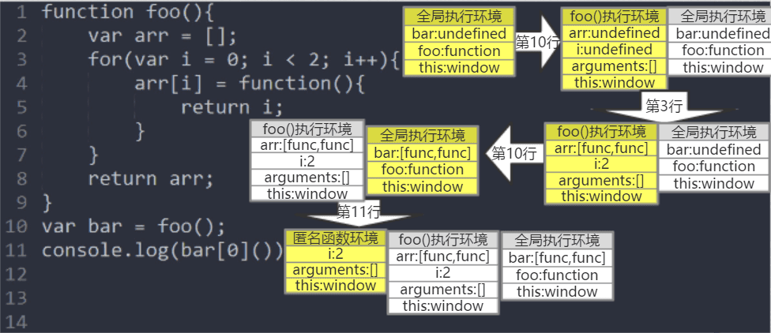

执行流首先创建并进入全局执行环境，进行[声明提升](http://www.cnblogs.com/xiaohuochai/p/5700590.html)过程。执行流执行到第10行，创建并进入foo()函数执行环境，并进行声明提升。然后执行第2行，将arr赋值为[]。然后执行第3行，给arr[0]和arr[1]都赋值为一个匿名函数。然后执行第8行，以arr的值为返回值退出函数。由于此时有闭包的存在，所以foo()执行环境并不会被销毁

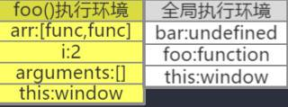

执行流进入全局执行环境，继续执行第10行，将函数的返回值arr赋值给bar

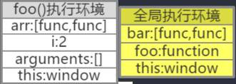

执行流执行第11行，访问bar的第0个元素并执行。此时，执行流创建并进入匿名函数执行环境，匿名函数中存在[自由变量](http://www.cnblogs.com/xiaohuochai/p/5722905.html#anchor2)i，需要使用其作用域链匿名函数 -> foo()函数 -> 全局作用域进行查找，最终在foo()函数的作用域找到了i，然后在foo()函数的执行环境中找到了i的值2，于是给i赋值2

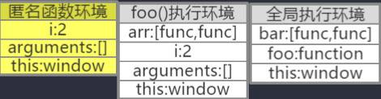

执行流接着执行第5行，以i的值2作为返回值返回。同时销毁匿名函数的执行环境。执行流进入全局执行环境，接着执行第11行，调用内部对象console，并找到其方法log，将bar[0](https://xiaohuochai.site/JS/ECMA/closure/commonError.html)的值2作为参数放入该方法中，最终在控制台显示2

　　 由此我们看出，犯错原因是在循环的过程中，并没有把函数的返回值赋值给数组元素，而仅仅是把函数赋值给了数组元素。这就使得在调用匿名函数时，通过作用域找到的执行环境中储存的变量的值已经不是循环时的瞬时索引值，而是循环执行完毕之后的索引值。


### IIFE

由此，可以利用[IIFE](http://www.cnblogs.com/xiaohuochai/p/5731016.html)传参和[闭包](http://www.cnblogs.com/xiaohuochai/p/5728577.html)来创建多个执行环境来保存循环时各个状态的索引值。因为[函数传参](http://www.cnblogs.com/xiaohuochai/p/5706289.html#anchor4)是按值传递的，不同参数的函数被调用时，会创建不同的[执行环境](http://www.cnblogs.com/xiaohuochai/p/5722905.html)

~~~javascript
function foo () {
  var arr = []
  for (var i = 0; i < 2; i++) {
    arr[i] = (function fn (j) {
      return function test () {
        return j
      }
    }(i))
  }
}
var bar = foo();
console.log(bar[0]());//0
~~~

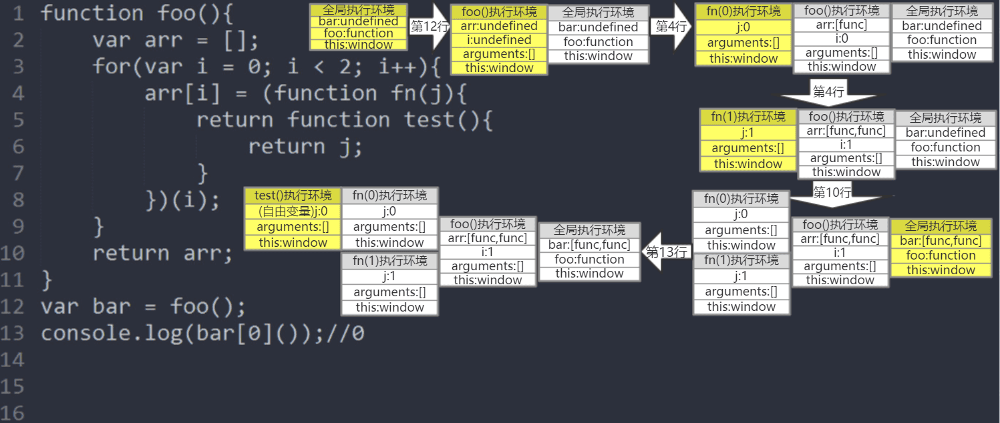


### 块作用域

　　使用IIFE还是较为复杂，使用块作用域则更为方便

　　由于[块作用域](http://www.cnblogs.com/xiaohuochai/p/5701287.html)可以将索引值i重新绑定到了循环的每一个迭代中，确保使用上一个循环迭代结束时的值重新进行赋值，相当于为每一次索引值都创建一个执行环境

```javascript
function foo(){
    var arr = [];
    for(let i = 0; i < 2; i++){
        arr[i] = function(){
            return i;
        }
    }
    return arr;
}
var bar = foo();
console.log(bar[0]());//0    
```


## 深入理解闭包——闭包的10种形式

　　根据[闭包的定义](http://www.cnblogs.com/xiaohuochai/p/5728577.html)，我们知道，无论通过何种手段，只要将内部函数传递到所在的词法作用域以外，它都会持有对原始作用域的引用，无论在何处执行这个函数都会使用闭包。接下来，本文将详细介绍闭包的8种形式

 

### 返回值

　　最常用的一种形式是函数作为返回值被返回

```javascript
var F = function(){
    var b = 'local';
    var N = function(){
        return b;
    }
    return N;
}
console.log(F()());
```

 

### 函数赋值

　　一种变形的形式是将内部函数赋值给一个外部变量

```javascript
var inner;
var F = function(){
    var b = 'local';
    var N = function(){
        return b;
    };
    inner = N;
};
F();
console.log(inner());
```

 

### 函数参数

　　闭包可以通过函数参数传递函数的形式来实现

```javascript
var Inner = function(fn){
    console.log(fn());
}
var F = function(){
    var b = 'local';
    var N = function(){
        return b;
    }
    Inner(N);
}
F();
```

 

### IIFE

　　由前面的示例代码可知，函数F()都是在声明后立即被调用，因此可以使用IIFE来替代。但是，要注意的是，这里的Inner()只能使用函数声明语句的形式，而不能使用函数表达式。

```javascript
function Inner(fn){
    console.log(fn());
}
(function(){
    var b = 'local';
    var N = function(){
        return b;
    }
    Inner(N);
})();
```

 

### 循环赋值

　　在闭包问题上，最常见的一个错误就是循环赋值的错误。

```javascript
function foo(){
    var arr = [];
    for(var i = 0; i < 2; i++){
        arr[i] = function(){
            return i;
        }
    }
    return arr;
}
var bar = foo();
console.log(bar[0]());//2    
```

　　正确的写法如下

```javascript
function foo(){
    var arr = [];
    for(var i = 0; i < 2; i++){
        arr[i] = (function fn(j){
            return function test(){
                return j;
            }
        })(i);
    }
    return arr;
}
var bar = foo();
console.log(bar[0]());//0    
```

 

### g(s)etter

　　我们通过提供getter()和setter()函数来将要操作的变量保存在函数内部，防止其暴露在外部

```javascript
var getValue,setValue;
(function(){
    var secret = 0;
    getValue = function(){
        return secret;
    }
    setValue = function(v){
        if(typeof v === 'number'){
            secret = v;
        }
    }
})();
console.log(getValue());//0
setValue(1);
console.log(getValue());//1
```

 

### 迭代器

　　我们经常使用闭包来实现一个累加器

```javascript
var add = (function(){
    var counter = 0;
    return function(){
        return ++counter; 
    }
})();
console.log(add())//1
console.log(add())//2  
```

　　类似地，使用闭包可以很方便的实现一个迭代器

```javascript
function setup(x){
    var i = 0;
    return function(){
        return x[i++];
    }
}
var next = setup(['a','b','c']);
console.log(next());//'a'
console.log(next());//'b'
console.log(next());//'c'
```

 

### 区分首次

```javascript
var firstLoad = (function(){
  var _list = [];
  return function(id){
    if(_list.indexOf(id) >= 0){
      return false;
    }else{
      _list.push(id);
      return true;
    }
  }
})();

firstLoad(10);//true
firstLoad(10);//false
firstLoad(20);//true
firstLoad(20);//false
```

 

### 缓存机制

　　通过闭包加入缓存机制，使得相同的参数不用重复计算，来提高函数的性能

　　未加入缓存机制前的代码如下

```javascript
var mult = function(){
  var a = 1;
  for(var i = 0,len = arguments.length; i<len; i++){
    a = a * arguments[i];
  }
  return a;
}
```

　　加入缓存机制后，代码如下

```javascript
var mult = function(){
  var cache = {};
  var calculate = function(){
    var a = 1;
    for(var i = 0,len = arguments.length; i<len; i++){
      a = a * arguments[i];
    }
    return a;
  };
  return function(){
    var args = Array.prototype.join.call(arguments,',');
    if(args in cache){
      return cache[args];
    }

    return cache[args] = calculate.apply(null,arguments);
  }
}()
```

 

### img对象

　　img对象经常用于数据上报

```javascript
var report = function(src){
  var img = new Image();
  img.src = src;
}
report('http://xx.com/getUserInfo');
```

　　但是，在一些低版本浏览器中，使用report函数进行数据上报会丢失30%左右的数据，也就是说，report函数并不是每一次都成功地发起了HTTP请求

　　原因是img是report函数中的局部变量，当report函数的调用结束后，img局部变量随即被销毁，而此时或许还没来得及发出HTTP请求，所以此次请求就会丢失掉

　　现在把img变量用闭包封闭起来，就能解决请求丢失的问题

```javascript
var report = (function(){
  var imgs = [];
  return function(src){
    var img = new Image();
    imgs.push(img);
    img.src = src;
  }
})()
report('http://xx.com/getUserInfo');
```


## 深入理解 this 机制 - this的四种绑定规则

this 关键字是 javascript 中最复杂的机制之一。他是一个很特别的关键字，被自动定义在所有函数的作用域中。但是即使是非常有经验的 javascript 开发者也很难说清楚他到底指向什么。


### this 到底指向什么

之前我们说过 this 是在运行时绑定的，并不是在编写时绑定的，它的上下文取决于函数调用时的各种条件。this 的绑定和函数声明的位置没有任何关系，只取决于函数的调用方式。

当一个函数被调用时，会创建一个活动记录（有时也称为执行上下文）。这个记录会包含函数在那里被调用（调用栈），函数的调用方式，传入的参数等信息。this 就是这个记录的一个属性，会在函数执行的过程中用到。


### 调用位置

在理解 this 的绑定过程之前，首先要理解调用位置：调用位置就是函数在代码中调用的位置（而不是声明的位置）。

通常来说，寻找调用位置就是寻找 "函数被调用的位置"，但是做起来并没有这么简单，因为某些函数式变成可能会隐藏真正的调用位置。

最重要的是分析调用栈（就是为了到达当前执行位置所调用的所有函数）。我们关心的调用位置就在当前正在执行的函数的前一个调用中。


### 默认绑定

首先要介绍的是最常用的函数调用类型：独立函数调用可以把这条规则看作是无法应用其他规则时的默认规则。


全局环境中，this默认绑定到window

~~~javascript
console.log(this === window);//true
~~~


函数独立调用时，this默认绑定到window

```javascript
function foo(){
    console.log(this === window);
}
foo(); //true
```


被嵌套的函数独立调用时，this默认绑定到window

```javascript
//虽然test()函数被嵌套在obj.foo()函数中，但test()函数是独立调用，而不是方法调用。所以this默认绑定到window
var a = 0;
var obj = {
    a : 2,
    foo:function(){
        function test(){
            console.log(this.a);
        }
        test();
    }
}
obj.foo();//0
```


**IIFE**

IIFE 立即执行函数实际上是函数声明后直接调用执行

```javascript
var a = 0;
function foo(){
    (function test(){
        console.log(this.a);
    })()
};
var obj = {
    a : 2,
    foo:foo
}
obj.foo();//0
```


```javascript
//等价于上例
var a = 0;
var obj = {
    a : 2,
    foo:function(){
            function test(){
                console.log(this.a);
            }
            test();
    }
}
obj.foo();//0
```


**闭包**

类似地，test()函数是独立调用，而不是方法调用，所以this默认绑定到window

```javascript
var a = 0;
function foo(){
    function test(){
        console.log(this.a);
    }
    return test;
};
var obj = {
    a : 2,
    foo:foo
}
obj.foo()();//0
```


由于闭包的this默认绑定到window对象，但又常常需要访问嵌套函数的this，所以常常在嵌套函数中使用var that = this，然后在闭包中使用that替代this，使用作用域查找的方法来找到嵌套函数的this值 

```javascript
var a = 0;
function foo(){
    var that = this;
    function test(){
        console.log(that.a);
    }
    return test;
};
var obj = {
    a : 2,
    foo:foo
}
obj.foo()();//2
```


**strict mode**

如果使用严格模式（strict mode），则不能将全局对象用于默认绑定，因此 this 会绑定到 undefined；

~~~javascript
function () {
	"use strict"
	console.log(this.a)
}

var a = 2

foo() // TypeError: this is undefined
~~~


这里有一个重要但是非常重要的细节，虽然 this 的绑定完全取决于调用位置，但是只有 foo() 运行在非 strict mode 下时，默认绑定才能绑定到全局对象，在严格模式下调用 foo() 则不影响默认绑定：

~~~javascript
function foo () {
	console.log(this.a)
}

var a = 2

(function () {
	"use strict"
	foo() // 2
})()
~~~


### 隐式绑定

一般地，被直接对象所包含的函数调用时，也称为方法调用，this隐式绑定到该直接对象

```javascript
function foo(){
    console.log(this.a);
};
var obj1 = {
    a:1,
    foo:foo,
    obj2:{
        a:2,
        foo:foo
    }
}

//foo()函数的直接对象是obj1，this隐式绑定到obj1
obj1.foo();//1

//foo()函数的直接对象是obj2，this隐式绑定到obj2
obj1.obj2.foo();//2
```


**隐式丢失**

隐式丢失是指被隐式绑定的函数丢失绑定对象，从而默认绑定到window。这种情况容易出错却又常见


【函数别名】

```javascript
var a = 0;
function foo(){
    console.log(this.a);
};
var obj = {
    a : 2,
    foo:foo
}
//把obj.foo赋予别名bar，造成了隐式丢失，因为只是把foo()函数赋给了bar，而bar与obj对象则毫无关系
var bar = obj.foo;
bar();//0
```


```javascript
//等价于
var a = 0;
var bar = function foo(){
    console.log(this.a);
}
bar();//0
```


【参数传递】

```javascript
var a = 0;
function foo(){
    console.log(this.a);
};
function bar(fn){
    fn();
}
var obj = {
    a : 2,
    foo:foo
}
//把obj.foo当作参数传递给bar函数时，有隐式的函数赋值fn=obj.foo。与上例类似，只是把foo函数赋给了fn，而fn与obj对象则毫无关系
bar(obj.foo);//0
```


```javascript
//等价于
var a = 0;
function bar(fn){
    fn();
}
bar(function foo(){
    console.log(this.a);
});
```


【内置函数】

　　内置函数与上例类似，也会造成隐式丢失

```
var a = 0;
function foo(){
    console.log(this.a);
};
var obj = {
    a : 2,
    foo:foo
}
setTimeout(obj.foo,100);//0
```


```javascript
//等价于
var a = 0;
setTimeout(function foo(){
    console.log(this.a);
},100);//0
```


【间接引用】

　　 函数的"间接引用"一般都在无意间创建，最容易在赋值时发生，会造成隐式丢失

```javascript
function foo() {
    console.log( this.a );
}
var a = 2;
var o = { a: 3, foo: foo };
var p = { a: 4 };
o.foo(); // 3
//将o.foo函数赋值给p.foo函数，然后立即执行。相当于仅仅是foo()函数的立即执行
(p.foo = o.foo)(); // 2
```


```javascript
function foo() {
    console.log( this.a );
}
var a = 2;
var o = { a: 3, foo: foo };
var p = { a: 4 };
o.foo(); // 3
//将o.foo函数赋值给p.foo函数，之后p.foo函数再执行，是属于p对象的foo函数的执行
p.foo = o.foo;
p.foo();//4
```


【其他情况】

　　在javascript引擎内部，obj和obj.foo储存在两个内存地址，简称为M1和M2。只有obj.foo()这样调用时，是从M1调用M2，因此this指向obj。但是，下面三种情况，都是直接取出M2进行运算，然后就在全局环境执行运算结果（还是M2），因此this指向全局环境


```javascript
var a = 0;
var obj = {
    a : 2,
    foo:foo
};
function foo() {
    console.log( this.a );
};

(obj.foo = obj.foo)();//0

(false || obj.foo)();//0

(1, obj.foo)();//0
```


### 显式绑定

通过call()、apply()、bind()方法把对象绑定到this上，叫做显式绑定。对于被调用的函数来说，叫做间接调用

```javascript
var a = 0;
function foo(){
    console.log(this.a);
}
var obj = {
    a:2
};
foo();//0
foo.call(obj);//2
```


通过 foo.call(..)，我们可以在调用 foo 时强制把它的 this 绑定到 obj 上。

如果你传入了一个原始值（字符串类型，布尔类型或者数字类型）来当作 this 的绑定对象，这个原始值会被转换成他的对象形式（也就是 new String(..)，new Boolean(..)或者 new Number(..)）。这通常被称为 "装箱"。


普通的显式绑定无法解决隐式丢失问题

```javascript
var a = 0;
function foo(){
    console.log(this.a);
}
var obj1 = {
    a:1
};
var obj2 = {
    a:2
};
foo.call(obj1);//1
foo.call(obj2);//2
```


【硬绑定】

　　硬绑定是显式绑定的一个变种，使this不能再被修改

```javascript
var a = 0;
function foo(){
    console.log(this.a);
}
var obj = {
    a:2
};
var bar= function(){
    foo.call(obj);
}
//在bar函数内部手动调用foo.call(obj)。因此，无论之后如何调用函数bar，它总会手动在obj上调用foo
bar();//2
setTimeout(bar,100);//2
bar.call(window);//2
```


【API】

　　javascript中新增了许多内置函数，具有显式绑定的功能，如数组的5个[迭代方法](http://www.cnblogs.com/xiaohuochai/p/5682621.html#anchor10)：map()、forEach()、filter()、some()、every()


```javascript
var id = 'window';
function foo(el){
    console.log(el,this.id);
}
var obj = {
    id: 'fn'
};
[1,2,3].forEach(foo);//1 "window" 2 "window" 3 "window"
[1,2,3].forEach(foo,obj);//1 "fn" 2 "fn" 3 "fn"
```


### new绑定

如果函数或者方法调用之前带有关键字new，它就构成构造函数调用。对于this绑定来说，称为new绑定


【1】构造函数通常不使用return关键字，它们通常初始化新对象，当构造函数的函数体执行完毕时，它会显式返回。在这种情况下，构造函数调用表达式的计算结果就是这个新对象的值

```javascript
function fn(){
    this.a = 2;
}
var test = new fn();
console.log(test);//{a:2}
```

　　

【2】如果构造函数使用return语句但没有指定返回值，或者返回一个原始值，那么这时将忽略返回值，同时使用这个新对象作为调用结果

```javascript
function fn(){
    this.a = 2;
    return;
}
var test = new fn();
console.log(test);//{a:2}
```


【3】如果构造函数显式地使用return语句返回一个对象，那么调用表达式的值就是这个对象

```javascript
var obj = {a:1};
function fn(){
    this.a = 2;
    return obj;
}
var test = new fn();
console.log(test);//{a:1}
```


[注意]尽管有时候构造函数看起来像一个方法调用，它依然会使用这个新对象作为this。也就是说，在表达式new o.m()中，this并不是o

```javascript
var o = {
    m: function(){
        return this;
    }
}
var obj = new o.m();
console.log(obj,obj === o);//{} false
console.log(obj.constructor === o.m);//true
```


## this绑定优先级

　　上一篇介绍过this的[绑定规则](http://www.cnblogs.com/xiaohuochai/p/5735901.html)，那如果在函数的调用位置上同时存在两种以上的绑定规则应该怎么办呢？本文将介绍this绑定的优先级

 

### 显式绑定 pk 隐式绑定

　　显式绑定胜出

```javascript
function foo() {
    console.log( this.a );
}
var obj1 = {
    a: 2,
    foo: foo
};
var obj2 = {
    a: 3,
    foo: foo
};
obj1.foo(); // 2
obj2.foo(); // 3
//在该语句中，显式绑定call(obj2)和隐式绑定obj1.foo同时出现，最终结果为3，说明被绑定到了obj2中
obj1.foo.call( obj2 ); // 3
obj2.foo.call( obj1 ); // 2
```

 

### new绑定 pk 隐式绑定

　　new绑定胜出

```javascript
function foo(something) {
    this.a = something;
}
var obj1 = {foo: foo};
var obj2 = {};
obj1.foo( 2 );
console.log( obj1.a ); // 2
obj1.foo.call(obj2,3);
console.log( obj2.a ); // 3
//在下列代码中，隐式绑定obj1.foo和new绑定同时出现。最终obj1.a结果是2，而bar.a结果是4，说明this被绑定在bar上
var bar = new obj1.foo( 4 );
console.log( obj1.a ); // 2
console.log( bar.a ); // 4
```

 

### new绑定 pk 显式绑定

　　new绑定胜出

```javascript
function foo(something) {
    this.a = something;
}
var obj1 = {};
//先将obj1绑定到foo函数中，此时this值为obj1
var bar = foo.bind( obj1 );
bar( 2 );
console.log(obj1.a); // 2
//通过new绑定，此时this值为baz
var baz = new bar( 3 );
console.log( obj1.a ); // 2
//说明使用new绑定时，在bar函数内，无论this指向obj1有没有生效，最终this都指向新创建的对象baz
console.log( baz.a ); // 3
```

 

### 顺序

　　【1】是否是new绑定？如果是，this绑定的是新创建的对象

```javascript
var bar = new foo();
```

　　【2】是否是显式绑定？如果是，this绑定的是指定的对象

```javascript
var bar = foo.call(obj2);
```

　　【3】是否是隐式绑定？如果是，this绑定的是属于的对象

```javascript
var bar = obj1.foo(); 
```

　　【4】如果都不是，则使用默认绑定

```javascript
var bar = foo();
```


## 深入理解javascript对象系列第一篇 — 初识对象

javascript中的难点是函数、对象和继承，从本系列开始介绍对象部分，本文是该系列的第一篇——初识对象。

### 对象定义

　　javascript的基本数据类型包括 `undefined`、`null`、`boolean`、`string`、`number`和`object`。对象和其他基本类型值不同的是，对象是一种复合值：它将许多值(原始值或者其他对象)聚合在一起，可通过名字访问这些值

　　于是，对象也可看做是属性的无序集合，每个属性都是一个名值对。属性名是字符串，因此我们可以把对象看成是从字符串到值的映射

 

### 对象创建

　　有以下三种方式来创建对象，包括new构造函数、对象直接量和Object.create()函数

【1】new构造函数

　　使用new操作符后跟Object构造函数用以初始化一个新创建的对象

```javascript
var person = new Object();
//如果不给构造函数传递参数可以不加括号 var person = new Object;
person.name = 'bai';
person.age = 29;
//创建无属性的空对象
var cody1 = new Object();
var cody2 = new Object(undefined);
var cody3 = new Object(null);
console.log(typeof cody1,typeof cody2, typeof cody3);//object object object
```

　　如果该参数是一个对象，则直接返回这个对象　

```javascript
var o1 = {a: 1};
var o2 = new Object(o1);
console.log(o1 === o2);// true

var f1 = function(){};
var f2 = new Object(f1);
console.log(f1 === f2);// true
```

　　如果是一个原始类型的值，则返回该值对应的包装对象

```javascript
//String {0: "f", 1: "o", 2: "o", length: 3, [[PrimitiveValue]]: "foo"}
console.log(new Object('foo'));

//Number {[[PrimitiveValue]]: 1}
console.log(new Object(1));

//Boolean {[[PrimitiveValue]]: true}
console.log(new Object(true));
```

　　若Object()函数不通过new而直接使用，则相当于转换方法，可以把任意值转换为对象

　　[注意]undefined和null会转换为一个空对象

```javascript
var uObj = Object(undefined);
var nObj = Object(null);
console.log(Object.keys(uObj));//[]
console.log(Object.keys(nObj));//[]
```

　　如果Object()的参数是一个对象，则直接返回原对象

```javascript
var o = {a:1};
var oObj = Object(o);
console.log(Object.keys(oObj));//['a']
```

　　利用这一点，可以写一个判断变量是否为对象的函数

```javascript
function isObject(value) {
  return value === Object(value);
}
isObject([]) // true
isObject(true) // false
```

【2】对象字面量

　　javascript提供了叫做字面量的快捷方式，用于创建大多数原生对象值。使用字面量只是隐藏了与使用new操作符相同的基本过程，于是也可以叫做语法糖

　　对象字面量是由若干名值对组成的映射表，名值对中间用冒号分隔，整个映射表用花括号括起来

　　不同属性之间用逗号分隔，属性名可以是任意字符串，属性值可以是任意类型表达式，表达式的值是属性值

```javascript
//等价于var person = new Object();
var person = {}; 
var person = {
    name : 'bai',
    age : 29,
    5 : true
};
```

　　使用对象字面量的方法来定义对象，属性名会自动转换成字符串

```javascript
//同上
var person = {
    'name' : 'bai',
    'age' : 29,
    '5' : true
}; 
```

　　[注意]一般地，对象字面量的最后一个属性后的逗号将忽略，但在IE7-浏览器中导致错误

```javascript
//IE7-浏览器中报错 SCRIPT1028: 缺少标识符、字符串或数字
var person = {
    name : 'bai',
    age : 29,
    5 : true,
};
```

【3】Object.create()

　　ES5定义了一个名为Object.create()的方法，它创建一个新对象，第一个参数就是这个对象的原型，第二个可选参数用以对对象的属性进行进一步描述

```javascript
var o1 = Object.create({x:1,y:1}); //o1继承了属性x和y
console.log(o1.x);//1
```

　　可以通过传入参数null来创建一个没有原型的新对象，但通过这种方式创建的对象不会继承任何东西，甚至不包括基础方法。比如 `toString()` 和 `valueOf()`

```javascript
var o2 = Object.create(null); // o2不继承任何属性和方法
var o1 = {};
console.log(Number(o1));//NaN
console.log(Number(o2));//Uncaught TypeError: Cannot convert object to primitive value
```

　　如果想创建一个普通的空对象(比如通过{}或new Object()创建的对象)，需要传入Object.prototype

```javascript
var o3 = Object.create(Object.prototype); // o3和{}和new Object()一样
var o1 = {};
console.log(Number(o1));//NaN
console.log(Number(o3));//NaN
```

 　Object.create()方法的第二个参数是属性描述符

```javascript
var o1 = Object.create({z:3},{
  x:{value:1,writable: false,enumerable:true,configurable:true},
  y:{value:2,writable: false,enumerable:true,configurable:true}
}); 
console.log(o1.x,o1.y,o1.z);//1 2 3
```

 

### 对象组成

　　对象是属性的无序集合，由键名和属性值组成

【键名】

　　对象的所有键名都是字符串，所以加不加引号都可以，如果不是字符串也会自动转换成字符串

```javascript
var o = {
  'p': 'Hello World'
};
var o = {
  p: 'Hello World'
};
var o ={
  1: 'a',
  3.2: 'b',
  1e2: true,
  1e-2: true,
  .234: true,
  0xFF: true,
};
//Object {1: "a", 100: true, 255: true, 3.2: "b", 0.01: true, 0.234: true}
o;
```

　　[注意]如果键名不符合[标识符命名规则](http://www.cnblogs.com/xiaohuochai/p/5549833.html#anchor2)，则必须加上引号，否则会报错

```javascript
//Uncaught SyntaxError: Unexpected identifier
var o = {
    1p: 123
}

var o = {
    '1p': 123
}
```

【属性值】

　　属性值可以是任何类型的表达式，最终表达式的结果就是属性值的结果

```javascript
var o ={
    a: 1+2
}
console.log(o.a);//3
```

　　如果属性值为函数，则通常把这个属性称为“方法”

```javascript
var o = {
  p: function (x) {
    return 2 * x;
  }
};
o.p(1);//2
```

　　由于对象的方法就是函数，因此也有 `name属性`。方法的name属性返回紧跟在function关键字后面的函数名。如果是匿名函数，ES5环境会返回undefined，ES6环境会返回方法名

```javascript
var obj = {
  m1: function f() {},
  m2: function () {}
};
obj.m1.name // "f"
obj.m2.name //ES5： undefined
obj.m2.name //ES6： "m2"
```

 

### 引用对象

　　如果不同的变量名指向同一个对象，那么它们都是这个对象的引用，也就是说指向同一个内存地址。修改其中一个变量，会影响到其他所有变量

```javascript
var o1 = {};
var o2 = o1;

o1.a = 1;
console.log(o2.a);// 1
o2.b = 2;
console.log(o1.b);// 2
```

　　如果取消某一个变量对于原对象的引用，不会影响到另一个变量

```javascript
var o1 = {};
var o2 = o1;

o1 = 1;
console.log(o2);//{}
```

 

### 实例方法

**valueOf()**

　　valueOf()方法返回当前对象

```javascript
var o = new Object();
o.valueOf() === o // true
```

**toString()**

　　toString()方法返回当前对象对应的字符串形式

```javascript
var o1 = new Object();
o1.toString() // "[object Object]"

var o2 = {a:1};
o2.toString() // "[object Object]"
```

　　一般地，使用 `Object.prototype.toString()` 来获取对象的类属性，进行类型识别

**toLocaleString()**

　　toLocaleString()方法并不做任何本地化自身的操作，它仅调用 `toString()` 方法并返回对应值

```
var o = {a:1};
o.toLocaleString() // "[object Object]"
```


## 深入理解javascript对象第二篇 - 属性操作

对于对象来说，属性操作是绕不开的话题。类似于“增删改查”的基本操作，属性操作分为属性查询、属性设置、属性删除，还包括属性继承。


### 属性查询

属性查询一般有两种方法，包括点运算符和方括号运算符

```javascript
var o = {
  p: 'Hello World'
};
o.p // "Hello World"
o['p'] // "Hello World"
```


【注意】变量中可以存在中文，因为中文相当于字符，与英文字符同样对待，因此可以写成person.白或person['白']

```javascript
var person = {
    白 : 1
}
person.白;//1
person['白'];//1
```


**点运算符**

点运算符是很多面向对象语句的通用写法，由于其比较简单，所以较方括号运算符相比，更常用

由于javascript是弱类型语言，在任何对象中都可以创建任意数量的属性。但当通过点运算符(.)访问对象的属性时，属性名用一个标识符来表示，标识符要符合变量命名规则。标识符必须直接出现在javascript程序中，它们不是数据类型，因此程序无法修改它们

```javascript
var o = {
    a:1,
    1:2
};
console.log(o.a);//1
//由于变量不可以以数字开头，所以o.1报错
console.log(o.1);//Uncaught SyntaxError: missing ) after argument list
```


**方括号运算符**

当通过方括号运算符([])来访问对象的属性时，属性名通过字符串来表示。字符串是javascript的数据类型，在程序运行中可以修改和创建它们

使用方括号运算符有两个优点

【1】可以通过变量来访问属性

```javascript
var a = 1;
var o = {
    1: 10
}
o[a];//10
```


【2】属性名称可以为javascript无效标识符

```javascript
var myObject = {
    123:'zero',
    class:'foo'
};
console.log(myObject['123'],myObject['class']);//'zero' 'foo'
console.log(myObject.123);//报错
```


方括号中的值若是非字符串类型会使用 **String()** 隐式转换成字符串再输出；如果是字符串类型，若有引号则原值输出，否则会被识别为变量，若变量未定义，则报错

```javascript
var person = {};
person[0];  //[]中的数字不会报错，而是自动转换成字符串
person[a];  //[]中符合变量命名规则的元素会被当成变量，变量未被定义，而报错
person['']; //[]中的空字符串不会报错，是实际存在的且可以调用，但不会在控制台右侧的集合中显示

person[undefined];//不会报错，而是自动转换成字符串
person[null];//不会报错，而是自动转换成字符串
person[true];//不会报错，而是自动转换成字符串
person[false];//不会报错，而是自动转换成字符串
```


**可计算属性名**

在方括号运算符内部可以使用表达式

```javascript
var a = 1;
var person = {
    3: 'abc'
};
person[a + 2];//'abc'
```


但如果要在对象字面量内部对属性名使用表达式，则需要使用ES6的可计算属性名

```javascript
var a = 1;
//Uncaught SyntaxError: Unexpected token +
var person = {
    a + 3: 'abc'
};
```


ES6增加了可计算属性名，可以在文字中使用[]包裹一个表达式来当作属性名

```javascript
var a = 1;
var person = {
    [a + 3]: 'abc'
};
person[4];//'abc'
```


**属性查询错误**

【1】查询一个不存在的属性不会报错，而是返回undefined

```javascript
var person = {};
console.log(person.a);//undefined
```


【2】如果对象不存在，试图查询这个不存在的对象的属性会报错

```javascript
console.log(person.a);//Uncaught ReferenceError: person is not defined
```


### 属性设置

属性设置又称为属性赋值，与属性查询相同，具有点运算符和方括号运算符这两种方法

```javascript
o.p = 'abc';
o['p'] = 'abc';
```


在给对象设置属性之前，一般要先检测对象是否存在

```javascript
var len = undefined;
if(book){
    if(book.subtitle){
        len = book.subtitle.length;
    }
}
```


上面代码可以简化为

```javascript
var len = book && book.subtitle && book.subtitle.length;
```


[null](http://www.cnblogs.com/xiaohuochai/p/5665637.html#anchor3)和[undefined](http://www.cnblogs.com/xiaohuochai/p/5665637.html#anchor2)不是对象，给它们设置属性会报错

```javascript
null.a = 1;//Uncaught TypeError: Cannot set property 'a' of null
undefined.a = 1;//Uncaught TypeError: Cannot set property 'a' of undefined
```


由于[string](http://www.cnblogs.com/xiaohuochai/p/5599529.html)、[number](http://www.cnblogs.com/xiaohuochai/p/5586166.html)和[boolean](http://www.cnblogs.com/xiaohuochai/p/5616641.html)有对应的[包装对象](http://www.cnblogs.com/xiaohuochai/p/5584647.html)，所以给它们设置属性不会报错

```javascript
'abc'.a = 1;//1
(1).a = 1;//1
true.a = 1;//1
```


### 属性删除

使用delete运算符可以删除对象属性(包括数组元素)

```javascript
var o = {
    a : 1
};
console.log(o.a);//1
console.log('a' in o);//true
console.log(delete o.a);//true
console.log(o.a);//undefined
console.log('a' in o);//false
```


[注意]给对象属性置null或undefined，并没有删除该属性

```javascript
var o = {
    a : 1
};
o.a = undefined;
console.log(o.a);//undefined
console.log('a' in o);//true
console.log(delete o.a);//true
console.log(o.a);//undefined
console.log('a' in o);//false
```


使用delete删除数组元素时，不会改变数组长度

```javascript
var a = [1,2,3];
delete a[2];
2 in a;//false
a.length;//3
```


delete运算符只能删除自有属性，不能删除继承属性 (要删除继承属性必须从定义这个属性的原型对象上删除它，而且这会影响到所有继承自这个原型的对象)

```javascript
var o  = {
    a:1
}
var obj = Object.create(o);
obj.a = 2;

console.log(obj.a);//2
console.log(delete obj.a);//true
console.log(obj.a);//1
console.log(delete obj.a);//true
console.log(obj.a);//1
```


**返回值**

delete操作符的返回值是个布尔值true或false

【1】当使用delete操作符删除对象属性或数组元素删除成功时，返回true

```javascript
var o = {a:1};
var arr = [1];
console.log(delete o.a);//true
console.log(delete arr[0]);//true
```


【2】当使用delete操作符删除不存在的属性或非[左值](http://www.cnblogs.com/xiaohuochai/p/5666530.html#anchor4)时，返回true

```javascript
var o = {};
console.log(delete o.a);//true
console.log(delete 1);//true
console.log(delete {});//true
```


【3】当使用delete操作符删除变量时，返回false，严格模式下会抛出ReferenceError错误

```javascript
var a = 1;
console.log(delete a);//false
console.log(a);//1

'use strict';
var a = 1;
//Uncaught SyntaxError: Delete of an unqualified identifier in strict mode
console.log(delete a);
```


【4】当使用delete操作符删除不可配置的属性时，返回false，严格模式下会抛出TypeError错误

```javascript
var obj = {};
Object.defineProperty(obj,'a',{configurable:false});
console.log(delete obj.a);//false

'use strict';
var obj = {};
Object.defineProperty(obj,'a',{configurable:false});
//Uncaught TypeError: Cannot delete property 'a' of #<Object>
console.log(delete obj.a);
```


### 属性继承

每一个javascript对象都和另一个对象相关联。**“另一个对象”**就是我们熟知的**原型**，每一个对象都从原型继承属性。所有通过对象直接量创建的对象都具有同一个原型对象，并可以通过Object.prototype获得对原型对象的引用

```javascript
var obj = {};
console.log(obj.__proto__ === Object.prototype);//true
```


[注意]Object.prototype的原型对象是null，所以它不继承任何属性

```javascript
console.log(Object.prototype.__proto__ === null);//true
```


对象本身具有的属性叫自有属性(own property)，从原型对象继承而来的属性叫继承属性

```javascript
var o = {a:1};
var obj = Object.create(o);
obj.b = 2;
//继承自原型对象o的属性a
console.log(obj.a);//1
//自有属性b
console.log(obj.b);//2
```


**in**

in操作符可以判断属性在不在该对象上，但无法区别自有还是继承属性

```javascript
var o = {a:1};
var obj = Object.create(o);
obj.b = 2;
console.log('a' in obj);//true
console.log('b' in obj);//true
console.log('b' in o);//false
```


**for-in**

通过[for-in循环](http://www.cnblogs.com/xiaohuochai/p/5673241.html#anchor2)可以遍历出该对象中所有可枚举属性　

```javascript
var o = {a:1};
var obj = Object.create(o);
obj.b = 2;
for(var i in obj){
    console.log(obj[i]);//2 1
}
```


**hasOwnProperty()**

通过hasOwnProperty()方法可以确定该属性是自有属性还是继承属性，自有属性返回 true，继承属性返回 false

```javascript
var o = {a:1};
var obj = Object.create(o);
obj.b = 2;
console.log(obj.hasOwnProperty('a'));//false
console.log(obj.hasOwnProperty('b'));//true
```


**Object.keys()**

Object.keys()方法返回所有可枚举的自有属性

```javascript
var o = {a:1};
var obj = Object.create(o,{
    c:{value:3,configurable: false}
});
obj.b = 2;
console.log(Object.keys(obj));//['b']
```


**Object.getOwnPropertyNames()**

与Object.keys()方法不同，Object.getOwnPropertyNames()方法返回所有自有属性(包括不可枚举的属性)

```javascript
var o = {a:1};
var obj = Object.create(o,{
    c:{value:3,configurable: false}
});
obj.b = 2;
console.log(Object.getOwnPropertyNames(obj));//['c','b']
```


## 深入理解javascript对象第三篇 - 神秘的属性描述符

### 属性的简写

属性名是可以简写的，但是有前提条件：属性的值是一个变量 变量名称和键名是一致的。

```javascript
var name ='lang'
var age=22;
var obj={
  name:name,
  age:age
}
```

像这样的对象，我们就可以进行简写

```javascript
var name ='lang'
var age=22;
var obj={
  name，
  age，
}
```

前提是属性名和属性值必须一致。

### 方法的简写

```javascript
var obj={
say:function(){}
}
```

简写为

```javascript
var obj={
say(){}
}
```

### 理解 Object.defineProperty的作用

对象是由多个名/值对组成的无序的集合。对象中每个属性对应任意类型的值。
定义对象可以使用构造函数或字面量的形式：

```javascript
var obj = new Object;  //obj = {}
obj.name = "张三";  //添加描述
obj.say = function(){};  //添加行为
```

除了以上添加属性的方式，还可以使用**Object.defineProperty**定义新属性或修改原有的属性。


**Object.defineProperty()**

语法：

```javascript
Object.defineProperty(obj, prop, descriptor)
```

参数说明：

> obj：必需。目标对象 
> prop：必需。需定义或修改的属性的名字
> descriptor：必需。目标属性所拥有的特性

返回值：

> 传入函数的对象。即第一个参数obj

针对属性，我们可以给这个属性设置一些特性，比如是否只读不可以写；是否可以被for..in或Object.keys()遍历。

给对象的属性添加特性描述，目前提供两种形式：**数据描述**和**存取器描述**。


**数据描述**

当修改或定义对象的某个属性的时候，给这个属性添加一些特性：

```javascript
var obj = {
    test:"hello"
}
//对象已有的属性添加特性描述
Object.defineProperty(obj,"test",{
    configurable:true | false,
    enumerable:true | false,
    value:任意类型的值,
    writable:true | false
});
//对象新添加的属性的特性描述
Object.defineProperty(obj,"newKey",{
    configurable:true | false,
    enumerable:true | false,
    value:任意类型的值,
    writable:true | false
});
```

数据描述中的属性都是可选的，来看一下设置每一个属性的作用。


### **value**

属性对应的值,可以是任意类型的值，默认为undefined

```javascript
var obj = {}
//第一种情况：不设置value属性
Object.defineProperty(obj,"newKey",{

});
console.log( obj.newKey );  //undefined
------------------------------
//第二种情况：设置value属性
Object.defineProperty(obj,"newKey",{
    value:"hello"
});
console.log( obj.newKey );  //hello
```


### **writable**

属性的值是否可以被重写。设置为true可以被重写；设置为false，不能被重写。默认为false。

```javascript
var obj = {}
//第一种情况：writable设置为false，不能重写。
Object.defineProperty(obj,"newKey",{
    value:"hello",
    writable:false
});
//更改newKey的值
obj.newKey = "change value";
console.log( obj.newKey );  //hello

//第二种情况：writable设置为true，可以重写
Object.defineProperty(obj,"newKey",{
    value:"hello",
    writable:true
});
//更改newKey的值
obj.newKey = "change value";
console.log( obj.newKey );  //change value
```


### **enumerable**

此属性是否可以被枚举（使用for...in或Object.keys()）。设置为true可以被枚举；设置为false，不能被枚举。默认为false。

```javascript
var obj = {}
//第一种情况：enumerable设置为false，不能被枚举。
Object.defineProperty(obj,"newKey",{
    value:"hello",
    writable:false,
    enumerable:false
});

//枚举对象的属性
for( var attr in obj ){
    console.log( attr );  
}
//第二种情况：enumerable设置为true，可以被枚举。
Object.defineProperty(obj,"newKey",{
    value:"hello",
    writable:false,
    enumerable:true
});

//枚举对象的属性
for( var attr in obj ){
    console.log( attr );  //newKey
}
```


### **configurable**

是否可以删除目标属性或是否可以再次修改属性的特性（writable, configurable, enumerable）。设置为true可以被删除或可以重新设置特性；设置为false，不能被可以被删除或不可以重新设置特性。默认为false。

这个属性起到两个作用：

1. 目标属性是否可以使用delete删除
2. 目标属性是否可以再次设置特性

```javascript
//-----------------测试目标属性是否能被删除------------------------
var obj = {}
//第一种情况：configurable设置为false，不能被删除。
Object.defineProperty(obj,"newKey",{
    value:"hello",
    writable:false,
    enumerable:false,
    configurable:false
});
//删除属性
delete obj.newKey;
console.log( obj.newKey ); //hello

//第二种情况：configurable设置为true，可以被删除。
Object.defineProperty(obj,"newKey",{
    value:"hello",
    writable:false,
    enumerable:false,
    configurable:true
});
//删除属性
delete obj.newKey;
console.log( obj.newKey ); //undefined

//-----------------测试是否可以再次修改特性------------------------
var obj = {}
//第一种情况：configurable设置为false，不能再次修改特性。
Object.defineProperty(obj,"newKey",{
    value:"hello",
    writable:false,
    enumerable:false,
    configurable:false
});

//重新修改特性
Object.defineProperty(obj,"newKey",{
    value:"hello",
    writable:true,
    enumerable:true,
    configurable:true
});
console.log( obj.newKey ); //报错：Uncaught TypeError: Cannot redefine property: newKey

//第二种情况：configurable设置为true，可以再次修改特性。
Object.defineProperty(obj,"newKey",{
    value:"hello",
    writable:false,
    enumerable:false,
    configurable:true
});

//重新修改特性
Object.defineProperty(obj,"newKey",{
    value:"hello",
    writable:true,
    enumerable:true,
    configurable:true
});
console.log( obj.newKey ); //hello
```


除了可以给新定义的属性设置特性，也可以给已有的属性设置特性

```javascript
//定义对象的时候添加的属性，是可删除、可重写、可枚举的。
var obj = {
    test:"hello"
}

//改写值
obj.test = 'change value';

console.log( obj.test ); //'change value'

Object.defineProperty(obj,"test",{
    writable:false
})


//再次改写值
obj.test = 'change value again';

console.log( obj.test ); //依然是：'change value'
```

> 提示：一旦使用Object.defineProperty给对象添加属性，那么如果不设置属性的特性，那么configurable、enumerable、writable这些值都为默认的false


```javascript
var obj = {};
//定义的新属性后，这个属性的特性中configurable，enumerable，writable都为默认的值false
//这就导致了neykey这个是不能重写、不能枚举、不能再次设置特性
//
Object.defineProperty(obj,'newKey',{

});

//设置值
obj.newKey = 'hello';
console.log(obj.newKey);  //undefined

//枚举
for( var attr in obj ){
    console.log(attr);
}
```


设置的特性总结：

> value: 设置属性的值
> writable: 值是否可以重写。true | false
> enumerable: 目标属性是否可以被枚举。true | false
> configurable: 目标属性是否可以被删除或是否可以再次修改特性 true | false


**存取器描述**

当使用存取器描述属性的特性的时候，允许设置以下特性属性：

```javascript
var obj = {};
Object.defineProperty(obj,"newKey",{
    get:function (){} | undefined,
    set:function (value){} | undefined
    configurable: true | false
    enumerable: true | false
});
```

**注意：当使用了getter或setter方法，不允许使用writable和value这两个属性**

### **getter/setter**

当设置或获取对象的某个属性的值的时候，可以提供getter/setter方法。

- getter 是一种获得属性值的方法
- setter是一种设置属性值的方法。

在特性中使用get/set属性来定义对应的方法。


```javascript
var obj = {};
var initValue = 'hello';
Object.defineProperty(obj,"newKey",{
    get:function (){
        //当获取值的时候触发的函数
        return initValue;    
    },
    set:function (value){
        //当设置值的时候触发的函数,设置的新值通过参数value拿到
        initValue = value;
    }
});
//获取值
console.log( obj.newKey );  //hello

//设置值
obj.newKey = 'change value';

console.log( obj.newKey ); //change value
```

**注意：get或set不是必须成对出现，任写其一就可以。如果不设置方法，则get和set的默认值为undefined**

**configurable和enumerable同上面的用法。**


**Object.keys**

使用Object.getOwnPropertyNames()和Object.keys()都可以得到一个对象的属性名，属性名是放在一个数组中的。

```javascript
var obj={
  name:'lang',
  age:22
}
console.log(Object.keys(obj));   //["name", "age"]
```

那么我们目前有三种遍历对象的方法了 对于对象的遍历目前有三种方式：

```javascript
1. for in

2.Object.keys()

3.Object.getOwnPropertyNames()
```

for in  :  会输出自身以及原型链上可枚举的属性。

Object.keys()  :  用来获取对象自身可枚举的属性键，不包括继承属性。

Object.getOwnPropertyNames() : 用来获取对象自身的全部属性名，包括不可枚举属性。


**Object.Values**

获取对象的值，放入数组中。

```javascript
var obj={
  name:'lang',
  age:22
}
console.log(Object.values(obj));   //["lang", 22]
```


## 对象的深浅拷贝

对象拷贝分为浅拷贝(shallow)和深拷贝(deep)两种。浅拷贝只复制一层对象的属性，并不会进行递归复制，而javascript存储对象都是存地址的，所以浅拷贝会导致对象中的子对象指向同一块内存地址；而深拷贝则不同，它不仅将原对象的各个属性逐个复制出去，而且将原对象各个属性所包含的对象也依次采用深拷贝的方法递归复制到新对象上，拷贝了所有层级。

### 浅拷贝

一般指的是把对象的第一层拷贝到一个新对象上去

~~~javascript
var a = { count: 1, deep: { count: 2 } }
var b = Object.assign({}, a)
// 或者
var b = {...a}

~~~


### 深拷贝

一般需要借助递归实现，如果对象的值还是个对象，要进一步的深入拷贝，完全替换掉每一个复杂类型的引用。

~~~javascript
const deepCopy = (obj) => {
    let ret = {}
    for (let key in obj) {
        let val = obj[key]
        ret[key] = typeof === 'object' ? deepCopy(val) : val
    }
    return ret
}
~~~


对于同一个用例来说

~~~javascript
// 浅拷贝
var a = { count: 1, deep: { count: 2 } }
var b = {...a}

a.deep.count = 5
b.deep.count // 5

~~~

~~~javascript
var a = { count: 1, deep: { count: 2 } }
var b = deepCopy(a)
a.deep.count = 5
b.deep.count // 2

~~~


## 深入理解javascript函数第一篇 - 函数描述

## 深入理解javascript函数第一篇 - 函数描述

## 深入理解javascript函数第一篇 - 函数描述

## 深入理解javascript函数第一篇 - 函数描述

## 深入理解javascript函数第一篇 - 函数描述

## 深入理解javascript函数第一篇 - 函数描述

## 深入理解javascript函数第一篇 - 函数描述

## 深入理解javascript函数第一篇 - 函数描述

## 深入理解javascript函数第一篇 - 函数描述

## 数据类型转换


## 继承

