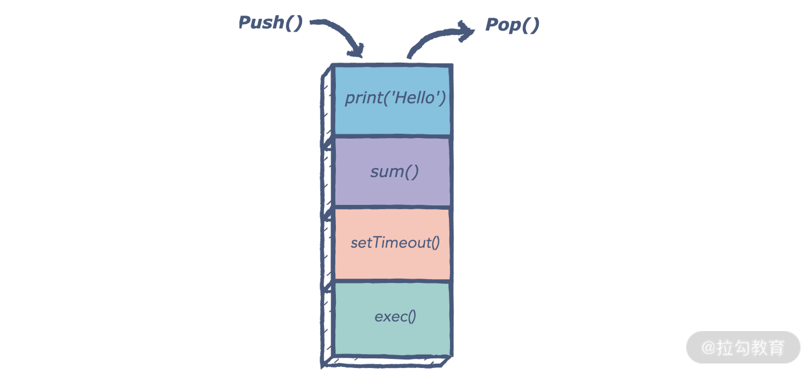
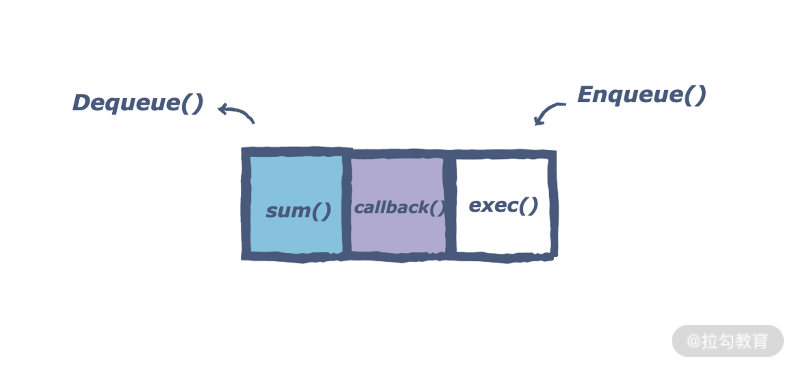
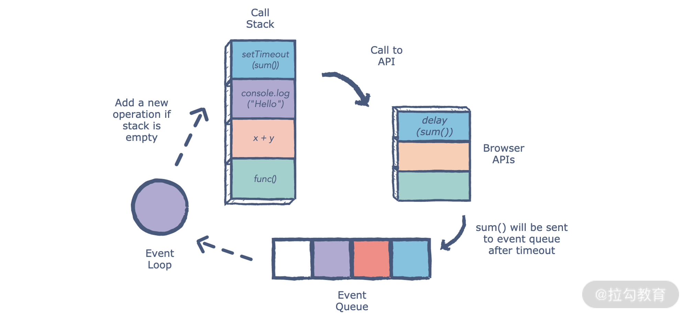
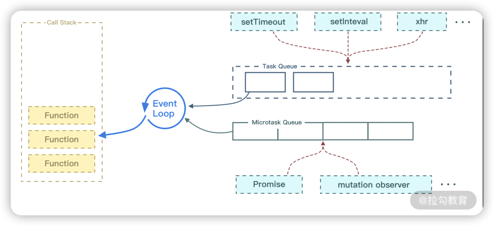
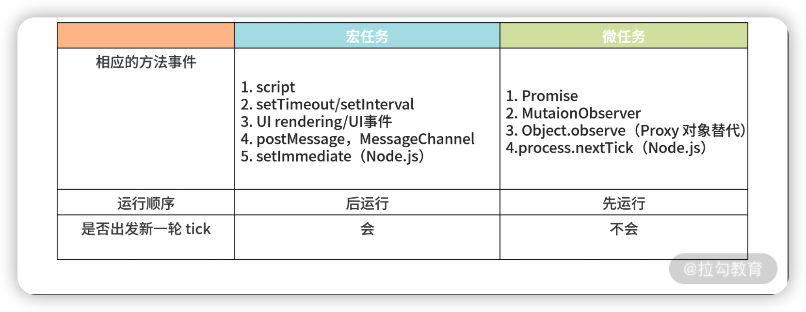

## 如何理解浏览器中的 EventLoop

### 浏览器的 Eventloop

Eventloop 是 JavaScript 引擎异步编程背后需要特别关注的知识点。JS 在单线程上执行所有操作，虽然是单线程，但是能够高效地解决问题，并能给我们带来一种“多线程”的错觉，这其实是通过使用一些比较合理的数据结构来达到此效果的。我们一起来看下 JavaScript 引擎背后都有哪些东西在同时运转。

1. **调用堆栈（call stack）负责跟踪所有要执行的代码。** 每当一个函数执行完成时，就会从堆栈中弹出（pop）该执行完成的函数；如果有代码需要进去执行的话，就进行 push 操作，如下图所示：
   
2. **事件队列（event queue）负责将新的 function 发送到队列中进行处理。** 它遵循 queue 的数据结构特性，先进先出，在该顺序下发送所有操作以进行执行。如下图所示：
   
3. **每当调用事件队列（event queue）中的异步函数时，都会将其发送到浏览器 API。** 根据从调用堆栈收到的命令，API 开始自己的单线程操作。其中 setTimeout 方法就是一个比较典型的例子，在堆栈中处理 setTimeout 操作时，会将其发送到相应的 API，该 API 一直等到指定的时间将此操作送回进行处理。它将操作发送到哪里去呢？答案是事件队列（event queue）。这样，就有了一个循环系统，用于在 JavaScript 中运行异步操作。
4. **JavaScript 语言本身是单线程的，而浏览器 API 充当单独的线程。** 事件循环（Eventloop）促进了这一过程，它会不断检查调用堆栈是否为空。如果为空，则从事件队列中添加新的函数进入调用栈（call stack）；如果不为空，则处理当前函数的调用。我们把整个过程串起来就是这样的一个循环执行流程，如下图所示：
   

通过上面这张图就能很清晰地看出调用栈、事件队列以及 Eventloop 和它们之间相互配合的关系。
那么看完了 JS 引擎的全局流程图，我们再看看 Eventloop 的内部都有哪些东西呢？简单来说 Eventloop 通过内部两个队列来实现 Event Queue 放进来的异步任务。以 setTimeout 为代表的任务被称为宏任务，放到宏任务队列（macrotask queue）中；而以 Promise  为代表的任务被称为微任务，放到微任务队列（microtask queue）中。我们来看一下日常工作中经常遇到的哪些是宏任务，哪些是微任务，如下所示。

```js
macrotasks(宏任务):

script(整体代码),setTimeout,setInterval,setImmediate,I/O,UI rendering,event listner

microtasks(微任务):

process.nextTick, Promises, Object.observe, MutationObserver

```

我把主要的宏任务和微任务都列了出来，其实 Eventloop 在处理宏任务和微任务的逻辑其实还是有些不一样的，执行的情况大致如下：
JavaScript 引擎首先从宏任务队列（macrotask queue）中取出第一个任务；
执行完毕后，再将微任务（microtask queue）中的所有任务取出，按照顺序分别全部执行（这里包括不仅指开始执行时队列里的微任务），如果在这一步过程中产生新的微任务，也需要执行；
然后再从宏任务队列中取下一个，执行完毕后，再次将 microtask queue 中的全部取出，循环往复，直到两个 queue 中的任务都取完。
总结起来就是：**一次 Eventloop 循环会处理一个宏任务和所有这次循环中产生的微任务。**

### EventLoop 对渲染的影响

---

## 探究宏任务 & 微任务的运行机制

在日常开发中，例如 setTimeout 和 promise 都是经常会使用到的 JS 方法。当这些方法变多了之后，再结合 JS 的异步编程代码混合使用，最终的执行顺序也经常会让开发者迷惑，因此要把这些问题搞清楚，下面的知识点你还是有必要好好学习一下。

### 代码执行顺序（一）

```js
console.log("begin");

setTimeout(() => {
  console.log("setTimeout");
}, 0);

new Promise((resolve) => {
  console.log("promise");
  resolve();
})
  .then(() => {
    console.log("then1");
  })
  .then(() => {
    console.log("then2");
  });

console.log("end");
```

这段代码应该比较简单，答案就是：

```js
begin;
promise;
end;
then1;
then2;
setTimeout;
```

其实这个就涉及了 JavaScript 事件轮询中的宏任务和微任务，如果你答对了，恭喜你，说明你的基本思路是没问题的。那么这里我就直接给出结论，宏任务和微任务的执行顺序基本是，在 EventLoop 中，每一次循环称为一次 tick，主要的任务顺序如下：

1. 执行栈选择最先进入队列的宏任务，执行其同步代码直至结束；
2. 检查是否有微任务，如果有则执行直到微任务队列为空；
3. 如果是在浏览器端，那么基本要渲染页面了；
4. 开始下一轮的循环（tick），执行宏任务中的一些异步代码，例如 setTimeout 等。

那么结合这个结论，以及前面学习的 EventLoop 的内容，来看下它们的运转流程效果图。


Call-Stack（调用栈）也就是执行栈，它是一个栈的结构，符合先进后出的机制，每次一个循环，先执行最先入队的宏任务，然后再执行微任务。不管微任务还是宏任务，它们只要按照顺序进入了执行栈，那么执行栈就还是按照先进后出的规则，一步一步执行。
因此根据这个原则，最先进行调用栈的宏任务，一般情况下都是最后返回执行的结果。那么从上面的代码中可以看到 setTimeout 的确最后执行了打印的结果。
这就是宏任务和微任务代码夹杂的情况下，代码的执行顺序，那么下面我们来专门看看宏任务到底有哪些，有什么值得关注的点。

### 宏任务

如果在浏览器的环境下，宏任务主要分为下面这几个大类：

1. 渲染事件（比如解析 DOM、计算布局、绘制）；
2. 用户交互事件（比如鼠标点击、滚动页面、放大缩小等）；
3. setTimeout、setInterval 等；
4. 网络请求完成、文件读写完成事件。

为了让这些任务在主线程上执行，页面进程引入了消息队列和事件循环机制，我们把这些消息队列中的任务称为宏任务。宏任务基本上满足了日常的开发需求，而对于时间精度有要求的宏任务就不太能满足了，比如渲染事件、各种 I/O、用户交互的事件等，都随时有可能被添加到消息队列中，JS 代码不能准确掌控任务要添加到队列中的位置，控制不了任务在消息队列中的位置，所以很难控制开始执行任务的时间。

为了方便理解，你可以看看下面的这段代码。

```js
function callback2() {
  console.log(2);
}

function callback() {
  console.log(1);

  setTimeout(callback2, 0);
}

setTimeout(callback, 0);
```

在上面这段代码中，我的目的是想通过 setTimeout 来设置两个回调任务，并让它们按照前后顺序来执行，中间也不要再插入其他的任务。但是实际情况我们难以控制，比如在你调用 setTimeout 来设置回调任务的间隙，消息队列中就有可能被插入很多系统级的任务。如果中间被插入的任务执行时间过久的话，那么就会影响到后面任务的执行了。所以说宏任务的时间粒度比较大，执行的间隔是不能精确控制的。这就不适用于一些高实时性的需求了，比如后面要讲到的监听 DOM 变化。

### 微任务

在理解了宏任务之后，下面我们就可以来看看什么是微任务了。微任务就是一个需要异步执行的函数，执行时机是在主函数执行结束之后、当前宏任务结束之前。

我们知道当 JavaScript 执行一段脚本的时候，V8 会为其创建一个全局执行上下文，同时 V8 引擎也会在内部创建一个微任务队列。这个微任务队列就是用来存放微任务的，因为在当前宏任务执行的过程中，有时候会产生多个微任务，这时候就需要使用这个微任务队列来保存这些微任务了。不过这个微任务队列是给 V8 引擎内部使用的，所以你是无法通过 JavaScript 直接访问的。

那么微任务是怎么产生的呢？在现代浏览器里面，产生微任务有两种方式。

1. 使用 MutationObserver 监控某个 DOM 节点，或者为这个节点添加、删除部分子节点，当 DOM 节点发生变化时，就会产生 DOM 变化记录的微任务。
2. 使用 Promise，当调用 Promise.resolve() 或者 Promise.reject() 的时候，也会产生微任务。
   通过 DOM 节点变化产生的微任务或者使用 Promise 产生的微任务都会被 JS 引擎按照顺序保存到微任务队列中。现在微任务队列中有了微任务，那么接下来就要看看微任务队列是何时被执行的。

通常情况下，在当前宏任务中的 JavaScript 快执行完成时，也就是在 JavaScript 引擎准备退出全局执行上下文并清空调用栈的时候，JavaScript 引擎会检查全局执行上下文中的微任务队列，然后按照顺序执行队列中的微任务。
如果在执行微任务的过程中，产生了新的微任务，一样会将该微任务添加到微任务队列中，V8 引擎一直循环执行微任务队列中的任务，直到队列清空才算执行结束。也就是说\*\*在执行微任务过程中产生的新的微任务并不会推迟到下一个循环中执行，而是在当前的循环中继续执行，\*\*这点是需要注意的。

以上就是微任务的工作流程，从上面的分析我们可以得出如下几个结论。

1. 微任务和宏任务是绑定的，每个宏任务在执行时，会创建自己的微任务队列。
2. 微任务的执行时长会影响当前宏任务的时长。比如一个宏任务在执行过程中，产生了 10 个微任务，执行每个微任务的时间是 10ms，那么执行这 10 个微任务的时间就是 100ms，也可以说这 10 个微任务让宏任务的执行时间延长了 100ms。
3. 在一个宏任务中，分别创建一个用于回调的宏任务和微任务，无论什么情况下，微任务都早于宏任务执行。

### 监听 DOM 变化应用场景

MutationObserver 是用来监听 DOM 变化的一套方法，而监听 DOM 变化一直是前端工程师经常要做的事情之一。
虽然监听 DOM 的需求是比较频繁的，不过早期页面并没有提供对监听的支持，所以那时要观察 DOM 是否变化，唯一能做的就是轮询检测。比如使用 setTimeout 或者 setInterval 来定时检测 DOM 是否有改变。这种方式简单粗暴，但是会遇到两个问题：如果时间间隔设置过长，DOM 变化响应不够及时；反过来如果时间间隔设置过短，又会浪费很多无用的工作量去检查 DOM，会让页面变得低效。

从 DOM 4 开始，W3C 推出了 MutationObserver。MutationObserver API 可以用来监视 DOM 的变化，包括属性的变更、节点的增加、内容的改变等。因为上面我们分析过，在两个任务之间，可能会被渲染进程插入其他的事件，从而影响到响应的实时性。这时候，微任务就可以上场了，在每次 DOM 节点发生变化的时候，渲染引擎将变化记录封装成微任务，并将微任务添加进当前的微任务队列中。这样当执行到检查点的时候，V8 引擎就会按照顺序执行微任务了。

综上所述，MutationObserver 采用了“异步 + 微任务”的策略：

1. 通过异步操作解决了同步操作的性能问题；
2. 通过微任务解决了实时性的问题。

好了，到这里你对宏任务和微任务的原理，以及执行顺序的特点已经有一定的了解了，那么最后我再结合 JS 的异步编程，给你展示一段比开篇那段更复杂一些的代码片段，

### 代码执行顺序（二）

```js
async function async1() {
  console.log("async1 start");

  await async2();

  console.log("async1 end");
}

async function async2() {
  console.log("async2");
}

async1();

setTimeout(() => {
  console.log("timeout");
}, 0);

new Promise(function(resolve) {
  console.log("promise1");

  resolve();
}).then(function() {
  console.log("promise2");
});

console.log("script end");
```

这段代码除了考察你对微任务和宏任务的理解外，也顺带考察了宏任务微任务结合异步编程最后的执行逻辑，这里你可以先按照自己的学习思路给出一个答案，之后再拿到浏览器端运行一下结果，对照着你的答案看是否正确，

### 总结

针对宏任务和微任务的区别以及执行顺序，这里有一个表格，方便深入理解

