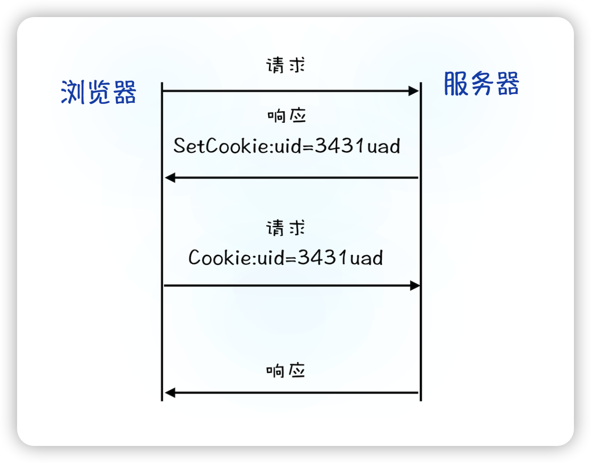

## 如何理解浏览器中的 EventLoop

### 浏览器的 Eventloop

Eventloop 是 JavaScript 引擎异步编程背后需要特别关注的知识点。JS 在单线程上执行所有操作，虽然是单线程，但是能够高效地解决问题，并能给我们带来一种“多线程”的错觉，这其实是通过使用一些比较合理的数据结构来达到此效果的。我们一起来看下 JavaScript 引擎背后都有哪些东西在同时运转。

1. **调用堆栈（call stack）负责跟踪所有要执行的代码。** 每当一个函数执行完成时，就会从堆栈中弹出（pop）该执行完成的函数；如果有代码需要进去执行的话，就进行 push 操作，如下图所示：
   
2. **事件队列（event queue）负责将新的 function 发送到队列中进行处理。** 它遵循 queue 的数据结构特性，先进先出，在该顺序下发送所有操作以进行执行。如下图所示：
   
3. **每当调用事件队列（event queue）中的异步函数时，都会将其发送到浏览器 API。** 根据从调用堆栈收到的命令，API 开始自己的单线程操作。其中 setTimeout 方法就是一个比较典型的例子，在堆栈中处理 setTimeout 操作时，会将其发送到相应的 API，该 API 一直等到指定的时间将此操作送回进行处理。它将操作发送到哪里去呢？答案是事件队列（event queue）。这样，就有了一个循环系统，用于在 JavaScript 中运行异步操作。
4. **JavaScript 语言本身是单线程的，而浏览器 API 充当单独的线程。** 事件循环（Eventloop）促进了这一过程，它会不断检查调用堆栈是否为空。如果为空，则从事件队列中添加新的函数进入调用栈（call stack）；如果不为空，则处理当前函数的调用。我们把整个过程串起来就是这样的一个循环执行流程，如下图所示：
   

通过上面这张图就能很清晰地看出调用栈、事件队列以及 Eventloop 和它们之间相互配合的关系。
那么看完了 JS 引擎的全局流程图，我们再看看 Eventloop 的内部都有哪些东西呢？简单来说 Eventloop 通过内部两个队列来实现 Event Queue 放进来的异步任务。以 setTimeout 为代表的任务被称为宏任务，放到宏任务队列（macrotask queue）中；而以 Promise  为代表的任务被称为微任务，放到微任务队列（microtask queue）中。我们来看一下日常工作中经常遇到的哪些是宏任务，哪些是微任务，如下所示。

```js
macrotasks(宏任务):

script(整体代码),setTimeout,setInterval,setImmediate,I/O,UI rendering,event listner

microtasks(微任务):

process.nextTick, Promises, Object.observe, MutationObserver

```

我把主要的宏任务和微任务都列了出来，其实 Eventloop 在处理宏任务和微任务的逻辑其实还是有些不一样的，执行的情况大致如下：
JavaScript 引擎首先从宏任务队列（macrotask queue）中取出第一个任务；
执行完毕后，再将微任务（microtask queue）中的所有任务取出，按照顺序分别全部执行（这里包括不仅指开始执行时队列里的微任务），如果在这一步过程中产生新的微任务，也需要执行；
然后再从宏任务队列中取下一个，执行完毕后，再次将 microtask queue 中的全部取出，循环往复，直到两个 queue 中的任务都取完。
总结起来就是：**一次 Eventloop 循环会处理一个宏任务和所有这次循环中产生的微任务。**

### EventLoop 对渲染的影响

---

## 探究宏任务 & 微任务的运行机制

在日常开发中，例如 setTimeout 和 promise 都是经常会使用到的 JS 方法。当这些方法变多了之后，再结合 JS 的异步编程代码混合使用，最终的执行顺序也经常会让开发者迷惑，因此要把这些问题搞清楚，下面的知识点你还是有必要好好学习一下。

### 代码执行顺序（一）

```js
console.log("begin");

setTimeout(() => {
  console.log("setTimeout");
}, 0);

new Promise((resolve) => {
  console.log("promise");
  resolve();
})
  .then(() => {
    console.log("then1");
  })
  .then(() => {
    console.log("then2");
  });

console.log("end");
```

这段代码应该比较简单，答案就是：

```js
begin;
promise;
end;
then1;
then2;
setTimeout;
```

其实这个就涉及了 JavaScript 事件轮询中的宏任务和微任务，如果你答对了，恭喜你，说明你的基本思路是没问题的。那么这里我就直接给出结论，宏任务和微任务的执行顺序基本是，在 EventLoop 中，每一次循环称为一次 tick，主要的任务顺序如下：

1. 执行栈选择最先进入队列的宏任务，执行其同步代码直至结束；
2. 检查是否有微任务，如果有则执行直到微任务队列为空；
3. 如果是在浏览器端，那么基本要渲染页面了；
4. 开始下一轮的循环（tick），执行宏任务中的一些异步代码，例如 setTimeout 等。

那么结合这个结论，以及前面学习的 EventLoop 的内容，来看下它们的运转流程效果图。


Call-Stack（调用栈）也就是执行栈，它是一个栈的结构，符合先进后出的机制，每次一个循环，先执行最先入队的宏任务，然后再执行微任务。不管微任务还是宏任务，它们只要按照顺序进入了执行栈，那么执行栈就还是按照先进后出的规则，一步一步执行。
因此根据这个原则，最先进行调用栈的宏任务，一般情况下都是最后返回执行的结果。那么从上面的代码中可以看到 setTimeout 的确最后执行了打印的结果。
这就是宏任务和微任务代码夹杂的情况下，代码的执行顺序，那么下面我们来专门看看宏任务到底有哪些，有什么值得关注的点。

### 宏任务

如果在浏览器的环境下，宏任务主要分为下面这几个大类：

1. 渲染事件（比如解析 DOM、计算布局、绘制）；
2. 用户交互事件（比如鼠标点击、滚动页面、放大缩小等）；
3. setTimeout、setInterval 等；
4. 网络请求完成、文件读写完成事件。

为了让这些任务在主线程上执行，页面进程引入了消息队列和事件循环机制，我们把这些消息队列中的任务称为宏任务。宏任务基本上满足了日常的开发需求，而对于时间精度有要求的宏任务就不太能满足了，比如渲染事件、各种 I/O、用户交互的事件等，都随时有可能被添加到消息队列中，JS 代码不能准确掌控任务要添加到队列中的位置，控制不了任务在消息队列中的位置，所以很难控制开始执行任务的时间。

为了方便理解，你可以看看下面的这段代码。

```js
function callback2() {
  console.log(2);
}

function callback() {
  console.log(1);

  setTimeout(callback2, 0);
}

setTimeout(callback, 0);
```

在上面这段代码中，我的目的是想通过 setTimeout 来设置两个回调任务，并让它们按照前后顺序来执行，中间也不要再插入其他的任务。但是实际情况我们难以控制，比如在你调用 setTimeout 来设置回调任务的间隙，消息队列中就有可能被插入很多系统级的任务。如果中间被插入的任务执行时间过久的话，那么就会影响到后面任务的执行了。所以说宏任务的时间粒度比较大，执行的间隔是不能精确控制的。这就不适用于一些高实时性的需求了，比如后面要讲到的监听 DOM 变化。

### 微任务

在理解了宏任务之后，下面我们就可以来看看什么是微任务了。微任务就是一个需要异步执行的函数，执行时机是在主函数执行结束之后、当前宏任务结束之前。

我们知道当 JavaScript 执行一段脚本的时候，V8 会为其创建一个全局执行上下文，同时 V8 引擎也会在内部创建一个微任务队列。这个微任务队列就是用来存放微任务的，因为在当前宏任务执行的过程中，有时候会产生多个微任务，这时候就需要使用这个微任务队列来保存这些微任务了。不过这个微任务队列是给 V8 引擎内部使用的，所以你是无法通过 JavaScript 直接访问的。

那么微任务是怎么产生的呢？在现代浏览器里面，产生微任务有两种方式。

1. 使用 MutationObserver 监控某个 DOM 节点，或者为这个节点添加、删除部分子节点，当 DOM 节点发生变化时，就会产生 DOM 变化记录的微任务。
2. 使用 Promise，当调用 Promise.resolve() 或者 Promise.reject() 的时候，也会产生微任务。
   通过 DOM 节点变化产生的微任务或者使用 Promise 产生的微任务都会被 JS 引擎按照顺序保存到微任务队列中。现在微任务队列中有了微任务，那么接下来就要看看微任务队列是何时被执行的。

通常情况下，在当前宏任务中的 JavaScript 快执行完成时，也就是在 JavaScript 引擎准备退出全局执行上下文并清空调用栈的时候，JavaScript 引擎会检查全局执行上下文中的微任务队列，然后按照顺序执行队列中的微任务。
如果在执行微任务的过程中，产生了新的微任务，一样会将该微任务添加到微任务队列中，V8 引擎一直循环执行微任务队列中的任务，直到队列清空才算执行结束。也就是说\*\*在执行微任务过程中产生的新的微任务并不会推迟到下一个循环中执行，而是在当前的循环中继续执行，\*\*这点是需要注意的。

以上就是微任务的工作流程，从上面的分析我们可以得出如下几个结论。

1. 微任务和宏任务是绑定的，每个宏任务在执行时，会创建自己的微任务队列。
2. 微任务的执行时长会影响当前宏任务的时长。比如一个宏任务在执行过程中，产生了 10 个微任务，执行每个微任务的时间是 10ms，那么执行这 10 个微任务的时间就是 100ms，也可以说这 10 个微任务让宏任务的执行时间延长了 100ms。
3. 在一个宏任务中，分别创建一个用于回调的宏任务和微任务，无论什么情况下，微任务都早于宏任务执行。

### 监听 DOM 变化应用场景

MutationObserver 是用来监听 DOM 变化的一套方法，而监听 DOM 变化一直是前端工程师经常要做的事情之一。
虽然监听 DOM 的需求是比较频繁的，不过早期页面并没有提供对监听的支持，所以那时要观察 DOM 是否变化，唯一能做的就是轮询检测。比如使用 setTimeout 或者 setInterval 来定时检测 DOM 是否有改变。这种方式简单粗暴，但是会遇到两个问题：如果时间间隔设置过长，DOM 变化响应不够及时；反过来如果时间间隔设置过短，又会浪费很多无用的工作量去检查 DOM，会让页面变得低效。

从 DOM 4 开始，W3C 推出了 MutationObserver。MutationObserver API 可以用来监视 DOM 的变化，包括属性的变更、节点的增加、内容的改变等。因为上面我们分析过，在两个任务之间，可能会被渲染进程插入其他的事件，从而影响到响应的实时性。这时候，微任务就可以上场了，在每次 DOM 节点发生变化的时候，渲染引擎将变化记录封装成微任务，并将微任务添加进当前的微任务队列中。这样当执行到检查点的时候，V8 引擎就会按照顺序执行微任务了。

综上所述，MutationObserver 采用了“异步 + 微任务”的策略：

1. 通过异步操作解决了同步操作的性能问题；
2. 通过微任务解决了实时性的问题。

好了，到这里你对宏任务和微任务的原理，以及执行顺序的特点已经有一定的了解了，那么最后我再结合 JS 的异步编程，给你展示一段比开篇那段更复杂一些的代码片段，

### 代码执行顺序（二）

```js
async function async1() {
  console.log("async1 start");

  await async2();

  console.log("async1 end");
}

async function async2() {
  console.log("async2");
}

async1();

setTimeout(() => {
  console.log("timeout");
}, 0);

new Promise(function(resolve) {
  console.log("promise1");

  resolve();
}).then(function() {
  console.log("promise2");
});

console.log("script end");
```

这段代码除了考察你对微任务和宏任务的理解外，也顺带考察了宏任务微任务结合异步编程最后的执行逻辑，这里你可以先按照自己的学习思路给出一个答案，之后再拿到浏览器端运行一下结果，对照着你的答案看是否正确，

### 总结

针对宏任务和微任务的区别以及执行顺序，这里有一个表格，方便深入理解


## chrome架构: 一个tab页面，为什么有4个进程？

在开始之前，我们一起看下，Chrome 打开一个页面需要启动多少进程？你可以点击 Chrome 浏览器右上角的“选项”菜单，选择“更多工具”子菜单，点击“任务管理器”，这将打开 Chrome 的任务管理器的窗口，

如下图：


和 Windows 任务管理器一样，Chrome 任务管理器也是用来展示运行中 Chrome 使用的进程信息的。从图中可以看到，Chrome 启动了 4 个进程，你也许会好奇，只是打开了 1 个页面，为什么要启动这么多进程呢？

在解答这个问题之前，我们需要了解一下进程的概念，不过由于好多人容易把进程和线程的概念混淆，从而影响后续其他概念的理解，所以这里我就将这两个概念以及它们之间的关系一并为你讲解下。

### 进程和线程

不过，在介绍进程和线程之前，我需要先讲解下什么是并行处理，因为如果你理解了并行处理的概念，那么再理解进程和线程之间的关系就会变得轻松许多。

### 什么是并行处理

**计算机中的并行处理就是同一时刻处理多个任务，**比如我们要计算下面这三个表达式的值，并显示出结果。

~~~shell
A = 1+2
B = 20/5
C = 7*8
~~~

在编写代码的时候，我们可以把这个过程拆分为四个任务：

+ 任务 1 是计算 A=1+2；
+ 任务 2 是计算 B=20/5；
+ 任务 3 是计算 C=7*8；
+ 任务 4 是显示最后计算的结果。

正常情况下程序可以使用单线程来处理，也就是分四步按照顺序分别执行这四个任务。

如果采用**多线程**，会怎么样呢？我们只需分“两步走”：第一步，使用三个线程同时执行前三个任务；第二步，再执行第四个显示任务。

通过对比分析，你会发现用单线程执行需要四步，而使用多线程只需要两步。因此，**使用并行处理能大大提升性能。**

### 线程 VS 进程

多线程可以并行处理任务，**但是线程是不能单独存在的，它是由进程来启动和管理的。**那什么又是进程呢？

**一个进程就是一个程序的运行实例。**详细解释就是，启动一个程序的时候，操作系统会为该程序创建一块内存，用来存放代码、运行中的数据和一个执行任务的主线程，我们把这样的一个运行环境叫**进程**。

单线程与多线程的进程对比图：


总结来说，进程和线程之间的关系有以下 4 个特点。

1. 进程中的任意一线程执行出错，都会导致整个进程的崩溃。

2. 线程之间共享进程中的数据。

   线程之间共享进程中的数据示意图：

   

   从上图可以看出，线程 1、线程 2、线程 3 分别把执行的结果写入 A、B、C 中，然后线程 2 继续从 A、B、C 中读取数据，用来显示执行结果。

3. 当一个进程关闭之后，操作系统会回收进程所占用的内存。

   当一个进程退出时，操作系统会回收该进程所申请的所有资源；即使其中任意线程因为操作不当导致内存泄漏，当进程退出时，这些内存也会被正确回收。

   比如之前的 IE 浏览器，支持很多插件，而这些插件很容易导致内存泄漏，这意味着只要浏览器开着，内存占用就有可能会越来越多，但是当关闭浏览器进程时，这些内存就都会被系统回收掉。

4. 进程之间的内容相互隔离。

   进程隔离是为保护操作系统中进程互不干扰的技术，每一个进程只能访问自己占有的数据，也就避免出现进程 A 写入数据到进程 B 的情况。正是因为进程之间的数据是严格隔离的，所以一个进程如果崩溃了，或者挂起了，是不会影响到其他进程的。如果进程之间需要进行数据的通信，这时候，就需要使用用于进程间通信（IPC）的机制了。

### 单进程浏览器时代

在了解了进程和线程之后，我们再来一起看下单进程浏览器的架构。顾名思义，**单进程浏览器是指浏览器的所有功能模块都是运行在同一个进程里，这些模块包含了网络、插件、JavaScript 运行环境、渲染引擎和页面等。**其实早在 2007 年之前，市面上浏览器都是单进程的。

单进程浏览器的架构如下图所示：


如此多的功能模块运行在一个进程里，是导致单进程浏览器 **不稳定、**    **不流畅 **和 **不安全** 的一个主要因素。下面我就来一一分析下出现这些问题的原因。

### 问题 1：

不稳定早期浏览器需要借助于 **插件** 来实现诸如 Web 视频、Web 游戏等各种强大的功能，但是插件是最容易出问题的模块，并且还运行在浏览器进程之中，所以一个插件的意外崩溃会引起整个浏览器的崩溃。

除了插件之外，渲染引擎模块 也是不稳定的，通常一些复杂的 JavaScript 代码就有可能引起渲染引擎模块的崩溃。和插件一样，渲染引擎的崩溃也会导致整个浏览器的崩溃。

### 问题 2：

不流畅从上面的“单进程浏览器架构示意图”可以看出，所有页面的渲染模块、JavaScript 执行环境以及插件都是运行在同一个线程中的，这就意味着同一时刻只能有一个模块可以执行。

比如，下面这个无限循环的脚本：

~~~javascript
function freeze() { 
  while (1) { 
    console.log("freeze"); 
  }}
freeze();
~~~

如果让这个脚本运行在一个单进程浏览器的页面里，你感觉会发生什么？

因为这个脚本是无限循环的，所以当其执行时，它会独占整个线程，这样导致其他运行在该线程中的模块就没有机会被执行。因为浏览器中所有的页面都运行在该线程中，所以这些页面都没有机会去执行任务，这样就会导致整个浏览器失去响应，变卡顿。

除了上述脚本或者插件会让单进程浏览器变卡顿外，页面的内存泄漏也是单进程变慢的一个重要原因。通常浏览器的内核都是非常复杂的，运行一个复杂点的页面再关闭页面，会存在内存不能完全回收的情况，这样导致的问题是使用时间越长，内存占用越高，浏览器会变得越慢。

### 问题 3：

不安全这里依然可以从插件和页面脚本两个方面来解释该原因。

插件可以使用 C/C++ 等代码编写，通过插件可以获取到操作系统的任意资源，当你在页面运行一个插件时也就意味着这个插件能完全操作你的电脑。如果是个恶意插件，那么它就可以释放病毒、窃取你的账号密码，引发安全性问题。

至于页面脚本，它可以通过浏览器的漏洞来获取系统权限，这些脚本获取系统权限之后也可以对你的电脑做一些恶意的事情，同样也会引发安全问题。

以上这些就是当时浏览器的特点，不稳定，不流畅，而且不安全。这是一段不堪回首的过去，也许你没有经历过，不过你可以想象一下这样的场景：当你正在用浏览器打开多个页面时，突然某个页面崩溃了或者失去响应，随之而来的是整个浏览器的崩溃或者无响应，然后你发现你给老板写的邮件页面也随之消失了，这时你的心情会不会和页面一样崩溃呢？

### 多进程浏览器时代

好在现代浏览器已经解决了这些问题，是如何解决的呢？这就得聊聊我们这个“多进程浏览器时代”了。

早期 Chrome 进程架构图：


从图中可以看出，Chrome 的页面是运行在单独的渲染进程中的，同时页面里的插件也是运行在单独的插件进程之中，而进程之间是通过 IPC 机制进行通信（如图中虚线部分）。

**我们先看看如何解决不稳定的问题。**由于进程是相互隔离的，所以当一个页面或者插件崩溃时，影响到的仅仅是当前的页面进程或者插件进程，并不会影响到浏览器和其他页面，这就完美地解决了页面或者插件的崩溃会导致整个浏览器崩溃，也就是不稳定的问题。

**接下来再来看看不流畅的问题是如何解决的。**同样，JavaScript 也是运行在渲染进程中的，所以即使 JavaScript 阻塞了渲染进程，影响到的也只是当前的渲染页面，而并不会影响浏览器和其他页面，因为其他页面的脚本是运行在它们自己的渲染进程中的。所以当我们再在 Chrome 中运行上面那个死循环的脚本时，没有响应的仅仅是当前的页面。对于内存泄漏的解决方法那就更简单了，因为当关闭一个页面时，整个渲染进程也会被关闭，之后该进程所占用的内存都会被系统回收，这样就轻松解决了浏览器页面的内存泄漏问题。

**最后我们再来看看上面的两个安全问题是怎么解决的。**采用多进程架构的额外好处是可以使用安全沙箱，你可以把沙箱看成是操作系统给进程上了一把锁，沙箱里面的程序可以运行，但是不能在你的硬盘上写入任何数据，也不能在敏感位置读取任何数据，例如你的文档和桌面。Chrome 把插件进程和渲染进程锁在沙箱里面，这样即使在渲染进程或者插件进程里面执行了恶意程序，恶意程序也无法突破沙箱去获取系统权限。

### 目前多进程架构

不过 Chrome 的发展是滚滚向前的，相较之前，目前的架构又有了很多新的变化。我们先看看最新的 Chrome 进程架构，


从图中可以看出，最新的 Chrome 浏览器包括：1 个浏览器（Browser）主进程、1 个 GPU 进程、1 个网络（NetWork）进程、多个渲染进程和多个插件进程。

下面我们来逐个分析下这几个进程的功能。

+ 浏览器进程。主要负责界面显示、用户交互、子进程管理，同时提供存储等功能。
+ 渲染进程。核心任务是将 HTML、CSS 和 JavaScript 转换为用户可以与之交互的网页，排版引擎 Blink 和 JavaScript 引擎 V8 都是运行在该进程中，默认情况下，Chrome 会为每个 Tab 标签创建一个渲染进程。出于安全考虑，渲染进程都是运行在沙箱模式下。
+ GPU 进程。其实，Chrome 刚开始发布的时候是没有 GPU 进程的。而 GPU 的使用初衷是为了实现 3D CSS 的效果，只是随后网页、Chrome 的 UI 界面都选择采用 GPU 来绘制，这使得 GPU 成为浏览器普遍的需求。最后，Chrome 在其多进程架构上也引入了 GPU 进程。
+ 网络进程。主要负责页面的网络资源加载，之前是作为一个模块运行在浏览器进程里面的，直至最近才独立出来，成为一个单独的进程。
+ 插件进程。主要是负责插件的运行，因插件易崩溃，所以需要通过插件进程来隔离，以保证插件进程崩溃不会对浏览器和页面造成影响。

讲到这里，现在你应该就可以回答文章开头提到的问题了：仅仅打开了 1 个页面，为什么有 4 个进程？因为打开 1 个页面至少需要 1 个网络进程、1 个浏览器进程、1 个 GPU 进程以及 1 个渲染进程，共 4 个；如果打开的页面有运行插件的话，还需要再加上 1 个插件进程。

不过凡事都有两面性，虽然多进程模型提升了浏览器的稳定性、流畅性和安全性，但同样不可避免地带来了一些问题：

+ 更高的资源占用。因为每个进程都会包含公共基础结构的副本（如 JavaScript 运行环境），这就意味着浏览器会消耗更多的内存资源。
+ 更复杂的体系架构。浏览器各模块之间耦合性高、扩展性差等问题，会导致现在的架构已经很难适应新的需求了。

## 一个数据包的“旅程”

下面我将分别从“数据包如何送达主机”“主机如何将数据包转交给应用”和“数据是如何被完整地送达应用程序”这三个角度来为你讲述数据的传输过程。

互联网中的数据是通过**数据包**来传输的。**如果发送的数据很大，那么该数据就会被拆分为很多小数据包来传输**。比如你现在听的音频数据，是拆分成一个个小的数据包来传输的，并不是一个大的文件一次传输过来的。

1. IP：把数据包送达目的主机

   数据包要在互联网上进行传输，就要符合**网际协议**（Internet Protocol，简称 **IP**）标准。互联网上不同的在线设备都有唯一的地址，地址只是一个数字，这和大部分家庭收件地址类似，你只需要知道一个家庭的具体地址，就可以往这个地址发送包裹，这样物流系统就能把物品送到目的地。

   **计算机的地址就称为 IP 地址，访问任何网站实际上只是你的计算机向另外一台计算机请求信息。**

   如果要想把一个数据包从主机 A 发送给主机 B，那么在传输之前，数据包上会被附加上主机 B 的 IP 地址信息，这样在传输过程中才能正确寻址。额外地，数据包上还会附加上主机 A 本身的 IP 地址，有了这些信息主机 B 才可以回复信息给主机 A。这些附加的信息会被装进一个叫 IP 头的数据结构里。IP 头是 IP 数据包开头的信息，包含 IP 版本、源 IP 地址、目标 IP 地址、生存时间等信息。

   IP 网络三层传输模型：

   


   该图展示了一个数据包从主机 A 到主机 B 的旅程：

   + 上层将含有“极客时间”的数据包交给网络层；
   + 网络层再将 IP 头附加到数据包上，组成新的 IP 数据包，并交给底层；
   + 底层通过物理网络将数据包传输给主机 B；
   + 数据包被传输到主机 B 的网络层，在这里主机 B 拆开数据包的 IP 头信息，并将拆开来的数据部分交给上层；
   + 最终，含有“极客时间”信息的数据包就到达了主机 B 的上层了。

2. UDP：把数据包送达应用程序

   IP 是非常底层的协议，只负责把数据包传送到对方电脑，但是对方电脑(在这里你可以理解为主机B)并不知道把数据包交给哪个程序，是交给浏览器还是交给王者荣耀？因此，需要基于 IP 之上开发能和应用打交道的协议，最常见的是**“用户数据包协议（User Datagram Protocol）”**，**简称 UDP**。

   UDP 中一个最重要的信息是端口号，端口号其实就是一个数字，每个想访问网络的程序都需要绑定一个端口号。通过端口号 UDP 就能把指定的数据包发送给指定的程序了，所以 **IP 通过 IP 地址信息把数据包发送给指定的电脑，而 UDP 通过端口号把数据包分发给正确的程序。**和 IP 头一样，端口号会被装进 UDP 头里面，UDP 头再和原始数据包合并组成新的 UDP 数据包。UDP 头中除了目的端口，还有源端口号等信息。

   简化的 UDP 网络四层传输模型：

   

   + 上层将含有“极客时间”的数据包交给传输层；
   + 传输层会在数据包前面附加上 UDP 头，组成新的 UDP 数据包，再将新的 UDP 数据包交给网络层；
   + 网络层再将 IP 头附加到数据包上，组成新的 IP 数据包，并交给底层；
   + 数据包被传输到主机 B 的网络层，在这里主机 B 拆开 IP 头信息，并将拆开来的数据部分交给传输层；在传输层，数据包中的 UDP 头会被拆开，并根据 UDP 中所提供的端口号，把数据部分交给上层的应用程序；
   + 最终，含有“极客时间”信息的数据包就旅行到了主机 B 上层应用程序这里。

   在使用 UDP 发送数据时，有各种因素会导致数据包出错，虽然 UDP 可以校验数据是否正确，但是对于错误的数据包，UDP 并不提供重发机制，只是丢弃当前的包，而且 UDP 在发送之后也无法知道是否能达到目的地。**虽说 UDP 不能保证数据可靠性，但是传输速度却非常快，**所以 UDP 会应用在一些关注速度、但不那么严格要求数据完整性的领域，如在线视频、互动游戏等。

3. TCP：把数据完整地送达应用程序

   对于浏览器请求，或者邮件这类要求数据传输可靠性（reliability）的应用，如果使用 UDP 来传输会存在两个问题：

   + 数据包在传输过程中容易丢失；
   + 大文件会被拆分成很多小的数据包来传输，这些小的数据包会经过不同的路由，并在不同的时间到达接收端，而 UDP 协议并不知道如何组装这些数据包，所以也就无法把这些数据包还原成完整的文件。

   基于这两个问题，我们引入 TCP 了。**TCP（Transmission Control Protocol，传输控制协议）是一种面向连接的、可靠的、基于字节流的传输层通信协议。**

   相对于 UDP，TCP 有下面两个特点:

   + 对于数据包丢失的情况，TCP 提供重传机制；
   + TCP 引入了数据包排序机制，用来保证把乱序的数据包组合成一个完整的文件。

   和 UDP 头一样，TCP 头除了包含了目标端口和本机端口号外，还提供了用于排序的序列号，以便接收端通过序号来重排数据包。

   简化的 TCP 网络四层传输模型：

   

   通过上图你应该可以了解一个数据包是如何通过 TCP 来传输的。TCP 单个数据包的传输流程和 UDP 流程差不多，不同的地方在于，通过 TCP 头的信息保证了一块大的数据传输的完整性。

   下面我们再看下**完整的 TCP 连接过程**，通过这个过程你可以明白 TCP 是如何保证重传机制和数据包的排序功能的。

   一个 TCP 连接的生命周期：

   

   + 首先，建立连接阶段。这个阶段是通过“三次握手”来建立客户端和服务器之间的连接。TCP 提供面向连接的通信传输。面向连接是指在数据通信开始之前先做好两端之间的准备工作。所谓三次握手，是指在建立一个 TCP 连接时，客户端和服务器总共要发送三个数据包以确认连接的建立。
   + 其次，传输数据阶段。在该阶段，接收端需要对每个数据包进行确认操作，也就是接收端在接收到数据包之后，需要发送确认数据包给发送端。所以当发送端发送了一个数据包之后，在规定时间内没有接收到接收端反馈的确认消息，则判断为数据包丢失，并触发发送端的重发机制。同样，一个大的文件在传输过程中会被拆分成很多小的数据包，这些数据包到达接收端后，接收端会按照 TCP 头中的序号为其排序，从而保证组成完整的数据。
   + 最后，断开连接阶段。数据传输完毕之后，就要终止连接了，涉及到最后一个阶段“四次挥手”来保证双方都能断开连接。

   到这里你应该就明白了，TCP 为了保证数据传输的可靠性，牺牲了数据包的传输速度，因为“三次握手”和“数据包校验机制”等把传输过程中的数据包的数量提高了一倍。

### 总结

1. 浏览器可以同时打开多个页签，他们端口一样吗？如果一样，数据怎么知道去哪个页签？

   端口一样的，网络进程知道每个tcp链接所对应的标签是那个，所以接收到数据后，会把数据分发给对应的渲染进程


## 浏览器的“缓存”

首先，由两个问题来开始对浏览器 "缓存" 的学习，

1. 为什么通常在第一次访问一个站点时，打开速度很慢，当再次访问这个站点时，速度就很快了？
2. 当登录过一个网站之后，下次再访问该站点，就已经处于登录状态了，这是怎么做到的呢？

相信有经验的开发人员都可以顺利的回答这两个问题，都是与http协议相关的问题，那这两个问题与浏览器缓存有关系吗？

表面上来看确实关系不是很大，但是http协议却是浏览器中使用最广的协议，所以要想学好浏览器，就要先深入了解 HTTP。

### 浏览器端发起 HTTP 请求流程

1. 构建请求

   首先，浏览器构建 **请求行** 信息（如下所示），构建好后，浏览器准备发起网络请求。

   ~~~shell
   GET /index.html HTTP1.1
   ~~~

   

2. 查找缓存

   在真正发起网络请求之前，浏览器会先在浏览器缓存中查询是否有要请求的文件。其中，**浏览器缓存是一种在本地保存资源副本，以供下次请求时直接使用的技术。** 当浏览器发现请求的资源已经在浏览器缓存中存有副本，它会拦截请求，返回该资源的副本，并直接结束请求，而不会再去源服务器重新下载。

   这样做的好处有：缓解服务器端压力，提升性能（获取资源的耗时更短了）；对于网站来说，缓存是实现快速资源加载的重要组成部分。当然，如果缓存查找失败，就会进入网络请求过程了。

3. 准备 IP 地址和端口

   因为浏览器使用 HTTP 协议作为应用层协议，用来封装请求的文本信息；并使用 TCP/IP 作传输层协议将它发到网络上，所以在 HTTP 工作开始之前，浏览器需要通过 TCP 与服务器建立连接。也就是说 HTTP 的内容是通过 TCP 的传输数据阶段来实现的，你可以结合下图更好地理解这二者的关系。

   

   在上一篇文章中，我们介绍过数据包都是通过 IP 地址传输给接收方的。由于 IP 地址是数字标识，比如极客时间网站的 IP 是 ` 39.106.233.176` , 难以记忆，但使用极客时间的域名（time.geekbang.org）就好记多了，所以基于这个需求又出现了一个服务，负责把域名和 IP 地址做一一映射关系。这套域名映射为 IP 的系统就叫做 **“域名系统”**，简称 **DNS**（Domain Name System）(在http专题中有对dns的文章)。

   所以，这样一路推导下来，你会发现在第一步浏览器会请求 DNS 返回域名对应的 IP。当然浏览器还提供了 DNS 数据缓存服务，如果某个域名已经解析过了，那么浏览器会缓存解析的结果，以供下次查询时直接使用，这样也会减少一次网络请求。

   拿到 IP 之后，接下来就需要获取端口号了。通常情况下，如果 URL 没有特别指明端口号，那么 HTTP 协议默认是 80 端口，(https默认端口是443)。

   3

4. 等待 TCP 队列

   现在已经把端口和 IP 地址都准备好了，那么下一步是不是可以建立 TCP 连接了呢？答案依然是“不行”。Chrome 有个机制，同一个域名同时最多只能建立 6 个 TCP 连接，如果在同一个域名下同时有 10 个请求发生，那么其中 4 个请求会进入排队等待状态，直至进行中的请求完成。当然，如果当前请求数量少于 6，会直接进入下一步，建立 TCP 连接。

5. 建立 TCP 连接

   排队等待结束之后，终于可以快乐地和服务器握手了，在 HTTP 工作开始之前，浏览器通过 TCP 与服务器建立连接。

6. 发送 HTTP 请求

   一旦建立了 TCP 连接，浏览器就可以和服务器进行通信了。而 HTTP 中的数据正是在这个通信过程中传输的。

   HTTP 请求数据格式：

   

   首先浏览器会向服务器发送 **请求行**， 它包括了 **请求方法** 、**请求 URI**（Uniform Resource Identifier）和 **HTTP 版本协议** 。

   发送请求行，就是告诉服务器浏览器需要什么资源，最常用的请求方法是 Get。比如，直接在浏览器地址栏键入极客时间的域名（time.geekbang.org），这就是告诉服务器要 Get 它的首页资源。

   另外一个常用的请求方法是 POST，它用于发送一些数据给服务器，比如登录一个网站，就需要通过 POST 方法把用户信息发送给服务器。如果使用 POST 方法，那么浏览器还要准备数据给服务器，这里准备的数据是通过请求体来发送。

   在浏览器发送请求行命令之后，还要以请求头形式发送其他一些信息，把浏览器的一些基础信息告诉服务器。比如包含了浏览器所使用的操作系统、浏览器内核等信息，以及当前请求的域名信息、浏览器端的 Cookie 信息，等等。

### 服务器端处理 HTTP 请求流程

1. 返回请求

   一旦服务器处理结束，便可以返回数据给浏览器了。你可以通过工具软件 curl 来查看返回请求数据，具体使用方法是在命令行中输入以下命令：

   ~~~shell
   curl -i https://time.geekbang.org/
   ~~~

   注意这里加上了-i 是为了返回响应行、响应头和响应体的数据，返回的结果如下图所示，你可以结合这些数据来理解服务器是如何响应浏览器的。

   

   首先服务器会返回响应行，包括协议版本和状态码。但并不是所有的请求都可以被服务器处理的，那么一些无法处理或者处理出错的信息，怎么办呢？服务器会通过响应行的 **状态码** 来告诉浏览器它的处理结果，

   比如：最常用的状态码是 200，表示处理成功；如果没有找到页面，则会返回 404。

   随后，正如浏览器会随同请求发送请求头一样，服务器也会随同响应向浏览器发送 **响应头。** 响应头包含了服务器自身的一些信息，比如服务器生成返回数据的时间、返回的数据类型（JSON、HTML、流媒体等类型），以及服务器要在客户端保存的 Cookie 等信息。

   发送完响应头后，服务器就可以继续发送 **响应体** 的数据，通常，响应体就包含了 HTML 的实际内容。

   以上这些就是服务器响应浏览器的具体过程。

2. 断开连接

   通常情况下，一旦服务器向客户端返回了请求数据，它就要关闭 TCP 连接。不过如果浏览器或者服务器在其头信息中加入了：

   ~~~shell
   Connection:Keep-Alive
   ~~~

   那么 TCP 连接在发送后将仍然保持打开状态，这样浏览器就可以继续通过同一个 TCP 连接发送请求。**保持 TCP 连接可以省去下次请求时需要建立连接的时间，提升资源加载速度。** 比如，一个 Web 页面中内嵌的图片就都来自同一个 Web 站点，如果初始化了一个持久连接，你就可以复用该连接，以请求其他资源，而不需要重新再建立新的 TCP 连接。

3. 重定向

### 问题解答

说了这么多，相信你现在已经了解了 HTTP 的请求流程，那现在我们再回过头来看看文章开头提出的问题。

1. 为什么很多站点第二次打开速度会很快？

   如果第二次页面打开很快，主要原因是第一次加载页面过程中，缓存了一些耗时的数据。那么，哪些数据会被缓存呢？从上面介绍的核心请求路径可以发现，**DNS 缓存** 和 **页面资源缓存** 这两块数据是会被浏览器缓存的。其中，DNS 缓存比较简单，它主要就是在浏览器本地把对应的 IP 和域名关联起来，这块内容可以去 **http专题** 查看。

   缓存查找流程：

   

   首先，我们看下服务器是通过什么方式让浏览器缓存数据的？

   从上图的第一次请求可以看出，当服务器返回 **HTTP 响应头** 给浏览器时，浏览器是通过响应头中的 **Cache-Control** 字段来设置是否缓存该资源。通常，我们还需要为这个资源设置一个缓存过期时长，而这个时长是通过 Cache-Control 中的 **Max-age** 参数来设置的，比如上图设置的缓存过期时间是 2000 秒。

   ~~~shell
   Cache-Control:Max-age=2000
   ~~~

   这也就意味着，在该缓存资源还未过期的情况下, 如果再次请求该资源，会直接返回缓存中的资源给浏览器。

   但如果缓存过期了，浏览器则会继续发起网络请求，并且在 HTTP 请求头中带上：

   ~~~shell
   If-None-Match:"4f80f-13c-3a1xb12a"
   ~~~

   服务器收到请求头后，会根据 If-None-Match 的值来判断请求的资源是否有更新。

   如果没有更新，就返回 304 状态码，相当于服务器告诉浏览器：“这个缓存可以继续使用，这次就不重复发送数据给你了。”

   如果资源有更新，服务器就直接返回最新资源给浏览器。关于缓存的细节内容特别多，具体细节你可以参考 http专题的http缓存。

   简要来说，很多网站第二次访问能够秒开，是因为这些网站把很多资源都缓存在了本地，浏览器缓存直接使用本地副本来回应请求，而不会产生真实的网络请求，从而节省了时间。同时，DNS 数据也被浏览器缓存了，这又省去了 DNS 查询环节。

2. 登录状态是如何保持的？

   通过上面的介绍，你已经了解了缓存是如何工作的。下面我们再一起看下登录状态是如何保持的。

   用户打开登录页面，在登录框里填入用户名和密码，点击确定按钮。点击按钮会触发页面脚本生成用户登录信息，然后调用 POST 方法提交用户登录信息给服务器。

   服务器接收到浏览器提交的信息之后，查询后台，验证用户登录信息是否正确，如果正确的话，会生成一段表示用户身份的字符串，并把该字符串写到响应头的 Set-Cookie 字段里，

   如下所示，然后把响应头发送给浏览器。

   ~~~shell
   Set-Cookie: UID=3431uad;
   ~~~

   浏览器在接收到服务器的响应头后，开始解析响应头，如果遇到响应头里含有 Set-Cookie 字段的情况，浏览器就会把这个字段信息保存到本地。比如把UID=3431uad保持到本地。

   当用户再次访问时，浏览器会发起 HTTP 请求，但在发起请求之前，浏览器会读取之前保存的 Cookie 数据，并把数据写进请求头里的 Cookie 字段里（如下所示），然后浏览器再将请求头发送给服务器。

   ~~~shell
   Cookie: UID=3431uad;
   ~~~

   服务器在收到 HTTP 请求头数据之后，就会查找请求头里面的“Cookie”字段信息，当查找到包含UID=3431uad的信息时，服务器查询后台，并判断该用户是已登录状态，然后生成含有该用户信息的页面数据，并把生成的数据发送给浏览器。

   浏览器在接收到该含有当前用户的页面数据后，就可以正确展示用户登录的状态信息了。

   Cookie 流程图：

   

   简单地说，如果服务器端发送的响应头内有 Set-Cookie 的字段，那么浏览器就会将该字段的内容保持到本地。当下次客户端再往该服务器发送请求时，客户端会自动在请求头中加入 Cookie 值后再发送出去。服务器端发现客户端发送过来的 Cookie 后，会去检查究竟是从哪一个客户端发来的连接请求，然后对比服务器上的记录，最后得到该用户的状态信息。

### 总结

为了便于理解，下面这张详细的“HTTP 请求示意图”，用来展现浏览器中的 HTTP 请求所经历的各个阶段。


从图中可以看到，浏览器中的 HTTP 请求从发起到结束一共经历了如下八个阶段：构建请求、查找缓存、准备 IP 和端口、等待 TCP 队列、建立 TCP 连接、发起 HTTP 请求、服务器处理请求、服务器返回请求和断开连接。

## 从输入URL到页面展示，这中间发生了什么？

“在浏览器里，从输入 URL 到页面展示，这中间发生了什么？ ”这是一道经典的面试题，

从输入 URL 到页面展示完整流程示意图：


从图中可以看出，**整个过程需要各个进程之间的配合**，所以在开始正式流程之前，我们还是先来快速回顾下浏览器进程、渲染进程和网络进程的主要职责。

+ 浏览器进程主要负责用户交互、子进程管理和文件储存等功能。
+ 网络进程是面向渲染进程和浏览器进程等提供网络下载功能。
+ 渲染进程的主要职责是把从网络下载的 HTML、JavaScript、CSS、图片等资源解析为可以显示和交互的页面。因为渲染进程所有的内容都是通过网络获取的，会存在一些恶意代码利用浏览器漏洞对系统进行攻击，所以运行在渲染进程里面的代码是不被信任的。这也是为什么 Chrome 会让渲染进程运行在安全沙箱里，就是为了保证系统的安全。

回顾了浏览器的进程架构后，我们再结合上图来看下这个完整的流程，可以看出，整个流程包含了许多步骤，我把其中几个核心的节点用蓝色背景标记出来了。这个过程可以大致描述为如下。

+ 首先，浏览器进程接收到用户输入的 URL 请求，浏览器进程便将该 URL 转发给网络进程。
+ 然后，在网络进程中发起真正的 URL 请求。
+ 接着网络进程接收到了响应头数据，便解析响应头数据，并将数据转发给浏览器进程。
+ 浏览器进程接收到网络进程的响应头数据之后，发送“提交导航 (CommitNavigation)”消息到渲染进程；
+ 渲染进程接收到“提交导航”的消息之后，便开始准备接收 HTML 数据，接收数据的方式是直接和网络进程建立数据管道；
+ 最后渲染进程会向浏览器进程“确认提交”，这是告诉浏览器进程：“已经准备好接受和解析页面数据了”。
+ 浏览器进程接收到渲染进程“提交文档”的消息之后，便开始移除之前旧的文档，然后更新浏览器进程中的页面状态。

**用户发出 URL 请求到页面开始解析的这个过程，就叫做导航。**

### 从输入url到页面展示

1. 用户输入

   当用户在地址栏中输入一个查询关键字时，地址栏会判断输入的关键字是 **搜索内容**，还是请求的 **URL**。

   如果是搜索内容，地址栏会使用浏览器默认的搜索引擎，来合成新的带搜索关键字的 URL。

   如果判断输入内容符合 URL 规则，比如输入的是 `time.geekbang.org`，那么地址栏会根据规则，把这段内容加上协议，合成为完整的 URL。

   > 当用户输入关键字并键入回车之后，这意味着当前页面即将要被替换成新的页面，不过在这个流程继续之前，浏览器还给了当前页面一次执行 beforeunload 事件的机会，beforeunload 事件允许页面在退出之前执行一些数据清理操作，还可以询问用户是否要离开当前页面，比如当前页面可能有未提交完成的表单等情况，因此用户可以通过 beforeunload 事件来取消导航，让浏览器不再执行任何后续工作。

   

2. URL 请求过程

   接下来，便进入了页面资源请求过程。这时，浏览器进程会通过进程间通信 **（IPC）** 把 URL 请求发送至网络进程，网络进程接收到 URL 请求后，会在这里发起真正的 URL 请求流程。那具体流程是怎样的呢？

   首先，网络进程会查找本地缓存是否缓存了该资源。如果有缓存资源，那么直接返回资源给浏览器进程；如果在缓存中没有查找到资源，那么直接进入网络请求流程。这请求前的第一步是要进行 DNS 解析，以获取请求域名的服务器 IP 地址。如果请求协议是 HTTPS，那么还需要建立 TLS 连接。

   接下来就是利用 IP 地址和服务器建立 TCP 连接。连接建立之后，浏览器端会构建请求行、请求头等信息，并把和该域名相关的 Cookie 等数据附加到请求头中，然后向服务器发送构建的请求信息。服务器接收到请求信息后，会根据请求信息生成响应数据（包括响应行、响应头和响应体等信息），并发给网络进程。等网络进程接收了响应行和响应头之后，就开始解析响应头的内容了。

   **重定向**

   在接收到服务器返回的响应头后，网络进程开始解析响应头，如果发现返回的状态码是 301 或者 302，那么说明服务器需要浏览器重定向到其他 URL。这时网络进程会从响应头的 Location 字段里面读取重定向的地址，然后再发起新的 HTTP 或者 HTTPS 请求，一切又重头开始了。

   比如，我们在终端里输入以下命令：

   ~~~shell
   curl -I http://time.geekbang.org/
   ~~~

   curl -I + URL的命令是接收服务器返回的响应头的信息。执行命令后，我们看到服务器返回的响应头信息如下：

   

   从图中可以看出，极客时间服务器会通过重定向的方式把所有 HTTP 请求转换为 HTTPS 请求。也就是说你使用 HTTP 向极客时间服务器请求时，服务器会返回一个包含有 301 或者 302 状态码响应头，并把响应头的 Location 字段中填上 HTTPS 的地址，这就是告诉了浏览器要重新导航到新的地址上。

   下面我们再使用 HTTPS 协议对极客时间发起请求，看看服务器的响应头信息是什么样子的。

   ~~~shell
   curl -I https://time.geekbang.org/
   ~~~

   我们看到服务器返回如下信息：

   

   从图中可以看出，服务器返回的响应头的状态码是 200，这是告诉浏览器一切正常，可以继续往下处理该请求了。

   好了，以上是重定向内容的介绍。现在你应该理解了，在导航过程中，如果服务器响应行的状态码包含了 301、302 一类的跳转信息，浏览器会跳转到新的地址继续导航；如果响应行是 200，那么表示浏览器可以继续处理该请求。

    **响应数据类型处理**

   在处理了跳转信息之后，我们继续导航流程的分析。URL 请求的数据类型，有时候是一个下载类型，有时候是正常的 HTML 页面，那么浏览器是如何区分它们呢？

   答案是 Content-Type。Content-Type 是 HTTP 头中一个非常重要的字段， 它告诉浏览器服务器返回的响应体数据是什么类型，**然后浏览器会根据 Content-Type 的值来决定如何显示响应体的内容。

   这里我们还是以极客时间为例，看看极客时间官网返回的 Content-Type 值是什么。在终端输入以下命令：

   ~~~shell
   curl -I https://time.geekbang.org/
   ~~~

   含有 HTML 格式的 Content-Type：

   

   从图中可以看到，响应头中的 Content-type 字段的值是 text/html，这就是告诉浏览器，服务器返回的数据是 HTML 格式。

   不同 Content-Type 的后续处理流程也截然不同。如果 Content-Type 字段的值被浏览器判断为下载类型，那么该请求会被提交给浏览器的下载管理器，同时该 URL 请求的导航流程就此结束。但如果是 HTML，那么浏览器则会继续进行导航流程。由于 Chrome 的页面渲染是运行在渲染进程中的，所以接下来就需要准备渲染进程了。

1. 准备渲染进程

   默认情况下，Chrome 会为每个页面分配一个渲染进程，也就是说，每打开一个新页面就会配套创建一个新的渲染进程。但是，也有一些例外，在某些情况下，浏览器会让多个页面直接运行在同一个渲染进程中。

   那什么情况下多个页面会同时运行在一个渲染进程中呢？

   要解决这个问题，我们就需要先了解下什么是同一站点 `（same-site）`。具体地讲，我们将 **“同一站点”** 定义为 **根域名** （例如，geekbang.org）加上协议（例如，https:// 或者 http://），还包含了该根域名下的所有子域名和不同的端口，比如下面这三个：

   ~~~shell
   https://time.geekbang.org
   https://www.geekbang.org
   https://www.geekbang.org:8080
   ~~~

   它们都是属于同一站点，因为它们的协议都是 HTTPS，而且根域名也都是 `geekbang.org`。

   Chrome 的默认策略是，每个标签对应一个渲染进程。但如果从一个页面打开了另一个新页面，而新页面和当前页面属于同一站点的话，那么新页面会复用父页面的渲染进程。官方把这个默认策略叫 `process-per-site-instance`

   总结来说，打开一个新页面采用的渲染进程策略就是：

   + 通常情况下，打开新的页面都会使用单独的渲染进程；
   + 如果从 A 页面打开 B 页面，且 A 和 B 都属于同一站点的话，那么 B 页面复用 A 页面的渲染进程；如果是其他情况，浏览器进程则会为 B 创建一个新的渲染进程。

2. 提交文档

   所谓提交文档，就是指浏览器进程将网络进程接收到的 HTML 数据提交给渲染进程，具体流程是这样的：

   + 首先当浏览器进程接收到网络进程的响应头数据之后，便向渲染进程发起“提交文档”的消息；
   + 渲染进程接收到“提交文档”的消息后，会和网络进程建立传输数据的“管道”；
   + 等文档数据传输完成之后，渲染进程会返回“确认提交”的消息给浏览器进程；
   + 浏览器进程在收到“确认提交”的消息后，会更新浏览器界面状态，包括了安全状态、地址栏的 URL、前进后退的历史状态，并更新 Web 页面。

   其中，当渲染进程确认提交之后，更新内容如下图所示：

   

   这也就解释了为什么在浏览器的地址栏里面输入了一个地址后，之前的页面没有立马消失，而是要加载一会儿才会更新页面。

   到这里，一个完整的导航流程就“走”完了，这之后就要进入 **渲染阶段** 了。

3. 渲染阶段

   一旦文档被提交，渲染进程便开始页面解析和子资源加载了，关于这个阶段的完整过程，我会在下一篇文章中来专门介绍。这里你只需要先了解一旦页面生成完成，渲染进程会发送一个消息给浏览器进程，浏览器接收到消息后，会停止标签图标上的加载动画。如下所示：

   

   至此，一个完整的页面就生成了。那文章开头的“从输入 URL 到页面展示，这中间发生了什么？”这个过程及其“串联”的问题也就解决了。