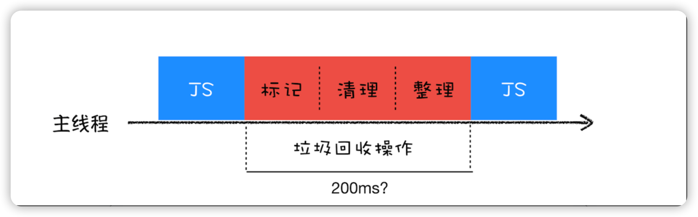
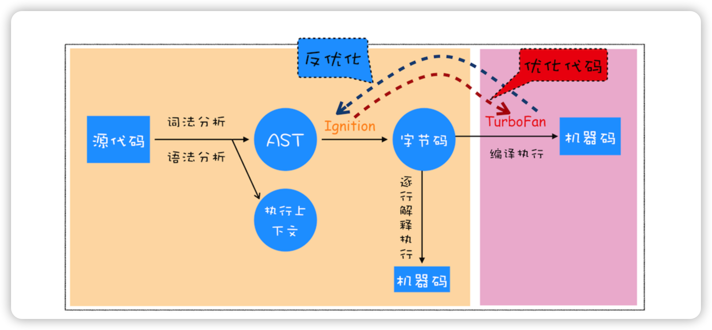

## 浏览器中的页面循环系统

### 如何理解浏览器中的EventLoop

Javascript引擎是运行在渲染进程的主线程上面的，主线程非常繁忙，既要处理DOM，又要计算样式，还要处理布局，同时还需要处理 Javascript 任务以及各种输入事件。要让这么多不同类型的任务在主线程中有条不紊地执行，这就需要一个系统来统筹调度这些任务，这个统筹调度系统就是我们今天要讲的消息队列和事件循环系统。

为了能让你更加深刻地理解事件循环机制，我们就从最简单的场景来分析，然后带你一步步了解浏览器页面主线程是如何运作的。

#### 使用单线程处理安排好的任务

我们先从最简单的场景讲起，比如有如下一系列的任务：

+ 任务 1：1+2
+ 任务 2：20/5
+ 任务 3：7*8
+ 任务 4：打印出任务 1、任务 2、任务 3 的运算结果

现在要在一个线程中去执行这些任务，通常我们会这样编写代码：

~~~c
void MainThread(){
  int num1 = 1+2; //任务1
  int num2 = 20/5; //任务2
  int num3 = 7*8; //任务3
  print("最终计算的值为:%d,%d,%d",num1,num2,num3)； //任务4
}
~~~

在上面的执行代码中，我们把所有任务代码按照顺序写进主线程里，等线程执行时，这些任务会按照顺序在线程中依次被执行；等所有任务执行完成之后，线程会自动退出。可以参考下图来直观地理解下其执行过程：


#### 在线程运行过程中处理新任务

但并不是所有的任务都是在执行之前统一安排好的，大部分情况下，新的任务是在线程运行过程中产生的。比如在线程执行过程中，又接收到了一个新的任务要求计算“10+2”，那上面那种方式就无法处理这种情况了。

**要想在线程运行过程中，能接收并执行新的任务，就需要采用事件循环机制**。我们可以通过一个 for 循环语句来监听是否有新的任务，如下面的示例代码：

~~~c
//GetInput
//等待用户从键盘输入一个数字，并返回该输入的数字
int GetInput(){
  int input_number = 0;
  cout<<"请输入一个数:";
  cin>>input_number;
  return input_number;
}

//主线程(Main Thread)
void MainThread(){
  for(;;){
    int first_num = GetInput()；
      int second_num = GetInput()；
      result_num = first_num + second_num;
    print("最终计算的值为:%d",result_num)；
  }
}
~~~

相较于第一版的线程，这一版的线程做了两点改进。

+ 第一点引入了循环机制，具体实现方式是在线程语句最后添加了一个 for 循环语句，线程会一直循环执行。
+ 第二点是引入了事件，可以在线程运行过程中，等待用户输入的数字，等待过程中线程处于暂停状态，一旦接收到用户输入的信息，那么线程会被激活，然后执行相加运算，最后输出结果。

通过引入事件循环机制，就可以让该线程“活”起来了，我们每次输入两个数字，都会打印出两数字相加的结果，你可以结合下图来参考下这个改进版的线程：


#### 处理其他线程发送过来的任务

上面我们改进了线程的执行方式，引入了事件循环机制，可以让其在执行过程中接受新的任务。不过在第二版的线程模型中，所有的任务都是来自于线程内部的，如果另外一个线程想让主线程执行一个任务，利用第二版的线程模型是无法做到的。

那下面我们就来看看其他线程是如何发送消息给渲染主线程的，具体形式你可以参考下图：


从上图可以看出，渲染主线程会频繁接收到来自于 IO 线程的一些任务，接收到这些任务之后，渲染进程就需要着手处理，比如接收到资源加载完成的消息后，渲染进程就要着手进行 DOM 解析了；接收到鼠标点击的消息后，渲染主线程就要开始执行相应的 JavaScript 脚本来处理该点击事件。

那么如何设计好一个线程模型，能让其能够接收其他线程发送的消息呢？

一个通用模式是使用**消息队列**。在解释如何实现之前，我们先说说什么是消息队列，可以参考下图：


从图中可以看出，**消息队列是一种数据结构，可以存放要执行的任务。它符合队列“先进先出”的特点，也就是说要添加任务的话，添加到队列的尾部；要取出任务的话，从队列头部去取**。

有了队列之后，我们就可以继续改造线程模型了，改造方案如下图所示：


从上图可以看出，我们的改造可以分为下面三个步骤：

1. 添加一个消息队列
2. IO 线程中产生的新任务添加进消息队列尾部
3. 渲染主线程会循环地从消息队列头部中读取任务，执行任务

有了这些步骤之后，那么接下来我们就可以按步骤使用代码来实现第三版的线程模型

首先，构造一个队列。当然，在本篇文章中我们不需要考虑队列实现的细节，只是构造队列的接口：

~~~c
class TaskQueue{
  public:
  Task takeTask(); //取出队列头部的一个任务
  void pushTask(Task task); //添加一个任务到队列尾部
};
~~~

接下来，改造主线程，让主线程从队列中读取任务：

~~~c
TaskQueue task_queue；
void ProcessTask();
void MainThread(){
  for(;;){
    Task task = task_queue.takeTask();
    ProcessTask(task);
  }
}
~~~

在上面的代码中，我们添加了一个消息队列的对象，然后在主线程的 for 循环代码块中，从消息队列中读取一个任务，然后执行该任务，主线程就这样一直循环往下执行，因此只要消息队列中有任务，主线程就会去执行。

主线程的代码就这样改造完成了。这样改造后，主线程执行的任务都全部从消息队列中获取。所以如果有其他线程想要发送任务让主线程去执行，只需要将任务添加到该消息队列中就可以了，添加任务的代码如下：

~~~c++
Task clickTask;
task_queue.pushTask(clickTask)
~~~

**由于是多个线程操作同一个消息队列，所以在添加任务和取出任务时还会加上一个同步锁，这块内容你也要注意下。**

#### 处理其他进程发送过来的任务

通过使用消息队列，我们实现了线程之间的消息通信。在 Chrome 中，跨进程之间的任务也是频繁发生的，那么如何处理其他进程发送过来的任务？你可以参考下图：


从图中可以看出，**渲染进程专门有一个 IO 线程用来接收其他进程传进来的消息，接收到消息之后，会将这些消息组装成任务发送给渲染主线程**，后续的步骤就和前面讲解的“处理其他线程发送的任务”一样了，这里就不再重复了。

#### 消息队列中的任务类型

现在你知道页面主线程是如何接收外部任务的了，那接下来我们再来看看消息队列中的任务类型有哪些。你可以参考下Chromium 的官方源码，这里面包含了很多内部消息类型，如输入事件（鼠标滚动、点击、移动）、微任务、文件读写、WebSocket、JavaScript 定时器等等。

除此之外，消息队列中还包含了很多与页面相关的事件，如 JavaScript 执行、解析 DOM、样式计算、布局计算、CSS 动画等。

以上这些事件都是在主线程中执行的，所以在编写 Web 应用时，你还需要衡量这些事件所占用的时长，并想办法解决单个任务占用主线程过久的问题。

#### 如何安全退出

当页面主线程执行完成之后，又该如何保证页面主线程能够安全退出呢？Chrome 是这样解决的，确定要退出当前页面时，页面主线程会设置一个退出标志的变量，在每次执行完一个任务时，判断是否有设置退出标志。

如果设置了，那么就直接中断当前的所有任务，退出线程，你可以参考下面代码：

~~~c
TaskQueue task_queue；
void ProcessTask();
bool keep_running = true;
void MainThread(){
  for(;;){
    Task task = task_queue.takeTask();
    ProcessTask(task);
    if(!keep_running) //如果设置了退出标志，那么直接退出线程循环
        break; 
  }
}
~~~

#### 页面使用单线程的缺点

上面讲述的就是页面线程的循环系统是如何工作的，那接下来，我们继续探讨页面线程的一些特征。

通过上面的介绍，你应该清楚了，页面线程所有执行的任务都来自于消息队列。消息队列是“先进先出”的属性，也就是说放入队列中的任务，需要等待前面的任务被执行完，才会被执行。鉴于这个属性，就有如下两个问题需要解决。

**第一个问题是如何处理高优先级的任务**

比如一个典型的场景是监控 DOM 节点的变化情况（节点的插入、修改、删除等动态变化），然后根据这些变化来处理相应的业务逻辑。一个通用的设计的是，利用 JavaScript 设计一套监听接口，当变化发生时，渲染引擎同步调用这些接口，这是一个典型的观察者模式。

不过这个模式有个问题，因为 DOM 变化非常频繁，如果每次发生变化的时候，都直接调用相应的 JavaScript 接口，那么这个当前的任务执行时间会被拉长，从而导致执行效率的下降。

如果将这些 DOM 变化做成异步的消息事件，添加到消息队列的尾部，那么又会影响到监控的实时性，因为在添加到消息队列的过程中，可能前面就有很多任务在排队了。

这也就是说，**如果 DOM 发生变化，采用同步通知的方式，会影响当前任务的执行效率；如果采用异步方式，又会影响到监控的实时性**。

那该如何权衡 **效率** 和 **实时性** 呢？

针对这种情况，微任务就应用而生了，下面我们来看看微任务是如何权衡效率和实时性的。

通常我们把消息队列中的任务称为 **宏任务**，每个宏任务中都包含了一个微任务队列，在执行宏任务的过程中，如果 DOM 有变化，那么就会将该变化添加到微任务列表中，这样就不会影响到宏任务的继续执行，因此也就解决了执行效率的问题。

等宏任务中的主要功能都直接完成之后，这时候，渲染引擎并不着急去执行下一个宏任务，而是执行当前宏任务中的微任务，因为 DOM 变化的事件都保存在这些微任务队列中，这样也就解决了实时性问题。

**第二个是如何解决单个任务执行时长过久的问题**

因为所有的任务都是在单线程中执行的，所以每次只能执行一个任务，而其他任务就都处于等待状态。如果其中一个任务执行时间过久，那么下一个任务就要等待很长时间。可以参考下图：


从图中你可以看到，如果在执行动画过程中，其中有个 JavaScript 任务因执行时间过久，占用了动画单帧的时间，这样会给用户制造了卡顿的感觉，这当然是极不好的用户体验。针对这种情况，JavaScript 可以通过回调功能来规避这种问题，也就是让要执行的 JavaScript 任务滞后执行。至于浏览器是如何实现回调功能的，后面的章节会继续探讨。

#### 总结


---


### 浏览器如何实现 setTimeout

要了解定时器的工作原理，就得先来回顾下之前讲的事件循环系统，我们知道渲染进程中所有运行在主线程上的任务都需要先添加到消息队列，然后事件循环系统再按照顺序执行消息队列中的任务。

+ 当接收到 HTML 文档数据，渲染引擎就会将“解析 DOM”事件添加到消息队列中，
+ 当用户改变了 Web 页面的窗口大小，渲染引擎就会将“重新布局”的事件添加到消息队列中。
+ 当触发了 JavaScript 引擎垃圾回收机制，渲染引擎会将“垃圾回收”任务添加到消息队列中。
+ 同样，如果要执行一段异步 JavaScript 代码，也是需要将执行任务添加到消息队列中。

以上列举的只是一小部分事件，这些事件被添加到消息队列之后，事件循环系统就会按照消息队列中的顺序来执行事件。

**所以说要执行一段异步任务，需要先将任务添加到消息队列中**。不过通过定时器设置回调函数有点特别，它们需要在指定的时间间隔内被调用，但消息队列中的任务是按照顺序执行的，所以为了保证回调函数能在指定时间内执行，**你不能将定时器的回调函数直接添加到消息队列中**。

那么该怎么设计才能让定时器设置的回调事件在规定时间内被执行呢？你也可以思考下，如果让你在消息循环系统的基础之上加上定时器的功能，你会如何设计？

在 Chrome 中除了正常使用的消息队列之外，**还有另外一个消息队列，这个队列中维护了需要延迟执行的任务列表**，包括了定时器和 Chromium 内部一些需要延迟执行的任务。**所以当通过 JavaScript 创建一个定时器时，渲染进程会将该定时器的回调任务添加到延迟队列中**。

> 如何理解这个延迟队列：
>
> 文章中说是队列，为了和消息队列统一起来，不然表述起来有点拗口。 其实是一个hashmap结构，等到执行这个结构的时候，会计算hashmap中的每个任务是否到期了，到期了就去执行，直到所有到期的任务都执行结束，才会进入下一轮循环！
>
> 延时队列里面是宏任务，普通的消息队列里面也是宏任务，微任务是在宏任务快要执行结束之前执行的！

源码中延迟执行队列的定义如下所示：

~~~c
DelayedIncomingQueue delayed_incoming_queue;
~~~

当通过 JavaScript 调用 setTimeout 设置回调函数的时候，渲染进程将会创建一个回调任务，包含了回调函数 showName、当前发起时间、延迟执行时间，其模拟代码如下所示：

~~~c
struct DelayTask{
  int64 id；
  CallBackFunction cbf;
  int start_time;
  int delay_time;
};
DelayTask timerTask;
timerTask.cbf = showName;
timerTask.start_time = getCurrentTime(); //获取当前时间
timerTask.delay_time = 200;//设置延迟执行时间
~~~

创建好回调任务之后，再将该任务添加到延迟执行队列中，代码如下所示：

~~~c
delayed_incoming_queue.push(timerTask)；
~~~

**现在通过定时器发起的任务就被保存到延迟队列中了，那接下来我们再来看看消息循环系统是怎么触发延迟队列的**。

我们可以来完善上一篇文章中消息循环的代码，在其中加入执行延迟队列的代码，如下所示：

~~~c
void ProcessTimerTask(){
  //从delayed_incoming_queue中取出已经到期的定时器任务
  //依次执行这些任务
}

TaskQueue task_queue；
void ProcessTask();
bool keep_running = true;
void MainTherad(){
  for(;;){
    //执行消息队列中的任务
    Task task = task_queue.takeTask();
    ProcessTask(task);
    
    //执行延迟队列中的任务
    ProcessDelayTask()

    if(!keep_running) //如果设置了退出标志，那么直接退出线程循环
        break; 
  }
}
~~~

从上面代码可以看出来，我们添加了一个 ProcessDelayTask 函数，该函数是专门用来处理延迟执行任务的。这里我们要重点关注它的执行时机，**在上段代码中，处理完消息队列中的一个任务之后，就开始执行 ProcessDelayTask 函数。ProcessDelayTask 函数会根据发起时间和延迟时间计算出到期的任务，然后依次执行这些到期的任务。等到期的任务执行完成之后，再继续下一个循环过程。通过这样的方式，一个完整的定时器就实现了**。

设置一个定时器，JavaScript 引擎会返回一个定时器的 ID。那通常情况下，当一个定时器的任务还没有被执行的时候，也是可以取消的，具体方法是调用 clearTimeout 函数，并传入需要取消的定时器的 ID。如下面代码所示：

~~~c
clearTimeout(timer_id)
~~~

其实浏览器内部实现取消定时器的操作也是非常简单的，就是直接从 delayed_incoming_queue 延迟队列中，通过 ID 查找到对应的任务，然后再将其从队列中删除掉就可以了。

#### 使用 setTimeout 的一些注意事项

现在你应该知道在浏览器内部定时器是如何工作的了。不过在使用定时器的过程中，如果你不了解定时器的一些细节，那么很有可能掉进定时器的一些陷阱里。所以接下来，我们就来讲解一下在使用定时器过程中存在的那些陷阱。

1. 如果当前任务执行时间过久，会影响定时器任务的执行

   在使用 setTimeout 的时候，有很多因素会导致回调函数执行比设定的预期值要久，其中一个就是当前任务执行时间过久从而导致定时器设置的任务被延后执行。我们先看下面这段代码：

   ~~~javascript
   function bar() {
       console.log('bar')
   }
   function foo() {
       setTimeout(bar, 0);
       for (let i = 0; i < 5000; i++) {
           let i = 5+8+8+8
           console.log(i)
       }
   }
   foo()
   ~~~

   这段代码中，在执行 foo 函数的时候使用 setTimeout 设置了一个 0 延时的回调任务，设置好回调任务后，foo 函数会继续执行 5000 次 for 循环。

   通过 setTimeout 设置的回调任务被放入了消息队列中并且等待下一次执行，这里并不是立即执行的；要执行消息队列中的下个任务，需要等待当前的任务执行完成，由于当前这段代码要执行 5000 次的 for 循环，所以当前这个任务的执行时间会比较久一点。这势必会影响到下个任务的执行时间。

   长任务导致定时器被延后执行

   

   从图中可以看到，执行 foo 函数所消耗的时长是 500 毫秒，这也就意味着通过 setTimeout 设置的任务会被推迟到 500 毫秒以后再去执行，而设置 setTimeout 的回调延迟时间是 0。

2. 如果 setTimeout 存在嵌套调用，那么系统会设置最短时间间隔为 4 毫秒

   也就是说在定时器函数里面嵌套调用定时器，也会延长定时器的执行时间，可以先看下面的这段代码：

   ~~~javascript
   function cb() { setTimeout(cb, 0); }
   setTimeout(cb, 0);
   ~~~

   上述这段代码你有没有看出存在什么问题？

   你还是可以通过 Performance 来记录下这段代码的执行过程，如下图所示：

   循环嵌套调用 setTimeout

   

   上图中的竖线就是定时器的函数回调过程，从图中可以看出，前面五次调用的时间间隔比较小，嵌套调用超过五次以上，后面每次的调用最小时间间隔是 4 毫秒。之所以出现这样的情况，是因为在 Chrome 中，定时器被嵌套调用 5 次以上，系统会判断该函数方法被阻塞了，如果定时器的调用时间间隔小于 4 毫秒，那么浏览器会将每次调用的时间间隔设置为 4 毫秒。

   所以，一些实时性较高的需求就不太适合使用 setTimeout 了，比如你用 setTimeout 来实现 JavaScript 动画就不是一个很好的主意。

3. 未激活的页面，setTimeout 执行最小间隔是 1000 毫秒

   除了前面的 4 毫秒延迟，还有一个很容易被忽略的地方，那就是未被激活的页面中定时器最小值大于 1000 毫秒，也就是说，如果标签不是当前的激活标签，那么定时器最小的时间间隔是 1000 毫秒，目的是为了优化后台页面的加载损耗以及降低耗电量。这一点你在使用定时器的时候要注意。

   > 未激活的页面：
   >
   > 比如打开一个页面后，不等加载完成，马上点击另一个标签页，那么之前的页面里的定时器不一定会按预想的执行。比如你设置了500毫秒，也会按1秒来执行。因为没有焦点的标签，也没有用户交互，可以牺牲实际的体验。

4. 延时执行时间有最大值

   除了要了解定时器的回调函数时间比实际设定值要延后之外，还有一点需要注意下，那就是 Chrome、Safari、Firefox 都是以 32 个 bit 来存储延时值的，32bit 最大只能存放的数字是 2147483647 毫秒，这就意味着，如果 setTimeout 设置的延迟值大于 2147483647 毫秒（大约 24.8 天）时就会溢出，那么相当于延时值被设置为 0 了，这导致定时器会被立即执行。你可以运行下面这段代码：

   ~~~javascript
   function showName(){
     console.log("极客时间")
   }
   var timerID = setTimeout(showName,2147483648);//会被理解调用执行
   ~~~

   运行后可以看到，这段代码是立即被执行的。但如果将延时值修改为小于 2147483647 毫秒的某个值，那么执行时就没有问题了。


### 浏览器是如何实现XMLHttpRequest

在深入讲解 XMLHttpRequest 之前，我们得先介绍下 **同步回调** 和 **异步回调** 这两个概念，

#### 回调函数 VS 系统调用栈

那什么是回调函数呢（Callback Function）？

将一个函数作为参数传递给另外一个函数，那作为参数的这个函数就是**回调函数**，代码如下所示：

~~~javascript
let callback = function(){
    console.log('i am do homework')
}
function doWork(cb) {
    console.log('start do work')
    cb()
    console.log('end do work')
}
doWork(callback)
~~~

在上面示例代码中，我们将一个匿名函数赋值给变量 callback，同时将 callback 作为参数传递给了 doWork() 函数，这时在函数 doWork() 中 callback 就是回调函数。

上面的回调方法有个特点，**就是回调函数 callback 是在主函数 doWork 返回之前执行的，我们把这个回调过程称为同步回调**。

既然有同步回调，那肯定也有异步回调。下面我们再来看看异步回调的例子：

~~~javascript
let callback = function(){
    console.log('i am do homework')
}
function doWork(cb) {
    console.log('start do work')
    setTimeout(cb,1000)   
    console.log('end do work')
}
doWork(callback)
~~~

在这个例子中，我们使用了 setTimeout 函数让 callback 在 doWork 函数执行结束后，又延时了 1 秒再执行，这次 callback 并没有在主函数 doWork 内部被调用，**我们把这种回调函数在主函数外部执行的过程称为异步回调**。

现在你应该知道什么是同步回调和异步回调了，那下面我们再深入点，站在消息循环的视角来看看同步回调和异步回调的区别。理解了这些，可以让你从本质上理解什么是回调。

浏览器页面是通过事件循环机制来驱动的，每个渲染进程都有一个消息队列，页面主线程按照顺序来执行消息队列中的事件，如执行 JavaScript 事件、解析 DOM 事件、计算布局事件、用户输入事件等等，如果页面有新的事件产生，那新的事件将会追加到事件队列的尾部。所以可以说是**消息队列和主线程循环机制保证了页面有条不紊地运行**。

这里还需要补充一点，那就是当循环系统在执行一个任务的时候，都要为这个任务维护一个系统调用栈。这个系统调用栈类似于 JavaScript 的调用栈，只不过系统调用栈是 Chromium 的开发语言 C++ 来维护的，其完整的调用栈信息你可以通过 chrome://tracing/ 来抓取。

当然，你也可以通过 Performance 来抓取它核心的调用信息，如下图所示：


这幅图记录了一个 Parse HTML 的任务执行过程，其中黄色的条目表示执行 JavaScript 的过程，其他颜色的条目表示浏览器内部系统的执行过程。

通过该图你可以看出来，Parse HTML 任务在执行过程中会遇到一系列的子过程，比如在解析页面的过程中遇到了 JavaScript 脚本，那么就暂停解析过程去执行该脚本，等执行完成之后，再恢复解析过程。然后又遇到了样式表，这时候又开始解析样式表……直到整个任务执行完成。

需要说明的是，整个 Parse HTML 是一个完整的任务，在执行过程中的脚本解析、样式表解析都是该任务的子过程，其下拉的长条就是执行过程中调用栈的信息。

每个任务在执行过程中都有自己的调用栈，那么同步回调就是在当前主函数的上下文中执行回调函数，这个没有太多可讲的。下面我们主要来看看异步回调过程，异步回调是指回调函数在主函数之外执行，一般有两种方式：

+ 第一种是把异步函数做成一个任务，添加到信息队列尾部；
+ 第二种是把异步函数添加到微任务队列中，这样就可以在当前任务的末尾处执行微任务了。

#### XMLHttpRequest 运作机制

理解了什么是同步回调和异步回调，接下来我们就来分析 XMLHttpRequest 背后的实现机制，具体工作过程你可以参考下图：


这是 XMLHttpRequest 的总执行流程图，下面我们就来分析从发起请求到接收数据的完整流程。

我们先从 XMLHttpRequest 的用法开始，首先看下面这样一段请求代码：

~~~javascript

 function GetWebData(URL){
    /**
     * 1:新建XMLHttpRequest请求对象
     */
    let xhr = new XMLHttpRequest()

    /**
     * 2:注册相关事件回调处理函数 
     */
    xhr.onreadystatechange = function () {
        switch(xhr.readyState){
          case 0: // 请求未初始化
            console.log("请求未初始化")
            break;
          case 1: // OPENED
            console.log("OPENED")
            break;
          case 2: // HEADERS_RECEIVED
            console.log("HEADERS_RECEIVED")
            break;
          case 3: // LOADING  
            console.log("LOADING")
            break;
          case 4: // DONE
            if(this.status == 200||this.status == 304){
                console.log(this.responseText);
                }
            console.log("DONE")
            break;
        }
    }

    xhr.ontimeout = function(e) { console.log('ontimeout') }
    xhr.onerror = function(e) { console.log('onerror') }

    /**
     * 3:打开请求
     */
    xhr.open('Get', URL, true);//创建一个Get请求,采用异步


    /**
     * 4:配置参数
     */
    xhr.timeout = 3000 //设置xhr请求的超时时间
    xhr.responseType = "text" //设置响应返回的数据格式
    xhr.setRequestHeader("X_TEST","time.geekbang")

    /**
     * 5:发送请求
     */
    xhr.send();
}
~~~

上面是一段利用了 XMLHttpRequest 来请求数据的代码，再结合上面的流程图，我们可以分析下这段代码是怎么执行的。

1. 创建 XMLHttpRequest 对象

   当执行到 let xhr = new XMLHttpRequest()后，JavaScript 会创建一个 XMLHttpRequest 对象 xhr，用来执行实际的网络请求操作。

2. 为 xhr 对象注册回调函数

   因为网络请求比较耗时，所以要注册回调函数，这样后台任务执行完成之后就会通过调用回调函数来告诉其执行结果。

   XMLHttpRequest 的回调函数主要有下面几种：

   + ontimeout，用来监控超时请求，如果后台请求超时了，该函数会被调用；
   + onerror，用来监控出错信息，如果后台请求出错了，该函数会被调用；o
   + nreadystatechange，用来监控后台请求过程中的状态，比如可以监控到 HTTP 头加载完成的消息、HTTP 响应体消息以及数据加载完成的消息等。

3. 配置基础的请求信息

   注册好回调事件之后，接下来就需要配置基础的请求信息了，首先要通过 open 接口配置一些基础的请求信息，包括请求的地址、请求方法（是 get 还是 post）和请求方式（同步还是异步请求）。

   然后通过 xhr 内部属性类配置一些其他可选的请求信息，你可以参考文中示例代码，我们通过xhr.timeout = 3000来配置超时时间，也就是说如果请求超过 3000 毫秒还没有响应，那么这次请求就被判断为失败了。

   我们还可以通过xhr.responseType = "text"来配置服务器返回的格式，将服务器返回的数据自动转换为自己想要的格式，如果将 responseType 的值设置为 json，那么系统会自动将服务器返回的数据转换为 JavaScript 对象格式。

   假如你还需要添加自己专用的请求头属性，可以通过 xhr.setRequestHeader 来添加。

4. 发起请求

   一切准备就绪之后，就可以调用xhr.send来发起网络请求了。你可以对照上面那张请求流程图，可以看到：**渲染进程会将请求发送给网络进程，然后网络进程负责资源的下载，等网络进程接收到数据之后，就会利用 IPC 来通知渲染进程；渲染进程接收到消息之后，会将 xhr 的回调函数封装成任务并添加到消息队列中，等主线程循环系统执行到该任务的时候，就会根据相关的状态来调用对应的回调函数**。

   + 如果网络请求出错了，就会执行 xhr.onerror；
   + 如果超时了，就会执行 xhr.ontimeout；
   + 如果是正常的数据接收，就会执行 onreadystatechange 来反馈相应的状态。

 

### 探究宏任务 & 微任务的运行机制

在日常开发中，例如 setTimeout 和 promise 都是经常会使用到的 JS 方法。当这些方法变多了之后，再结合 JS 的异步编程代码混合使用，最终的执行顺序也经常会让开发者迷惑，因此要把这些问题搞清楚，下面的知识点你还是有必要好好学习一下。

#### 代码执行顺序（一）

```js
console.log("begin");

setTimeout(() => {
  console.log("setTimeout");
}, 0);

new Promise((resolve) => {
  console.log("promise");
  resolve();
})
  .then(() => {
    console.log("then1");
  })
  .then(() => {
    console.log("then2");
  });

console.log("end");
```

这段代码应该比较简单，答案就是：

```js
begin;
promise;
end;
then1;
then2;
setTimeout;
```

其实这个就涉及了 JavaScript 事件轮询中的宏任务和微任务，如果你答对了，恭喜你，说明你的基本思路是没问题的。那么这里我就直接给出结论，宏任务和微任务的执行顺序基本是，在 EventLoop 中，每一次循环称为一次 tick，主要的任务顺序如下：

1. 执行栈选择最先进入队列的宏任务，执行其同步代码直至结束；
2. 检查是否有微任务，如果有则执行直到微任务队列为空；
3. 如果是在浏览器端，那么基本要渲染页面了；
4. 开始下一轮的循环（tick），执行宏任务中的一些异步代码，例如 setTimeout 等。

那么结合这个结论，以及前面学习的 EventLoop 的内容，来看下它们的运转流程效果图。


Call-Stack（调用栈）也就是执行栈，它是一个栈的结构，符合先进后出的机制，每次一个循环，先执行最先入队的宏任务，然后再执行微任务。不管微任务还是宏任务，它们只要按照顺序进入了执行栈，那么执行栈就还是按照先进后出的规则，一步一步执行。
因此根据这个原则，最先进行调用栈的宏任务，一般情况下都是最后返回执行的结果。那么从上面的代码中可以看到 setTimeout 的确最后执行了打印的结果。
这就是宏任务和微任务代码夹杂的情况下，代码的执行顺序，那么下面我们来专门看看宏任务到底有哪些，有什么值得关注的点。

#### 宏任务

如果在浏览器的环境下，宏任务主要分为下面这几个大类：

1. 渲染事件（比如解析 DOM、计算布局、绘制）；
2. 用户交互事件（比如鼠标点击、滚动页面、放大缩小等）；
3. setTimeout、setInterval 等；
4. 网络请求完成、文件读写完成事件。

为了让这些任务在主线程上执行，页面进程引入了消息队列和事件循环机制，我们把这些消息队列中的任务称为宏任务。宏任务基本上满足了日常的开发需求，而对于时间精度有要求的宏任务就不太能满足了，比如渲染事件、各种 I/O、用户交互的事件等，都随时有可能被添加到消息队列中，JS 代码不能准确掌控任务要添加到队列中的位置，控制不了任务在消息队列中的位置，所以很难控制开始执行任务的时间。

为了方便理解，你可以看看下面的这段代码。

```js
function callback2() {
  console.log(2);
}

function callback() {
  console.log(1);

  setTimeout(callback2, 0);
}

setTimeout(callback, 0);
```

在上面这段代码中，我的目的是想通过 setTimeout 来设置两个回调任务，并让它们按照前后顺序来执行，中间也不要再插入其他的任务。但是实际情况我们难以控制，比如在你调用 setTimeout 来设置回调任务的间隙，消息队列中就有可能被插入很多系统级的任务。如果中间被插入的任务执行时间过久的话，那么就会影响到后面任务的执行了。所以说宏任务的时间粒度比较大，执行的间隔是不能精确控制的。这就不适用于一些高实时性的需求了，比如后面要讲到的监听 DOM 变化。

#### 微任务

在理解了宏任务之后，下面我们就可以来看看什么是微任务了。微任务就是一个需要异步执行的函数，执行时机是在主函数执行结束之后、当前宏任务结束之前。

我们知道当 JavaScript 执行一段脚本的时候，V8 会为其创建一个全局执行上下文，同时 V8 引擎也会在内部创建一个微任务队列。这个微任务队列就是用来存放微任务的，因为在当前宏任务执行的过程中，有时候会产生多个微任务，这时候就需要使用这个微任务队列来保存这些微任务了。不过这个微任务队列是给 V8 引擎内部使用的，所以你是无法通过 JavaScript 直接访问的。

那么微任务是怎么产生的呢？在现代浏览器里面，产生微任务有两种方式。

1. 使用 MutationObserver 监控某个 DOM 节点，或者为这个节点添加、删除部分子节点，当 DOM 节点发生变化时，就会产生 DOM 变化记录的微任务。
2. 使用 Promise，当调用 Promise.resolve() 或者 Promise.reject() 的时候，也会产生微任务。
   通过 DOM 节点变化产生的微任务或者使用 Promise 产生的微任务都会被 JS 引擎按照顺序保存到微任务队列中。现在微任务队列中有了微任务，那么接下来就要看看微任务队列是何时被执行的。

通常情况下，在当前宏任务中的 JavaScript 快执行完成时，也就是在 JavaScript 引擎准备退出全局执行上下文并清空调用栈的时候，JavaScript 引擎会检查全局执行上下文中的微任务队列，然后按照顺序执行队列中的微任务。
如果在执行微任务的过程中，产生了新的微任务，一样会将该微任务添加到微任务队列中，V8 引擎一直循环执行微任务队列中的任务，直到队列清空才算执行结束。也就是说\*\*在执行微任务过程中产生的新的微任务并不会推迟到下一个循环中执行，而是在当前的循环中继续执行，\*\*这点是需要注意的。

以上就是微任务的工作流程，从上面的分析我们可以得出如下几个结论。

1. 微任务和宏任务是绑定的，每个宏任务在执行时，会创建自己的微任务队列。
2. 微任务的执行时长会影响当前宏任务的时长。比如一个宏任务在执行过程中，产生了 10 个微任务，执行每个微任务的时间是 10ms，那么执行这 10 个微任务的时间就是 100ms，也可以说这 10 个微任务让宏任务的执行时间延长了 100ms。
3. 在一个宏任务中，分别创建一个用于回调的宏任务和微任务，无论什么情况下，微任务都早于宏任务执行。

#### 监听 DOM 变化应用场景

MutationObserver 是用来监听 DOM 变化的一套方法，而监听 DOM 变化一直是前端工程师经常要做的事情之一。
虽然监听 DOM 的需求是比较频繁的，不过早期页面并没有提供对监听的支持，所以那时要观察 DOM 是否变化，唯一能做的就是轮询检测。比如使用 setTimeout 或者 setInterval 来定时检测 DOM 是否有改变。这种方式简单粗暴，但是会遇到两个问题：如果时间间隔设置过长，DOM 变化响应不够及时；反过来如果时间间隔设置过短，又会浪费很多无用的工作量去检查 DOM，会让页面变得低效。

从 DOM 4 开始，W3C 推出了 MutationObserver。MutationObserver API 可以用来监视 DOM 的变化，包括属性的变更、节点的增加、内容的改变等。因为上面我们分析过，在两个任务之间，可能会被渲染进程插入其他的事件，从而影响到响应的实时性。这时候，微任务就可以上场了，在每次 DOM 节点发生变化的时候，渲染引擎将变化记录封装成微任务，并将微任务添加进当前的微任务队列中。这样当执行到检查点的时候，V8 引擎就会按照顺序执行微任务了。

综上所述，MutationObserver 采用了“异步 + 微任务”的策略：

1. 通过异步操作解决了同步操作的性能问题；
2. 通过微任务解决了实时性的问题。

好了，到这里你对宏任务和微任务的原理，以及执行顺序的特点已经有一定的了解了，那么最后我再结合 JS 的异步编程，给你展示一段比开篇那段更复杂一些的代码片段，

#### 代码执行顺序（二）

```js
async function async1() {
  console.log("async1 start");

  await async2();

  console.log("async1 end");
}

async function async2() {
  console.log("async2");
}

async1();

setTimeout(() => {
  console.log("timeout");
}, 0);

new Promise(function(resolve) {
  console.log("promise1");

  resolve();
}).then(function() {
  console.log("promise2");
});

console.log("script end");
```

这段代码除了考察你对微任务和宏任务的理解外，也顺带考察了宏任务微任务结合异步编程最后的执行逻辑，这里你可以先按照自己的学习思路给出一个答案，之后再拿到浏览器端运行一下结果，对照着你的答案看是否正确，

#### 总结

针对宏任务和微任务的区别以及执行顺序，这里有一个表格，方便深入理解


## 宏观视角下的浏览器

### chrome架构: 一个tab页面，为什么有4个进程？

在开始之前，我们一起看下，Chrome 打开一个页面需要启动多少进程？你可以点击 Chrome 浏览器右上角的“选项”菜单，选择“更多工具”子菜单，点击“任务管理器”，这将打开 Chrome 的任务管理器的窗口，

如下图：


和 Windows 任务管理器一样，Chrome 任务管理器也是用来展示运行中 Chrome 使用的进程信息的。从图中可以看到，Chrome 启动了 4 个进程，你也许会好奇，只是打开了 1 个页面，为什么要启动这么多进程呢？

在解答这个问题之前，我们需要了解一下进程的概念，不过由于好多人容易把进程和线程的概念混淆，从而影响后续其他概念的理解，所以这里我就将这两个概念以及它们之间的关系一并为你讲解下。

#### 进程和线程

不过，在介绍进程和线程之前，我需要先讲解下什么是并行处理，因为如果你理解了并行处理的概念，那么再理解进程和线程之间的关系就会变得轻松许多。

#### 什么是并行处理

**算机中的并行处理就是同一时刻处理多个任务**，比如我们要计算下面这三个表达式的值，并显示出结果。

~~~shell
A = 1+2
B = 20/5
C = 7*8
~~~

在编写代码的时候，我们可以把这个过程拆分为四个任务：

+ 任务 1 是计算 A=1+2；
+ 任务 2 是计算 B=20/5；
+ 任务 3 是计算 C=7*8；
+ 任务 4 是显示最后计算的结果。

正常情况下程序可以使用单线程来处理，也就是分四步按照顺序分别执行这四个任务。

如果采用**多线程**，会怎么样呢？我们只需分“两步走”：第一步，使用三个线程同时执行前三个任务；第二步，再执行第四个显示任务。

通过对比分析，你会发现用单线程执行需要四步，而使用多线程只需要两步。因此，**使用并行处理能大大提升性能。**

#### 线程 VS 进程

多线程可以并行处理任务，**但是线程是不能单独存在的，它是由进程来启动和管理的。**那什么又是进程呢？

**一个进程就是一个程序的运行实例。**详细解释就是，启动一个程序的时候，操作系统会为该程序创建一块内存，用来存放代码、运行中的数据和一个执行任务的主线程，我们把这样的一个运行环境叫**进程**。

单线程与多线程的进程对比图：


总结来说，进程和线程之间的关系有以下 4 个特点。

1. 进程中的任意一线程执行出错，都会导致整个进程的崩溃。

2. 线程之间共享进程中的数据。

   线程之间共享进程中的数据示意图：

   

   从上图可以看出，线程 1、线程 2、线程 3 分别把执行的结果写入 A、B、C 中，然后线程 2 继续从 A、B、C 中读取数据，用来显示执行结果。

3. 当一个进程关闭之后，操作系统会回收进程所占用的内存。

   当一个进程退出时，操作系统会回收该进程所申请的所有资源；即使其中任意线程因为操作不当导致内存泄漏，当进程退出时，这些内存也会被正确回收。

   比如之前的 IE 浏览器，支持很多插件，而这些插件很容易导致内存泄漏，这意味着只要浏览器开着，内存占用就有可能会越来越多，但是当关闭浏览器进程时，这些内存就都会被系统回收掉。

4. 进程之间的内容相互隔离。

   进程隔离是为保护操作系统中进程互不干扰的技术，每一个进程只能访问自己占有的数据，也就避免出现进程 A 写入数据到进程 B 的情况。正是因为进程之间的数据是严格隔离的，所以一个进程如果崩溃了，或者挂起了，是不会影响到其他进程的。如果进程之间需要进行数据的通信，这时候，就需要使用用于进程间通信（IPC）的机制了。

#### 单进程浏览器时代

在了解了进程和线程之后，我们再来一起看下单进程浏览器的架构。顾名思义，**单进程浏览器是指浏览器的所有功能模块都是运行在同一个进程里，这些模块包含了网络、插件、JavaScript 运行环境、渲染引擎和页面等。**其实早在 2007 年之前，市面上浏览器都是单进程的。

单进程浏览器的架构如下图所示：


如此多的功能模块运行在一个进程里，是导致单进程浏览器 **不稳定、**    **不流畅 **和 **不安全** 的一个主要因素。下面我就来一一分析下出现这些问题的原因。

#### 问题 1：

不稳定早期浏览器需要借助于 **插件** 来实现诸如 Web 视频、Web 游戏等各种强大的功能，但是插件是最容易出问题的模块，并且还运行在浏览器进程之中，所以一个插件的意外崩溃会引起整个浏览器的崩溃。

除了插件之外，渲染引擎模块 也是不稳定的，通常一些复杂的 JavaScript 代码就有可能引起渲染引擎模块的崩溃。和插件一样，渲染引擎的崩溃也会导致整个浏览器的崩溃。

#### 问题 2：

不流畅从上面的“单进程浏览器架构示意图”可以看出，所有页面的渲染模块、JavaScript 执行环境以及插件都是运行在同一个线程中的，这就意味着同一时刻只能有一个模块可以执行。

比如，下面这个无限循环的脚本：

~~~javascript
function freeze() { 
  while (1) { 
    console.log("freeze"); 
  }}
freeze();
~~~

如果让这个脚本运行在一个单进程浏览器的页面里，你感觉会发生什么？

因为这个脚本是无限循环的，所以当其执行时，它会独占整个线程，这样导致其他运行在该线程中的模块就没有机会被执行。因为浏览器中所有的页面都运行在该线程中，所以这些页面都没有机会去执行任务，这样就会导致整个浏览器失去响应，变卡顿。

除了上述脚本或者插件会让单进程浏览器变卡顿外，页面的内存泄漏也是单进程变慢的一个重要原因。通常浏览器的内核都是非常复杂的，运行一个复杂点的页面再关闭页面，会存在内存不能完全回收的情况，这样导致的问题是使用时间越长，内存占用越高，浏览器会变得越慢。

#### 问题 3：

不安全这里依然可以从插件和页面脚本两个方面来解释该原因。

插件可以使用 C/C++ 等代码编写，通过插件可以获取到操作系统的任意资源，当你在页面运行一个插件时也就意味着这个插件能完全操作你的电脑。如果是个恶意插件，那么它就可以释放病毒、窃取你的账号密码，引发安全性问题。

至于页面脚本，它可以通过浏览器的漏洞来获取系统权限，这些脚本获取系统权限之后也可以对你的电脑做一些恶意的事情，同样也会引发安全问题。

以上这些就是当时浏览器的特点，不稳定，不流畅，而且不安全。这是一段不堪回首的过去，也许你没有经历过，不过你可以想象一下这样的场景：当你正在用浏览器打开多个页面时，突然某个页面崩溃了或者失去响应，随之而来的是整个浏览器的崩溃或者无响应，然后你发现你给老板写的邮件页面也随之消失了，这时你的心情会不会和页面一样崩溃呢？

#### 多进程浏览器时代

好在现代浏览器已经解决了这些问题，是如何解决的呢？这就得聊聊我们这个“多进程浏览器时代”了。

早期 Chrome 进程架构图：


从图中可以看出，Chrome 的页面是运行在单独的渲染进程中的，同时页面里的插件也是运行在单独的插件进程之中，而进程之间是通过 IPC 机制进行通信（如图中虚线部分）。

**我们先看看如何解决不稳定的问题。**由于进程是相互隔离的，所以当一个页面或者插件崩溃时，影响到的仅仅是当前的页面进程或者插件进程，并不会影响到浏览器和其他页面，这就完美地解决了页面或者插件的崩溃会导致整个浏览器崩溃，也就是不稳定的问题。

**接下来再来看看不流畅的问题是如何解决的。**同样，JavaScript 也是运行在渲染进程中的，所以即使 JavaScript 阻塞了渲染进程，影响到的也只是当前的渲染页面，而并不会影响浏览器和其他页面，因为其他页面的脚本是运行在它们自己的渲染进程中的。所以当我们再在 Chrome 中运行上面那个死循环的脚本时，没有响应的仅仅是当前的页面。对于内存泄漏的解决方法那就更简单了，因为当关闭一个页面时，整个渲染进程也会被关闭，之后该进程所占用的内存都会被系统回收，这样就轻松解决了浏览器页面的内存泄漏问题。

**最后我们再来看看上面的两个安全问题是怎么解决的。**采用多进程架构的额外好处是可以使用安全沙箱，你可以把沙箱看成是操作系统给进程上了一把锁，沙箱里面的程序可以运行，但是不能在你的硬盘上写入任何数据，也不能在敏感位置读取任何数据，例如你的文档和桌面。Chrome 把插件进程和渲染进程锁在沙箱里面，这样即使在渲染进程或者插件进程里面执行了恶意程序，恶意程序也无法突破沙箱去获取系统权限。

#### 目前多进程架构

不过 Chrome 的发展是滚滚向前的，相较之前，目前的架构又有了很多新的变化。我们先看看最新的 Chrome 进程架构，


从图中可以看出，最新的 Chrome 浏览器包括：1 个浏览器（Browser）主进程、1 个 GPU 进程、1 个网络（NetWork）进程、多个渲染进程和多个插件进程。

下面我们来逐个分析下这几个进程的功能。

+ 浏览器进程。主要负责界面显示、用户交互、子进程管理，同时提供存储等功能。
+ 渲染进程。核心任务是将 HTML、CSS 和 JavaScript 转换为用户可以与之交互的网页，排版引擎 Blink 和 JavaScript 引擎 V8 都是运行在该进程中，默认情况下，Chrome 会为每个 Tab 标签创建一个渲染进程。出于安全考虑，渲染进程都是运行在沙箱模式下。
+ GPU 进程。其实，Chrome 刚开始发布的时候是没有 GPU 进程的。而 GPU 的使用初衷是为了实现 3D CSS 的效果，只是随后网页、Chrome 的 UI 界面都选择采用 GPU 来绘制，这使得 GPU 成为浏览器普遍的需求。最后，Chrome 在其多进程架构上也引入了 GPU 进程。
+ 网络进程。主要负责页面的网络资源加载，之前是作为一个模块运行在浏览器进程里面的，直至最近才独立出来，成为一个单独的进程。
+ 插件进程。主要是负责插件的运行，因插件易崩溃，所以需要通过插件进程来隔离，以保证插件进程崩溃不会对浏览器和页面造成影响。

讲到这里，现在你应该就可以回答文章开头提到的问题了：仅仅打开了 1 个页面，为什么有 4 个进程？因为打开 1 个页面至少需要 1 个网络进程、1 个浏览器进程、1 个 GPU 进程以及 1 个渲染进程，共 4 个；如果打开的页面有运行插件的话，还需要再加上 1 个插件进程。

不过凡事都有两面性，虽然多进程模型提升了浏览器的稳定性、流畅性和安全性，但同样不可避免地带来了一些问题：

+ 更高的资源占用。因为每个进程都会包含公共基础结构的副本（如 JavaScript 运行环境），这就意味着浏览器会消耗更多的内存资源。
+ 更复杂的体系架构。浏览器各模块之间耦合性高、扩展性差等问题，会导致现在的架构已经很难适应新的需求了。

### 一个数据包的旅程

**在网络中，一个文件通常会被拆分为很多数据包来进行传输，而数据包在传输过程中又有很大概率丢失或者出错**，那么如何保证页面文件能被完整地送达浏览器呢？

下面我将分别从 “数据包如何送达主机” “主机如何将数据包转交给应用” 和 “数据是如何被完整地送达应用程序” 这三个角度来为你讲述数据的传输过程。

互联网中的数据是通过**数据包**来传输的。**如果发送的数据很大，那么该数据就会被拆分为很多小数据包来传输**。比如你现在听的音频数据，是拆分成一个个小的数据包来传输的，并不是一个大的文件一次传输过来的。

1. IP：把数据包送达目的主机

   数据包要在互联网上进行传输，就要符合**网际协议**（Internet Protocol，简称 **IP**）标准。互联网上不同的在线设备都有唯一的地址，地址只是一个数字，这和大部分家庭收件地址类似，你只需要知道一个家庭的具体地址，就可以往这个地址发送包裹，这样物流系统就能把物品送到目的地。

   **计算机的地址就称为 IP 地址，访问任何网站实际上只是你的计算机向另外一台计算机请求信息。**

   如果要想把一个数据包从主机 A 发送给主机 B，那么在传输之前，数据包上会被附加上主机 B 的 IP 地址信息，这样在传输过程中才能正确寻址。额外地，数据包上还会附加上主机 A 本身的 IP 地址，有了这些信息主机 B 才可以回复信息给主机 A。这些附加的信息会被装进一个叫 IP 头的数据结构里。IP 头是 IP 数据包开头的信息，包含 IP 版本、源 IP 地址、目标 IP 地址、生存时间等信息。

   IP 网络三层传输模型：

   


   该图展示了一个数据包从主机 A 到主机 B 的旅程：

   + 上层将含有“极客时间”的数据包交给网络层；
   + 网络层再将 IP 头附加到数据包上，组成新的 IP 数据包，并交给底层；
   + 底层通过物理网络将数据包传输给主机 B；
   + 数据包被传输到主机 B 的网络层，在这里主机 B 拆开数据包的 IP 头信息，并将拆开来的数据部分交给上层；
   + 最终，含有“极客时间”信息的数据包就到达了主机 B 的上层了。

2. UDP：把数据包送达应用程序

   IP 是非常底层的协议，只负责把数据包传送到对方电脑，但是对方电脑(在这里你可以理解为主机B)并不知道把数据包交给哪个程序，是交给浏览器还是交给王者荣耀？因此，需要基于 IP 之上开发能和应用打交道的协议，最常见的是**“用户数据包协议（User Datagram Protocol）”**，**简称 UDP**。

   UDP 中一个最重要的信息是端口号，端口号其实就是一个数字，每个想访问网络的程序都需要绑定一个端口号。通过端口号 UDP 就能把指定的数据包发送给指定的程序了，所以 **IP 通过 IP 地址信息把数据包发送给指定的电脑，而 UDP 通过端口号把数据包分发给正确的程序。**和 IP 头一样，端口号会被装进 UDP 头里面，UDP 头再和原始数据包合并组成新的 UDP 数据包。UDP 头中除了目的端口，还有源端口号等信息。

   简化的 UDP 网络四层传输模型：

   

   + 上层将含有“极客时间”的数据包交给传输层；
   + 传输层会在数据包前面附加上 UDP 头，组成新的 UDP 数据包，再将新的 UDP 数据包交给网络层；
   + 网络层再将 IP 头附加到数据包上，组成新的 IP 数据包，并交给底层；
   + 数据包被传输到主机 B 的网络层，在这里主机 B 拆开 IP 头信息，并将拆开来的数据部分交给传输层；在传输层，数据包中的 UDP 头会被拆开，并根据 UDP 中所提供的端口号，把数据部分交给上层的应用程序；
   + 最终，含有“极客时间”信息的数据包就旅行到了主机 B 上层应用程序这里。

   在使用 UDP 发送数据时，有各种因素会导致数据包出错，虽然 UDP 可以校验数据是否正确，但是对于错误的数据包，UDP 并不提供重发机制，只是丢弃当前的包，而且 UDP 在发送之后也无法知道是否能达到目的地。**虽说 UDP 不能保证数据可靠性，但是传输速度却非常快，**所以 UDP 会应用在一些关注速度、但不那么严格要求数据完整性的领域，如在线视频、互动游戏等。

3. TCP：把数据完整地送达应用程序

   对于浏览器请求，或者邮件这类要求数据传输可靠性（reliability）的应用，如果使用 UDP 来传输会存在两个问题：

   + 数据包在传输过程中容易丢失；
   + 大文件会被拆分成很多小的数据包来传输，这些小的数据包会经过不同的路由，并在不同的时间到达接收端，而 UDP 协议并不知道如何组装这些数据包，所以也就无法把这些数据包还原成完整的文件。

   基于这两个问题，我们引入 TCP 了。**TCP（Transmission Control Protocol，传输控制协议）是一种面向连接的、可靠的、基于字节流的传输层通信协议。**

   相对于 UDP，TCP 有下面两个特点:

   + 对于数据包丢失的情况，TCP 提供重传机制；
   + TCP 引入了数据包排序机制，用来保证把乱序的数据包组合成一个完整的文件。

   和 UDP 头一样，TCP 头除了包含了目标端口和本机端口号外，还提供了用于排序的序列号，以便接收端通过序号来重排数据包。

   简化的 TCP 网络四层传输模型：

   

   通过上图你应该可以了解一个数据包是如何通过 TCP 来传输的。TCP 单个数据包的传输流程和 UDP 流程差不多，不同的地方在于，通过 TCP 头的信息保证了一块大的数据传输的完整性。

   下面我们再看下**完整的 TCP 连接过程**，通过这个过程你可以明白 TCP 是如何保证重传机制和数据包的排序功能的。

   一个 TCP 连接的生命周期：

   

   + 首先，建立连接阶段。这个阶段是通过“三次握手”来建立客户端和服务器之间的连接。TCP 提供面向连接的通信传输。面向连接是指在数据通信开始之前先做好两端之间的准备工作。所谓三次握手，是指在建立一个 TCP 连接时，客户端和服务器总共要发送三个数据包以确认连接的建立。
   + 其次，传输数据阶段。在该阶段，接收端需要对每个数据包进行确认操作，也就是接收端在接收到数据包之后，需要发送确认数据包给发送端。所以当发送端发送了一个数据包之后，在规定时间内没有接收到接收端反馈的确认消息，则判断为数据包丢失，并触发发送端的重发机制。同样，一个大的文件在传输过程中会被拆分成很多小的数据包，这些数据包到达接收端后，接收端会按照 TCP 头中的序号为其排序，从而保证组成完整的数据。
   + 最后，断开连接阶段。数据传输完毕之后，就要终止连接了，涉及到最后一个阶段“四次挥手”来保证双方都能断开连接。

   到这里你应该就明白了，TCP 为了保证数据传输的可靠性，牺牲了数据包的传输速度，因为“三次握手”和“数据包校验机制”等把传输过程中的数据包的数量提高了一倍。

#### 总结

1. 浏览器可以同时打开多个页签，他们端口一样吗？如果一样，数据怎么知道去哪个页签？

   端口一样的，网络进程知道每个tcp链接所对应的标签是那个，所以接收到数据后，会把数据分发给对应的渲染进程
   
2. TCP传送数据时 浏览器端就做渲染处理了么？如果前面数据包丢了 后面数据包要等待吗？类似的那种实时渲染怎么处理？针对数据包的顺序性？

   接收到http响应头中的content-type类型时就开始准备渲染进程了，响应体数据一旦接受到便开始做DOM解析了！基于http不用担心数据包丢失的问题，因为丢包和重传都是在tcp层解决的。http能保证数据按照顺序接收的（也就是说，从tcp到http的数据就已经是完整的了，即便是实时渲染，如果发生丢包也得在重传后才能开始渲染）

   

### 为什么很多站点第二次打开速度会很快

首先，由两个问题来开始对浏览器 "缓存" 的学习，

1. 为什么通常在第一次访问一个站点时，打开速度很慢，当再次访问这个站点时，速度就很快了？
2. 当登录过一个网站之后，下次再访问该站点，就已经处于登录状态了，这是怎么做到的呢？

相信有经验的开发人员都可以顺利的回答这两个问题，都是与http协议相关的问题，那这两个问题与浏览器缓存有关系吗？

表面上来看确实关系不是很大，但是http协议却是浏览器中使用最广的协议，所以要想学好浏览器，就要先深入了解 HTTP。

#### 浏览器端发起 HTTP 请求流程

1. 构建请求

   首先，浏览器构建 **请求行** 信息（如下所示），构建好后，浏览器准备发起网络请求。

   ~~~shell
   GET /index.html HTTP1.1
   ~~~

   

2. 查找缓存

   在真正发起网络请求之前，浏览器会先在浏览器缓存中查询是否有要请求的文件。其中，**浏览器缓存是一种在本地保存资源副本，以供下次请求时直接使用的技术。** 当浏览器发现请求的资源已经在浏览器缓存中存有副本，它会拦截请求，返回该资源的副本，并直接结束请求，而不会再去源服务器重新下载。

   这样做的好处有：缓解服务器端压力，提升性能（获取资源的耗时更短了）；对于网站来说，缓存是实现快速资源加载的重要组成部分。当然，如果缓存查找失败，就会进入网络请求过程了。

3. 准备 IP 地址和端口

   因为浏览器使用 HTTP 协议作为应用层协议，用来封装请求的文本信息；并使用 TCP/IP 作传输层协议将它发到网络上，所以在 HTTP 工作开始之前，浏览器需要通过 TCP 与服务器建立连接。也就是说 HTTP 的内容是通过 TCP 的传输数据阶段来实现的，你可以结合下图更好地理解这二者的关系。

   

   在上一篇文章中，我们介绍过数据包都是通过 IP 地址传输给接收方的。由于 IP 地址是数字标识，比如极客时间网站的 IP 是 ` 39.106.233.176` , 难以记忆，但使用极客时间的域名（time.geekbang.org）就好记多了，所以基于这个需求又出现了一个服务，负责把域名和 IP 地址做一一映射关系。这套域名映射为 IP 的系统就叫做 **“域名系统”**，简称 **DNS**（Domain Name System）(在http专题中有对dns的文章)。

   所以，这样一路推导下来，你会发现在第一步浏览器会请求 DNS 返回域名对应的 IP。当然浏览器还提供了 DNS 数据缓存服务，如果某个域名已经解析过了，那么浏览器会缓存解析的结果，以供下次查询时直接使用，这样也会减少一次网络请求。

   拿到 IP 之后，接下来就需要获取端口号了。通常情况下，如果 URL 没有特别指明端口号，那么 HTTP 协议默认是 80 端口，(https默认端口是443)。

   

4. 等待 TCP 队列

   现在已经把端口和 IP 地址都准备好了，那么下一步是不是可以建立 TCP 连接了呢？答案依然是“不行”。Chrome 有个机制，同一个域名同时最多只能建立 6 个 TCP 连接，如果在同一个域名下同时有 10 个请求发生，那么其中 4 个请求会进入排队等待状态，直至进行中的请求完成。当然，如果当前请求数量少于 6，会直接进入下一步，建立 TCP 连接。

5. 建立 TCP 连接

   排队等待结束之后，终于可以快乐地和服务器握手了，在 HTTP 工作开始之前，浏览器通过 TCP 与服务器建立连接。

6. 发送 HTTP 请求

   一旦建立了 TCP 连接，浏览器就可以和服务器进行通信了。而 HTTP 中的数据正是在这个通信过程中传输的。

   HTTP 请求数据格式：

   

   首先浏览器会向服务器发送 **请求行**， 它包括了 **请求方法** 、**请求 URI**（Uniform Resource Identifier）和 **HTTP 版本协议** 。

   发送请求行，就是告诉服务器浏览器需要什么资源，最常用的请求方法是 Get。比如，直接在浏览器地址栏键入极客时间的域名（time.geekbang.org），这就是告诉服务器要 Get 它的首页资源。

   另外一个常用的请求方法是 POST，它用于发送一些数据给服务器，比如登录一个网站，就需要通过 POST 方法把用户信息发送给服务器。如果使用 POST 方法，那么浏览器还要准备数据给服务器，这里准备的数据是通过请求体来发送。

   在浏览器发送请求行命令之后，还要以请求头形式发送其他一些信息，把浏览器的一些基础信息告诉服务器。比如包含了浏览器所使用的操作系统、浏览器内核等信息，以及当前请求的域名信息、浏览器端的 Cookie 信息，等等。

#### 服务器端处理 HTTP 请求流程

1. 返回请求

   一旦服务器处理结束，便可以返回数据给浏览器了。你可以通过工具软件 curl 来查看返回请求数据，具体使用方法是在命令行中输入以下命令：

   ~~~shell
   curl -i https://time.geekbang.org/
   ~~~

   注意这里加上了-i 是为了返回响应行、响应头和响应体的数据，返回的结果如下图所示，你可以结合这些数据来理解服务器是如何响应浏览器的。

   

   首先服务器会返回响应行，包括协议版本和状态码。但并不是所有的请求都可以被服务器处理的，那么一些无法处理或者处理出错的信息，怎么办呢？服务器会通过响应行的 **状态码** 来告诉浏览器它的处理结果，

   比如：最常用的状态码是 200，表示处理成功；如果没有找到页面，则会返回 404。

   随后，正如浏览器会随同请求发送请求头一样，服务器也会随同响应向浏览器发送 **响应头。** 响应头包含了服务器自身的一些信息，比如服务器生成返回数据的时间、返回的数据类型（JSON、HTML、流媒体等类型），以及服务器要在客户端保存的 Cookie 等信息。

   发送完响应头后，服务器就可以继续发送 **响应体** 的数据，通常，响应体就包含了 HTML 的实际内容。

   以上这些就是服务器响应浏览器的具体过程。

2. 断开连接

   通常情况下，一旦服务器向客户端返回了请求数据，它就要关闭 TCP 连接。不过如果浏览器或者服务器在其头信息中加入了：

   ~~~shell
   Connection:Keep-Alive
   ~~~

   那么 TCP 连接在发送后将仍然保持打开状态，这样浏览器就可以继续通过同一个 TCP 连接发送请求。**保持 TCP 连接可以省去下次请求时需要建立连接的时间，提升资源加载速度。** 比如，一个 Web 页面中内嵌的图片就都来自同一个 Web 站点，如果初始化了一个持久连接，你就可以复用该连接，以请求其他资源，而不需要重新再建立新的 TCP 连接。

3. 重定向

#### 问题解答

说了这么多，相信你现在已经了解了 HTTP 的请求流程，那现在我们再回过头来看看文章开头提出的问题。

1. 为什么很多站点第二次打开速度会很快？

   如果第二次页面打开很快，主要原因是第一次加载页面过程中，缓存了一些耗时的数据。那么，哪些数据会被缓存呢？从上面介绍的核心请求路径可以发现，**DNS 缓存** 和 **页面资源缓存** 这两块数据是会被浏览器缓存的。其中，DNS 缓存比较简单，它主要就是在浏览器本地把对应的 IP 和域名关联起来，这块内容可以去 **http专题** 查看。

   缓存查找流程：

   

   首先，我们看下服务器是通过什么方式让浏览器缓存数据的？

   从上图的第一次请求可以看出，当服务器返回 **HTTP 响应头** 给浏览器时，浏览器是通过响应头中的 **Cache-Control** 字段来设置是否缓存该资源。通常，我们还需要为这个资源设置一个缓存过期时长，而这个时长是通过 Cache-Control 中的 **Max-age** 参数来设置的，比如上图设置的缓存过期时间是 2000 秒。

   ~~~shell
   Cache-Control:Max-age=2000
   ~~~

   这也就意味着，在该缓存资源还未过期的情况下, 如果再次请求该资源，会直接返回缓存中的资源给浏览器。

   但如果缓存过期了，浏览器则会继续发起网络请求，并且在 HTTP 请求头中带上：

   ~~~shell
   If-None-Match:"4f80f-13c-3a1xb12a"
   ~~~

   服务器收到请求头后，会根据 If-None-Match 的值来判断请求的资源是否有更新。

   如果没有更新，就返回 304 状态码，相当于服务器告诉浏览器：“这个缓存可以继续使用，这次就不重复发送数据给你了。”

   如果资源有更新，服务器就直接返回最新资源给浏览器。关于缓存的细节内容特别多，具体细节你可以参考 **网络协议专题的http缓存**。

   简要来说，很多网站第二次访问能够秒开，是因为这些网站把很多资源都缓存在了本地，浏览器缓存直接使用本地副本来回应请求，而不会产生真实的网络请求，从而节省了时间。同时，DNS 数据也被浏览器缓存了，这又省去了 DNS 查询环节。

2. 登录状态是如何保持的？

   通过上面的介绍，你已经了解了缓存是如何工作的。下面我们再一起看下登录状态是如何保持的。

   用户打开登录页面，在登录框里填入用户名和密码，点击确定按钮。点击按钮会触发页面脚本生成用户登录信息，然后调用 POST 方法提交用户登录信息给服务器。

   服务器接收到浏览器提交的信息之后，查询后台，验证用户登录信息是否正确，如果正确的话，会生成一段表示用户身份的字符串，并把该字符串写到响应头的 Set-Cookie 字段里，

   如下所示，然后把响应头发送给浏览器。

   ~~~shell
   Set-Cookie: UID=3431uad;
   ~~~

   浏览器在接收到服务器的响应头后，开始解析响应头，如果遇到响应头里含有 Set-Cookie 字段的情况，浏览器就会把这个字段信息保存到本地。比如把UID=3431uad保持到本地。

   当用户再次访问时，浏览器会发起 HTTP 请求，但在发起请求之前，浏览器会读取之前保存的 Cookie 数据，并把数据写进请求头里的 Cookie 字段里（如下所示），然后浏览器再将请求头发送给服务器。

   ~~~shell
   Cookie: UID=3431uad;
   ~~~

   服务器在收到 HTTP 请求头数据之后，就会查找请求头里面的“Cookie”字段信息，当查找到包含UID=3431uad的信息时，服务器查询后台，并判断该用户是已登录状态，然后生成含有该用户信息的页面数据，并把生成的数据发送给浏览器。

   浏览器在接收到该含有当前用户的页面数据后，就可以正确展示用户登录的状态信息了。

   Cookie 流程图：

   

   简单地说，如果服务器端发送的响应头内有 Set-Cookie 的字段，那么浏览器就会将该字段的内容保持到本地。当下次客户端再往该服务器发送请求时，客户端会自动在请求头中加入 Cookie 值后再发送出去。服务器端发现客户端发送过来的 Cookie 后，会去检查究竟是从哪一个客户端发来的连接请求，然后对比服务器上的记录，最后得到该用户的状态信息。

#### 总结

为了便于理解，下面这张详细的“HTTP 请求示意图”，用来展现浏览器中的 HTTP 请求所经历的各个阶段。


从图中可以看到，浏览器中的 HTTP 请求从发起到结束一共经历了如下八个阶段：构建请求、查找缓存、准备 IP 和端口、等待 TCP 队列、建立 TCP 连接、发起 HTTP 请求、服务器处理请求、服务器返回请求和断开连接。

### 从输入URL到页面展示，这中间发生了什么

“在浏览器里，从输入 URL 到页面展示，这中间发生了什么？ ”这是一道经典的面试题，

从输入 URL 到页面展示完整流程示意图：


从图中可以看出，**整个过程需要各个进程之间的配合**，所以在开始正式流程之前，我们还是先来快速回顾下浏览器进程、渲染进程和网络进程的主要职责。

+ 浏览器进程主要负责用户交互、子进程管理和文件储存等功能。
+ 网络进程是面向渲染进程和浏览器进程等提供网络下载功能。
+ 渲染进程的主要职责是把从网络下载的 HTML、JavaScript、CSS、图片等资源解析为可以显示和交互的页面。因为渲染进程所有的内容都是通过网络获取的，会存在一些恶意代码利用浏览器漏洞对系统进行攻击，所以运行在渲染进程里面的代码是不被信任的。这也是为什么 Chrome 会让渲染进程运行在安全沙箱里，就是为了保证系统的安全。

回顾了浏览器的进程架构后，我们再结合上图来看下这个完整的流程，可以看出，整个流程包含了许多步骤，我把其中几个核心的节点用蓝色背景标记出来了。这个过程可以大致描述为如下。

+ 首先，浏览器进程接收到用户输入的 URL 请求，浏览器进程便将该 URL 转发给网络进程。
+ 然后，在网络进程中发起真正的 URL 请求。
+ 接着网络进程接收到了响应头数据，便解析响应头数据，并将数据转发给浏览器进程。
+ 浏览器进程接收到网络进程的响应头数据之后，发送“提交导航 (CommitNavigation)”消息到渲染进程；
+ 渲染进程接收到“提交导航”的消息之后，便开始准备接收 HTML 数据，接收数据的方式是直接和网络进程建立数据管道；
+ 最后渲染进程会向浏览器进程“确认提交”，这是告诉浏览器进程：“已经准备好接受和解析页面数据了”。
+ 浏览器进程接收到渲染进程“提交文档”的消息之后，便开始移除之前旧的文档，然后更新浏览器进程中的页面状态。

**用户发出 URL 请求到页面开始解析的这个过程，就叫做导航。**

#### 从输入url到页面展示

##### 用户输入

当用户在地址栏中输入一个查询关键字时，地址栏会判断输入的关键字是 **搜索内容**，还是请求的 **URL**。

如果是搜索内容，地址栏会使用浏览器默认的搜索引擎，来合成新的带搜索关键字的 URL。

如果判断输入内容符合 URL 规则，比如输入的是 `time.geekbang.org`，那么地址栏会根据规则，把这段内容加上协议，合成为完整的 URL。

> 当用户输入关键字并键入回车之后，这意味着当前页面即将要被替换成新的页面，不过在这个流程继续之前，浏览器还给了当前页面一次执行 beforeunload 事件的机会，beforeunload 事件允许页面在退出之前执行一些数据清理操作，还可以询问用户是否要离开当前页面，比如当前页面可能有未提交完成的表单等情况，因此用户可以通过 beforeunload 事件来取消导航，让浏览器不再执行任何后续工作。


##### URL 请求过程

接下来，便进入了页面资源请求过程。这时，浏览器进程会通过进程间通信 **（IPC）** 把 URL 请求发送至网络进程，网络进程接收到 URL 请求后，会在这里发起真正的 URL 请求流程。那具体流程是怎样的呢？

首先，网络进程会查找本地缓存是否缓存了该资源。如果有缓存资源，那么直接返回资源给浏览器进程；如果在缓存中没有查找到资源，那么直接进入网络请求流程。这请求前的第一步是要进行 DNS 解析，以获取请求域名的服务器 IP 地址。如果请求协议是 HTTPS，那么还需要建立 TLS 连接。

接下来就是利用 IP 地址和服务器建立 TCP 连接。连接建立之后，浏览器端会构建请求行、请求头等信息，并把和该域名相关的 Cookie 等数据附加到请求头中，然后向服务器发送构建的请求信息。服务器接收到请求信息后，会根据请求信息生成响应数据（包括响应行、响应头和响应体等信息），并发给网络进程。等网络进程接收了响应行和响应头之后，就开始解析响应头的内容了。

**重定向**

在接收到服务器返回的响应头后，网络进程开始解析响应头，如果发现返回的状态码是 301 或者 302，那么说明服务器需要浏览器重定向到其他 URL。这时网络进程会从响应头的 Location 字段里面读取重定向的地址，然后再发起新的 HTTP 或者 HTTPS 请求，一切又重头开始了。

比如，我们在终端里输入以下命令：

~~~shell
curl -I http://time.geekbang.org/
~~~

curl -I + URL的命令是接收服务器返回的响应头的信息。执行命令后，我们看到服务器返回的响应头信息如下：


从图中可以看出，极客时间服务器会通过重定向的方式把所有 HTTP 请求转换为 HTTPS 请求。也就是说你使用 HTTP 向极客时间服务器请求时，服务器会返回一个包含有 301 或者 302 状态码响应头，并把响应头的 Location 字段中填上 HTTPS 的地址，这就是告诉了浏览器要重新导航到新的地址上。

下面我们再使用 HTTPS 协议对极客时间发起请求，看看服务器的响应头信息是什么样子的。

~~~shell
curl -I https://time.geekbang.org/
~~~

我们看到服务器返回如下信息：


从图中可以看出，服务器返回的响应头的状态码是 200，这是告诉浏览器一切正常，可以继续往下处理该请求了。

好了，以上是重定向内容的介绍。现在你应该理解了，在导航过程中，如果服务器响应行的状态码包含了 301、302 一类的跳转信息，浏览器会跳转到新的地址继续导航；如果响应行是 200，那么表示浏览器可以继续处理该请求。

 **响应数据类型处理**

在处理了跳转信息之后，我们继续导航流程的分析。URL 请求的数据类型，有时候是一个下载类型，有时候是正常的 HTML 页面，那么浏览器是如何区分它们呢？

答案是 Content-Type。Content-Type 是 HTTP 头中一个非常重要的字段， 它告诉浏览器服务器返回的响应体数据是什么类型，**然后浏览器会根据 Content-Type 的值来决定如何显示响应体的内容。

这里我们还是以极客时间为例，看看极客时间官网返回的 Content-Type 值是什么。在终端输入以下命令：

~~~shell
curl -I https://time.geekbang.org/
~~~

含有 HTML 格式的 Content-Type：


从图中可以看到，响应头中的 Content-type 字段的值是 text/html，这就是告诉浏览器，服务器返回的数据是 HTML 格式。

不同 Content-Type 的后续处理流程也截然不同。如果 Content-Type 字段的值被浏览器判断为下载类型，那么该请求会被提交给浏览器的下载管理器，同时该 URL 请求的导航流程就此结束。但如果是 HTML，那么浏览器则会继续进行导航流程。由于 Chrome 的页面渲染是运行在渲染进程中的，所以接下来就需要准备渲染进程了。

##### 准备渲染进程

默认情况下，Chrome 会为每个页面分配一个渲染进程，也就是说，每打开一个新页面就会配套创建一个新的渲染进程。但是，也有一些例外，在某些情况下，浏览器会让多个页面直接运行在同一个渲染进程中。

那什么情况下多个页面会同时运行在一个渲染进程中呢？

要解决这个问题，我们就需要先了解下什么是同一站点 `（same-site）`。具体地讲，我们将 **“同一站点”** 定义为 **根域名** （例如，geekbang.org）加上协议（例如，https:// 或者 http://），还包含了该根域名下的所有子域名和不同的端口，比如下面这三个：

~~~shell
https://time.geekbang.org
https://www.geekbang.org
https://www.geekbang.org:8080
~~~

它们都是属于同一站点，因为它们的协议都是 HTTPS，而且根域名也都是 `geekbang.org`。

Chrome 的默认策略是，每个标签对应一个渲染进程。但如果从一个页面打开了另一个新页面，而新页面和当前页面属于同一站点的话，那么新页面会复用父页面的渲染进程。官方把这个默认策略叫 `process-per-site-instance`

总结来说，打开一个新页面采用的渲染进程策略就是：

+ 通常情况下，打开新的页面都会使用单独的渲染进程；
+ 如果从 A 页面打开 B 页面，且 A 和 B 都属于同一站点的话，那么 B 页面复用 A 页面的渲染进程；如果是其他情况，浏览器进程则会为 B 创建一个新的渲染进程。

##### 提交文档

所谓提交文档，就是指浏览器进程将网络进程接收到的 HTML 数据提交给渲染进程，具体流程是这样的：

+ 首先当浏览器进程接收到网络进程的响应头数据之后，便向渲染进程发起“提交文档”的消息；
+ 渲染进程接收到“提交文档”的消息后，会和网络进程建立传输数据的“管道”；
+ 等文档数据传输完成之后，渲染进程会返回“确认提交”的消息给浏览器进程；
+ 浏览器进程在收到“确认提交”的消息后，会更新浏览器界面状态，包括了安全状态、地址栏的 URL、前进后退的历史状态，并更新 Web 页面。

其中，当渲染进程确认提交之后，更新内容如下图所示：


这也就解释了为什么在浏览器的地址栏里面输入了一个地址后，之前的页面没有立马消失，而是要加载一会儿才会更新页面。

到这里，一个完整的导航流程就“走”完了，这之后就要进入 **渲染阶段** 了。

##### 渲染阶段

一旦文档被提交，渲染进程便开始页面解析和子资源加载了，关于这个阶段的完整过程，我会在下一篇文章中来专门介绍。这里你只需要先了解一旦页面生成完成，渲染进程会发送一个消息给浏览器进程，浏览器接收到消息后，会停止标签图标上的加载动画。如下所示：


至此，一个完整的页面就生成了。那文章开头的“从输入 URL 到页面展示，这中间发生了什么？”这个过程及其“串联”的问题也就解决了。

### Html、Css和Javascript是如何渲染成页面的

在上一篇文章中我们介绍了导航相关的流程，那导航被提交后又会怎么样呢？就进入了渲染阶段。这个阶段很重要，了解其相关流程能让你“看透” “页面” 是如何工作的，有了这些知识，你可以解决一系列相关的问题，比如能熟练使用开发者工具，因为能够理解开发者工具里面大部分项目的含义，能优化页面卡顿问题，使用 JavaScript 优化动画流程，通过优化样式表来防止强制同步布局，等等。

通常，我们编写好 HTML、CSS、JavaScript 等文件，经过浏览器就会显示出漂亮的页面（如下图所示），但是你知道它们是如何转化成页面的吗？这背后的原理，估计很多人答不上来。

渲染流程示意图


从图中可以看出，左边输入的是 HTML、CSS、JavaScript 数据，这些数据经过中间渲染模块的处理，最终输出为屏幕上的像素。

这中间的 **渲染模块** 就是我们今天要讨论的主题。为了能更好地理解下文，你可以先结合下图快速抓住 HTML、CSS 和 JavaScript 的含义：

HTML、CSS 和 JavaScript 关系图


从上图可以看出，**HTML 的内容是由标记和文本组成**。标记也称为标签，每个标签都有它自己的语义，浏览器会根据标签的语义来正确展示 HTML 内容。比如上面的 `<p>` 标签是告诉浏览器在这里的内容需要创建一个新段落，中间的文本就是段落中需要显示的内容。

如果需要改变 HTML 的字体颜色、大小等信息，就需要用到 CSS。**CSS 又称为层叠样式表，是由选择器和属性组成**，比如图中的 p 选择器，它会把 HTML 里面 `<p>` 标签的内容选择出来，然后再把选择器的属性值应用到

标签内容上。选择器里面有个 color 属性，它的值是 red，这是告诉渲染引擎把 `<p>` 标签的内容显示为红色。

至于 JavaScript（简称为 JS），使用它可以使网页的内容“动”起来，比如上图中，可以通过 JavaScript 来修改 CSS 样式值，从而达到修改文本颜色的目的。

**由于渲染机制过于复杂，所以渲染模块在执行过程中会被划分为很多子阶段，输入的 HTML 经过这些子阶段，最后输出像素。我们把这样的一个处理流程叫做渲染流水线**，其大致流程如下图所示：

渲染流水线示意图


**按照渲染的时间顺序，流水线可分为如下几个子阶段：构建 DOM 树、样式计算、布局阶段、分层、绘制、分块、光栅化和合成。**

在介绍每个阶段的过程中，你应该重点关注以下三点内容：

+ 开始每个子阶段都有其输入内容
+ 然后每个子阶段都有其处理过程
+ 最终每个子阶段都有其输出内容

#### 构建DOM树

为什么要构建 DOM 树呢？**这是因为浏览器无法直接理解和使用 HTML，所以需要将 HTML 转换为浏览器能够理解的结构——DOM 树**。

树结构示意图


从图中可以看出，树这种结构非常像我们现实生活中的 “树”，其中每个点我们称为 “节点”，相连的节点称为 “父子节点”。

接下来咱们还是言归正传，来看看 DOM 树的构建过程，

DOM树构建过程示意图


从图中可以看出，构建 DOM 树的输入内容是一个非常简单的 HTML 文件，然后经由 HTML 解析器解析，最终输出树状结构的 DOM。

#### 样式计算（Recalculate Style）

样式计算的目的是为了计算出 DOM 节点中每个元素的具体样式，这个阶段大体可分为三步来完成。

1. 把css转换为浏览器能够理解的结构

   那 CSS 样式的来源主要有哪些呢？你可以先参考下图：

   

   和 HTML 文件一样，浏览器也是无法直接理解这些纯文本的 CSS 样式，所以 **当渲染引擎接收到 CSS 文本时，会执行一个转换操作，将 CSS 文本转换为浏览器可以理解的结构——styleSheets**。

   为了加深理解，你可以在 Chrome 控制台中查看其结构，只需要在控制台中输入 `document.styleSheets`，然后就看到如下图所示的结构：

   

   从图中可以看出，这个样式表包含了很多种样式，已经把那三种来源的样式都包含进去了。当然样式表的  	具体结构不是我们今天讨论的重点，你只需要知道 **渲染引擎会把获取到的 CSS 文本全部转换为 styleSheets 结构中的数据，并且该结构同时具备了查询和修改功能，这会为后面的样式操作提供基础**。

1. 转换样式表中的属性值，使其标准化

   现在我们已经把现有的 CSS 文本转化为浏览器可以理解的结构了，**那么接下来就要对其进行属性值的标准化操作。**

   要理解什么是属性值标准化，你可以看下面这样一段 CSS 文本：

   ~~~css
   body { font-size: 2em }
   p {color:blue;}
   span  {display: none}
   div {font-weight: bold}
   div  p {color:green;}
   div {color:red; }
   ~~~

   可以看到上面的 CSS 文本中有很多属性值，如 2em、blue、bold，这些类型数值不容易被渲染引擎理解，**所以需要将所有值转换为渲染引擎容易理解的、标准化的计算值，这个过程就是属性值标准化**。

​			那标准化后的属性值是什么样子的？

​						从图中可以看到，2em 被解析成了 32px，red 被解析成了 rgb(255,0,0)，bold 被解析成了 700……

1. 计算出 DOM 树中每个节点的具体样式 

   现在样式的属性已被标准化了，接下来就需要计算 DOM 树中每个节点的样式属性了，如何计算呢？

   **这就涉及到 CSS 的继承规则和层叠规则了。**

   首先是 CSS 继承。CSS 继承就是每个 DOM 节点都包含有父节点的样式。这么说可能有点抽象，我们可以结合具体例子，看下面这样一张样式表是如何应用到 DOM 节点上的。

   ~~~css
   body { font-size: 20px }
   p {color:blue;}
   span  {display: none}
   div {font-weight: bold;color:red}
   div  p {color:green;}
   ~~~

   这张样式表最终应用到 DOM 节点的效果如下图所示：

   

   从图中可以看出，所有子节点都继承了父节点样式。比如 body 节点的 font-size 属性是 20，那 body 节点下面的所有节点的 font-size 都等于 20。

   为了加深你对 CSS 继承的理解，你可以打开 Chrome 的“开发者工具”，选择第一个“element”标签，再选择“style”子标签，你会看到如下界面：

   

   这个界面展示的信息很丰富，大致可描述为如下。

   + 首先，可以选择要查看的元素的样式（位于图中的区域 2 中），在图中的第 1 个区域中点击对应的元素，就可以在下面的区域查看该元素的样式了。比如这里我们选择的元素是标签，位于 html.body.div. 这个路径下面。
   + 其次，可以从样式来源（位于图中的区域 3 中）中查看样式的具体来源信息，看看是来源于样式文件，还是来源于 UserAgent 样式表。**这里需要特别提下 UserAgent 样式，它是浏览器提供的一组默认样式，如果你不提供任何样式，默认使用的就是 UserAgent 样式**。
   + 最后，可以通过区域 2 和区域 3 来查看样式继承的具体过程。

   以上就是 CSS 继承的一些特性，样式计算过程中，会根据 DOM 节点的继承关系来合理计算节点样式。

   样式计算过程中的第二个规则是样式层叠。层叠是 CSS 的一个基本特征，它是一个定义了如何合并来自多个源的属性值的算法。它在 CSS 处于核心地位，CSS 的全称“层叠样式表”正是强调了这一点。

   总之，样式计算阶段的目的是为了计算出 DOM 节点中每个元素的具体样式，在计算过程中需要遵守 CSS 的继承和层叠两个规则。这个阶段最终输出的内容是每个 DOM 节点的样式，并被保存在 ComputedStyle 的结构内。


#### 布局阶段

现在，我们有 DOM 树和 DOM 树中元素的样式，但这还不足以显示页面，因为我们还不知道 DOM 元素的几何位置信息。**那么接下来就需要计算出 DOM 树中可见元素的几何位置，我们把这个计算过程叫做布局**。

Chrome 在布局阶段需要完成两个任务：**创建布局树和布局计算**。

1. 创建布局树

   你可能注意到了 DOM 树还含有很多不可见的元素，比如 head 标签，还有使用了 display:none 属性的元素。所以**在显示之前，我们还要额外地构建一棵只包含可见元素布局树**。

   我们结合下图来看看布局树的构造过程：

   

   从上图可以看出，DOM 树中所有不可见的节点都没有包含到布局树中。

   为了构建布局树，浏览器大体上完成了下面这些工作：

   + 遍历 DOM 树中的所有可见节点，并把这些节点加到布局树中；
   + 而不可见的节点会被布局树忽略掉，如 head 标签下面的全部内容，再比如 body.p.span 这个元素，因为它的属性包含 dispaly:none，所以这个元素也没有被包进布局树。

1. 布局计算

   现在我们有了一棵完整的布局树。那么接下来，就要计算布局树节点的坐标位置了。布局的计算过程非常复杂，我们这里先跳过不讲，等到后面章节中我再做详细的介绍。

   在执行布局操作的时候，会把布局运算的结果重新写回布局树中，所以布局树既是输入内容也是输出内容，这是布局阶段一个不合理的地方，因为在布局阶段并没有清晰地将输入内容和输出内容区分开来。针对这个问题，Chrome 团队正在重构布局代码，下一代布局系统叫 LayoutNG，试图更清晰地分离输入和输出，从而让新设计的布局算法更加简单。

#### 分层

现在我们有了布局树，而且每个元素的具体位置信息都计算出来了，那么接下来是不是就要开始着手绘制页面了？

答案依然是否定的。

因为页面中有很多复杂的效果，如一些复杂的 3D 变换、页面滚动，或者使用 z-indexing 做 z 轴排序等，为了更加方便地实现这些效果，**渲染引擎还需要为特定的节点生成专用的图层，并生成一棵对应的图层树（LayerTree）**。如果你熟悉 PS，相信你会很容易理解图层的概念，正是这些图层叠加在一起构成了最终的页面图像。

要想直观地理解什么是图层，你可以打开 Chrome 的“开发者工具”，选择“Layers”标签，就可以可视化页面的分层情况，如下图所示：


从上图可以看出，渲染引擎给页面分了很多图层，这些图层按照一定顺序叠加在一起，就形成了最终的页面，

也就是浏览器现在显示的页面。

现在你知道了 **浏览器的页面实际上被分成了很多图层，这些图层叠加后合成了最终的页面**。下面我们再来看看这些图层和布局树节点之间的关系，如文中图所示：


通常情况下，**并不是布局树的每个节点都包含一个图层，如果一个节点没有对应的层，那么这个节点就从属于父节点的图层**。如上图中的 span 标签没有专属图层，那么它们就从属于它们的父节点图层。但不管怎样，最终每一个节点都会直接或者间接地从属于一个层。

那么需要满足什么条件，渲染引擎才会为特定的节点创建新的图层呢？通常满足下面两点中任意一点的元素就可以被提升为单独的一个图层。

1. 拥有层叠上下文属性的元素会被提升为单独的一层。

   页面是个二维平面，但是层叠上下文能够让 HTML 元素具有三维概念，这些 HTML 元素按照自身属性的优先级分布在垂直于这个二维平面的 z 轴上。你可以结合下图来直观感受下：

   

   从图中可以看出，**明确定位属性的元素、定义透明属性的元素、使用 CSS 滤镜的元素等，都拥有层叠上下文属性**。

2. 需要剪裁（clip）的地方也会被创建为图层。

   首先你需要了解什么是剪裁，结合下面的 HTML 代码：

   ~~~html
   <style>
         div {
               width: 200;
               height: 200;
               overflow:auto;
               background: gray;
           } 
   </style>
   <body>
       <div >
           <p>所以元素有了层叠上下文的属性或者需要被剪裁，那么就会被提升成为单独一层，你可以参看下图：</p>
           <p>从上图我们可以看到，document层上有A和B层，而B层之上又有两个图层。这些图层组织在一起也是一颗树状结构。</p>
           <p>图层树是基于布局树来创建的，为了找出哪些元素需要在哪些层中，渲染引擎会遍历布局树来创建层树（Update LayerTree）。</p> 
       </div>
   </body>
   ~~~

   在这里我们把 div 的大小限定为 200 * 200 像素，而 div 里面的文字内容比较多，文字所显示的区域肯定会超出 200 * 200 的面积，这时候就产生了剪裁，渲染引擎会把裁剪文字内容的一部分用于显示在 div 区域，

   出现这种裁剪情况的时候，渲染引擎会为文字部分单独创建一个层，如果出现滚动条，滚动条也会被提升为单独的层。你可以参考下图：

   

   所以说，元素有了层叠上下文的属性或者需要被剪裁，满足其中任意一点，就会被提升成为单独一层。

#### 图层绘制

在完成图层树的构建之后，渲染引擎会对图层树中的每个图层进行绘制，那么接下来我们看看渲染引擎是怎么实现图层绘制的？

试想一下，如果给你一张纸，让你先把纸的背景涂成蓝色，然后在中间位置画一个红色的圆，最后再在圆上画个绿色三角形。你会怎么操作呢？

通常，你会把你的绘制操作分解为三步：

1. 绘制蓝色背景；
2. 在中间绘制一个红色的圆；
3. 再在圆上绘制绿色三角形。

渲染引擎实现图层的绘制与之类似，**会把一个图层的绘制拆分成很多小的绘制指令，然后再把这些指令按照顺序组成一个待绘制列表**，如下图所示：


从图中可以看出，绘制列表中的指令其实非常简单，就是让其执行一个简单的绘制操作，比如绘制粉色矩形或者黑色的线等。而绘制一个元素通常需要好几条绘制指令，因为每个元素的背景、前景、边框都需要单独的指令去绘制。所以 **在图层绘制阶段，输出的内容就是这些待绘制列表**。

#### 栅格化（raster）操作

**绘制列表只是用来记录绘制顺序和绘制指令的列表，而实际上绘制操作是由渲染引擎中的合成线程来完成的**。你可以结合下图来看下渲染主线程和合成线程之间的关系：


如上图所示，当图层的绘制列表准备好之后，**主线程会把该绘制列表提交（commit）给合成线程**，那么接下来合成线程是怎么工作的呢？

那我们得先来看看什么是视口，你可以参看下图：


通常一个页面可能很大，但是用户只能看到其中的一部分，我们把用户可以看到的这个部分叫做 **视口**（viewport）。

在有些情况下，有的图层可以很大，比如有的页面你使用滚动条要滚动好久才能滚动到底部，但是通过视口，用户只能看到页面的很小一部分，所以在这种情况下，要绘制出所有图层内容的话，就会产生太大的开销，而且也没有必要。

基于这个原因，**合成线程会将图层划分为图块（tile）**，这些图块的大小通常是 256x256 或者 512x512，如下图所示：


**然后合成线程会按照视口附近的图块来优先生成位图，实际生成位图的操作是由栅格化来执行的。所谓栅格化，是指将图块转换为位图。而图块是栅格化执行的最小单位。渲染进程维护了一个栅格化的线程池，所有的图块栅格化都是在线程池内执行的**，运行方式如下图所示：


**通常，栅格化过程都会使用 GPU 来加速生成，使用 GPU 生成位图的过程叫快速栅格化，或者 GPU 栅格化，生成的位图被保存在 GPU 内存中。**

相信你还记得，GPU 操作是运行在 GPU 进程中，如果栅格化操作使用了 GPU，那么最终生成位图的操作是在 GPU 中完成的，这就涉及到了跨进程操作。具体形式你可以参考下图：


从图中可以看出，渲染进程把生成图块的指令发送给 GPU，然后在 GPU 中执行生成图块的位图，并保存在 GPU 的内存中。

#### 合成和显示

一旦所有图块都被光栅化，合成线程就会生成一个绘制图块的命令——“DrawQuad”，然后将该命令提交给浏览器进程。

浏览器进程里面有一个叫 `viz` 的组件，用来接收合成线程发过来的 DrawQuad 命令，然后根据 DrawQuad 命令，将其页面内容绘制到内存中，最后再将内存显示在屏幕上。

到这里，经过这一系列的阶段，编写好的 HTML、CSS、JavaScript 等文件，经过浏览器就会显示出漂亮的页面了。

#### 渲染流水线大总结

好了，我们现在已经分析完了整个渲染流程，从 HTML 到 DOM、样式计算、布局、图层、绘制、光栅化、合成和显示。下面我用一张图来总结下这整个渲染流程：


1. 渲染进程将 HTML 内容转换为能够读懂的 DOM 树结构。
2. 渲染引擎将 CSS 样式表转化为浏览器可以理解的 styleSheets，进行css规范化， 计算出 DOM 节点的样式。
3. 创建布局树，并计算元素的布局信息。
4. 对布局树进行分层，并生成分层树。
5. 为每个图层生成绘制列表，并将其提交到合成线程。
6. 合成线程将图层分成图块，并在光栅化线程池中将图块转换成位图。
7. 合成线程发送绘制图块命令 DrawQuad 给浏览器进程。
8. 浏览器进程根据 DrawQuad 消息生成页面，并显示到显示器上。

#### 总结

经过上面大幅的理论知识的铺垫，我们已经了解了整个渲染流水线的过程，那现在让我们回到真实的业务场景中，去思考几个在开发过程中所遇到的问题，

+ 如果下载 CSS 文件阻塞了，会阻塞 DOM 树的合成吗？会阻塞页面的显示吗？

  这个问题分场景来解答，当浏览器从服务器接收到 html 的数据时，DOM 解析的工作就已经开始了，在解析过程中，如果遇到了JS脚本，如下所示：

  ~~~html
  <html>
      <body>
          极客时间
          <script>
          document.write("--foo")
          </script>
      </body>
  </html>
  ~~~

  那么DOM解析器会先执行JavaScript脚本，执行完成之后，再继续往下解析。

  第二种情况是，我们内联的脚本替换成js外部文件，如下所示：

  ~~~html
  <html>
      <body>
          极客时间
          <script type="text/javascript" src="foo.js"></script>
      </body>
  </html>
  ~~~

  这种情况下，当解析到JavaScript的时候，会先暂停DOM解析，并下载foo.js文件，下载完成之后执行该段JS文件，然后再继续往下解析DOM。这就是JavaScript文件为什么会阻塞DOM渲染。

  我们再看第三种情况，还是看下面代码：

  ~~~
  <html>
      <head>
          <style type="text/css" src = "theme.css" />
      </head>
      <body>
          <p>极客时间</p>
          <script>
              let e = document.getElementsByTagName('p')[0]
              e.style.color = 'blue'
          </script>
      </body>
  </html>
  ~~~

  当我在JavaScript中访问了某个元素的样式，那么这时候就需要等待这个样式被下载完成才能继续往下执行，所以在这种情况下，CSS也会阻塞DOM的解析。

## V8工作原理

### Javascript的栈空间和堆空间

实际上，javascript有较多的数据类型，但详细划分的话我们可以归类为两种，**基本数据类型** 和 **引用数据类型**，

之所以把它们区分为两种不同的类型，是因为它们在内存中存放的位置不一样。

那到底是怎么不一样呢？

#### 内存空间

要理解 JavaScript 在运行过程中数据是如何存储的，你就得先搞清楚其存储空间的种类。

JavaScript 内存模型：


从图中可以看出， 在 JavaScript 的执行过程中， 主要有三种类型内存空间，分别是 **代码空间**、**栈空间** 和 堆空间。

其中的 代码空间主要是存储可执行代码的，这个我们后面再做介绍，今天主要来说说栈空间和堆空间。

#### 栈空间和堆空间

这里的栈空间就是我们之前反复提及的调用栈，是用来存储执行上下文的。为了搞清楚栈空间是如何存储数据的，我们还是先看下面这段代码：

~~~javascript
function foo(){
    var a = "极客时间"
    var b = a
    var c = {name:"极客时间"}
    var d = c
}
foo()
~~~

前面文章我们已经讲解过了，当执行一段代码时，需要先编译，并创建执行上下文，然后再按照顺序执行代码。那么下面我们来看看，当执行到第 3 行代码时，其调用栈的状态，你可以参考下面这张调用栈状态图：


从图中可以看出来，当执行到第 3 行时，变量 a 和变量 b 的值都被保存在执行上下文中，而执行上下文又被压入到栈中，所以你也可以认为变量 a 和变量 b 的值都是存放在栈中的。

接下来继续执行第 4 行代码，由于 JavaScript 引擎判断右边的值是一个引用类型，这时候处理的情况就不一样了，JavaScript 引擎并不是直接将该对象存放到变量环境中，而是将它分配到堆空间里面，分配后该对象会有一个在“堆”中的地址，然后再将该数据的地址写进 c 的变量值，最终分配好内存的示意图如下所示：


从上图你可以清晰地观察到，对象类型是存放在堆空间的，在栈空间中只是保留了对象的引用地址，当 JavaScript 需要访问该数据的时候，是通过栈中的引用地址来访问的，相当于多了一道转手流程。

好了，现在你应该知道了 **原始类型的数据值都是直接保存在“栈”中的，引用类型的值是存放在“堆”中的。**不过你也许会好奇，为什么一定要分“堆”和“栈”两个存储空间呢？所有数据直接存放在“栈”中不就可以了吗？

答案是不可以的。这是因为 JavaScript 引擎需要用栈来维护程序执行期间上下文的状态，如果栈空间大了话，所有的数据都存放在栈空间里面，那么会影响到上下文切换的效率，进而又影响到整个程序的执行效率。比如文中的 foo 函数执行结束了，JavaScript 引擎需要离开当前的执行上下文，只需要将指针下移到上个执行上下文的地址就可以了，foo 函数执行上下文栈区空间全部回收，具体过程你可以参考下图：


所以**通常情况下，栈空间都不会设置太大，主要用来存放一些原始类型的小数据。**而引用类型的数据占用的空间都比较大，所以这一类数据会被存放到堆中，**堆空间很大，能存放很多大的数据，**不过缺点是分配内存和回收内存都会占用一定的时间。

解释了程序在执行过程中为什么需要堆和栈两种数据结构后，我们还是回到示例代码那里，看看它最后一步将变量 c 赋值给变量 d 是怎么执行的？

在 JavaScript 中，赋值操作和其他语言有很大的不同，**原始类型的赋值会完整复制变量值，而引用类型的赋值是复制引用地址。**

所以d=c的操作就是把 c 的引用地址赋值给 d，你可以参考下图：


从图中你可以看到，变量 c 和变量 d 都指向了同一个堆中的对象，所以这就很好地解释了文章开头的那个问题，通过 c 修改 name 的值，变量 d 的值也跟着改变，归根结底它们是同一个对象。

#### 再谈闭包

现在你知道了作用域内的原始类型数据会被存储到栈空间，引用类型会被存储到堆空间，基于这两点的认知，我们再深入一步，探讨下闭包的内存模型。

~~~javascript
function foo() {
    var myName = "极客时间"
    let test1 = 1
    const test2 = 2
    var innerBar = { 
        setName:function(newName){
            myName = newName
        },
        getName:function(){
            console.log(test1)
            return myName
        }
    }
    return innerBar
}
var bar = foo()
bar.setName("极客邦")
bar.getName()
console.log(bar.getName())
~~~

看上面这块代码，当执行这块代码的时候，你应该有过这样的分析，首先 javascript 引擎会先进行编译，创建 foo 的执行上下文，由于 myName test1 与 test2 都是原始数据类型，所以在执行 foo 函数的时候，它们会被压入到调用栈中；当 foo 函数执行结束之后，调用栈中 foo 函数的执行上下文会被销毁，其内部变量 myName、test1、test2 也应该一同被销毁。

但是，在闭包中我们都知道，被闭包引用的变量是不会被销毁的，而是保存在内存中，那如何解释这个现象呢？

要解释这个现象，我们就得站在内存模型的角度来分析这段代码的执行流程。

1. 当 JavaScript 引擎执行到 foo 函数时，首先会编译，并创建一个空执行上下文。
2. 在编译过程中，遇到内部函数 setName，JavaScript 引擎还要对内部函数做一次快速的词法扫描，发现该内部函数引用了 foo 函数中的 myName 变量，由于是内部函数引用了外部函数的变量，所以 JavaScript 引擎判断这是一个闭包，于是在堆空间创建一个“closure(foo)”的对象（这是一个内部对象，JavaScript 是无法访问的），用来保存 myName 变量。
3. 接着继续扫描到 getName 方法时，发现该函数内部还引用变量 test1，于是 JavaScript 引擎又将 test1 添加到“closure(foo)”对象中。这时候堆中的“closure(foo)”对象中就包含了 myName 和 test1 两个变量了。
4. 由于 test2 并没有被内部函数引用，所以 test2 依然保存在调用栈中。

通过上面的分析，我们可以画出执行到 foo 函数中“return innerBar”语句时的调用栈状态，如下图所示：


从上图你可以清晰地看出，当执行到 foo 函数时，闭包就产生了；当 foo 函数执行结束之后，返回的 getName 和 setName 方法都引用“closure(foo)”对象，所以即使 foo 函数退出了，“ closure(foo)”依然被其内部的 getName 和 setName 方法引用。所以在下次调用bar.setName或者bar.getName时，创建的执行上下文中就包含了“closure(foo)”。

总的来说，产生闭包的核心有两步：第一步是需要预扫描内部函数；第二步是把内部函数引用的外部变量保存到堆中。

### Javascript的垃圾回收

当一段代码执行完成以后，有些数据就不需要了，我们这种数据成为 **垃圾数据**，如果这些垃圾数据一直保存在内存中，那么内存会越用越多，所以我们需要对这些垃圾数据进行回收，以释放有限的内存空间。

#### 不同语言的垃圾回收策略

通常情况下，垃圾数据回收分为 **手动回收** 和 **自动回收** 两种策略。

如 C/C++ 就是使用手动回收策略，**何时分配内存、何时销毁内存都是由代码控制的**，你可以参考下面这段 C 代码：

~~~javascript
//在堆中分配内存
char* p =  (char*)malloc(2048);  //在堆空间中分配2048字节的空间，并将分配后的引用地址保存到p中
 
 //使用p指向的内存
 {
   //....
 }
 
//使用结束后，销毁这段内存
free(p)；
p = NULL；
~~~

从上面这段 C 代码可以看出来，要使用堆中的一块空间，我们需要先调用 mallco 函数分配内存，然后再使用；当不再需要这块数据的时候，就要手动调用 free 函数来释放内存。如果这段数据已经不再需要了，但是又没有主动调用 free 函数来销毁，那么这种情况就被称为 **内存泄漏**。

另外一种使用的是自动垃圾回收的策略，如 JavaScript、Java、Python 等语言，**产生的垃圾数据是由垃圾回收器来释放的，并不需要手动通过代码来释放。**

对于 JavaScript 而言，也正是这个“自动”释放资源的特性带来了很多困惑，也让一些 JavaScript 开发者误以为可以不关心内存管理，这是一个很大的误解。

#### 调用栈中的数据是如何回收的

首先是调用栈中的数据，我们还是通过一段示例代码的执行流程来分析其回收机制，具体如下：

~~~javascript
function foo(){
    var a = 1
    var b = {name:"极客邦"}
    function showName(){
      var c = 2
      var d = {name:"极客时间"}
    }
    showName()
}
foo()
~~~

当执行到第 6 行代码时，其调用栈和堆空间状态图如下所示：


从图中可以看出，**原始类型的数据被分配到栈中，引用类型的数据会被分配到堆中**。当 foo 函数执行结束之后，foo 函数的执行上下文会从堆中被销毁掉，那么它是怎么被销毁的呢？下面我们就来分析一下。

在上篇文章中，我们已经介绍过了，如果执行到 showName 函数时，那么 JavaScript 引擎会创建 showName 函数的执行上下文，并将 showName 函数的执行上下文压入到调用栈中，最终执行到 showName 函数时，其调用栈就如上图所示。与此同时，**还有一个记录当前执行状态的指针（称为 ESP）**，指向调用栈中 showName 函数的执行上下文，表示当前正在执行 showName 函数。

接着，当 showName 函数执行完成之后，函数执行流程就进入了 foo 函数，那这时就需要销毁 showName 函数的执行上下文了。ESP 这时候就帮上忙了，**JavaScript 会将 ESP 下移到 foo 函数的执行上下文，这个下移操作就是销毁 showName 函数执行上下文的过程**。

你可能会有点懵，ESP 指针向下移动怎么就能把 showName 的执行上下文销毁了呢？具体你可以看下面这张移动 ESP 前后的对比图：


从图中可以看出，当 showName 函数执行结束之后，ESP 向下移动到 foo 函数的执行上下文中，上面 showName 的执行上下文虽然保存在栈内存中，但是已经是无效内存了。比如当 foo 函数再次调用另外一个函数时，这块内容会被直接覆盖掉，用来存放另外一个函数的执行上下文。

所以说，**当一个函数执行结束之后，JavaScript 引擎会通过向下移动 ESP 来销毁该函数保存在栈中的执行上下文**。

#### 堆中的数据是如何回收的

通过上面的讲解，我想现在你应该已经知道，当上面那段代码的 foo 函数执行结束之后，ESP 应该是指向全局执行上下文的，那这样的话，showName 函数和 foo 函数的执行上下文就处于无效状态了，不过保存在堆中的两个对象依然占用着空间，如下图所示：


从图中可以看出，1003 和 1050 这两块内存依然被占用。**要回收堆中的垃圾数据，就需要用到 JavaScript 中的垃圾回收器了**。

所以，接下来我们就来通过 Chrome 的 JavaScript 引擎 V8 来分析下堆中的垃圾数据是如何回收的。

#### 代际假说和分代收集

不过在正式介绍 V8 是如何实现回收之前，你需要先学习下**代际假说**（The Generational Hypothesis）的内容，这是垃圾回收领域中一个重要的术语，后续垃圾回收的策略都是建立在该假说的基础之上的，所以很是重要。

代际假说有两个特点

+ 第一个是大部分对象在内存中存在的时间很短，简单来说，就是很多对象一经分配内存，很快就变得不可访问；
+ 第二个是不死的对象，会活得很久；

其实这两个特点不仅仅适用于 JavaScript，同样适用于大多数的动态语言，如 Java、Python 等。

有了代际假说的基础，我们就可以来探讨 V8 是如何实现垃圾回收的了。

通常，垃圾回收算法有很多种，但是并没有哪一种能胜任所有的场景，你需要权衡各种场景，根据对象的生存周期的不同而使用不同的算法，以便达到最好的效果。

所以，在 V8 中会把堆分为 **新生代** 和 **老生代** 两个区域，**新生代中存放的是生存时间短的对象，老生代中存放的生存时间久的对象**。

新生区通常只支持 1～8M 的容量，而老生区支持的容量就大很多了。对于这两块区域，V8 分别使用两个不同的垃圾回收器，以便更高效地实施垃圾回收。

+ 副垃圾回收器，主要负责新生代的垃圾回收
+ 主垃圾回收器，主要负责老生代的垃圾回收

#### 垃圾回收器的工作流程

现在你知道了 V8 把堆分成两个区域——新生代和老生代，并分别使用两个不同的垃圾回收器。其实不论什么类型的垃圾回收器，它们都有一套共同的执行流程。

1. 第一步是标记空间中的活动对象和非活动对象，活动的对象就是还在使用的对象，非活动对象就是可以进行垃圾回收的对象。
2. 第二步是回收非活动对象所占据的内存。其实就是在所有的标记完成之后，统一清理内存中所有被标记为可回收的对象。
3. 第三步是做内存整理。一般来说，频繁回收对象后，内存中就会存在大量不连续空间，我们把这些不连续的内存空间称为 **内存碎片**。当内存中出现了大量的内存碎片之后，如果需要分配较大连续内存的时候，就有可能出现内存不足的情况。所以最后一步需要整理这些内存碎片，但这步其实是可选的，因为有的垃圾回收器不会产生内存碎片，比如接下来我们要介绍的副垃圾回收器

那么接下来，我们就按照这个流程来分析新生代垃圾回收器（副垃圾回收器）和老生代垃圾回收器（主垃圾回收器）是如何处理垃圾回收的。

#### 副垃圾回收器

副垃圾回收器主要负责新生区的垃圾回收。而通常情况下，大多数小的对象都会被分配到新生区，所以说这个区域虽然不大，但是垃圾回收还是比较频繁的。

新生代中用 **Scavenge** 算法来处理。所谓 Scavenge 算法，是把新生代空间对半划分为两个区域，一半是对象区域，一半是空闲区域，如下图所示：


新加入的对象都会存放到对象区域，当对象区域快被写满时，就需要执行一次垃圾清理操作。

在垃圾回收过程中，首先要对对象区域中的垃圾做标记；标记完成之后，就进入垃圾清理阶段，副垃圾回收器会把这些存活的对象复制到空闲区域中，同时它还会把这些对象有序地排列起来，所以这个复制过程，也就相当于完成了内存整理操作，复制后空闲区域就没有内存碎片了。

完成复制后，对象区域与空闲区域进行角色翻转，也就是原来的对象区域变成空闲区域，原来的空闲区域变成了对象区域。这样就完成了垃圾对象的回收操作，**同时这种角色翻转的操作还能让新生代中的这两块区域无限重复使用下去。**

由于新生代中采用的 Scavenge 算法，所以每次执行清理操作时，都需要将存活的对象从对象区域复制到空闲区域。但复制操作需要时间成本，如果新生区空间设置得太大了，那么每次清理的时间就会过久，**所以为了执行效率，一般新生区的空间会被设置得比较小**。

也正是因为新生区的空间不大，所以很容易被存活的对象装满整个区域。为了解决这个问题，JavaScript 引擎采用了 **对象晋升策略**，也就是经过两次垃圾回收依然还存活的对象，会被移动到老生区中。

#### 主垃圾回收器

主垃圾回收器主要负责老生区中的垃圾回收。除了新生区中晋升的对象，一些大的对象会直接被分配到老生区。因此老生区中的对象有两个特点，**一个是对象占用空间大，另一个是对象存活时间长**。

由于老生区的对象比较大，若要在老生区中使用 Scavenge 算法进行垃圾回收，复制这些大的对象将会花费比较多的时间，从而导致回收执行效率不高，同时还会浪费一半的空间。因而，主垃圾回收器是采用 **标记 - 清除（Mark-Sweep）** 的算法进行垃圾回收的。下面我们来看看该算法是如何工作的。

首先是标记过程阶段。标记阶段就是从一组根元素开始，递归遍历这组根元素，在这个遍历过程中，**能到达的元素称为活动对象，没有到达的元素就可以判断为垃圾数据**。

比如最开始的那段代码，当 showName 函数执行退出之后，这段代码的调用栈和堆空间如下图所示：

标记过程


从上图你可以大致看到垃圾数据的标记过程，当 showName 函数执行结束之后，ESP 向下移动，指向了 foo 函数的执行上下文，这时候如果遍历调用栈，是不会找到引用 1003 地址的变量，也就意味着 1003 这块数据为垃圾数据，被标记为红色。由于 1050 这块数据被变量 b 引用了，所以这块数据会被标记为活动对象。这就是大致的标记过程。

接下来就是垃圾的清除过程。它和副垃圾回收器的垃圾清除过程完全不同，你可以理解这个过程是清除掉红色标记数据的过程，可参考下图大致理解下其清除过程：

清除过程


上面的标记过程和清除过程就是标记 - 清除算法，不过对一块内存多次执行标记 - 清除算法后，会产生大量不连续的内存碎片。而碎片过多会导致大对象无法分配到足够的连续内存，于是又产生了另外一种算法—— **标记 - 整理**（Mark-Compact），这个标记过程仍然与标记 - 清除算法里的是一样的，但后续步骤不是直接对可回收对象进行清理，而是让所有存活的对象都向一端移动，然后直接清理掉端边界以外的内存。你可以参考下图：

标记整理过程


#### 全停顿

现在你知道了 V8 是使用副垃圾回收器和主垃圾回收器处理垃圾回收的，不过由于 JavaScript 是运行在主线程之上的，一旦执行垃圾回收算法，都需要将正在执行的 JavaScript 脚本暂停下来，待垃圾回收完毕后再恢复脚本执行。我们把这种行为叫做 **全停顿（Stop-The-World）**。

比如堆中的数据有 1.5GB，V8 实现一次完整的垃圾回收需要 1 秒以上的时间，这也是由于垃圾回收而引起 JavaScript 线程暂停执行的时间，若是这样的时间花销，那么应用的性能和响应能力都会直线下降。主垃圾回收器执行一次完整的垃圾回收流程如下图所示：



在 V8 新生代的垃圾回收中，因其空间较小，且存活对象较少，所以全停顿的影响不大，但老生代就不一样了。如果在执行垃圾回收的过程中，占用主线程时间过久，就像上面图片展示的那样，花费了 200 毫秒，在这 200 毫秒内，主线程是不能做其他事情的。比如页面正在执行一个 JavaScript 动画，因为垃圾回收器在工作，就会导致这个动画在这 200 毫秒内无法执行的，这将会造成页面的卡顿现象。

为了降低老生代的垃圾回收而造成的卡顿，V8 将标记过程分为一个个的子标记过程，同时让垃圾回收标记和 JavaScript 应用逻辑交替进行，直到标记阶段完成，我们把这个算法称为 **增量标记（Incremental Marking）**算法。如下图所示：

增量标记过程


使用增量标记算法，可以把一个完整的垃圾回收任务拆分为很多小的任务，这些小的任务执行时间比较短，可以穿插在其他的 JavaScript 任务中间执行，这样当执行上述动画效果时，就不会让用户因为垃圾回收任务而感受到页面的卡顿了。


### V8是如何执行一段javascript代码的

要深入理解 V8 的工作原理，你需要搞清楚一些概念和原理，比如接下来我们要详细讲解的 `编译器`（Compiler）、`解释器`（Interpreter）、`抽象语法树`（AST）、`字节码`（Bytecode）、`即时编译器`（JIT）等概念，都是需要重点关注的。

#### 什么是v8？

V8 是一个由 Google 开发的开源 JavaScript 引擎，目前用在 Chrome 浏览器和 Node.js 中，其核心功能是执行易于人类理解的 JavaScript 代码。


那么 V8 又是怎么执行 JavaScript 代码的呢？
其主要核心流程分为`编译`和`执行`两步。首先需要将 JavaScript 代码转换为低级中间代码或者机器能够理解的机器代码，然后再执行转换后的代码并输出执行结果。


你可以把 V8 看成是一个虚构出来的计算机，也称为虚拟机，虚拟机通过模拟实际计算机的各种功能来实现代码的执行，如模拟实际计算机的 CPU、堆栈、寄存器等，虚拟机还具有它自己的一套指令系统。

所以对于JavaScript代码来说，V8就是它的整个世界，当V8执行JavaScript代码时，你并不需要担心现实中不同操作系统的差异，也不需要担心不同体系结构计算机的差异，你只需要按照虚拟机的规范写好代码就可以了。

既然 V8 是虚构出来的计算机，用来编译和执行 JavaScript 代码，为什么计算机需要对 JavaScript 这样的高级语言进行编译，以及编译完成后又是如何执行的。

#### 高级代码为什么需要先编译再执行？

我们先从 CPU 是怎么执行机器代码讲起，你可以把 CPU 看成是一个非常小的运算机器，我们可以通过二进制的指令和 CPU 进行沟通，比如我们给 CPU 发出“1000100111011000”的二进制指令，这条指令的意思是将一个寄存器中的数据移动到另外一个寄存器中，当处理器执行到这条指令的时候，便会按照指令的意思去实现相关的操作。

为了能够完成复杂的任务，工程师们为 CPU 提供了一大堆指令，来实现各种功能，我们就把这一大堆指令称为`指令集`（Instructions），也就是**机器语言**。

注意，CPU 只能识别二进制的指令，但是对程序员来说，二进制代码难以阅读和记忆，于是我们又将二进制指令集转换为人类可以识别和记忆的符号，这就是**汇编指令集**，你可以参考下面的代码：

~~~
1000100111011000  机器指令
mov ax,bx         汇编指令
~~~

那么你可能会问，CPU 能直接识别汇编语言吗？

答案是“不能”，**所以如果你使用汇编编写了一段程序，你还需要一个汇编编译器，其作用是将汇编代码编程成机器代码**，具体流程你可以参考下图：


虽然汇编语言对机器语言做了一层抽象，减少了程序员理解机器语言的复杂度，但是汇编语言依然是复杂且繁琐的，即便你写一个非常简单的功能，也需要实现大量的汇编代码，这主要表现在以下两点。

首先，**不同的 CPU 有着不同的指令集**，如果要使用机器语言或者汇编语言来实现一个功能，那么你需要为每种架构的 CPU 编写特定的汇编代码，这会带来巨大的、枯燥繁琐的操作，你可以参看下图：


需要为每种架构的CPU编写特定的汇编代码

其次，**在编写汇编代码时，我们还需要了解和处理器架构相关的硬件知识**，比如你需要使用寄存器、内存、操作 CPU等。大部分程序员在编写应用的时候，只想专心处理业务逻辑，并不想要过多地理会这些处理器架构相关的细节。

因此我们需要一种屏蔽了计算机架构细节的语言，能适应多种不同 CPU 架构的语言，能专心处理业务逻辑的语言，诸如 C、C++、Java、C#、Python、JavaScript 等，这些“高级语言”就应运而生了。

和汇编语言一样，处理器也不能直接识别由高级语言所编写的代码，那怎么办呢？通常，要有两种方式来执行这些代码。

**第一种是解释执行**，需要先将输入的源代码通过解析器编译成`中间代码`，之后直接使用解释器解释执行中间代码，然后直接输出结果。具体流程如下图所示：


解释执行流程图

**第二种是编译执行**。采用这种方式时，也需要先将源代码转换为`中间代码`，然后我们的编译器再将中间代码`编译成机器代码`。通常编译成的机器代码是以二进制文件形式存储的，需要执行这段程序的时候直接执行二进制文件就可以了。还可以使用虚拟机将编译后的机器代码保存在内存中，然后直接执行内存中的二进制代码。


编译执行流程图

以上就是计算机执行高级语言的两种基本的方式：`解释执行和编译执行`。但是针对不同的高级语言，这个实现方式还是有很大差异的，比如要执行 C 语言编写的代码，你需要将其编译为二进制代码的文件，然后再直接执行二进制代码。而对于像 Java 语言、JavaScript 语言等，则需要不同虚拟机，模拟计算机的这个编译执行流程。执行 Java 语言，需要经过 Java 虚拟机的转换，执行 JavaScript 需要经过 JavaScript 虚拟机的转换。

即便是 JavaScript 一门语言，也有好几种流行的虚拟机，它们之间的实现方式也存在着一部分差异，比如苹果公司在 Safari 中就是用 JavaScriptCore 虚拟机，Firefox 使用了 TraceMonkey 虚拟机，而 Chrome 则使用了 V8 虚拟机。

#### 编译器和解释器

之所以存在编译器和解释器，是因为机器不能直接理解我们所写的代码，所以在执行程序之前，需要将我们所写的代码“翻译”成机器能读懂的机器语言。**按语言的执行流程，可以把语言划分为编译型语言和解释型语言**。

**编译型语言在程序执行之前，需要经过编译器的编译过程，并且编译之后会直接保留机器能读懂的二进制文件，这样每次运行程序时，都可以直接运行该二进制文件，而不需要再次重新编译了**。比如 C/C++、GO 等都是编译型语言。

**而由解释型语言编写的程序，在每次运行时都需要通过解释器对程序进行动态解释和执行**。比如 Python、JavaScript 等都属于解释型语言。

那编译器和解释器是如何“翻译”代码的呢？具体流程你可以参考下图：



V8 执行一段代码流程图

从图中可以清楚地看到，V8 在执行过程中既有**解释器 Ignition**，又有**编译器 TurboFan**，那么它们是如何配合去执行一段 JavaScript 代码的呢? 下面我们就按照上图来一一分解其执行流程。

1. 生成抽象语法树（AST）和执行上下文

将源代码转换为**抽象语法树**，并生成执行上下文，而执行上下文我们在前面的文章中已经介绍过很多了，主要是代码在执行过程中的环境信息。

高级语言是开发者可以理解的语言，但是让编译器或者解释器来理解就非常困难了。对于编译器或者解释器来说，它们可以理解的就是 AST 了。所以无论你使用的是解释型语言还是编译型语言，在编译过程中，它们都会生成一个 AST。这和渲染引擎将 HTML 格式文件转换为计算机可以理解的 DOM 树的情况类似。

你可以结合下面这段代码来直观地感受下什么是 AST：
~~~javascript
var myName = "极客时间"
function foo(){
  return 23;
}
myName = "geektime"
foo()
~~~

这段代码经过`javascript-ast`站点处理后，生成的 AST 结构如下：


从图中可以看出，AST 的结构和代码的结构非常相似，其实你也可以把 AST 看成代码的结构化的表示，编译器或者解释器后续的工作都需要依赖于 AST，而不是源代码。

AST 是非常重要的一种数据结构，在很多项目中有着广泛的应用。其中最著名的一个项目是 Babel。Babel 是一个被广泛使用的代码转码器，可以将 ES6 代码转为 ES5 代码，这意味着你可以现在就用 ES6 编写程序，而不用担心现有环境是否支持 ES6。Babel 的工作原理就是先将 ES6 源码转换为 AST，然后再将 ES6 语法的 AST 转换为 ES5 语法的 AST，最后利用 ES5 的 AST 生成 JavaScript 源代码。

现在你知道了什么是 AST 以及它的一些应用，那接下来我们再来看下 AST 是如何生成的。通常，生成 AST 需要经过两个阶段。

+ 第一阶段是分词（tokenize），又称为词法分析，其作用是将一行行的源码拆解成一个个 token。所谓 token，指的是语法上不可能再分的、最小的单个字符或字符串。你可以参考下图来更好地理解什么 token。

分解 token 示意图

从图中可以看出，通过var myName = “极客时间”简单地定义了一个变量，其中关键字“var”、标识符“myName” 、赋值运算符“=”、字符串“极客时间”四个都是 token，而且它们代表的属性还不一样。
+ 第二阶段是解析（parse），又称为语法分析，其作用是将上一步生成的 token 数据，根据语法规则转为 AST。如果源码符合语法规则，这一步就会顺利完成。但如果源码存在语法错误，这一步就会终止，并抛出一个“语法错误”。

这就是 AST 的生成过程，先分词，再解析。

有了 AST 后，那接下来 V8 就会生成该段代码的执行上下文。

2. 生成字节码
有了 AST 和执行上下文后，那接下来的第二步，解释器 Ignition 就登场了，它会根据 AST 生成字节码，并解释执行字节码。

其实一开始 V8 并没有字节码，而是直接将 AST 转换为机器码，由于执行机器码的效率是非常高效的，所以这种方式在发布后的一段时间内运行效果是非常好的。但是随着 Chrome 在手机上的广泛普及，特别是运行在 512M 内存的手机上，内存占用问题也暴露出来了，因为 V8 需要消耗大量的内存来存放转换后的机器码。为了解决内存占用问题，V8 团队大幅重构了引擎架构，引入字节码，并且抛弃了之前的编译器，最终花了将进四年的时间，实现了现在的这套架构。

那什么是字节码呢？为什么引入字节码就能解决内存占用问题呢？

**字节码就是介于 AST 和机器码之间的一种代码。但是与特定类型的机器码无关，字节码需要通过解释器将其转换为机器码后才能执行。**


字节码和机器码占用空间对比

从图中可以看出，机器码所占用的空间远远超过了字节码，所以使用字节码可以减少系统的内存使用。

3. 执行代码
生成字节码之后，接下来就要进入执行阶段了。

通常，如果有一段第一次执行的字节码，解释器 Ignition 会逐条解释执行。到了这里，相信你已经发现了，解释器 Ignition 除了负责生成字节码之外，它还有另外一个作用，就是解释执行字节码。在 Ignition 执行字节码的过程中，如果发现有热点代码（HotSpot），比如一段代码被重复执行多次，这种就称为热点代码，那么后台的编译器 TurboFan 就会把该段热点的字节码编译为高效的机器码，然后当再次执行这段被优化的代码时，只需要执行编译后的机器码就可以了，这样就大大提升了代码的执行效率。

V8 的解释器和编译器的取名也很有意思。解释器 Ignition 是点火器的意思，编译器 TurboFan 是涡轮增压的意思，寓意着代码启动时通过点火器慢慢发动，一旦启动，涡轮增压介入，其执行效率随着执行时间越来越高效率，因为热点代码都被编译器 TurboFan 转换了机器码，直接执行机器码就省去了字节码“翻译”为机器码的过程。

其实字节码配合解释器和编译器是最近一段时间很火的技术，比如 Java 和 Python 的虚拟机也都是基于这种技术实现的，我们把这种技术称为即时编译（JIT）。具体到 V8，就是指解释器 Ignition 在解释执行字节码的同时，收集代码信息，当它发现某一部分代码变热了之后，TurboFan 编译器便闪亮登场，把热点的字节码转换为机器码，并把转换后的机器码保存起来，以备下次使用。

对于 JavaScript 工作引擎，除了 V8 使用了“字节码 +JIT”技术之外，苹果的 SquirrelFish Extreme 和 Mozilla 的 SpiderMonkey 也都使用了该技术。

这么多语言的工作引擎都使用了“字节码 +JIT”技术，因此理解 JIT 这套工作机制还是很有必要的。你可以结合下图看看 JIT 的工作过程：


即时编译（JIT）技术

#### 总结
初始化基础环境；
解析源码生成 AST 和作用域；
依据 AST 和作用域生成字节码；
解释执行字节码；监听热点代码；
优化热点代码为二进制的机器代码；
反优化生成的二进制机器代码

### V8中的快属性和慢属性

JavaScript 中的对象是由一组组属性和值的集合，从 JavaScript 语言的角度来看，JavaScript 对象像一个字典，字符串作为键名，任意对象可以作为键值，可以通过键名读写键值。
然而在 V8 实现对象存储时，并没有完全采用字典的存储方式，这主要是出于性能的考量。因为字典是非线性的数据结构，查询效率会低于线性的数据结构，V8 为了提升存储和查找效率，采用了一套复杂的存储策略。


线性结构和非线性结构

#### 常规属性 (properties) 和排序属性 (element)
我们来分析下 V8 采用了哪些策略提升了对象属性的访问速度，在开始之前，我们先来了解什么是对象中的常规属性和排序属性，你可以先参考下面这样一段代码：
~~~javascript

function Foo() {
    this[100] = 'test-100'
    this[1] = 'test-1'
    this["B"] = 'bar-B'
    this[50] = 'test-50'
    this[9] =  'test-9'
    this[8] = 'test-8'
    this[3] = 'test-3'
    this[5] = 'test-5'
    this["A"] = 'bar-A'
    this["C"] = 'bar-C'
}
var bar = new Foo()


for(key in bar){
    console.log(`index:${key}  value:${bar[key]}`)
}
~~~
在上面这段代码中，我们利用构造函数 Foo 创建了一个 bar 对象，在构造函数中，我们给 bar 对象设置了很多属性，包括了数字属性和字符串属性，然后我们枚举出来了 bar 对象中所有的属性，并将其一一打印出来，下面就是执行这段代码所打印出来的结果：

~~~javascript
    index:1  value:test-1
    index:3  value:test-3
    index:5  value:test-5
    index:8  value:test-8
    index:9  value:test-9
    index:50  value:test-50
    index:100  value:test-100
    index:B  value:bar-B
    index:A  value:bar-A
    index:C  value:bar-C
~~~

观察这段打印出来的数据，我们发现打印出来的属性顺序并不是我们设置的顺序，我们设置属性的时候是乱序设置的，比如开始先设置 100，然后又设置了 1，但是输出的内容却非常规律，总的来说体现在以下两点：

+ 设置的数字属性被最先打印出来了，并且是按照数字大小的顺序打印的；
+ 设置的字符串属性依然是按照之前的设置顺序打印的，比如我们是按照 B、A、C 的顺序设置的，打印出来依然是这个顺序。

之所以出现这样的结果，是因为在 ECMAScript 规范中定义了**数字属性应该按照索引值大小升序排列，字符串属性根据创建时的顺序升序排列。**

在这里我们把对象中的数字属性称为**排序属性**，在 V8 中被称为 **elements**，字符串属性就被称为**常规属性**，在 V8 中被称为 **properties**。

在 V8 内部，为了有效地提升存储和访问这两种属性的性能，分别使用了两个线性数据结构来分别保存排序属性和常规属性，具体结构如下图所示：


V8内部的对象构造

通过上图我们可以发现，bar 对象包含了两个隐藏属性：elements 属性和 properties 属性，elements 属性指向了 elements 对象，在 elements 对象中，会按照顺序存放排序属性，properties 属性则指向了 properties 对象，在 properties 对象中，会按照创建时的顺序保存了常规属性。

分解成这两种线性数据结构之后，如果执行索引操作，那么 V8 会先从 elements 属性中按照顺序读取所有的元素，然后再在 properties 属性中读取所有的元素，这样就完成一次索引操作。

#### 快属性和慢属性

将不同的属性分别保存到 elements 属性和 properties 属性中，无疑简化了程序的复杂度，但是在查找元素时，却多了一步操作，比如执行 bar.B这个语句来查找 B 的属性值，那么在 V8 会先查找出 properties 属性所指向的对象 properties，然后再在 properties 对象中查找 B 属性，这种方式在查找过程中增加了一步操作，因此会影响到元素的查找效率。

基于这个原因，V8 采取了一个权衡的策略以加快查找属性的效率，这个策略是将部分常规属性直接存储到对象本身，我们把这称为**对象内属性 (in-object properties)。** 对象在内存中的展现形式你可以参看下图：


对象内属性

采用对象内属性之后，常规属性就被保存到 bar 对象本身了，这样当再次使用bar.B来查找 B 的属性值时，V8 就可以直接从 bar 对象本身去获取该值就可以了，这种方式减少查找属性值的步骤，增加了查找效率。

不过对象内属性的数量是固定的，默认是 10 个，如果添加的属性超出了对象分配的空间，则它们将被保存在常规属性存储中。虽然属性存储多了一层间接层，但可以自由地扩容。

通常，我们将保存在线性数据结构中的属性称之为“快属性”，因为线性数据结构中只需要通过索引即可以访问到属性，虽然访问线性结构的速度快，但是如果从线性结构中添加或者删除大量的属性时，则执行效率会非常低，这主要因为会产生大量时间和内存开销。

因此，如果一个对象的属性过多时，V8 就会采取另外一种存储策略，那就是“慢属性”策略，但慢属性的对象内部会有独立的非线性数据结构 (词典) 作为属性存储容器。所有的属性元信息不再是线性存储的，而是直接保存在属性字典中。


慢属性是如何存储的

#### 在 Chrome 中查看对象布局

现在我们知道了 V8 是怎么存储对象的了，接下来我们来结合 Chrome 中的内存快照，来看看对象在内存中是如何布局的？

你可以打开 Chrome 开发者工具，先选择控制台标签，然后在控制台中执行以下代码查看内存快照：

~~~javascript
    
function Foo(property_num,element_num) {
    //添加可索引属性
    for (let i = 0; i < element_num; i++) {
        this[i] = `element${i}`
    }
    //添加常规属性
    for (let i = 0; i < property_num; i++) {
        let ppt = `property${i}`
        this[ppt] = ppt
    }
}
var bar = new Foo(10,10)
~~~

上面我们创建了一个构造函数，可以利用该构造函数创建了新的对象，我给该构造函数设置了两个参数 property_num、element_num，分别代表创建常规属性的个数和排序属性的个数，我们先将这两种类型的个数都设置为 10 个，然后利用该构造函数创建了一个新的 bar 对象。


v8内存快照

上图就是收集了当前内存快照的界面，要想查找我们刚才创建的对象，你可以在搜索框里面输入构造函数 Foo，Chrome 会列出所有经过构造函数 Foo 创建的对象，如下图所示：


从内存快照搜索构造函数


### V8是如何实现对象继承的

## 浏览器中的页面

### JavaScript是如何影响DOM树构建的

而在渲染流水线中，后面的步骤都直接或者间接地依赖于 DOM 结构，所以本文我们就继续沿着网络数据流路径来介绍 DOM 树是怎么生成的。然后再基于 DOM 树的解析流程介绍两块内容：第一个是在解析过程中遇到 JavaScript 脚本，DOM 解析器是如何处理的？第二个是 DOM 解析器是如何处理跨站点资源的？

#### 什么是 DOM

从网络传给渲染引擎的 HTML 文件字节流是无法直接被渲染引擎理解的，所以要将其转化为渲染引擎能够理解的内部结构，这个结构就是 DOM。DOM 提供了对 HTML 文档结构化的表述。在渲染引擎中，DOM 有三个层面的作用。

+ 从页面的视角来看，DOM 是生成页面的基础数据结构。
+ 从 JavaScript 脚本视角来看，DOM 提供给 JavaScript 脚本操作的接口，通过这套接口，JavaScript 可以对 DOM 结构进行访问，从而改变文档的结构、样式和内容。
+ 从安全视角来看，DOM 是一道安全防护线，一些不安全的内容在 DOM 解析阶段就被拒之门外了。

简言之，DOM 是表述 HTML 的内部数据结构，它会将 Web 页面和 JavaScript 脚本连接起来，并过滤一些不安全的内容。

#### DOM 树如何生成

在渲染引擎内部，有一个叫 **HTML 解析器（HTMLParser）** 的模块，它的职责就是负责将 HTML 字节流转换为 DOM 结构。所以这里我们需要先要搞清楚 HTML 解析器是怎么工作的。

在开始介绍 HTML 解析器之前，我要先解释一个问题：HTML 解析器是等整个 HTML 文档加载完成之后开始解析的，还是随着 HTML 文档边加载边解析的？

HTML 解析器并不是等整个文档加载完成之后再解析的，**而是网络进程加载了多少数据，HTML 解析器便解析多少数据。**

那详细的流程是怎样的呢？

网络进程接收到响应头之后，会根据响应头中的 content-type 字段来判断文件的类型，比如 content-type 的值是“text/html”，那么浏览器就会判断这是一个 HTML 类型的文件，然后为该请求选择或者创建一个渲染进程。渲染进程准备好之后，网络进程和渲染进程之间会建立一个共享数据的管道，网络进程接收到数据后就往这个管道里面放，而渲染进程则从管道的另外一端不断地读取数据，并同时将读取的数据“喂”给 HTML 解析器。你可以把这个管道想象成一个“水管”，网络进程接收到的字节流像水一样倒进这个“水管”，而“水管”的另外一端是渲染进程的 HTML 解析器，它会动态接收字节流，并将其解析为 DOM。

前面我们说过代码从网络传输过来是字节流的形式，那么后续字节流是如何转换为 DOM 的呢？你可以参考下图：


从图中你可以看出，字节流转换为 DOM 需要三个阶段。

#### 第一个阶段，通过分词器将字节流转换为 Token。

前面我们介绍过，V8 编译 JavaScript 过程中的第一步是做词法分析，将 JavaScript 先分解为一个个 Token。解析 HTML 也是一样的，需要通过分词器先将字节流转换为一个个 Token，分为 Tag Token 和文本 Token。上述 HTML 代码通过词法分析生成的 Token 如下所示：


由图可以看出，Tag Token 又分 StartTag 和 EndTag，比如就是 StartTag ，就是EndTag，分别对于图中的蓝色和红色块，文本 Token 对应的绿色块。

#### 后续的第二个和第三个阶段是同步进行的，需要将 Token 解析为 DOM 节点，并将 DOM 节点添加到 DOM 树中。

HTML 解析器维护了一个 Token 栈结构，该 Token 栈主要用来计算节点之间的父子关系，在第一个阶段中生成的 Token 会被按照顺序压到这个栈中。具体的处理规则如下所示：

+ 如果压入到栈中的是 StartTag Token，HTML 解析器会为该 Token 创建一个 DOM 节点，然后将该节点加入到 DOM 树中，它的父节点就是栈中相邻的那个元素生成的节点。
+ 如果分词器解析出来是文本 Token，那么会生成一个文本节点，然后将该节点加入到 DOM 树中，文本 Token 是不需要压入到栈中，它的父节点就是当前栈顶 Token 所对应的 DOM 节点。
+ 如果分词器解析出来的是 EndTag 标签，比如是 EndTag div，HTML 解析器会查看 Token 栈顶的元素是否是 StarTag div，如果是，就将 StartTag div 从栈中弹出，表示该 div 元素解析完成。

通过分词器产生的新 Token 就这样不停地压栈和出栈，整个解析过程就这样一直持续下去，直到分词器将所有字节流分词完成。

为了更加直观地理解整个过程，下面我们结合一段 HTML 代码（如下），来一步步分析 DOM 树的生成过程。

~~~html

<html>
<body>
    <div>1</div>
    <div>test</div>
</body>
</html>
~~~

这段代码以字节流的形式传给了 HTML 解析器，经过分词器处理，解析出来的第一个 Token 是 StartTag html，解析出来的 Token 会被压入到栈中，并同时创建一个 html 的 DOM 节点，将其加入到 DOM 树中。

这里需要补充说明下，**HTML 解析器开始工作时，会默认创建了一个根为 document 的空 DOM 结构**，同时会将一个 StartTag document 的 Token 压入栈底。然后经过分词器解析出来的第一个 StartTag html Token 会被压入到栈中，并创建一个 html 的 DOM 节点，添加到 document 上，如下图所示：


从图中你可以看出，字节流转换为 DOM 需要三个阶段。

#### 第一个阶段，通过分词器将字节流转换为 Token。

前面文章我们介绍过，V8 编译 JavaScript 过程中的第一步是做词法分析，将 JavaScript 先分解为一个个 Token。解析 HTML 也是一样的，需要通过分词器先将字节流转换为一个个 Token，分为 Tag Token 和文本 Token。上述 HTML 代码通过词法分析生成的 Token 如下所示：


由图可以看出，Tag Token 又分 StartTag 和 EndTag，比如就是 StartTag ，就是EndTag，分别对于图中的蓝色和红色块，文本 Token 对应的绿色块。

**后续的第二个和第三个阶段是同步进行的，需要将 Token 解析为 DOM 节点，并将 DOM 节点添加到 DOM 树中。**

HTML 解析器维护了一个 **Token 栈结构**，该 Token 栈主要用来计算节点之间的父子关系，在第一个阶段中生成的 Token 会被按照顺序压到这个栈中。具体的处理规则如下所示：

+ 如果压入到栈中的是 StartTag Token，HTML 解析器会为该 Token 创建一个 DOM 节点，然后将该节点加入到 DOM 树中，它的父节点就是栈中相邻的那个元素生成的节点。
+ 如果分词器解析出来是文本 Token，那么会生成一个文本节点，然后将该节点加入到 DOM 树中，文本 Token 是不需要压入到栈中，它的父节点就是当前栈顶 Token 所对应的 DOM 节点。
+ 如果分词器解析出来的是 EndTag 标签，比如是 EndTag div，HTML 解析器会查看 Token 栈顶的元素是否是 StarTag div，如果是，就将 StartTag div 从栈中弹出，表示该 div 元素解析完成。

通过分词器产生的新 Token 就这样不停地压栈和出栈，整个解析过程就这样一直持续下去，直到分词器将所有字节流分词完成。

为了更加直观地理解整个过程，下面我们结合一段 HTML 代码（如下），来一步步分析 DOM 树的生成过程。

~~~html
<html>
<body>
    <div>1</div>
    <div>test</div>
</body>
</html>
~~~

这段代码以字节流的形式传给了 HTML 解析器，经过分词器处理，解析出来的第一个 Token 是 StartTag html，解析出来的 Token 会被压入到栈中，并同时创建一个 html 的 DOM 节点，将其加入到 DOM 树中。

这里需要补充说明下，**HTML 解析器开始工作时，会默认创建了一个根为 document 的空 DOM 结构，**同时会将一个 StartTag document 的 Token 压入栈底。然后经过分词器解析出来的第一个 StartTag html Token 会被压入到栈中，并创建一个 html 的 DOM 节点，添加到 document 上，如下图所示：


然后按照同样的流程解析出来 StartTag body 和 StartTag div，其 Token 栈和 DOM 的状态如下图所示：


接下来解析出来的是第一个 div 的文本 Token，渲染引擎会为该 Token 创建一个文本节点，并将该 Token 添加到 DOM 中，它的父节点就是当前 Token 栈顶元素对应的节点，如下图所示：


再接下来，分词器解析出来第一个 EndTag div，这时候 HTML 解析器会去判断当前栈顶的元素是否是 StartTag div，如果是则从栈顶弹出 StartTag div，如下图所示：


按照同样的规则，一路解析，最终结果如下图所示：


通过上面的介绍，相信你已经清楚 DOM 是怎么生成的了。不过在实际生产环境中，HTML 源文件中既包含 CSS 和 JavaScript，又包含图片、音频、视频等文件，所以处理过程远比上面这个示范 Demo 复杂。不过理解了这个简单的 Demo 生成过程，我们就可以往下分析更加复杂的场景了。

#### JavaScript 是如何影响 DOM 生成的

我们再来看看稍微复杂点的 HTML 文件，如下所示：

~~~html
<html>
<body>
    <div>1</div>
    <script>
    let div1 = document.getElementsByTagName('div')[0]
    div1.innerText = 'time.geekbang'
    </script>
    <div>test</div>
</body>
</html>
~~~

我在两段 div 中间插入了一段 JavaScript 脚本，这段脚本的解析过程就有点不一样了。`<script>` 标签之前，所有的解析流程还是和之前介绍的一样，但是解析到 `<script>` 标签时，渲染引擎判断这是一段脚本，此时 HTML 解析器就会暂停 DOM 的解析，因为接下来的 JavaScript 可能要修改当前已经生成的 DOM 结构。

这时候 HTML 解析器暂停工作，JavaScript 引擎介入，并执行 script 标签中的这段脚本，因为这段 JavaScript 脚本修改了 DOM 中第一个 div 中的内容，所以执行这段脚本之后，div 节点内容已经修改为 time.geekbang 了。脚本执行完成之后，HTML 解析器恢复解析过程，继续解析后续的内容，直至生成最终的 DOM

以上过程应该还是比较好理解的，不过除了在页面中直接内嵌 JavaScript 脚本之外，我们还通常需要在页面中引入 JavaScript 文件，这个解析过程就稍微复杂了些，如下面代码：

~~~javascript
//foo.js
let div1 = document.getElementsByTagName('div')[0]
div1.innerText = 'time.geekbang'
~~~

~~~html
<html>
<body>
    <div>1</div>
    <script type="text/javascript" src='foo.js'></script>
    <div>test</div>
</body>
</html>
~~~

这段代码的功能还是和前面那段代码是一样的，不过这里我把内嵌 JavaScript 脚本修改成了通过 JavaScript 文件加载。其整个执行流程还是一样的，执行到 JavaScript 标签时，暂停整个 DOM 的解析，执行 JavaScript 代码，不过这里执行 JavaScript 时，需要先下载这段 JavaScript 代码。这里需要重点关注下载环境，因为 **JavaScript 文件的下载过程会阻塞 DOM 解析**，而通常下载又是非常耗时的，会受到网络环境、JavaScript 文件大小等因素的影响。

不过 Chrome 浏览器做了很多优化，其中一个主要的优化是**预解析**操作。当渲染引擎收到字节流之后，会开启一个预解析线程，用来分析 HTML 文件中包含的 JavaScript、CSS 等相关文件，解析到相关文件之后，预解析线程会提前下载这些文件。

再回到 DOM 解析上，我们知道引入 JavaScript 线程会阻塞 DOM，不过也有一些相关的策略来规避，比如使用 CDN 来加速 JavaScript 文件的加载，压缩 JavaScript 文件的体积。另外，如果 JavaScript 文件中没有操作 DOM 相关代码，就可以将该 JavaScript 脚本设置为异步加载，通过 async 或 defer 来标记代码，使用方式如下所示：

~~~javascript
<script async type="text/javascript" src='foo.js'></script>
~~~

~~~javascript
<script defer type="text/javascript" src='foo.js'></script>
~~~

async  和  defer 虽然都是异步的，不过还有一些差异，使用 async 标志的脚本文件一旦加载完成，会立即执行；而使用了 defer 标记的脚本文件，需要在 DOMContentLoaded 事件之前执行。

现在我们知道了 JavaScript 是如何阻塞 DOM 解析的了，那接下来我们再来结合文中代码看看另外一种情况：

~~~css
//theme.css
div {color:blue}
~~~

~~~html
<html>
    <head>
        <style src='theme.css'></style>
    </head>
<body>
    <div>1</div>
    <script>
            let div1 = document.getElementsByTagName('div')[0]
            div1.innerText = 'time.geekbang' //需要DOM
            div1.style.color = 'red'  //需要CSSOM
        </script>
    <div>test</div>
</body>
</html>
~~~

该示例中，JavaScript 代码出现了 div1.style.color = ‘red' 的语句，它是用来操纵 CSSOM 的，所以在执行 JavaScript 之前，需要先解析 JavaScript 语句之上所有的 CSS 样式。所以如果代码里引用了外部的 CSS 文件，那么在执行 JavaScript 之前，还需要等待外部的 CSS 文件下载完成，并解析生成 CSSOM 对象之后，才能执行 JavaScript 脚本。

而 JavaScript 引擎在解析 JavaScript 之前，是不知道 JavaScript 是否操纵了 CSSOM 的，所以渲染引擎在遇到 JavaScript 脚本时，不管该脚本是否操纵了 CSSOM，都会执行 CSS 文件下载，解析操作，再执行 JavaScript 脚本。

所以说 JavaScript 脚本是依赖样式表的，这又多了一个阻塞过程。

通过上面的分析，我们知道了 JavaScript 会阻塞 DOM 生成，而样式文件又会阻塞 JavaScript 的执行，所以在实际的工程中需要重点关注 JavaScript 文件和样式表文件，使用不当会影响到页面性能的。

#### 总结

CSS不阻塞dom的生成。 CSS不阻塞js的加载，但是会阻塞js的执行。

 js会阻塞dom的生成，也就是会阻塞页面的渲染，那么css也有可能会阻塞页面的渲染。 

如果把CSS放在文档的最后面加载执行，CSS不会阻塞DOM的生成，也不会阻塞JS，

但是浏览器在解析完DOM后，要花费额外时间来解析CSS，而不是在解析DOM的时候，并行解析CSS。 并且浏览器会先渲染出一个没有样式的页面，等CSS加载完后会再渲染成一个有样式的页面，页面会出现明显的闪动的现象。 

所以应该把CSS放在文档的头部，尽可能的提前加载CSS；把JS放在文档的尾部，这样JS也不会阻塞页面的渲染。CSS会和JS并行解析，CSS解析也尽可能的不去阻塞JS的执行，从而使页面尽快的渲染完成。

### Css 如何影响首次加载时的白屏时间

在上一遍文章中我们详细讲解了dom的生成过程，并结合具体例子分析了 JavaScript 是如何阻塞 DOM 生成的。那本文我们就继续深入聊聊渲染流水线中的 CSS。因为 CSS 是页面中非常重要的资源，它决定了页面最终显示出来的效果，并影响着用户对整个网站的第一体验。所以，搞清楚浏览器中的 CSS 是怎么工作的很有必要，只有理解了 CSS 是如何工作的，才能更加深刻地理解如何去优化页面。

#### 渲染流水线视角下的 CSS

我们先结合下面代码来看看最简单的渲染流程：

~~~css
//theme.css
div{ 
    color : coral;
    background-color:black
}
~~~

~~~css
<html>
<head>
    <link href="theme.css" rel="stylesheet">
</head>
<body>
    <div>geekbang com</div>
</body>
</html>
~~~

这两段代码分别由 CSS 文件和 HTML 文件构成，我们来分析下打开这段 HTML 文件时的渲染流水线，你可以先参考下面这张渲染流水线示意图：


含有 CSS 的页面渲染流水线

首先是发起主页面的请求，这个发起请求方可能是渲染进程，也有可能是浏览器进程，发起的请求被送到网络进程中去执行。网络进程接收到返回的 HTML 数据之后，将其发送给渲染进程，渲染进程会解析 HTML 数据并构建 DOM。这里你需要特别注意下，请求 HTML 数据和构建 DOM 中间有一段空闲时间，这个空闲时间有可能成为页面渲染的瓶颈。

上一篇文章中我们提到过，当渲染进程接收 HTML 文件字节流时，会先开启一个预解析线程，如果遇到 JavaScript 文件或者 CSS 文件，那么预解析线程会提前下载这些数据。对于上面的代码，预解析线程会解析出来一个外部的 theme.css 文件，并发起 theme.css 的下载。这里也有一个空闲时间需要你注意一下，就是在 DOM 构建结束之后、theme.css 文件还未下载完成的这段时间内，渲染流水线无事可做，因为下一步是合成布局树，而合成布局树需要 CSSOM 和 DOM，所以这里需要等待 CSS 加载结束并解析成 CSSOM。

#### 那渲染流水线为什么需要 CSSOM 呢？

和 HTML 一样，渲染引擎也是无法直接理解 CSS 文件内容的，所以需要将其解析成渲染引擎能够理解的结构，这个结构就是 CSSOM。和 DOM 一样，CSSOM 也具有两个作用，**第一个是提供给 JavaScript 操作样式表的能力**，

**第二个是为布局树的合成提供基础的样式信息。**  这个 CSSOM 体现在 DOM 中就是document.styleSheets。具体结构你可以去查阅相关资料，这里我就不过多介绍了，你知道 CSSOM 的两个作用是怎样的就行了。

等 DOM 和 CSSOM 都构建好之后，渲染引擎就会构造布局树。布局树的结构基本上就是复制 DOM 树的结构，不同之处在于 DOM 树中那些不需要显示的元素会被过滤掉，如 display:none 属性的元素、head 标签、script 标签等。复制好基本的布局树结构之后，渲染引擎会为对应的 DOM 元素选择对应的样式信息，这个过程就是样式计算。样式计算完成之后，渲染引擎还需要计算布局树中每个元素对应的几何位置，这个过程就是计算布局。通过样式计算和计算布局就完成了最终布局树的构建。再之后，就该进行后续的绘制操作了。

这就是在渲染过程中涉及到 CSS 的一些主要流程。

了解了这些之后，我们再来看看稍微复杂一点的场景，还是看下面这段 HTML 代码：

~~~css
//theme.css
div{ 
    color : coral;
    background-color:black
}
~~~

~~~html
<html>
<head>
    <link href="theme.css" rel="stylesheet">
</head>
<body>
    <div>geekbang com</div>
    <script>
        console.log('time.geekbang.org')
    </script>
    <div>geekbang com</div>
</body>
</html>
~~~

这段代码是我在开头代码的基础之上做了一点小修改，在 body 标签内部加了一个简单的 JavaScript。有了 JavaScript，渲染流水线就有点不一样了，可以参考下面这张渲染流水线图：


那我们就结合这张图来分析含有外部 CSS 文件和 JavaScript 代码的页面渲染流水线，上篇文章中我们提到过在解析 DOM 的过程中，如果遇到了 JavaScript 脚本，那么需要先暂停 DOM 解析去执行 JavaScript，因为 JavaScript 有可能会修改当前状态下的 DOM。

不过在执行 JavaScript 脚本之前，如果页面中包含了外部 CSS 文件的引用，或者通过 style 标签内置了 CSS 内容，那么渲染引擎还需要将这些内容转换为 CSSOM，因为 JavaScript 有修改 CSSOM 的能力，所以在执行 JavaScript 之前，还需要依赖 CSSOM。也就是说 CSS 在部分情况下也会阻塞 DOM 的生成。

我们再来看看更加复杂一点的情况，如果在 body 中被包含的是 JavaScript 外部引用文件，Demo 代码如下所示：

~~~css
//theme.css
div{ 
    color : coral;
    background-color:black
}
~~~

~~~javascript
//foo.js
console.log('time.geekbang.org')
~~~

~~~html
<html>
<head>
    <link href="theme.css" rel="stylesheet">
</head>
<body>
    <div>geekbang com</div>
    <script src='foo.js'></script>
    <div>geekbang com</div>
</body>
</html>
~~~

从上面代码可以看出来，HTML 文件中包含了 CSS 的外部引用和 JavaScript 外部文件，那它们的渲染流水线是怎样的呢？可参考下图：


含有 JavaScript 文件和 CSS 文件页面的渲染流水线

从图中可以看出来，在接收到 HTML 数据之后的预解析过程中，HTML 预解析器识别出来了有 CSS 文件和 JavaScript 文件需要下载，然后就同时发起这两个文件的下载请求，需要注意的是，这两个文件的下载过程是重叠的，所以下载时间按照最久的那个文件来算。

后面的流水线就和前面是一样的了，不管 CSS 文件和 JavaScript 文件谁先到达，都要先等到 CSS 文件下载完成并生成 CSSOM，然后再执行 JavaScript 脚本，最后再继续构建 DOM，构建布局树，绘制页面。

#### 影响页面展示的因素以及优化策略

渲染流水线影响到了首次页面展示的速度，而首次页面展示的速度又直接影响到了用户体验，所以我们分析渲染流水线的目的就是为了找出一些影响到首屏展示的因素，然后再基于这些因素做一些针对性的调整。

下面就从发起 URL 请求开始，到首次显示页面的内容，在视觉上经历的三个阶段。

+ 第一个阶段，等请求发出去之后，到提交数据阶段，这时页面展示出来的还是之前页面的内容。
+ 第二个阶段，提交数据之后渲染进程会创建一个空白页面，我们通常把这段时间称为解析白屏，并等待 CSS 文件和 JavaScript 文件的加载完成，生成 CSSOM 和 DOM，然后合成布局树，最后还要经过一系列的步骤准备首次渲染。
+ 第三个阶段，等首次渲染完成之后，就开始进入完整页面的生成阶段了，然后页面会一点点被绘制出来。

现在我们重点关注第二个阶段，这个阶段的主要问题是白屏时间，如果白屏时间过久，就会影响到用户体验。为了缩短白屏时间，我们来挨个分析这个阶段的主要任务，包括了解析 HTML、下载 CSS、下载 JavaScript、生成 CSSOM、执行 JavaScript、生成布局树、绘制页面一系列操作。

通常情况下的瓶颈主要体现在 **下载 CSS 文件**、**下载 JavaScript 文件** 和 **执行 JavaScript**。

所以要想缩短白屏时长，可以有以下策略：

+ 通过内联 JavaScript、内联 CSS 来移除这两种类型的文件下载，这样获取到 HTML 文件之后就可以直接开始渲染流程了。
+ 但并不是所有的场合都适合内联，那么还可以尽量减少文件大小，比如通过 webpack 等工具移除一些不必要的注释，并压缩 JavaScript 文件。
+ 还可以将一些不需要在解析 HTML 阶段使用的 JavaScript 标记上 sync 或者 defer。
+ 对于大的 CSS 文件，可以通过媒体查询属性，将其拆分为多个不同用途的 CSS 文件，这样只有在特定的场景下才会加载特定的 CSS 文件。

### 为什么css动画比javascript动画高效

我们沿着渲染流水线继续向下分析，来聊聊dom树后面发生的事，

前面介绍过 DOM 树生成之后，还要经历布局、分层、绘制、合成、显示等阶段后才能显示出漂亮的页面。

本文我们主要讲渲染引擎的分层和合成机制。

#### 显示器是怎样显示图像的

每个显示器都有固定的刷新频率，通常是 `60HZ`，也就是每秒更新 60 张图片，更新的图片都来自于显卡中一个叫 **前缓冲区** 的地方，显示器所做的任务很简单，就是每秒固定读取 60 次前缓冲区中的图像，并将读取的图像显示到显示器上。

#### 显卡做了哪些事情

显卡的职责就是合成新的图像，并将图像保存到**后缓冲区**中，一旦显卡把合成的图像写到后缓冲区，系统就会让后缓冲区和前缓冲区互换，这样就能保证显示器能读取到最新显卡合成的图像。通常情况下，显卡的更新频率和显示器的刷新频率是一致的。但有时候，在一些复杂的场景中，显卡处理一张图片的速度会变慢，这样就会造成视觉上的卡顿。

#### 帧vs帧率

当你通过滚动条滚动页面，或者通过手势缩放页面时，屏幕上就会产生动画的效果。之所以你能感觉到有动画的效果，是因为在滚动或者缩放操作时，渲染引擎会通过渲染流水线生成新的图片，并发送到显卡的后缓冲区。

大多数设备屏幕的更新频率是 60 次 / 秒，**这也就意味着正常情况下要实现流畅的动画效果，渲染引擎需要每秒更新 60 张图片到显卡的后缓冲区。**

我们把渲染流水线生成的每一副图片称为一帧，把渲染流水线每秒更新了多少帧称为帧率，比如滚动过程中 1 秒更新了 60 帧，那么帧率就是 60Hz（或者 60FPS）。

由于用户很容易观察到那些丢失的帧，如果在一次动画过程中，渲染引擎生成某些帧的时间过久，那么用户就会感受到卡顿，这会给用户造成非常不好的印象。

要解决卡顿问题，就要解决每帧生成时间过久的问题，为此 Chrome 对浏览器渲染方式做了大量的工作，其中最卓有成效的策略就是引入了分层和合成机制。分层和合成机制代表了当今最先进的渲染技术，

#### 如何生成一帧图像

关于其中任意一帧的生成方式，有**重排**、**重绘**和**合成**三种方式。

这三种方式的渲染路径是不同的，**通常渲染路径越长，生成图像花费的时间就越多**。比如重排，它需要重新根据 CSSOM 和 DOM 来计算布局树，这样生成一幅图片时，会让整个渲染流水线的每个阶段都执行一遍，如果布局复杂的话，就很难保证渲染的效率了。而重绘因为没有了重新布局的阶段，操作效率稍微高点，但是依然需要重新计算绘制信息，并触发绘制操作之后的一系列操作。

相较于重排和重绘，合成操作的路径就显得非常短了，并不需要触发布局和绘制两个阶段，如果采用了 GPU，那么合成的效率会非常高。

所以，关于渲染引擎生成一帧图像的几种方式，按照效率我们推荐合成方式优先，若实在不能满足需求，那么就再退后一步使用重绘或者重排的方式。

#### 分层和合成

通常页面的组成是非常复杂的，有的页面里要实现一些复杂的动画效果，比如点击菜单时弹出菜单的动画特效，滚动鼠标滚轮时页面滚动的动画效果，当然还有一些炫酷的 3D 动画特效。如果没有采用分层机制，从布局树直接生成目标图片的话，那么每次页面有很小的变化时，都会触发重排或者重绘机制，这种“牵一发而动全身”的绘制策略会严重影响页面的渲染效率。

#### 怎么来理解分层和合成机制呢？

你可以把一张网页想象成是由很多个图片叠加在一起的，每个图片就对应一个图层，Chrome 合成器最终将这些图层合成了用于显示页面的图片。如果你熟悉 PhotoShop 的话，就能很好地理解这个过程了，PhotoShop 中一个项目是由很多图层构成的，每个图层都可以是一张单独图片，可以设置透明度、边框阴影，可以旋转或者设置图层的上下位置，将这些图层叠加在一起后，就能呈现出最终的图片了。

在这个过程中，将素材分解为多个图层的操作就称为**分层**，最后将这些图层合并到一起的操作就称为**合成**。所以，分层和合成通常是一起使用的。

考虑到一个页面被划分为两个层，当进行到下一帧的渲染时，上面的一帧可能需要实现某些变换，如平移、旋转、缩放、阴影或者 Alpha 渐变，这时候合成器只需要将两个层进行相应的变化操作就可以了，**显卡处理这些操作驾轻就熟，所以这个合成过程时间非常短**。

#### Chrome 是怎么实现分层和合成机制的？

在 Chrome 的渲染流水线中，**分层体现在生成布局树之后**，渲染引擎会根据布局树的特点将其转换为**层树**（Layer Tree），层树是渲染流水线后续流程的基础结构。

层树中的每个节点都对应着一个图层，下一步的绘制阶段就依赖于层树中的节点。

绘制阶段其实并不是真正地绘出图片，而是将绘制指令组合成一个列表，比如一个图层要设置的背景为黑色，并且还要在中间画一个圆形，那么绘制过程会生成|Paint BackGroundColor:Black | Paint Circle|这样的绘制指令列表，绘制过程就完成了。

有了绘制列表之后，就需要进入光栅化阶段了，**光栅化就是按照绘制列表中的指令生成图片。每一个图层都对应一张图片，合成线程有了这些图片之后，会将这些图片合成为“一张”图片，并最终将生成的图片发送到后缓冲区。这就是一个大致的分层、合成流程。**

**需要重点关注的是，合成操作是在合成线程上完成的，这也就意味着在执行合成操作时，是不会影响到主线程执行的。** 这就是为什么经常主线程卡住了，但是 CSS 动画依然能执行的原因。

#### 分块

如果说分层是从宏观上提升了渲染效率，那么分块则是从微观层面提升了渲染效率。

通常情况下，页面的内容都要比屏幕大得多，显示一个页面时，如果等待所有的图层都生成完毕，再进行合成的话，会产生一些不必要的开销，也会让合成图片的时间变得更久。

因此，合成线程会将每个图层分割为大小固定的图块，然后优先绘制靠近视口的图块，这样就可以大大加速页面的显示速度。不过有时候， 即使只绘制那些优先级最高的图块，也要耗费不少的时间，因为涉及到一个很关键的因素 ——纹理上传，**这是因为从计算机内存上传到 GPU 内存的操作会比较慢**。

为了解决这个问题，Chrome 又采取了一个策略：在首次合成图块的时候使用一个低分辨率的图片。比如可以是正常分辨率的一半，分辨率减少一半，纹理就减少了四分之三。在首次显示页面内容的时候，将这个低分辨率的图片显示出来，然后合成器继续绘制正常比例的网页内容，当正常比例的网页内容绘制完成后，再替换掉当前显示的低分辨率内容。这种方式尽管会让用户在开始时看到的是低分辨率的内容，但是也比用户在开始时什么都看不到要好。

### 如何系统地优化页面

这里我们所谈论的页面优化，其实就是要让页面更快地显示和响应。由于一个页面在它不同的阶段，所侧重的关注点是不一样的，所以如果我们要讨论页面优化，就要分析一个页面生存周期的不同阶段。

通常一个页面有三个阶段：**加载阶段、** **交互阶段和关闭阶段。**

+ 加载阶段，是指从发出请求到渲染出完整页面的过程，影响到这个阶段的主要因素有网络和 JavaScript 脚本。
+ 交互阶段，主要是从页面加载完成到用户交互的整合过程，影响到这个阶段的主要因素是 JavaScript 脚本。
+ 关闭阶段，主要是用户发出关闭指令后页面所做的一些清理操作。

这里我们需要重点关注**加载阶段**和**交互阶段**，因为影响到我们体验的因素主要都在这两个阶段，下面我们就来逐个详细分析下。

#### 加载阶段

我们先来分析如何系统优化加载阶段中的页面，还是先看一个典型的渲染流水线，如下图所示：


加载阶段渲染流水线(该图cssom画反了)

通过前面文章的讲解，你应该已经知道了并非所有的资源都会阻塞页面的首次绘制，比如图片、音频、视频等文件就不会阻塞页面的首次渲染；而 JavaScript、首次请求的 HTML 资源文件、CSS 文件是会阻塞首次渲染的，因为在构建 DOM 的过程中需要 HTML 和 JavaScript 文件，在构造渲染树的过程中需要用到 CSS 文件。

我们把**这些能阻塞网页首次渲染的资源称为关键资源**。基于关键资源，我们可以继续细化出来三个影响页面首次渲染的核心因素。

+ **第一个是关键资源个数。** 关键资源个数越多，首次页面的加载时间就会越长。比如上图中的关键资源个数就是 3 个，1 个 HTML 文件、1 个 JavaScript 和 1 个 CSS 文件。
+ **第二个是关键资源大小。** 通常情况下，所有关键资源的内容越小，其整个资源的下载时间也就越短，那么阻塞渲染的时间也就越短。上图中关键资源的大小分别是 6KB、8KB 和 9KB，那么整个关键资源大小就是 23KB。
+ **第三个是请求关键资源需要多少个 RTT（Round Trip Time）。** 那什么是 RTT 呢？ 在《02 | TCP 协议：如何保证页面文件能被完整送达浏览器？》这篇文章中我们分析过，当使用 TCP 协议传输一个文件时，比如这个文件大小是 0.1M，由于 TCP 的特性，这个数据并不是一次传输到服务端的，而是需要拆分成一个个数据包来回多次进行传输的。**RTT 就是这里的往返时延。它是网络中一个重要的性能指标，表示从发送端发送数据开始，到发送端收到来自接收端的确认，总共经历的时延。**通常 1 个 HTTP 的数据包在 14KB 左右，所以 1 个 0.1M 的页面就需要拆分成 8 个包来传输了，也就是说需要 8 个 RTT。

我们可以结合上图来看看它的关键资源请求需要多少个 RTT。首先是请求 HTML 资源，大小是 6KB，小于 14KB，所以 1 个 RTT 就可以解决了。至于 JavaScript 和 CSS 文件，这里需要注意一点，由于渲染引擎有一个预解析的线程，在接收到 HTML 数据之后，预解析线程会快速扫描 HTML 数据中的关键资源，一旦扫描到了，会立马发起请求，你可以认为 JavaScript 和 CSS 是同时发起请求的，所以它们的请求是重叠的，那么计算它们的 RTT 时，只需要计算体积最大的那个数据就可以了。这里最大的是 CSS 文件（9KB），所以我们就按照 9KB 来计算，同样由于 9KB 小于 14KB，所以 JavaScript 和 CSS 资源也就可以算成 1 个 RTT。也就是说，上图中关键资源请求共花费了 2 个 RTT。

了解了影响加载过程中的几个核心因素之后，接下来我们就可以系统性地考虑优化方案了。**总的优化原则就是减少关键资源个数，降低关键资源大小，降低关键资源的 RTT 次数。**

+ 如何减少关键资源的个数？一种方式是可以将 JavaScript 和 CSS 改成内联的形式，比如上图的 JavaScript 和 CSS，若都改成内联模式，那么关键资源的个数就由 3 个减少到了 1 个。另一种方式，如果 JavaScript 代码没有 DOM 或者 CSSOM 的操作，则可以改成 async 或者 defer 属性；同样对于 CSS，如果不是在构建页面之前加载的，则可以添加媒体取消阻止显现的标志。当 JavaScript 标签加上了 async 或者 defer、CSSlink 属性之前加上了取消阻止显现的标志后，它们就变成了非关键资源了。
+ 如何减少关键资源的大小？可以压缩 CSS 和 JavaScript 资源，移除 HTML、CSS、JavaScript 文件中一些注释内容，
+ 如何减少关键资源 RTT 的次数？可以通过减少关键资源的个数和减少关键资源的大小搭配来实现。除此之外，还可以使用 CDN 来减少每次 RTT 时长。

#### 交互阶段

接下来我们再来聊聊页面加载完成之后的交互阶段以及应该如何去优化。谈交互阶段的优化，其实就是在谈渲染进程渲染帧的速度，因为在交互阶段，**帧的渲染速度决定了交互的流畅度。**因此讨论页面优化实际上就是讨论渲染引擎是如何渲染帧的，否则就无法优化帧率。

我们先来看看交互阶段的渲染流水线（如下图）。和加载阶段的渲染流水线有一些不同的地方是，在交互阶段没有了加载关键资源和构建 DOM、CSSOM 流程，通常是由 JavaScript 触发交互动画的。


交互阶段渲染流水线

结合上图，我们来一起回顾下交互阶段是如何生成一个帧的。**大部分情况下，生成一个新的帧都是由 JavaScript 通过修改 DOM 或者 CSSOM 来触发的。还有另外一部分帧是由 CSS 来触发的。**

如果在计算样式阶段发现有布局信息的修改，那么就会触发**重排**操作，然后触发后续渲染流水线的一系列操作，这个代价是非常大的。

同样如果在计算样式阶段没有发现有布局信息的修改，只是修改了颜色一类的信息，那么就不会涉及到布局相关的调整，所以可以跳过布局阶段，直接进入绘制阶段，这个过程叫**重绘**。不过重绘阶段的代价也是不小的。

还有另外一种情况，通过 CSS 实现一些变形、渐变、动画等特效，这是由 CSS 触发的，并且是在合成线程上执行的，这个过程称为**合成**。因为它不会触发重排或者重绘，而且合成操作本身的速度就非常快，所以执行合成是效率最高的方式。

回顾了在交互过程中的帧是如何生成的，那接下来我们就可以讨论优化方案了。**一个大的原则就是让单个帧的生成速度变快。**所以，下面我们就来分析下在交互阶段渲染流水线中有哪些因素影响了帧的生成速度以及如何去优化。

1. 减少 JavaScript 脚本执行时间

   有时 JavaScript 函数的一次执行时间可能有几百毫秒，这就严重霸占了主线程执行其他渲染任务的时间。针对这种情况我们可以采用以下两种策略：

   + 一种是将一次执行的函数分解为多个任务，使得每次的执行时间不要过久。
   + 另一种是采用 Web Workers。你可以把 Web Workers 当作主线程之外的一个线程，在 Web Workers 中是可以执行 JavaScript 脚本的，不过 Web Workers 中没有 DOM、CSSOM 环境，这意味着在 Web Workers 中是无法通过 JavaScript 来访问 DOM 的，所以我们可以把一些和 DOM 操作无关且耗时的任务放到 Web Workers 中去执行。总之，在交互阶段，对 JavaScript 脚本总的原则就是不要一次霸占太久主线程。

2. 避免强制同步布局

   在介绍强制同步布局之前，我们先来聊聊正常情况下的布局操作。通过 DOM 接口执行添加元素或者删除元素等操作后，是需要重新计算样式和布局的，不过正常情况下这些操作都是在另外的任务中异步完成的，这样做是为了避免当前的任务占用太长的主线程时间。为了直观理解，你可以参考下面的代码：

   ~~~html
   <html>
   <body>
       <div id="mian_div">
           <li id="time_li">time</li>
           <li>geekbang</li>
       </div>
   
       <p id="demo">强制布局demo</p>
       <button onclick="foo()">添加新元素</button>
   
       <script>
           function foo() {
               let main_div = document.getElementById("mian_div")      
               let new_node = document.createElement("li")
               let textnode = document.createTextNode("time.geekbang")
               new_node.appendChild(textnode);
               document.getElementById("mian_div").appendChild(new_node);
           }
       </script>
   </body>
   </html>
   ~~~

   对于上面这段代码，我们可以使用 Performance 工具来记录添加元素的过程，如下图所示：

   

   从图中可以看出来，执行 JavaScript 添加元素是在一个任务中执行的，重新计算样式布局是在另外一个任务中执行，这就是正常情况下的布局操作。

   理解了正常情况下的布局操作，接下来我们就可以聊什么是强制同步布局了。

   所谓强制同步布局，是指 JavaScript 强制将计算样式和布局操作提前到当前的任务中。为了直观理解，这里我们对上面的代码做了一点修改，让它变成强制同步布局，修改后的代码如下所示：

   ~~~javascript
   function foo() {
       let main_div = document.getElementById("mian_div")
       let new_node = document.createElement("li")
       let textnode = document.createTextNode("time.geekbang")
       new_node.appendChild(textnode);
       document.getElementById("mian_div").appendChild(new_node);
       //由于要获取到offsetHeight，
       //但是此时的offsetHeight还是老的数据，
       //所以需要立即执行布局操作
       console.log(main_div.offsetHeight)
   }
   ~~~

   将新的元素添加到 DOM 之后，我们又调用了main_div.offsetHeight来获取新 main_div 的高度信息。如果要获取到 main_div 的高度，就需要重新布局，所以这里在获取到 main_div 的高度之前，JavaScript 还需要强制让渲染引擎默认执行一次布局操作。我们把这个操作称为强制同步布局。

   

   触发强制同步布局 Performance 图

   从上图可以看出来，计算样式和布局都是在当前脚本执行过程中触发的，这就是强制同步布局。

   为了避免强制同步布局，我们可以调整策略，在修改 DOM 之前查询相关值。代码如下所示：

   ~~~javascript
   function foo() {
       let main_div = document.getElementById("mian_div")
       //为了避免强制同步布局，在修改DOM之前查询相关值
       console.log(main_div.offsetHeight)
       let new_node = document.createElement("li")
       let textnode = document.createTextNode("time.geekbang")
       new_node.appendChild(textnode);
       document.getElementById("mian_div").appendChild(new_node);
       
   }
   ~~~

3. 避免布局抖动

   还有一种比强制同步布局更坏的情况，那就是布局抖动。所谓布局抖动，是指在一次 JavaScript 执行过程中，多次执行强制布局和抖动操作。为了直观理解，你可以看下面的代码：

   ~~~javascript
   
   function foo() {
       let time_li = document.getElementById("time_li")
       for (let i = 0; i < 100; i++) {
           let main_div = document.getElementById("mian_div")
           let new_node = document.createElement("li")
           let textnode = document.createTextNode("time.geekbang")
           new_node.appendChild(textnode);
           new_node.offsetHeight = time_li.offsetHeight;
           document.getElementById("mian_div").appendChild(new_node);
       }
   }
   ~~~

   我们在一个 for 循环语句里面不断读取属性值，每次读取属性值之前都要进行计算样式和布局。执行代码之后，使用 Performance 记录的状态如下所示：

   

   Performance 中关于布局抖动的表现

   从上图可以看出，在 foo 函数内部重复执行计算样式和布局，这会大大影响当前函数的执行效率。这种情况的避免方式和强制同步布局一样，都是尽量不要在修改 DOM 结构时再去查询一些相关值。

4. 合理利用 CSS 合成动画

   合成动画是直接在合成线程上执行的，这和在主线程上执行的布局、绘制等操作不同，如果主线程被 JavaScript 或者一些布局任务占用，CSS 动画依然能继续执行。所以要尽量利用好 CSS 合成动画，如果能让 CSS 处理动画，就尽量交给 CSS 来操作。

5. 避免频繁的垃圾回收

    我们知道 JavaScript 使用了自动垃圾回收机制，如果在一些函数中频繁创建临时对象，那么垃圾回收器也会频繁地去执行垃圾回收策略。这样当垃圾回收操作发生时，就会占用主线程，从而影响到其他任务的执行，严重的话还会让用户产生掉帧、不流畅的感觉。

   所以要尽量避免产生那些临时垃圾数据。那该怎么做呢？可以尽可能优化储存结构，尽可能避免小颗粒对象的产生。


### 虚拟DOM和真实DOM有何不同

虚拟 DOM 是最近非常火的技术，两大著名前端框架 React 和 Vue 都使用了虚拟 DOM，所以我觉得非常有必要结合浏览器的工作机制对虚拟 DOM 进行一次分析。

#### DOM的缺陷

通过前面一系列文章的学习，你对 DOM 的生成过程应该已经有了比较深刻的理解，并且也知道了通过 JavaScript 操纵 DOM 是会影响到整个渲染流水线的。另外，DOM 还提供了一组 JavaScript 接口用来遍历或者修改节点，这套接口包含了 getElementById、removeChild、appendChild 等方法。

比如，我们可以调用document.body.appendChild(node)往 body 节点上添加一个元素，调用该 API 之后会引发一系列的连锁反应。首先渲染引擎会将 node 节点添加到 body 节点之上，然后触发样式计算、布局、绘制、栅格化、合成等任务，我们把这一过程称为重排。除了重排之外，还有可能引起重绘或者合成操作，形象地理解就是“牵一发而动全身”。另外，对于 DOM 的不当操作还有可能引发强制同步布局和布局抖动的问题，这些操作都会大大降低渲染效率。因此，对于 DOM 的操作我们时刻都需要非常小心谨慎。

当然，对于简单的页面来说，其 DOM 结构还是比较简单的，所以以上这些操作 DOM 的问题并不会对用户体验产生太多影响。但是对于一些复杂的页面或者目前使用非常多的单页应用来说，其 DOM 结构是非常复杂的，而且还需要不断地去修改 DOM 树，每次操作 DOM 渲染引擎都需要进行重排、重绘或者合成等操作，因为 DOM 结构复杂，所生成的页面结构也会很复杂，对于这些复杂的页面，执行一次重排或者重绘操作都是非常耗时的，这就给我们带来了真正的性能问题。

所以我们需要有一种方式来减少 JavaScript 对 DOM 的操作，这时候虚拟 DOM 就上场了。

#### 什么是虚拟DOM

在谈论什么是虚拟 DOM 之前，我们先来看看虚拟 DOM 到底要解决哪些事情。

+ 将页面改变的内容应用到虚拟 DOM 上，而不是直接应用到 DOM 上。
+ 变化被应用到虚拟 DOM 上时，虚拟 DOM 并不急着去渲染页面，而仅仅是调整虚拟 DOM 的内部状态，这样操作虚拟 DOM 的代价就变得非常轻了。
+ 在虚拟 DOM 收集到足够的改变时，再把这些变化一次性应用到真实的 DOM 上。


该图是我结合 React 流程画的一张虚拟 DOM 执行流程图，下面我们就结合这张图来分析下虚拟 DOM 到底怎么运行的。

+ **创建阶段**。首先依据 JSX 和基础数据创建出来虚拟 DOM，它反映了真实的 DOM 树的结构。然后由虚拟 DOM 树创建出真实 DOM 树，真实的 DOM 树生成完后，再触发渲染流水线往屏幕输出页面。
+ **更新阶段**。如果数据发生了改变，那么就需要根据新的数据创建一个新的虚拟 DOM 树；然后 React 比较两个树，找出变化的地方，并把变化的地方一次性更新到真实的 DOM 树上；最后渲染引擎更新渲染流水线，并生成新的页面。

既然聊到虚拟 DOM 的更新，那我们就不得不聊聊最新的 **React Fiber 更新机制**。通过上图我们知道，当有数据更新时，React 会生成一个新的虚拟 DOM，然后拿新的虚拟 DOM 和之前的虚拟 DOM 进行比较，这个过程会找出变化的节点，然后再将变化的节点应用到 DOM 上。

这里我们重点关注下比较过程，最开始的时候，比较两个虚拟 DOM 的过程是在一个递归函数里执行的，其核心算法是 reconciliation。通常情况下，这个比较过程执行得很快，不过当虚拟 DOM 比较复杂的时候，执行比较函数就有可能占据主线程比较久的时间，这样就会导致其他任务的等待，造成页面卡顿。为了解决这个问题，React 团队重写了 reconciliation 算法，新的算法称为 Fiber reconciler，之前老的算法称为 Stack reconciler。

在前面我们介绍过协程，其实协程的另外一个称呼就是 Fiber，所以在这里我们可以把 Fiber 和协程关联起来，那么所谓的 Fiber reconciler 相信你也很清楚了，就是在执行算法的过程中出让主线程，这样就解决了 Stack reconciler 函数占用时间过久的问题。

了解完虚拟 DOM 的大致执行流程，你应该也就知道为何需要虚拟 DOM 了。不过以上都从单纯的技术视角来分析虚拟 DOM 的，那接下来我们再从双缓存和 MVC 模型这两个视角来聊聊虚拟 DOM。

#### 双缓存

在开发游戏或者处理其他图像的过程中，屏幕从前缓冲区读取数据然后显示。但是很多图形操作都很复杂且需要大量的运算，比如一幅完整的画面，可能需要计算多次才能完成，如果每次计算完一部分图像，就将其写入缓冲区，那么就会造成一个后果，那就是在显示一个稍微复杂点的图像的过程中，你看到的页面效果可能是一部分一部分地显示出来，因此在刷新页面的过程中，会让用户感受到界面的闪烁。

而使用双缓存，可以让你先将计算的中间结果存放在另一个缓冲区中，等全部的计算结束，该缓冲区已经存储了完整的图形之后，再将该缓冲区的图形数据一次性复制到显示缓冲区，这样就使得整个图像的输出非常稳定。

在这里，你可以把虚拟 DOM 看成是 DOM 的一个 buffer，和图形显示一样，它会在完成一次完整的操作之后，再把结果应用到 DOM 上，这样就能减少一些不必要的更新，同时还能保证 DOM 的稳定输出。

#### MVC模式

到这里我们了解了虚拟 DOM 是一种类似双缓存的实现。不过如果站在技术角度来理解虚拟缓存，依然不能全面理解其含义。那么接下来我们再来看看虚拟 DOM 在 MVC 模式中所扮演的角色。

在各大设计模式当中，MVC 是一个非常重要且应用广泛的模式，因为它能将数据和视图进行分离，在涉及到一些复杂的项目时，能够大大减轻项目的耦合度，使得程序易于维护。


通过上图你可以发现，MVC 的整体结构比较简单，由模型、视图和控制器组成，其**核心思想就是将数据和视图分离**，也就是说视图和模型之间是不允许直接通信的，它们之间的通信都是通过控制器来完成的。通常情况下的通信路径是视图发生了改变，然后通知控制器，控制器再根据情况判断是否需要更新模型数据。当然还可以根据不同的通信路径和控制器不同的实现方式，基于 MVC 又能衍生出很多其他的模式，如 MVP、MVVM 等，不过万变不离其宗，它们的基础骨架都是基于 MVC 而来。

所以在分析基于 React 或者 Vue 这些前端框架时，我们需要先重点把握大的 MVC 骨架结构，然后再重点查看通信方式和控制器的具体实现方式，这样我们就能从架构的视角来理解这些前端框架了。比如在分析 React 项目时，我们可以把 React 的部分看成是一个 MVC 中的视图，在项目中结合 Redux 就可以构建一个 MVC 的模型结构


在该图中，我们可以把虚拟 DOM 看成是 MVC 的视图部分，其控制器和模型都是由 Redux 提供的。其具体实现过程如下：

+ 图中的控制器是用来监控 DOM 的变化，一旦 DOM 发生变化，控制器便会通知模型，让其更新数据；
+ 模型数据更新好之后，控制器会通知视图，告诉它模型的数据发生了变化；
+ 视图接收到更新消息之后，会根据模型所提供的数据来生成新的虚拟 DOM；
+ 新的虚拟 DOM 生成好之后，就需要与之前的虚拟 DOM 进行比较，找出变化的节点；
+ 比较出变化的节点之后，React 将变化的虚拟节点应用到 DOM 上，这样就会触发 DOM 节点的更新；
+ DOM 节点的变化又会触发后续一系列渲染流水线的变化，从而实现页面的更新。

#### 总结

虚拟DOM的出现根本意义上不是为了解决 js 频繁操作DOM而引起的性能问题，因为如果通过 js 来操作DOM，那么无论用什么方式，多少动作都需要执行，虚拟DOM并没有减少操作。虚拟DOM的意义在于改变了开发模式，之前是需要手动管理DOM，数据和DOM操作糅合在一起，开发效率低下；之后是使用框架/库自动管理DOM，数据驱动DOM的更新，只需要关注数据的变化即可。但是这会遇到一个问题，就是当数据改变时，框架需要更新全部的DOM吗？显然这是不可接受的，js 操作DOM的代价很高，所以当数据变化时并不直接对DOM进行更新，而是先对应在虚拟DOM上，通过与之前的虚拟DOM进行比较，确定需要更新的变动，然后在对应在真实的DOM上。