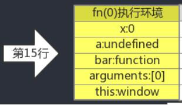
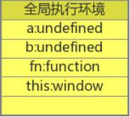
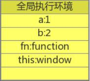
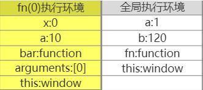
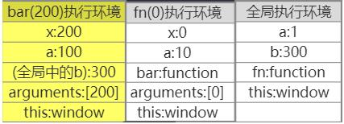
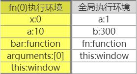
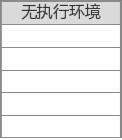

## 深入理解作用域-执行环境与作用域

对于执行环境(execution context)和作用域(scope)并不容易区分，甚至很多人认为它们就是一回事，只是高程和犀牛书关于作用域的两种不同翻译而已。但实际上，它们并不相同，却相互纠缠在一起。本文先用一张图开宗明义，然后进行术语的简单解释，最后根据图示内容进行详细说明

## 图示

## 概念

作用域是一套规则，用于确定在何处以及如何查找标识符。关于LHS查询和RHS查询详见作用域系列第一篇[内部原理](http://www.cnblogs.com/xiaohuochai/p/5699739.html)。

作用域分为**词法作用域**和动态作用域。javascript使用词法作用域，简单地说，词法作用域就是定义在词法阶段的作用域，是由写代码时将变量和函数写在哪里来决定的。于是词法作用域也可以描述为程序源代码中定义变量和函数的区域

作用域分为全局作用域和函数作用域，函数作用域可以互相嵌套

在下面的例子中，存在着全局作用域，fn作用域和bar作用域，它们相互嵌套

**作用域链和自由变量**

各个作用域的嵌套关系组成了一条作用域链。例子中bar函数保存的作用域链是bar -> fn -> 全局，fn函数保存的作用域链是fn -> 全局

使用作用域链主要是进行标识符的查询，标识符解析就是沿着作用域链一级一级地搜索标识符的过程，而作用域链就是要保证对变量和函数的有序访问

【1】如果自身作用域中声明了该变量，则无需使用作用域链

在下面的例子中，如果要在bar函数中查询变量a，则直接使用LHS查询，赋值为100即可

~~~javascript
var a = 1;
var b = 2;
function fn(x){
    var a = 10;
    function bar(x){
        var a = 100;
        b = x + a;
        return b;
    }
    bar(20);
    bar(200);
}
fn(0);
~~~

【2】如果自身作用域中未声明该变量，则需要使用作用域链进行查找

这时，就引出了另一个概念——自由变量。在当前作用域中存在但未在当前作用域中声明的变量叫自由变量

在下面的例子中，如果要在bar函数中查询变量b，由于b并没有在当前作用域中声明，所以b是自由变量。bar函数的作用域链是bar -> fn -> 全局。到上一级fn作用域中查找b没有找到，继续到再上一级全局作用域中查找b，找到了b

~~~javascript
var a = 1;
var b = 2;
function fn(x){
    var a = 10;
    function bar(x){
        var a = 100;
        b = x + a;
        return b;
    }
    bar(20);
    bar(200);
}
fn(0);
~~~

[注意]如果标识符没有找到，则需要分为RHS和LHS查询进行分析，若进行的是LHS查询，则在全局环境中声明该变量，若是严格模式下的LHS查询，则抛出ReferenceError(引用错误)异常；若进行的是RHS查询，则抛出ReferenceError(引用错误)异常。

## 执行环境

执行环境(execution context)，有时也称为执行上下文、执行上下文环境或环境，执行环境定义了变量或函数有权访问的其他数据，决定了他们各自的行为。每个执行环境都有一个与之关联的**变量对象**，环境中定义的所有变量和对象都保存在这个对象中。虽然我们编写的代码无法访问这个对象，但解析器在处理数据是会在后台使用他。

一定要区分执行环境和变量对象。执行环境会随着函数的调用和返回，不断的重建和销毁。但变量对象在有变量引用(如闭包)的情况下，将留在内存中不被销毁

这是例子中的代码执行到第15行时fn(0)函数的执行环境，执行环境里的变量对象保存了fn()函数作用域内所有的变量和函数的值

## 执行流

代码的执行顺序叫做执行流，程序源代码并不是按照代码的书写顺序一行一行往下执行，而是和函数的调用顺序有关

例子中的执行流是第1行 -> 第2行 -> 第4行 -> 第15行 -> 第5行 -> 第7行 -> 第12行 -> 第8行 -> 第9行 -> 第10行 -> 第11行 -> 第13行 -> 第8行 -> 第9行 -> 第10行 -> 第11行 -> 第14行

## 执行环境栈

执行环境栈类似于作用域链，有序地保存着当前程序中存在的执行环境。当执行流进入一个函数时，函数的环境就会被推入一个环境栈中。而在函数执行之后，栈将其环境弹出，把控制权返回给之前的执行环境。ECMAScript程序中的执行流正是由这个方便的机制控制着。

在例子中，当执行流进入bar(20)函数时，当前程序的执行环境栈如下图所示，其中黄色的bar(20)执行环境表示当前程序正处此执行环境中

当bar(20)函数执行完成后，当前程序的执行环境栈如下图所示，bar(20)函数的执行环境被销毁，等待垃圾回收，控制权交还给黄色背景的fn(0)执行环境

## 说明

下面按照代码执行流的顺序对该图示进行详细说明

【1】代码执行流进入全局执行环境，并对全局执行环境中的代码进入**声明提升**

【2】执行流执行第1行代码`var a = 1`;，对a进行LHS查询，给a赋值1；执行流执行第2行代码`var b = 2`;，对b进行LHS查询，给b赋值2

【3】执行流执行第15行代码fn(0);，调用fn(0)函数，此时执行流进入fn(0)函数执行环境中，对该执行环境中的代码进行声明提升过程，并将实参0赋值给形参x中。此时执行环境栈中存在两个执行环境，fn(0)函数为当前执行流所在执行环境

【4】执行流执行第5行代码`var a = 10`;，对a进行LHS查询，给a赋值10

【5】执行流执行第12行代码bar(20);，调用bar(20)函数，此时执行流进入bar(20)函数执行环境中，对该执行环境中的代码进行声明提升过程，并将实参20赋值给形参x中。此时执行环境栈中存在三个执行环境，bar(20)函数为当前执行流所在执行环境

　　在声明提升的过程中，由于b是个自由变量，需要通过bar()函数的作用域链bar() -> fn() -> 全局作用域进行查找，最终在全局作用域中也就是代码第2行找到`var b = 2`;，然后在全局执行环境中找到b的值是2，所以给b赋值2

【6】执行流执行第8行代码`var a = 100`;，给a赋值100；执行流执行第9行`b = x + a`;，对x进行RHS查询，找到x的值是20，对a进行RHS查询，找到a的值是100，所以通过计算b的值是120，给b赋值120；执行第10行代码`return b`;，对b进行RHS查询，找到b的值是120，所以函数返回值为120

【7】执行流执行完第10行代码后，bar(20)的执行环境被弹出执行环境栈，并被销毁，等待垃圾回收，控制权交还给fn(0)函数的执行环境

【8】执行流执行第13行代码bar(200);，调用bar(200)函数，此时执行流进入bar(200)函数执行环境中，对该执行环境中的代码进行声明提升过程，并将实参200赋值给形参x中。此时执行环境栈中存在三个执行环境，bar(200)函数为当前执行流所在执行环境

　　与第5步相同，在声明提升的过程中，由于b是个自由变量，需要通过bar()函数的作用域链bar() -> fn() -> 全局作用域进行查找，最终在全局作用域中也就是代码第2行找到更新后的`var b = 120`，然后在全局执行环境中找到b的值是120，所以给b赋值120

【9】与第6步相同，执行流执行第8行代码`var a = 100`;，给a赋值100；执行流执行第9行`b = x + a`;，对x进行RHS查询，找到x的值是200，对a进行RHS查询，找到a的值是100，所以通过计算b的值是300，给b赋值300；执行第10行代码`return b`;，对b进行RHS查询，找到b的值是300，所以函数返回值为300

【10】执行流执行完第10行代码后，bar(200)的执行环境被弹出执行环境栈，并被销毁，等待垃圾回收，控制权交还给fn(0)函数的执行环境

【11】执行流执行第14行代码`}`，fn(0)的执行环境被弹出执行环境栈，并被销毁，等待垃圾回收，控制权交还给全局执行环境

【12】当页面关闭时，全局执行环境被销毁，页面再无执行环境

## 总结

【1】javascript使用的是词法作用域。对于函数来说，词法作用域是在函数定义时就已经确定了，与函数是否被调用无关。通过作用域，可以知道作用域范围内的变量和函数有哪些，却不知道变量的值是什么。所以作用域是静态的

【2】对于函数来说，执行环境是在函数调用时确定的，执行环境包含作用域内所有变量和函数的值。在同一作用域下，不同的调用(如传递不同的参数)会产生不同的执行环境，从而产生不同的变量的值。所以执行环境是动态的

