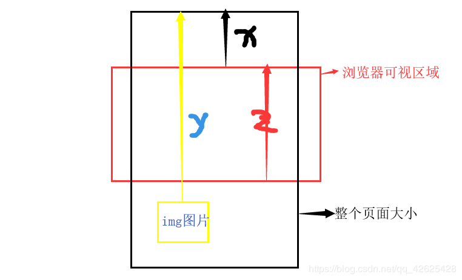

# 关于图片懒加载 - 原理和实现

## 什么是图片懒加载

图片懒加载就是鼠标滑动到哪里，图片加载到哪里。总的来说，一般页面打开，会同时加载页面所有的图片，如果页面的图片请求太多会造成很卡很慢的现象，为了避免这一现象，利用懒加载图片的方法，提高性能（典型：淘宝）

## 实现图片懒加载的原理

图片懒加载的实现原理：将图片的地址放在`data-set`属性中，由于图片并没有在src中，并不会发送http请求。比较图片到整个页面距离（Y）和  页面滑动的距离 （X） +  浏览器可视区域的大小(Z) ，Y小于两者之和，则图片就显示出来，将图片的`data-set`属性换为src属性




 **Vue的图片懒加载实现**


下载插件       npm install vue-lazyload --save 或 yarn add  vue-lazyload 

main.js    引入插件  

~~~javascript
import Vue from 'vue'
import VueLazyLoad from 'vue-lazyload'
 
Vue.use(VueLazyLoad)   
或
Vue.use(VueLazyload, {
  preLoad: 1.3, // 提前加载高度（数字 1 表示 1 屏的高度） 默认值:1.3
  error: 'dist/error.png',     // 当加载图片失败的时候
  loading: 'dist/loading.gif', // 图片加载状态下显示的图片
  attempt: 3   //  加载错误后最大尝试次数 默认值:3
})
~~~

在组件中使用

对于img

```javascript
v-lazy="'/static/img/product/' + productshow1"   

// productshow1为路径地址，直接将变量写在data中使用 data: () =>{productshow1:"productshow1.png" }
```

对于背景图片

```javascript
v-lazy:backgroundImage = "showMessage.imageUrl"  //showMessage.imageUrl为变量名，图片的地址
```


**原生 js 实现图片懒加载**

获取到所有需要用到的高度，和加载的图片，修改`data-set `属性实现懒加载

~~~javascript
html部分
 


 
javaScript部分
 
<script type="text/javascript>
 var imgs = document.querySelectorAll("img");  //获取所有的img元素
 window.onscroll = function(){     //定义触发事件
     var showViewH = document.documentElement.clientHeight;  //获取可视区域的高度
     //获取滚动的高度（兼容性写法）
     var scrollH = document.body.scrollTop || document.documentElement.scrollTop;  
     for(var i =0 ; i<imgs.length;i ++){
         //判断图片到页面的高度与可视高度和滑动高度的大小
          if (imgs[i].offsetTop < showViewH + scrollH ) {  
                    if (imgs[i].getAttribute('src') == '') {
                        imgs[i].src = imgs[i].getAttribute('data-set');
                    }
        }
 }
</script>
~~~


