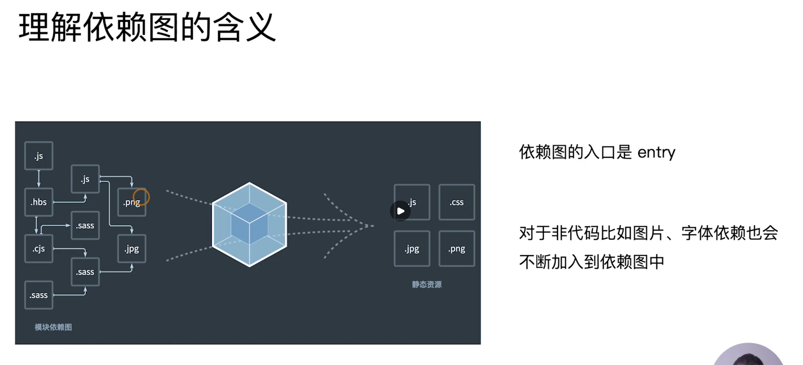
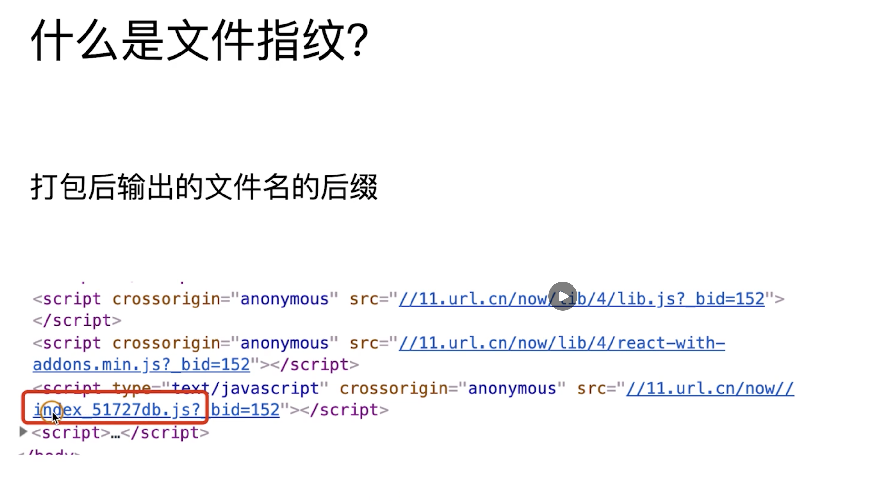

# webpack基础用法

## webpack的核心概念之entry

entry用来指定webpack的入口，通过一张图片我们来进行分析，分析webpack为什么需要一个入口文件。

我们知道我们开发过程中会有不同格式的文件，这些文件之间有不同依赖关系，我们可以理解为模块化开发，而webpack会把不同的文件都理解成不同的模块，当他发现这些模块之间有不同的依赖关系的时候，他会一个一个的去遍历，最终输出不同文件格式的打包文件。

## webpack的核心概念之output

Output用来告诉webpack如何将编译后的文件输出到磁盘

~~~javascript
// output的用法，多入口配置
module.exports = {
  entry: {
    app: './src/app.js',
    search: './src/search.js'
  },
  output: {
    filename: '[name].js',   // 多入口配置通过占位符确保文件的唯一性 '[name].js'
    path: __dirname + '/dist'
  }
}
~~~

~~~javascript
'use strict';

const path = require('path')

module.exports = {
  entry: {
    index: './src/index.js',
    search: './src/search.js'
  },
  output: {
    path: path.join(__dirname, 'dist'),
    filename: '[name].js'
  },
  mode: 'production'
}
~~~

## webpack的核心概念之loader

webpack即只支持js和json两种类型的格式，那么现在的前端开发中我们可能会用到 css less scss jsx template 这些文件格式，那么对于这些文件格式webpack如何来处理呢？

那么这时候就需要使用loader了，loader的作用就是将webpack不支持的文件格式来进行支持，支持完成以后，webpack就可以处理这些文件并添加到依赖图里面去。

loader本身是一个函数，接收源文件作为参数，返回转化后的结果。

#####  常见的loader有哪些

1. Babel-loader：转换es6 es7等js新特性的语法
2. Css-loader：支持.css文件的加载和解析
3. Less-loader：将less文件转换成css文件
4. Ts-loader：将ts转换成js文件
5. File-loader：对图片 字体等文件进行打包
6. Raw-loader：将文件以字符串的形式导入
7. Thread-loader：多进程打包js和css

~~~javascript
'use strict';

const path = require('path')

module.exports = {
  entry: './src/index.js',
  output: {
    path: path.join(__dirname, 'dist'),
    filename: 'boundle.js'
  },
  module: {
    test: '/\.txt$/', // test指定匹配规则
    use: 'raw-loader' // use指定使用loader的名称
  }
  mode: 'production'
}
~~~

## webpack的核心概念之plugins

插件用于bundle文件的优化，资源管理和环境变量的注入。

##### 常见的plugins有哪些

1. CommonsChunkPlugin：将chunks相同的代码模块提取成公共的js文件
2. CleanWebpackPlugin：清理构建目录
3. ExtractTextWebpackPLugin：将css从bundle里面提取出来一个独立的css文件
4. CopyWebpackPlugin：将文件或者文件夹copy到构建的输出目录
5. HtmlWebpackPlugin：创建html文件去承载输出的bundle
6. UglifysWebpackPlugin：压缩js
7. ZipWebpackPlugin：将打包的资源输出一个zip包

~~~javascript
'use strict';

const path = require('path')

module.exports = {
  entry: './src/index.js',
  output: {
    path: path.join(__dirname, 'dist'),
    filename: 'boundle.js'
  },
  module: {
    test: '/\.txt$/', // test指定匹配规则
    use: 'raw-loader' // use指定使用loader的名称
  },
  plugins: [
    new HtmlWebpackPlugin({
      template: './src/ndex.html'
    })
  ]
  mode: 'production'
}
~~~

## webpack的核心概念之mode

mode用来指定当前的构建环境是 production development还是none，设置mode可以使用webpack的内置函数，默认值为production，

## 解析es6和react的jsx

1. 解析es6，webpack原生就支持解析js，但是很多es的语法他是不支持的，这时候我们就要使用 babel-loader 进行解析。

   首先我们先要安装babel，

   `npm i @babel/core @babel/preset-env babel-loader -D`

   安装完成之后我们要对babel进行配置 .babelrc

   ~~~javascript
   {
     "presets": [
       "@babel/preset-env"
     ]
   }
   ~~~

   ~~~javascript
   'use strict';
   
   const path = require('path')
   
   module.exports = {
     entry: {
       index: './src/index.js',
       search: './src/search.js'
     },
     output: {
       path: path.join(__dirname, 'dist'),
       filename: '[name].js'
     },
     module: {
       rules: [
         {
           test: /\.js$/,
           use: 'babel-loader'
         }
       ]
     },
     mode: 'production'
   }
   ~~~

2. 解析react jsx 语法

   ~~~javascript
   {
     "presets": [
       "@babel/preset-env",
       "@babel/preset-react" // 增加react的preset-react的配置
     ]
   }
   ~~~

   

   直接使用webpack去打包search这个js文件

   ~~~javascript
   
   import React from 'react'
   import ReactDOM from 'react-dom'
   
   class Search extends React.Component {
     render() {
       return 

         搜索文字的内容
       

     }
   }
   
   ReactDOM.render(
     <Search />,
     document.getElementById('root')
   )
   ~~~

## 解析css，less 和sass

css-loader用于加载.css文件，并且会把css文件转化成commonjs对象，

style-loader会将style样式通过style标签插入到head里面，

less-loader用于将less转换成css，

~~~javascript
'use strict';

const path = require('path')

module.exports = {
  entry: {
    index: './src/index.js',
    search: './src/search.js'
  },
  output: {
    path: path.join(__dirname, 'dist'),
    filename: '[name].js'
  },
  module: {
    rules: [
      {
        test: /\.js$/,
        use: 'babel-loader'
      },
      {
        test: /\.css$/,
        use: [   // loader的调用是链式调用的，从右向左调用
          'style-loader',
          'css-loader'
        ]
      },
      {
        test: /\.less$/,
        use: [
          'style-loader',
          'css-loader',
          'less-loader'
        ]
      }
    ]
  },
  mode: 'production'
}
~~~

## 在webpack中解析图片和字体

File-loader：用于处理文件也可以用于处理字体

1. 解析图片

~~~javascript
'use strict';

const path = require('path')

module.exports = {
  entry: {
    index: './src/index.js',
    search: './src/search.js'
  },
  output: {
    path: path.join(__dirname, 'dist'),
    filename: '[name].js'
  },
  module: {
    rules: [
      {
        test: /\.js$/,
        use: 'babel-loader'
      },
      {
        test: /\.css$/,
        use: [   // loader的调用是链式调用的，从右向左调用
          'style-loader',
          'css-loader'
        ]
      },
      {
        test: /\.less$/,
        use: [
          'style-loader',
          'css-loader',
          'less-loader'
        ]
      },
      {
        test: /.(png|jpg|gif|jpeg)$/,
        use: 'file-loader'
      }
    ]
  },
  mode: 'production'
}
~~~

2. 处理字体

~~~javascript
'use strict';

const path = require('path')

module.exports = {
  entry: {
    index: './src/index.js',
    search: './src/search.js'
  },
  output: {
    path: path.join(__dirname, 'dist'),
    filename: '[name].js'
  },
  module: {
    rules: [
      {
        test: /\.js$/,
        use: 'babel-loader'
      },
      {
        test: /\.css$/,
        use: [   // loader的调用是链式调用的，从右向左调用
          'style-loader',
          'css-loader'
        ]
      },
      {
        test: /\.less$/,
        use: [
          'style-loader',
          'css-loader',
          'less-loader'
        ]
      },
      {
        test: /.(png|jpg|gif|jpeg)$/,
        use: 'file-loader'
      },
      {
        test: /.(woff|woff2|eot|ttf|otf|svg)$/,
        use: 'file-loader'
      }
    ]
  },
  mode: 'production'
}
~~~

3. 使用url-loader

在前面的步骤中，我们使用了file-loader处理了图片和字体，其实我们还可以使用url-loader对图片和字体进行处理，url-loader还可以对图片和字体进行 limit 的设置，自动转换成base64，同时url-loader内部也引用了file-loader，所以我们在使用的时候不需要安装url-loader。

> 这里举一个例子；
>
> 我们项目目录中有一张图片 npm.png，我们使用file-loader对这种图片进行处理的时候他不会转成base64，也不会将这张图片打包到bundle.js中，
>
> 但当我们想要将他转成base64并且也想将他打包到我们输出的js文件中的时候，我们就需要使用url-loader了。

~~~javascript
'use strict';

const path = require('path')

module.exports = {
  entry: {
    index: './src/index.js',
    search: './src/search.js'
  },
  output: {
    path: path.join(__dirname, 'dist'),
    filename: '[name].js'
  },
  module: {
    rules: [
      {
        test: /\.js$/,
        use: 'babel-loader'
      },
      {
        test: /\.css$/,
        use: [   // loader的调用是链式调用的，从右向左调用
          'style-loader',
          'css-loader'
        ]
      },
      {
        test: /\.less$/,
        use: [
          'style-loader',
          'css-loader',
          'less-loader'
        ]
      },
      {
        test: /.(png|jpg|gif|jpeg)$/,
        // use: 'file-loader'
        use: [
          {
            loader: 'url-loader',
            options: {
              limit: 550000
            }
          }
        ]
      },
      {
        test: /.(woff|woff2|eot|ttf|otf|svg)$/,
        use: 'file-loader'
      }
    ]
  },
  mode: 'production'
}
~~~

+ 使用url-loader将较小的图片转成base64打包进bundle.js中，这样增加了打包文件的体积，如果体积变大了，首屏加载的速度会变慢这么做对吗？

  如果不打包到js中，那图片就是外部资源，当浏览器解析html发现需要外部资源时，就会向服务器发起请求，网络请求外部资源耗费的时间肯定是比本地解析Base64要长。

+ 实际开发中，并不是所有的图片都会以 js 的方式引入，我们分情况进行考虑，

  如果是html里面的img标签的src引用了一张图片，这张图片并没有被js所依赖，所以这张图片不会被打包。

  如果在css中使用背景图去引用图片，而这个css是直接link在html内的，同样也不会去打包输出这个图片。

webpack 目前的打包入口只能是以 js 为入口的，暂时还不支持以 html 为入口进行打包，也就是 webpack 默认是不会分析 html 文件里面的依赖 (比如 src=xxx 或者 外部 css 中的语法)。

##### 解决方案：

1. 比如在html里用img的src引用图片
解决办法：可以增加 html-loader 去处理 html，这样的话就可以识别了 img:src 这个属性。html-loader 提供了解析 html 里面的图片引入的能力

2. 通过 link 去引入的css里面的图片处理
解决办法：思路和 html-loader 比较像，可以去编写一个 loader 用于解析 html 的 link 语法，如果发现引入的是 css，那么对这个 css 的语法和里面的图片依赖进行解析，并且打包出一份新的 css 文件放到 dist 目录。

## webpack中的文件监听

文件监听是指当源码发生变化的时候，自动打包构建出新的文件，

##### webpack开启监听模式有两种：

+ 启动webpack命令时，在命令后面加上 --watch参数
+ 在webpack.config.js中，配置watch:true

~~~javascript
"scripts": {
  "test": "echo \"Error: no test specified\" && exit 1",
    "build": "webpack",
    "watch": "webpack --watch"
},
~~~

执行 `npm run watch` 这个命令，webpack就开启的了文件的监控，当修改文件的时候，webpack会重新进行打包，但这种方式有一个缺点，他打包完成后不会自动刷新浏览器 ，还需要手动进行刷新。

##### 文件监听的原理分析

轮询去判断文件的最后编辑时间是否发生了变化，某个文件发生了变化，并不会立刻告诉监听者，而是等待 `aggregateTimeout`。

~~~javascript
module.export = {
	watch: true, // 默认false
	watchOptions: {
		ignore: /node_modules/, // 默认为空，不监听的文件或者文件夹，支持正则匹配
		aggregateTimeout: 300s，// 监听到文件发生变化后等300s再去构建，默认300s
		poll: 1000s // 判断文件是否发生了变化是通过不停的询问系统指定的文件是否发生了变化来实现的，默认1000s
	}
}
~~~

## webpack热更新原理

热更新：webpack-dev-server 以下简称WDS，WDS不刷新浏览器，不输出文件而是放在内存中。

前面我们已经学习了文件监听的方式，但是他最大的问题是需要手动刷新浏览器，我们可以在webpack中使用`WDS (Webpack-dev-server)`的模块热替换，只需要局部刷新页面上发生变化的模块，同时可以保留当前的页面状态，比如复选框的选中状态、输入框的输入等。

WDS通常情况下需要和 `hot-module-replacement-plugin` 一起使用。

~~~javascript
"scripts": {
  "test": "echo \"Error: no test specified\" && exit 1",
  "build": "webpack",
  "watch": "webpack --watch",
  "dev": "webpack serve --open" // --open指每次更新打开浏览器
},
~~~

~~~javascript
'use strict';

const path = require('path')
const webpack = require('webpack')

module.exports = {
  mode: 'development',
  entry: {
    index: './src/index.js',
    search: './src/search.js'
  },
  output: {
    path: path.join(__dirname, 'dist'),
    filename: '[name].js'
  },
  module: {
    rules: [
      {
        test: /\.js$/,
        use: 'babel-loader'
      },
      {
        test: /\.css$/,
        use: [   // loader的调用是链式调用的，从右向左调用
          'style-loader',
          'css-loader'
        ]
      },
      {
        test: /\.less$/,
        use: [
          'style-loader',
          'css-loader',
          'less-loader'
        ]
      },
      {
        test: /\.(png|jpg|gif|jpeg)$/,
        use: [
          {
            loader: 'url-loader',
            options: {
              limit: 550000
            }
          }
        ]
      },
      {
        test: /\.(woff|woff2|eot|ttf|otf|svg)$/,
        use: 'file-loader'
      }
    ]
  },
  plugins: [
    new webpack.HotModuleReplacementPlugin() // webpack内置的插件
  ],
  devServer: {
    hot: true,
    contentBase: './dist', // 告诉服务器内容的来源
    port: 9527
  }
}
~~~

## 文件指纹

##### 有哪些文件指纹？

指纹文件策略一共有三种，hash、chunkhash、contenthash

+ hash 策略和整个项目相关，只要项目文件改变，整个项目构建的hash值都会改变

+ chunkhash：和webpack打包的chunk(指模块)有关，不同的entry会生成不同的chunkhash

  单独对chunkhash举个例子，当前的 entry 有两个文件，修改 index.js只会让index.js重新打包，search.js并不会打包，修改search.js中引用的css文件，发现search.js和css文件都重新进行了打包。

+ contenthash：根据文件内容来定义hash，文件内容不变，则contenthash不变

##### 文件指纹的好处

有时候我们修改了项目的文件，但并不是所有的文件的 hash 都发生了改变，这时，我们只需要上传修改 hash值的文件，可以做一个版本管理。

另外，对于没有改变hash的文件，浏览器可以继续使用缓存，避免了再次进行加载。

~~~javascript
'use strict';

const path = require('path')
const miniCssExtractPlugin = require('mini-css-extract-plugin')

module.exports = {
  mode: 'production',
  entry: {
    index: './src/index.js',
    search: './src/search.js'
  },
  output: {
    path: path.join(__dirname, 'dist'),
    filename: '[name]_[chunkhash:8].js' 
  },
  module: {
    rules: [
      {
        test: /\.js$/,
        use: 'babel-loader'
      },
      {
        test: /\.css$/,
        use: [
          miniCssExtractPlugin.loader,
          'css-loader'
        ]
      },
      {
        test: /\.less$/,
        use: [
          miniCssExtractPlugin.loader,
          'css-loader',
          'less-loader'
        ]
      },
      {
        test: /\.(png|jpg|gif|jpeg)$/,
        use: [
          {
            loader: 'file-loader',
            options: {
              name: '[name]_[hash:8].[ext]'
            }
          }
        ]
      },
      {
        test: /\.(woff|woff2|eot|ttf|otf|svg)$/,
        use: [
          {
            loader: 'file-loader',
            options: {
              name: '[name]_[hash:8].[ext]'
            }
          }
        ]
      }
    ]
  },
  plugins: [
    new miniCssExtractPlugin({ // 该插件与style-loader功能互斥
      filename: '[name]_[contenthash:8].css'
    })
  ]
}
~~~

##### 总结

1. hash策略用于图片和字体

2. chunkhash用于js文件打包

3. contenthash用于css文件

   

## html css js 文件压缩

代码压缩分为 html压缩 css压缩和js压缩，

1. js压缩：webpack内置了`uglifyjs-webpack-plugin`插件，所以webpack打包出来的js就是压缩好的。

   在 uglifyjs-webpack-plugin 3.0 版本之前使用该插件压缩 es6 的代码是会报错的，在 uglifyjs-webpack-plugin3.0 版本已经可以打包es6代码了。

   webpack在mode = production模式下会进行js文件的压缩

2. css压缩：使用 `optimize-css-assets-webpack-plugin`插件同时配合 `cssnano`对css进行压缩。

   ~~~javascript
   'use strict';
   
   const path = require('path')
   const miniCssExtractPlugin = require('mini-css-extract-plugin')
   const OptimizeCssAssetsPlugin = require('optimize-css-assets-webpack-plugin')
   
   module.exports = {
     mode: 'production',
     entry: {
       index: './src/index.js',
       search: './src/search.js'
     },
     output: {
       path: path.join(__dirname, 'dist'),
       filename: '[name]_[chunkhash:8].js' 
     },
     module: {
       rules: [
         {
           test: /\.js$/,
           use: 'babel-loader'
         },
         {
           test: /\.css$/,
           use: [
             miniCssExtractPlugin.loader,
             'css-loader'
           ]
         },
         {
           test: /\.less$/,
           use: [
             miniCssExtractPlugin.loader,
             'css-loader',
             'less-loader'
           ]
         },
         {
           test: /\.(png|jpg|gif|jpeg)$/,
           use: [
             {
               loader: 'file-loader',
               options: {
                 name: '[name]_[hash:8].[ext]'
               }
             }
           ]
         },
         {
           test: /\.(woff|woff2|eot|ttf|otf|svg)$/,
           use: [
             {
               loader: 'file-loader',
               options: {
                 name: '[name]_[hash:8].[ext]'
               }
             }
           ]
         }
       ]
     },
     plugins: [
       new miniCssExtractPlugin({ // 该插件与style-loader功能互斥
         filename: '[name]_[contenthash:8].css'
       }),
       new OptimizeCssAssetsPlugin({
         cssProcessor: require('cssnano'),
         assetNameRegExp: /\.css$/g
       })
     ]
   }
   ~~~

   

3. html压缩：使用`html-webpack-plugin`。

   ~~~javascript
   'use strict';
   
   const path = require('path')
   const miniCssExtractPlugin = require('mini-css-extract-plugin')
   const OptimizeCssAssetsPlugin = require('optimize-css-assets-webpack-plugin')
   const HtmlWebpackPlugin = require('html-webpack-plugin')
   
   module.exports = {
     mode: 'production',
     entry: {
       index: './src/index.js',
       search: './src/search.js'
     },
     output: {
       path: path.join(__dirname, 'dist'),
       filename: '[name]_[chunkhash:8].js' 
     },
     module: {
       rules: [
         {
           test: /\.js$/,
           use: 'babel-loader'
         },
         {
           test: /\.css$/,
           use: [
             miniCssExtractPlugin.loader,
             'css-loader'
           ]
         },
         {
           test: /\.less$/,
           use: [
             miniCssExtractPlugin.loader,
             'css-loader',
             'less-loader'
           ]
         },
         {
           test: /\.(png|jpg|gif|jpeg)$/,
           use: [
             {
               loader: 'file-loader',
               options: {
                 name: '[name]_[hash:8].[ext]'
               }
             }
           ]
         },
         {
           test: /\.(woff|woff2|eot|ttf|otf|svg)$/,
           use: [
             {
               loader: 'file-loader',
               options: {
                 name: '[name]_[hash:8].[ext]'
               }
             }
           ]
         }
       ]
     },
     plugins: [
       new miniCssExtractPlugin({ // 该插件与style-loader功能互斥
         filename: '[name]_[contenthash:8].css'
       }),
       new OptimizeCssAssetsPlugin({
         cssProcessor: require('cssnano'),
         assetNameRegExp: /\.css$/g
       }),
       new HtmlWebpackPlugin({
         template: path.join(__dirname, 'src/search.html'), // 模板文件路径
         filename: 'search.html', // 输出的HTML文件名
         chunks: ['search'], // 对应entry的key
         inject: true,
         minify: { // 使用minify会对生成的html文件进行压缩
           html5: true,
           collapseWhitespace: true,
           preserveLineBreaks: false,
           minifyCSS: true,
           minifyJS: true,
           removeComments: false
         }
       })
     ]
   }
   ~~~

   多个html页面要使用多个插件。

   HtmlWebpackPlugin 里面的minify 的 minifyCSS 参数和minifyJS参数是用于去压缩一开始就内联在 html 里面的css和js，不是打包生成的 css 和 js。

   >Bundle指的是打包最终输出的文件。
   >
   >chunk是由多个module组成，可以通过代码分割成多个chunk。
   >
   >module webpack中的模块(js css 图片等)。

