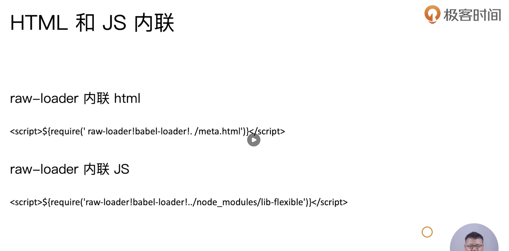
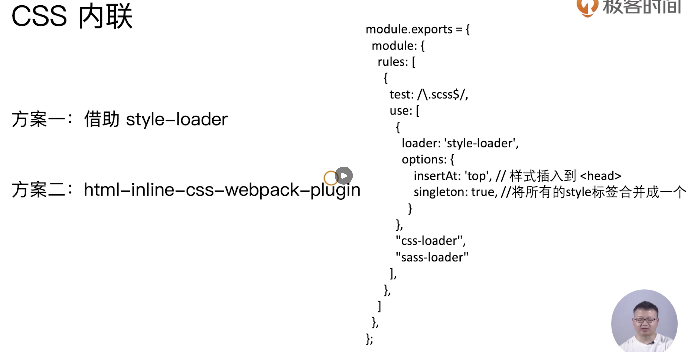
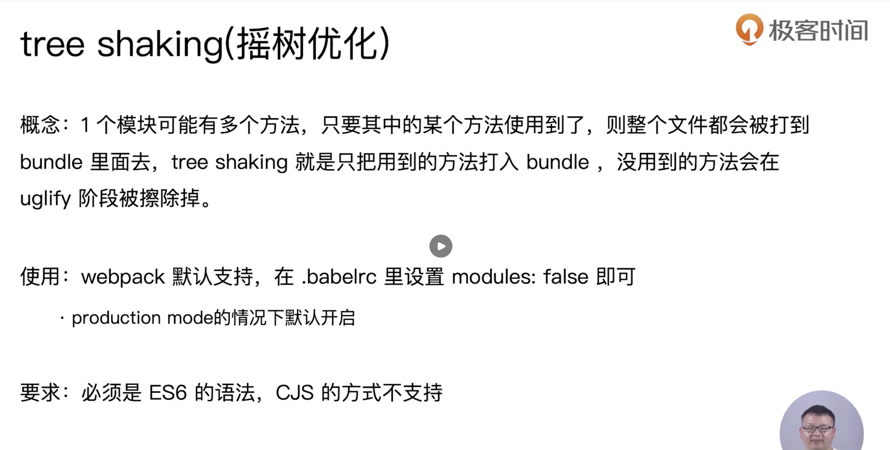
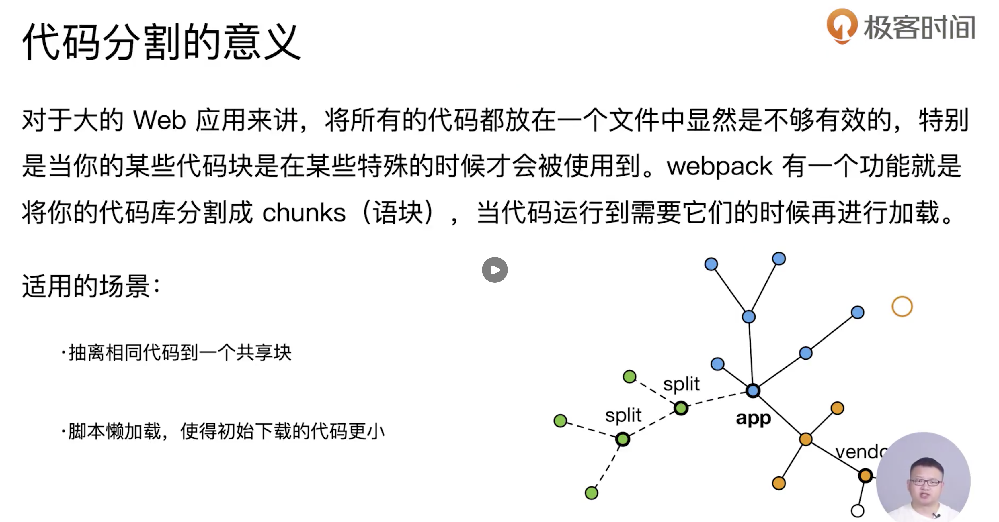
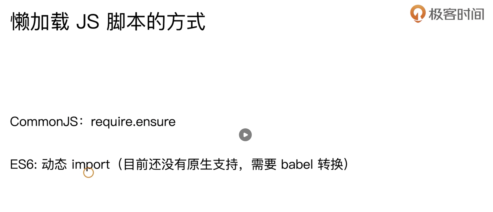
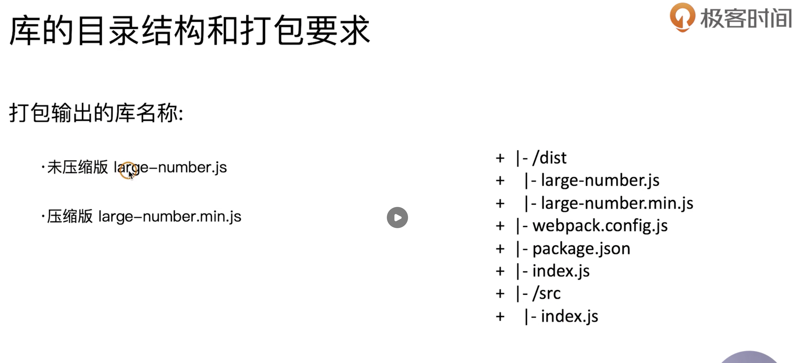
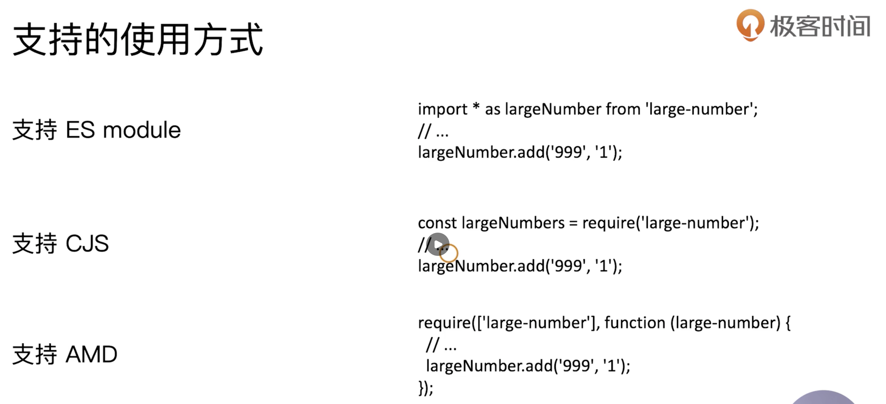
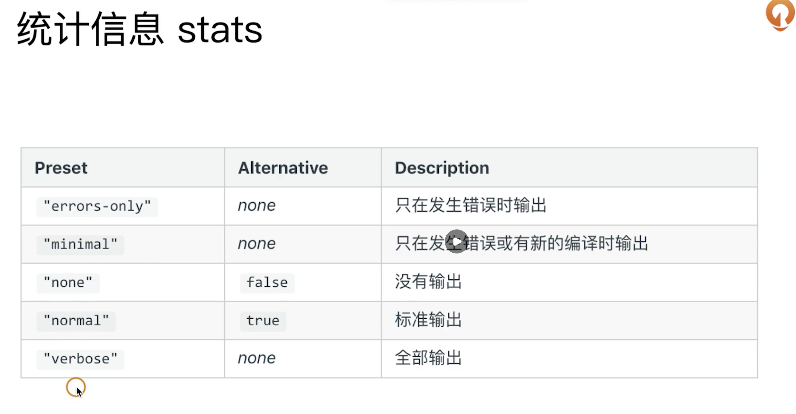
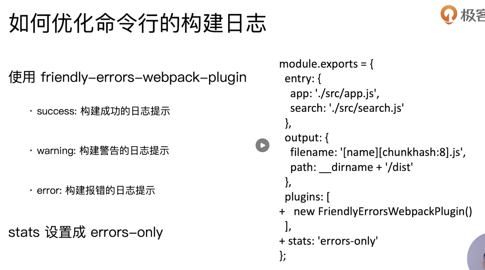
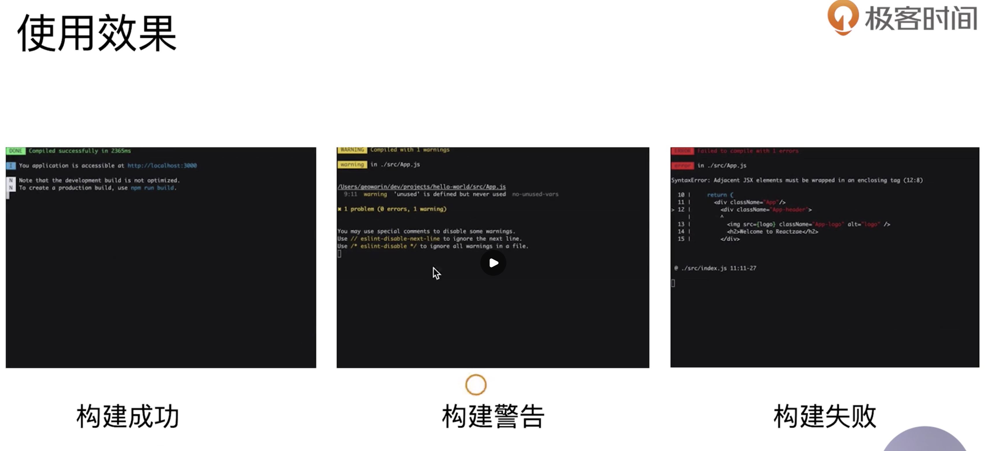

#  webpack进阶用法

## 自动删除构建目录

使用 `clean-webpack-plugin`，默认会删除 output 指定的输出目录。

~~~javascript
'use strict';

const path = require('path')
const miniCssExtractPlugin = require('mini-css-extract-plugin')
const OptimizeCssAssetsPlugin = require('optimize-css-assets-webpack-plugin')
const HtmlWebpackPlugin = require('html-webpack-plugin')
const { CleanWebpackPlugin } = require('clean-webpack-plugin')

module.exports = {
  mode: 'production',
  entry: {
    index: './src/index.js',
    search: './src/search.js'
  },
  output: {
    path: path.join(__dirname, 'dist'),
    filename: '[name]_[chunkhash:8].js' 
  },
  module: {
    rules: [
      {
        test: /\.js$/,
        use: 'babel-loader'
      },
      {
        test: /\.css$/,
        use: [
          miniCssExtractPlugin.loader,
          'css-loader'
        ]
      },
      {
        test: /\.less$/,
        use: [
          miniCssExtractPlugin.loader,
          'css-loader',
          'less-loader'
        ]
      },
      {
        test: /\.(png|jpg|gif|jpeg)$/,
        use: [
          {
            loader: 'file-loader',
            options: {
              name: '[name]_[hash:8].[ext]'
            }
          }
        ]
      },
      {
        test: /\.(woff|woff2|eot|ttf|otf|svg)$/,
        use: [
          {
            loader: 'file-loader',
            options: {
              name: '[name]_[hash:8].[ext]'
            }
          }
        ]
      }
    ]
  },
  plugins: [
    new miniCssExtractPlugin({ // 该插件与style-loader功能互斥
      filename: '[name]_[contenthash:8].css'
    }),
    new OptimizeCssAssetsPlugin({
      cssProcessor: require('cssnano'),
      assetNameRegExp: /\.css$/g
    }),
    new HtmlWebpackPlugin({
      template: path.join(__dirname, 'src/search.html'), // 模板文件路径
      filename: 'search.html', // 输出的HTML文件名
      chunks: ['search'], // 对应entry的key
      inject: true,
      minify: { // 使用minify会对生成的html文件进行压缩
        html5: true,
        collapseWhitespace: true,
        preserveLineBreaks: false,
        minifyCSS: true,
        minifyJS: true,
        removeComments: false
      }
    }),
    new CleanWebpackPlugin()
  ]
}
~~~

## 自动补全css3的浏览器前缀

使用 postcss loader autoprefixer 插件 自动补全css前缀。

`npm i postcss-loader autoprefix -D`

安装完成之后我们开始去配置 `postcss`，在项目目录下面去新建 `postcss.config.js`文件，在这个文件里面去配置我们最低要支持到的浏览器的版本，

~~~javascript
module.exports = {
  plugins: [
    require('autoprefixer')({
      overrideBrowserslist: [
        'last 2 version',
        'ios 7.1',
        '>1%' // 必须大于 1% 用户使用的浏览器
      ]
    })
  ]
}
~~~

~~~javascript
{
  test: /\.less$/,
    use: [
      miniCssExtractPlugin.loader,
      'css-loader',
      'less-loader',
      'postcss-loader'
    ]
}
~~~

> postcss-loader 执行顺序必须保证在 css-loader 之前，
>
> 即 loader 顺序：less-loader -> postcss-loader -> css-loader -> style-loader 或者 MiniCssExtractPlugin.loader。

## 移动端css px自动转成rem

在做移动端适配的时候，不同的屏幕因为分辨率的不同，屏幕宽度也是不同的，这就要求我们在铺页面的时候对不同的屏幕进行适配，适配的方式有很多种，媒体查询，rem，flex弹性布局，

在这里，我们将使用 `px2rem-loader` 将px转成rem对不同屏幕进行支持。

1. 我们如何去动态的计算不同屏幕的根字体的大小？

   第一种方案我们可以使用 手淘 `lib-flexible` 这个库去计算，

   ~~~javascript
   ;(function(win, lib) {
       var doc = win.document;
       var docEl = doc.documentElement;
       var metaEl = doc.querySelector('meta[name="viewport"]');
       var flexibleEl = doc.querySelector('meta[name="flexible"]');
       var dpr = 0;
       var scale = 0;
       var tid;
       var flexible = lib.flexible || (lib.flexible = {});
   
       if (metaEl) {
           console.warn('将根据已有的meta标签来设置缩放比例');
           var match = metaEl.getAttribute('content').match(/initial\-scale=([\d\.]+)/);
           if (match) {
               scale = parseFloat(match[1]);
               dpr = parseInt(1 / scale);
           }
       } else if (flexibleEl) {
           var content = flexibleEl.getAttribute('content');
           if (content) {
               var initialDpr = content.match(/initial\-dpr=([\d\.]+)/);
               var maximumDpr = content.match(/maximum\-dpr=([\d\.]+)/);
               if (initialDpr) {
                   dpr = parseFloat(initialDpr[1]);
                   scale = parseFloat((1 / dpr).toFixed(2));
               }
               if (maximumDpr) {
                   dpr = parseFloat(maximumDpr[1]);
                   scale = parseFloat((1 / dpr).toFixed(2));
               }
           }
       }
   
       if (!dpr && !scale) {
           var isAndroid = win.navigator.appVersion.match(/android/gi);
           var isIPhone = win.navigator.appVersion.match(/iphone/gi);
           var devicePixelRatio = win.devicePixelRatio;
           if (isIPhone) {
               // iOS下，对于2和3的屏，用2倍的方案，其余的用1倍方案
               if (devicePixelRatio >= 3 && (!dpr || dpr >= 3)) {
                   dpr = 3;
               } else if (devicePixelRatio >= 2 && (!dpr || dpr >= 2)){
                   dpr = 2;
               } else {
                   dpr = 1;
               }
           } else {
               // 其他设备下，仍旧使用1倍的方案
               dpr = 1;
           }
           scale = 1 / dpr;
       }
   
       docEl.setAttribute('data-dpr', dpr);
       if (!metaEl) {
           metaEl = doc.createElement('meta');
           metaEl.setAttribute('name', 'viewport');
           metaEl.setAttribute('content', 'initial-scale=' + scale + ', maximum-scale=' + scale + ', minimum-scale=' + scale + ', user-scalable=no');
           if (docEl.firstElementChild) {
               docEl.firstElementChild.appendChild(metaEl);
           } else {
               var wrap = doc.createElement('div');
               wrap.appendChild(metaEl);
               doc.write(wrap.innerHTML);
           }
       }
   
       function refreshRem(){
           var width = docEl.getBoundingClientRect().width;
           if (width / dpr > 540) {
               width = 540 * dpr;
           }
           var rem = width / 10;
           docEl.style.fontSize = rem + 'px';
           flexible.rem = win.rem = rem;
       }
   
       win.addEventListener('resize', function() {
           clearTimeout(tid);
           tid = setTimeout(refreshRem, 300);
       }, false);
       win.addEventListener('pageshow', function(e) {
           if (e.persisted) {
               clearTimeout(tid);
               tid = setTimeout(refreshRem, 300);
           }
       }, false);
   
       if (doc.readyState === 'complete') {
           doc.body.style.fontSize = 12 * dpr + 'px';
       } else {
           doc.addEventListener('DOMContentLoaded', function(e) {
               doc.body.style.fontSize = 12 * dpr + 'px';
           }, false);
       }
   
   
       refreshRem();
   
       flexible.dpr = win.dpr = dpr;
       flexible.refreshRem = refreshRem;
       flexible.rem2px = function(d) {
           var val = parseFloat(d) * this.rem;
           if (typeof d === 'string' && d.match(/rem$/)) {
               val += 'px';
           }
           return val;
       }
       flexible.px2rem = function(d) {
           var val = parseFloat(d) / this.rem;
           if (typeof d === 'string' && d.match(/px$/)) {
               val += 'rem';
           }
           return val;
       }
   
     })(window, window['lib'] || (window['lib'] = {}));
   ~~~

   第二种方案我们可以自己去动态计算，通过下面的代码计算出了1rem=25px，那么在不同的屏幕下面这个结果是不同的，

   ~~~javascript
   
   ~~~

2. px转rem

   ~~~javascript
   {
     test: /\.less$/,
       use: [
         miniCssExtractPlugin.loader,
         'css-loader',
         'less-loader',
         'postcss-loader',
         {
           loader: 'px2rem-loader',
           options: {
             remUnit: 75, // 1rem=75px
             remPrecision: 8 // rem后小数点位数
           }
         }
       ]
   },
   ~~~

   经过loader的配置以后，我们现在可以将px转成rem了，但是，现在还有最重要一步，我们还没有做屏幕适配，我们先采取第一种方案试一试，

   经过测试发现我们的html根字体的大小是动态进行改变的，调整不同的手机屏幕也是可以动态改变的，但为什么更推荐使用 lib-flexible 这个库呢？

   他比较方便的解决手机端的1px问题。

3. js代码内联到了html页面

   现在我们将动态计算字体大小的代码放到了html页面里面，很明显，进行打包的时候他也会打包进我们的bundle里面，那么我们可不可以使用webpack将静态资源内联到html里面去。

## 静态资源内联

+ 什么是资源内联？

  将js css html 写入到html里面不打包进bundle里面

+ 资源内联的意义？

  页面初始化需要执行的脚本，拿上一节的动态计算rem来说，需要先执行计算的脚本次能得到正确的rem。

  css内联避免页面闪动，对于单页应用来说，提前将css内联入页面，页面再进行渲染避免了页面的闪动。

  减少http的请求数量，将小图片小体积字体通过 url-loader 转成base64做成本地资源，避免了这些小资源也去发送请求。

+ Raw-loader 内联js和html

  首先安装 raw-loader

  `npm i raw-loader@0.5.1 -D`

  然后在项目目录下准备了一个 meta.html，现在我们就要将这个 meta.html 通过 raw-loader 插入到 search.html中，同时也要将 flexible.js 内联进 html 里面去。

  因为我们使用了 html-webpack-plugin 这个插件，所以我们可以使用 ejs 模板引擎的语法。

  ~~~html
  <!DOCTYPE html>
  <html lang="en">
  <head>
    <%= require('raw-loader!./meta.html') %>
    <title>Document</title>
    
  </head>
  <body>
    

  </body>
  </html>
  ~~~

  

+ css的内联

  

##### ss样式内联与style-loader样式的动态插入的区别？

style-loader 插入样式是一个动态的过程，你可以直接查看打包后的 html 源码并不会看到 html 有 style 样式。

css-loader先将css转换成commonjs对象，这时css也被打包进入了bundle里面，style-loader会在代码运行时动态创建style标签，然后将 css style 插入到 style 标签里面去。

css内联是指已经通过 miniCssExtractPlugin 将css单独打包成了一个css文件，然后读取提取出的 css 内容注入到页面的 style 里面去。这个过程在构建阶段完成。

## 多页面打包通用方案

多页面应用(MPA)

我们在使用webpack进行打包的时候，有入口文件，但并不是说这个入口文件就只能是单入口的，他也可以是多入口的，在这个项目里面我们还使用了 `html-webpack-plugin`，那 entry 与 这个插件的关系是怎么样的呢？

一个入口就要对应一个 html-webpack-plugin，那这样的话为我们的配置就显得不那么灵活了，如果我们的入口过多的话，那我们就要重复配置多个 html-webpack-plugin，所以我们要修改一下这个多入口的配置。

~~~javascript
const setMPA = () => {
  const entry = {}
  const htmlWebpackPlugin = []

  // 获取项目目录的一级文件夹
  const entryFlieList = glob.sync(path.join(__dirname, './src/*/index.js'))
  entryFlieList.forEach((file, index) => {
    const match = file.match(/src\/(.*)\/index\.js/)
    const pageName = match && match[1]
    entry[pageName] = file
    htmlWebpackPlugin.push(
      new HtmlWebpackPlugin({
        template: path.join(__dirname, `src/${pageName}/index.html`), // 模板文件路径
        filename: `${pageName}.html`, // 输出的HTML文件名
        chunks: [`${pageName}`], // 对应entry的key
        inject: true,
        minify: { // 使用minify会对生成的html文件进行压缩
          html5: true,
          collapseWhitespace: true,
          preserveLineBreaks: false,
          minifyCSS: true,
          minifyJS: true,
          removeComments: false
        }
      })
    )
  })

  return {
    entry,
    htmlWebpackPlugin
  }
}

const { entry, htmlWebpackPlugin } = setMPA()
~~~

## 使用webpack提取页面公共代码

提取页面公共代码是一件非常重要的事情，在现在的前端开发中，尤其是单页应用的流行，将公共代码进行提取能大大的优化首屏的加载速度，那什么样的代码才能成为公共代码，项目中引用的基础包 react vue，vuex，各个组件之间都引用了同一个工具函数，这个样的代码就能称之为公共代码。

1. 使用html-webpack-externals-plugin

   ~~~javascript
   new HtmlWebpackExternalsPlugin({
     externals: [
       {
         module: 'react',
         entry: 'https://11.url.cn/now/lib/16.2.0/react.min.js',
         global: 'React',
       },
       {
         module: 'react-dom',
         entry: 'https://11.url.cn/now/lib/16.2.0/react-dom.min.js',
         global: 'ReactDOM',
       }
     ]
   })
   ~~~

   将基础包使用HtmlWebpackExternalsPlugin这个插件进行排除，不打包进bundle.js。

2. 使用split-chunk-plugin进行公共脚本分离

   首先是抽离基础组件包

   ~~~javascript
   optimization: {
     splitChunks: {
       minSize: 0, // 抽离的公共包最小的大小，单位字节
         cacheGroups: {
           vendors: {
             test: /(react|react-dom)/,
             name: "vendors",
             chunks: "all",
             priority: -10
           }
         }
     }
   }
   ~~~

   抽离基础组件包 + 各组件的公共代码（分别打包出不同js代码）

   ~~~
   没能实现，
   ~~~

## Tree-shaking使用

Tree-shaking要求代码的语法必须是es6，对于node.js的require语法他默认是不支持的。

+ DCE

  DCE (Dead Code Elimination)-无用代码消除，这样做的优点也是为了减少代码体积，

+ DCE主要包括：

  代码不会被执行，根本不会到达

  (程序中没有执行的代码，比如不可能进入的分支，return之后的语句)

  代码的执行结果不会被用到

  代码只会影响死变量(只写不读，修改了这个变量后该变量没有被读取)

+ Tree-shaking的实现方式

  基于es6的静态引用，tree shaking 通过扫描所有的es6的export，找出import的内容并添加到最终的代码中，webpack的实现是把所有的import标记为 已使用/未使用两种。

  在后续压缩时进行DCE处理。

+ 举个例子

  在项目中添加一个 tree-shaking.js 文件，在 search/index.js中 `import { a } from './tree-shaking'`。

  然后我们开启 tree-shaking ，这时在打包出来的文件里面就找不到我们引入的 a 函数了。

> tree-shaking要求代码是不能有副作用的，什么意思？
>
> 副作用这个概念来源于函数式编程(FP)，纯函数是没有副作用的，也不依赖外界环境或者改变外界环境。纯函数的概念是：接受相同的输入，任何情况下输出都是一样的。
>
> 非纯函数存在副作用，副作用就是：相同的输入，输出不一定相同。或者这个函数会影响到外部变量、外部环境。
>
> 函数如果调用了全局对象或者改变函数外部变量，则说明这个函数有副作用。

## 代码分割和动态import

前面的章节我们已经学习了代码分割，也就是利用了 splitChunks，

通俗的来讲，我们的单页应用会将所有的组件打包输出一个bundle.js，但是，当我们首次去加载首屏所需要的代码的时候，一些不相关的代码也被请求了下来，现在我们要做的就是将不同的组件的代码去切割成一个chunk，然后当我们需要这个组件渲染的时候我们再将该组件需要的chunk请求下来，这样既减少了bundle的体积，也加快了首屏加载速度，同时，我们还可以通过 动态 import 做到js脚本的懒加载。

+ 懒加载js脚本

  

在这我们主要使用的是 动态import的方式去引用模块，动态import需要babel的支持，

先要引入

`npm install --save-dev @babel/plugin-syntax-dynamic-import`

然后配置.babelrc，开启动态import。

~~~javascript
{
  "presets": [
    "@babel/preset-env",
    "@babel/preset-react"
  ],
  "plugins": [
    "@babel/plugin-syntax-dynamic-import"
  ]
}
~~~

接下来我们创建 search/test.js

~~~javascript
import React from 'react';

export default () => 
 动态 import 

~~~

然后修改 search/index.js，在这个文件里面我们做的事情很明显，点击图片的时候就会动态加载test.js这个文件。

动态引入的js文件返回的是一个promise，在这个promise里面可以拿到test.js中的内容，这样做的目的就是模拟了一个懒加载的过程，因为打包后会将 test.js 这个懒加载的js文件单独打包出一个chunk文件，这个chunk文件并不会在首屏加载的时候请求，当点击图片的时候才会通过 jsonp 的方式去加载这个懒加载的chunk。

~~~javascript

import React from 'react'
import ReactDOM from 'react-dom'
import npm from '../img/npm.png'
import { a } from './tree-shaking'
import '../help/help.js'
import './search.less'

class Search extends React.Component {
  constructor () {
    super(...arguments)
    this.state = {
      Test: null
    }
  }
  loadComponent() {
    // 动态import引入
    import('./test.js').then((test) => {
      console.log('---', test.default);
      this.setState({
        Test: test.default
      })
    })
  }
  render() {
    const funcA = a()
    const { Test } = this.state
    return 

      { Test ? <Test/> : null }
      { funcA }搜索文字的内容
      </img>
    

  }
}

ReactDOM.render(
  <Search />,
  document.getElementById('root')
)
~~~

## webpack打包组件和基础库

在学习该章节之前需要一点前置知识。

### AMD、CMD、CommonJS、UMD、ESM

+ amd

  异步加载模块方案，允许指定回调函数，在浏览器中要从服务端获取数据，这个过程是异步的，因此浏览器端一般采用amd规范。推崇依赖前置

  AMD规范使用define方法定义模块，如果我们定义的模块本身也依赖其他模块,那就需要将它们放在[]中作为define()的第一参数。

  ~~~javascript
  define(['package/lib'], function(lib){
    function foo(){
      lib.log('hello world!');
    }
  
    return {
      foo: foo
    };
  });
  ~~~

+ cmd

  CMD是SeaJS在推广过程中对模块定义的规范化产出，对于模块的依赖，CMD是延迟执行。

  推崇依赖就近

  ~~~javascript
  define((require, exports, module) => {
    module.exports = {
      fun1: () => {
         var $ = require('jquery');
         return $('#test');
      }
    };
  });
  ~~~

  这个例子中只有当 fun1 函数真正执行的时候才回去加载 jquery。

+ commonjs

  根据CommonJS规范，一个单独的文件就是一个模块。加载模块使用require方法，该方法读取一个文件并执行，最后返回文件内部的module.exports对象。

  ~~~javascript
  moudle.exports = {
    a: 1
  };
   
   
  var f1 = require('./file1');
  var v = f1.a + 2;
  module.exports ={
    v: v
  };
  ~~~

+ esm

  ESM是ES6中的模块化规范，在nodeJS新版本中可以直接使用，现在大部分浏览器也开始支持（在script标签上设置type="module"），

  ES6 在语言标准的层面上，实现了模块功能，而且实现得相当简单，完全可以取代现有的 CommonJS 和 AMD 规范，成为浏览器和服务器通用的模块解决方案。

  ~~~javascript
  // 写法一
  export var m = 1;
  // 写法二
  var m = 1; export { m };
  // 写法三
  var n = 1; export { n as m };
  // 写法四
  var n = 1; export default n;
  // 写法五
  if (true) { import('./myModule.js').then(({ export1, export2 }) => { /* ... */ }); }
  // 写法六
  Promise.all([import('./module1.js'),
  import('./module2.js'),
  import('./module3.js')]).then(([module1, module2, module3]) => { /* ... */ });
  ~~~

### 如何使用webpack创建library

https://webpack.docschina.org/guides/author-libraries/

### webpack除了可以打包应用也可以用来打包js库

在这我们去实现一个 **大整数加法** 的库，

打包库的需求：

1. 需要打包出压缩版本和非压缩版本
2. 支持amd cmd esm 模块的引入

> 若两个整数很大的时候，直接用变量保存数字，则会造成溢出。这时候最常用也最容易的方法就是用字符串或者数组表示大数。
>
> **例如：**输入‘189’，‘321’，返回‘510’。
>
> 这样在进行两个任意大的整数相加的时候，既不会溢出，也不会损失精度。

~~~javascript
/**
 * 实现大整数加法
 */

export default function add(a, b) {
  let a1 = a.length - 1
  let b1 = b.length - 1

  let result = ''
  let carry = 0

  while (a1 >= 0 || b1 >= 0) {
    let x = 0 // a1位数上的值
    let y = 0 // b1位数上的值
    let sum

    if (a1 >= 0) {
      x = a[a1] - '0' // a[a1]获取个位数，-'0'将字符串转成数字
      a1--
    }

    if (b1 >= 0) {
      y = b[b1] - '0'
      b1--
    }

    sum = x + y + carry

    if (sum >= 10) {
      carry = 1
      sum -= 10
    } else {
      carry = 0
    }
    // 91 90 90 add('999', '1')
	  // 31 22 13 add('321', '123')
    result = sum + result
  }
  if (carry) {
    result = carry + result
  }
  return result
}
~~~

配置webpack.config.js，mode: 'none' 模式下不进行压缩，使用 TerserPlugin 插件匹配 .min 的 js 脚本进行压缩。

同时在package.json中增加打包命令

~~~javascript
const TerserPlugin = require('terser-webpack-plugin')

module.exports = {
  mode: 'none',
  entry: {
    'large-number': './src/index.js',
    'large-number.min': './src/index.js'
  },
  output: {
    filename: '[name].js',
    library: 'my-library', // 打包输出包名
    libraryTarget: 'umd', // 将你的 library 暴露为所有的模块定义下都可运行的方式
    libraryExport: 'default'
  },
  optimization: {
    minimize: true,
    minimizer: [
      new TerserPlugin({
        include: /\.min\.js$/
      })
    ]
  }
}
~~~

执行 `npm publish` 将 `large-number` 发布到 npm，现在这个库已经发布到 npm 了，在 play-webpack 这个项目中去引入 large-number@x.x.x 版本。

## 优化构建时命令行的显示日志

在大多数时候，webpack 的打包输出的log信息有很多是无用的，开发者并不需要关注，那么在 webpack 中如何去优化这些 log 信息呢？

1. 统计信息 stats

   

~~~javascript
stats: 'errors-only'
~~~

2. 使用 friendly-errors-webpack-plugin 插件优化构建日志

   

   

   

~~~javascript
'use strict';

const path = require('path')
const miniCssExtractPlugin = require('mini-css-extract-plugin')
const OptimizeCssAssetsPlugin = require('optimize-css-assets-webpack-plugin')
const HtmlWebpackPlugin = require('html-webpack-plugin')
const FriendlyErrorsWebpackPlugin = require('friendly-errors-webpack-plugin')
const HtmlWebpackExternalsPlugin = require('html-webpack-externals-plugin')
const { CleanWebpackPlugin } = require('clean-webpack-plugin');
const { glob } = require('glob');

const setMPA = () => {
  const entry = {}
  const htmlWebpackPlugin = []

  // 获取项目目录的一级文件夹
  const entryFlieList = glob.sync(path.join(__dirname, './src/*/index.js'))
  entryFlieList.forEach((file, index) => {
    const match = file.match(/src\/(.*)\/index\.js/)
    const pageName = match && match[1]
    entry[pageName] = file
    htmlWebpackPlugin.push(
      new HtmlWebpackPlugin({
        template: path.join(__dirname, `src/${pageName}/index.html`), // 模板文件路径
        filename: `${pageName}.html`, // 输出的HTML文件名
        chunks: [`${pageName}`], // 对应entry的key
        inject: true,
        minify: { // 使用minify会对生成的html文件进行压缩
          html5: true,
          collapseWhitespace: true,
          preserveLineBreaks: false,
          minifyCSS: true,
          minifyJS: true,
          removeComments: false
        }
      })
    )
  })

  return {
    entry,
    htmlWebpackPlugin
  }
}

const { entry, htmlWebpackPlugin } = setMPA()

module.exports = {
  mode: 'production',
  entry: entry,
  output: {
    path: path.join(__dirname, 'dist'),
    filename: '[name]_[chunkhash:8].js' 
  },
  module: {
    rules: [
      {
        test: /\.js$/,
        use: 'babel-loader'
      },
      {
        test: /\.css$/,
        use: [
          miniCssExtractPlugin.loader,
          'css-loader'
        ]
      },
      {
        test: /\.less$/,
        use: [
          miniCssExtractPlugin.loader,
          'css-loader',
          'less-loader',
          'postcss-loader',
          {
            loader: 'px2rem-loader',
            options: {
              remUnit: 75, // 1rem=75px
              remPrecision: 8
            }
          }
        ]
      },
      {
        test: /\.(png|jpg|gif|jpeg)$/,
        use: [
          {
            loader: 'file-loader',
            options: {
              name: '[name]_[hash:8].[ext]'
            }
          }
        ]
      },
      {
        test: /\.(woff|woff2|eot|ttf|otf|svg)$/,
        use: [
          {
            loader: 'file-loader',
            options: {
              name: '[name]_[hash:8].[ext]'
            }
          }
        ]
      }
    ]
  },
  plugins: [
    new miniCssExtractPlugin({ // 该插件与style-loader功能互斥
      filename: '[name]_[contenthash:8].css'
    }),
    new OptimizeCssAssetsPlugin({
      cssProcessor: require('cssnano'),
      assetNameRegExp: /\.css$/g
    }),
    new CleanWebpackPlugin(),
    new FriendlyErrorsWebpackPlugin()
  ].concat(htmlWebpackPlugin),
  optimization: {
    splitChunks: {
      minSize: 0, // 抽离的公共包最小的大小，单位字节
      cacheGroups: {
        vendors: {
          test: /(react|react-dom)/,
          name: "vendors",
          chunks: "all",
          priority: -10
        },
        commons: {
          name: 'common',
          chunks: 'all',
          minChunks: 2, // 资源使用的次数(在多个页面使用到)， 大于1
          priority: -20
        }
      }
    }
  },
  stats: 'errors-only'
}

~~~

安装这个插件以后，分别在 `webpack.prod.js` 和 `webpack.dev.js` 中对该插件进行设置。